# feat: Fro Bot Autonomous Control Plane

## Overview

Transform `fro-bot/.github` from a reactive prompt wrapper into an autonomous control plane that drives the Fro Bot persona — a playful trickster-helper character with persistent memory, event routing, tiered autonomy, cross-platform social presence, and GitHub-native state. All operational state remains in GitHub, while autonomous writes are isolated to a `data` branch and merged back into `main` under explicit path-based rules.

## Problem Frame

Fro Bot today responds only when poked. It has no compounding memory across repos, no durable wiki that improves with each interaction, limited social presence, and no clear separation between low-risk autonomous activity and approval-gated cross-repo writes. The `.github` repo is still a thin dispatch layer over `fro-bot/agent`.

This plan turns the repo into a control plane where Fro Bot is a character first and an automation layer second. The character becomes durable through a Karpathy-style wiki, issues-as-journal, deterministic trust boundaries, and a hybrid social broadcast model that separates deciding when to post from generating what to say.

## Requirements Trace

- R1-R4: Persona & Voice — versioned trickster-helper identity with Afrofuturism × Cyberpunk tone, loaded into all agent interactions (Units 1, 9, 14)
- R5: Collaboration invite handling — verify inviter, accept, star, survey, and optionally propose workflow installation (Units 2, 7, 8)
- R6-R7: Issue/PR event handling + scheduled oversight across collaborator repos, now augmented with persona and wiki query context (Units 9, 10)
- R8: Renovate metadata tracking with smart dispatch and deduplication; **R17 revised** so dispatching an existing Renovate workflow is autonomous rather than approval-gated (Units 2, 15, 16)
- R9: GitHub-native persistent state — metadata YAML, journal issues, and `data` branch persistence; GitHub Discussions for reflection are **deferred to a post-V1 follow-up** after journal patterns are proven (Units 2, 5, 13)
- R10-R11: Karpathy three-layer knowledge system — schema, wiki, and ingest/query/lint operations; **R11 incremental growth is implemented by Unit 10 event ingest in addition to Unit 8 survey ingest** (Units 6, 8, 10, 17)
- R12-R15: Self-improvement metrics and prompt evolution are **deferred to a separate follow-up plan** once Phases 1-4 have real operating data
- R16-R19: Tiered autonomy — autonomous actions, approval-required draft PR proposals, and human-only merge/push boundaries are enforced through credential scope, workflow structure, branch protection, and draft PR mechanisms (Units 4, 5, 7, 8, 15)
- R20-R23: Cross-platform social output — Discord + BlueSky broadcasting with **hybrid curation**: deterministic eligibility gates decide whether to post, then the agent generates in-character, platform-specific content (Units 11, 12, 14)
- R24-R26: Changeset releases remain **deferred to a separate operational plan**

## Scope Boundaries

- **In scope**: Phases 1-4 only — persona, trust boundaries, `data` branch lifecycle, wiki architecture, invitation handling, event handling, journal, social broadcast, Renovate dispatch, metadata maintenance, and wiki lint
- **Not in scope**: Bidirectional Discord/BlueSky, multi-user support, custom GitHub App migration, web dashboard, monetization, self-improvement workflows, release automation, and prompt evolution loops
- **Explicitly deferred**: GitHub App credential migration (V2 evaluation based on privilege-splitting needs), self-improvement (R12-R15), releases (R24-R26), and GitHub Discussions for reflection under R9
- **SC3 deferral note**: This plan does **not** satisfy origin Success Criterion SC3 (prompt improvement within the first month). SC3 shifts to the deferred self-improvement follow-up plan once enough operational data exists to justify prompt changes
- **R20 V1 interpretation**: This plan satisfies curated social output with deterministic eligibility gates plus agent-authored content. It does **not** implement fully autonomous “AI decides everything” broadcast selection beyond those configured gates

## Context & Research

### Relevant Code and Patterns

- `fro-bot.yaml` — core dispatch workflow: event triggers → prompt resolution → `fro-bot/agent` action. Existing concurrency grouping and reusable workflow structure should be preserved while adding persona and wiki query context
- `fro-bot/agent` action — structured outputs include run metadata and supports prompt composition patterns used for persona, ingest, query, and social generation prompts
- `fro-bot/agent/docs/wiki/` — existing Obsidian-style wiki pattern with frontmatter, wikilinks, and scheduled maintenance; the control plane adopts this pattern but expands it to a three-layer knowledge system
- `manage-issues.yaml` — pattern for scheduled workflows and scoped GitHub API usage
- `common-settings.yaml` + `.github/settings.yml` — settings-as-code baseline; `main` keeps `enforce_admins: true`, so autonomous writes must flow through `data`
- `bfra-me/.github` — reference pattern for Renovate dispatch, metadata scanning, and release automation sequencing; only the dispatch and metadata patterns are in scope for this plan
- `mise.toml` + workspace toolchain — Node v24 native TypeScript execution is available, so scripts run as `node scripts/<name>.ts` without extra runners

### External References

- **GitHub Invitation API**: Poll `GET /user/repository_invitations`, accept via `PATCH /user/repository_invitations/{id}`. No webhook exists for invite delivery to user accounts; polling remains required
- **GitHub Starring API**: `PUT /user/starred/{owner}/{repo}` is idempotent and low-risk
- **GitHub typed SDK access**: Use Octokit-backed calls for GitHub operations instead of raw HTTP handling in TypeScript scripts
- **Discord Webhook API**: Supports rich embeds, retry-aware rate limiting, and output-only posting via HTTPS webhook requests
- **BlueSky AT Protocol**: Use `@atproto/api` for session creation, rich text, and posting with BlueSky’s 300-character constraints

## Key Technical Decisions

- **Invitation detection via polling**: No webhook exists for pending invites to user accounts, so a 15-minute scheduled workflow polls invitations through GitHub’s API
- **All automation scripts live under `scripts/` and use TypeScript**: No shell-based automation. Scripts execute as `node scripts/<name>.ts` using Node v24 native TypeScript support
- **Allowlist and structured state live in YAML metadata**: `metadata/allowlist.yaml`, `metadata/repos.yaml`, `metadata/renovate.yaml`, and `metadata/social-cooldowns.yaml` remain public, versioned, auditable state. `metadata/metrics.yaml` is deferred with the self-improvement plan
- **`yaml` is the only new general-purpose dependency**: Add `yaml@^2.6.0` to `package.json` so TypeScript scripts can parse and write metadata files deterministically
- **GitHub API access uses typed SDK calls**: Control-plane scripts use Octokit-style typed API access, not ad hoc HTTP request assembly and not CLI shell-outs embedded in scripts
- **Knowledge uses the full Karpathy three-layer pattern**:
  1. Raw sources remain upstream and are referenced by URL/SHA only
  2. The persistent compounding wiki lives under `knowledge/wiki/`
  3. `knowledge/schema.md` defines page taxonomy, frontmatter rules, naming, and cross-reference conventions
- **Wiki uses hybrid ingest**: Survey ingest on invite acceptance, event-driven incremental ingest from meaningful interactions, and a weekly lint pass. This is the compounding mechanism for R10-R11
- **Wiki lint v1 is detect/report only**: The weekly lint pass inspects the authoritative wiki state on `data`, classifies findings by confidence, and reports them without opening a fix branch or autonomously editing wiki content
- **`data` branch is the autonomous write surface**: Knowledge and metadata updates land on `data`, not `main`. `main` retains `enforce_admins: true`. A scheduled weekly PR merges `data` back into `main`
- **Data branch merge is conditional**: If the weekly `data` → `main` PR changes only `knowledge/` and `metadata/`, auto-merge is enabled. If any other path changes, the PR is labeled `needs-review` and waits for human approval
- **Commit strategy differs by scope**: Single-file metadata updates use GitHub Contents API with retry-with-refetch through `scripts/commit-metadata.ts`. Multi-file wiki ingest uses git-based atomic commits on `data` so no partial wiki state lands across `index.md`, `log.md`, and multiple wiki pages
- **Persona document is a versioned prompt artifact**: `persona/fro-bot-persona.md` remains the canonical character definition and is injected into agent calls instead of replacing existing task prompts
- **Journal uses GitHub Issues**: Fro Bot maintains an in-character operational journal in this repo. Journal entries are human-readable first, with structured metadata tucked into details blocks for future parsing
- **Credential split follows trust tiers**: `FRO_BOT_POLL_PAT` handles invitation polling, collaborator discovery, and repo survey reads. `FRO_BOT_PAT` is reserved for write-tier actions in Fro Bot’s own control plane and explicit proposal workflows
- **Renovate dispatch is autonomous under revised R17**: Triggering an already-installed Renovate workflow in another repo is treated as autonomous because it invokes owner-approved workflow code instead of writing new repository content
- **Draft PRs are proposals, not autonomous writes**: When Fro Bot opens a draft PR in another repo, the resulting code is still subject to human review and merge. The PR creation is the proposal mechanism, not a bypass of R17-R18 boundaries
- **Social broadcast is hybrid by design**: Deterministic allowlists and cooldowns decide when a post is eligible. Once eligible, the agent generates the actual Discord embed copy or BlueSky post in persona voice
- **Explicit secret passing replaces blanket inheritance**: Caller workflows pass only the specific secrets they need into reusable workflows
- **Surveyed repos are untrusted input**: Survey and ingest cap source breadth, validate outputs against schema and safety rules, and isolate writes to the control-plane repo’s `data` branch
- **Wiki lint reads `data`, not `main`**: `main` is only the promoted view of knowledge. Weekly lint must inspect the `data` snapshot that `fro-bot.yaml` restores before agent work
- **Wiki lint findings are split by confidence**: Broken links, orphan pages, index drift, and missing required frontmatter are deterministic integrity findings. Stale claims, missing cross-references, and knowledge gaps are advisory signals until their thresholds are proven in live use

## Open Questions

### Resolved During Planning

- **Allowlist structure**: `metadata/allowlist.yaml` remains the public allowlist of approved inviters
- **Knowledge repo location**: Knowledge remains inside this repo under `knowledge/`, not in a separate repository
- **Wiki granularity**: Hybrid Karpathy pattern — initial repo survey ingest, event-driven incremental ingest, and weekly lint maintenance
- **Data branch strategy**: Autonomous writes land on `data`, with a weekly conditional merge PR back to `main`
- **R17 revision**: Renovate dispatch is autonomous because it triggers an existing workflow rather than pushing code changes
- **Social curation model**: Eligibility is deterministic; content generation is agent-authored and persona-aware
- **Script execution model**: All scripts live in `scripts/` and run under Node v24 native TypeScript support
- **GitHub access model**: Use typed SDK calls for GitHub operations instead of embedding shell-based API workflows into scripts

### Deferred to Implementation

- Exact prompt wording for `INGEST_PROMPT`, `WIKI_QUERY_PROMPT`, and `SOCIAL_POST_PROMPT`
- BlueSky session caching strategy beyond per-run login
- Journal issue title/template polish once the core event loop is live
- Fine-grained stale-claim thresholds for wiki lint after real repository activity is observed
- Whether a later Unit 17 follow-up should escalate deterministic findings or execution failures into control-plane issues instead of keeping v1 workflow-only
- Whether a later Unit 17 follow-up should auto-propose deterministic wiki repairs after v1 signal quality is proven

## High-Level Technical Design

> _This illustrates the intended approach and is directional guidance for review, not implementation specification. The implementing agent should treat it as context, not code to reproduce._

```mermaid
graph TD
    subgraph "Event Sources"
        INVITE[Poll: repository invitations]
        REPOEVENT[Webhook: issues and PRs]
        OVERSIGHT[Cron: scheduled oversight]
        WEEKLY[Cron: wiki lint + data merge]
        MANUAL[Manual: workflow_dispatch]
    end

    subgraph "Control Plane"
        PERSONA[persona/fro-bot-persona.md]
        META[metadata/*.yaml]
        DATABRANCH[data branch]
        JOURNAL[GitHub Issues journal]
        ROUTER[fro-bot.yaml + companion workflows]
    end

    subgraph "Knowledge System"
        RAW[Raw sources in target repos\nreferenced by URL + SHA]
        SCHEMA[knowledge/schema.md]
        INDEX[knowledge/index.md]
        LOG[knowledge/log.md]
        subgraph "knowledge/wiki/"
            REPOS[repos/]
            TOPICS[topics/]
            ENTITIES[entities/]
            COMPARISONS[comparisons/]
        end
        INGEST[Ingest]
        QUERY[Query]
        LINT[Weekly lint]
    end

    subgraph "Execution"
        AGENT[fro-bot/agent]
    end

    subgraph "Outputs"
        GITHUB[GitHub comments and draft PRs]
        DISCORD[Discord embeds]
        BLUESKY[BlueSky posts]
    end

    INVITE --> ROUTER
    REPOEVENT --> ROUTER
    OVERSIGHT --> ROUTER
    WEEKLY --> ROUTER
    MANUAL --> ROUTER

    ROUTER --> PERSONA
    ROUTER --> META
    ROUTER --> QUERY
    ROUTER --> AGENT
    AGENT --> GITHUB
    ROUTER --> JOURNAL

    RAW --> INGEST
    SCHEMA --> INGEST
    SCHEMA --> QUERY
    SCHEMA --> LINT
    INGEST --> REPOS
    INGEST --> TOPICS
    INGEST --> ENTITIES
    INGEST --> COMPARISONS
    INGEST --> INDEX
    INGEST --> LOG
    QUERY --> REPOS
    QUERY --> TOPICS
    QUERY --> ENTITIES
    QUERY --> COMPARISONS
    LINT --> REPOS
    LINT --> TOPICS
    LINT --> ENTITIES
    LINT --> COMPARISONS
    LINT --> LOG

    INGEST --> DATABRANCH
    META --> DATABRANCH
    DATABRANCH --> ROUTER

    ROUTER --> DISCORD
    ROUTER --> BLUESKY
```

## Phased Delivery

### Phase 1: Character First

Persona definition, metadata scaffolding, CI hardening, and trust-boundary cleanup. Fro Bot’s character and safety model are visible before broader autonomy expands.

### Phase 2: Core Event Loop

`data` branch lifecycle, wiki schema, invitation polling, survey ingest, and persona-aware event handling. Fro Bot can join repos, learn from them, and compound knowledge safely.

### Phase 3: Social Voice + Journal

Reusable outbound channels plus journaling and hybrid curation. Fro Bot develops a public voice and a visible internal narrative without becoming spammy.

### Phase 4: Scheduled Autonomy

Renovate dispatch, metadata refresh, and wiki lint. Scheduled autonomy ships only after the control plane can persist state safely and feed better context back into the agent.

### Deferred to Separate Plans

- **Self-Improvement** (R12-R15) — deferred until Phases 1-4 produce stable behavioral data
- **Releases & Versioning** (R24-R26) — deferred as operational infrastructure separate from the control-plane behavior work

## Implementation Units

### Phase 1: Character First

- [x] **Unit 1: Persona Document**

**Goal:** Create the versioned persona definition that all Fro Bot interactions will load.

**Requirements:** R1, R2, R3, R4

**Dependencies:** None

**Files:**

- Create: `persona/fro-bot-persona.md`
- Create: `persona/README.md`

**Approach:**

- Define the trickster-helper voice, tone guidelines, and Afrofuturism × Cyberpunk expression
- Include concrete examples across PR review, issue triage, social post, onboarding, and journal contexts
- Structure the document as reusable prompt instructions that can be prepended to task-specific prompts
- Keep visual identity assets out of scope here; this unit covers voice, behavior, and narrative stance only

**Patterns to follow:**

- Existing prompt resolution pattern in `fro-bot.yaml`
- Prompt composition style used by `fro-bot/agent`

**Test scenarios:**

- Persona document parses as clean markdown
- Prompt text fits expected workflow input limits
- Voice guidance covers review, issue, social, and journal contexts

**Verification:**

- Persona document exists and is referenced by at least one workflow
- Guidelines are specific enough that different operators would generate recognizably similar Fro Bot voice

---

- [x] **Unit 2: Metadata Structure & Allowlist**

**Goal:** Create the metadata directory, shared metadata commit module, and public control-plane state files.

**Requirements:** R5, R7, R8, R9, R16, R17, R18

**Dependencies:** None

**Files:**

- Create: `metadata/allowlist.yaml`
- Create: `metadata/repos.yaml`
- Create: `metadata/renovate.yaml`
- Create: `metadata/social-cooldowns.yaml`
- Create: `metadata/README.md`
- Create: `scripts/commit-metadata.ts`
- Modify: `package.json` — add `yaml@^2.6.0`

**Approach:**

- `allowlist.yaml` stores approved inviters; initial contents should include `marcusrbrown`
- `repos.yaml` tracks collaborator repos, onboarding status, survey status, and wiki-related metadata
- `renovate.yaml` tracks which collaborator repos have Renovate installed and dispatchable
- `social-cooldowns.yaml` stores the last eligible broadcast timestamps by event type and repo
- `scripts/commit-metadata.ts` exports typed helpers for retry-with-refetch Contents API updates on single metadata files
- `metadata/README.md` documents schemas, credential expectations, and the rule that active-phase metrics are journaled rather than written to a metrics file
- Document the PAT split using `FRO_BOT_POLL_PAT` for polling/survey reads and `FRO_BOT_PAT` for write-tier control-plane actions

**Patterns to follow:**

- `bfra-me/.github/metadata/renovate.yaml` structure
- Existing YAML style in `.github/settings.yml`

**Test scenarios:**

- YAML files parse cleanly
- Allowlist contains at least one approved user
- Shared metadata module updates a file successfully and retries cleanly on a simulated SHA conflict

**Verification:**

- Metadata files exist and are valid YAML
- `package.json` includes `yaml`
- README documents schema and commit conventions for each metadata file

---

- [x] **Unit 3: CI Hardening**

**Goal:** Make `main.yaml` CI match the repo’s stated contract.

**Requirements:** Hardening support for all implementation units

**Dependencies:** None

**Files:**

- Modify: `.github/workflows/main.yaml`
- Modify: `.github/settings.yml`

**Approach:**

- Add `pnpm check-types` and `pnpm check-format` to the main CI workflow
- Add workflow validation with `actionlint`
- Update required status checks in `.github/settings.yml` to match actual job names
- Keep existing lint coverage intact

**Patterns to follow:**

- Existing `main.yaml` lint job
- `copilot-setup-steps.yaml` quality gate sequencing

**Test scenarios:**

- CI runs lint, types, format, and workflow validation on pull requests
- Invalid workflow syntax is caught by validation
- Required checks in settings match actual job outputs

**Verification:**

- `main.yaml` runs lint + check-types + check-format + actionlint
- `.github/settings.yml` required checks match the workflow job names

---

### Phase 2: Core Event Loop

- [x] **Unit 4: Secrets Hardening**

**Goal:** Replace blanket secret inheritance with explicit secret passing and align credential naming with the actual trust model.

**Requirements:** R16, R17, R18

**Dependencies:** Unit 2

**Files:**

- Modify: `.github/workflows/fro-bot-autoheal.yaml`
- Modify: `.github/workflows/apply-branding.yaml`
- Modify: `.github/workflows/fro-bot.yaml`
- Modify: `metadata/README.md`

**Approach:**

- Replace `secrets: inherit` with explicit secret maps in all reusable workflow callers
- Expose only the secrets needed by each workflow invocation
- Standardize on `FRO_BOT_POLL_PAT` for polling/survey reads and `FRO_BOT_PAT` for write-tier actions
- Add a credential table to `metadata/README.md` that maps each workflow to the minimum required secret set

**Verification:**

- No workflow uses blanket secret inheritance
- Each caller passes only the secrets it needs
- Credential documentation matches the workflow interfaces

---

- [x] **Unit 5: Data Branch Lifecycle**

**Goal:** Create and maintain the `data` branch used for autonomous writes, and set up the weekly merge-back workflow.

**Requirements:** R9, R16

**Dependencies:** None

**Files:**

- Create: `scripts/data-branch-bootstrap.ts`
- Create: `scripts/merge-data-pr.ts`
- Create: `.github/workflows/merge-data.yaml`
- Modify: `.github/settings.yml`

**Approach:**

- `data-branch-bootstrap.ts` checks whether `data` exists and creates it from `main` if missing; the operation is idempotent
- Weekly merge workflow runs Sundays at 22:00 UTC, after wiki lint, and opens a `data` → `main` pull request
- `merge-data-pr.ts` compares changed paths; if every changed file is under `knowledge/` or `metadata/`, it labels the PR `auto-merge` and enables auto-merge
- If any path falls outside `knowledge/` or `metadata/`, label the PR `needs-review` and create a journal entry for human attention
- If merge conflicts block the PR, create a journal entry with conflict details
- If `data` remains more than two weeks ahead of `main`, create a stale-divergence journal issue
- `.github/settings.yml` records `data` as an unprotected branch while preserving `main` protections unchanged

**Patterns to follow:**

- Scheduled merge PR flow adapted from `bfra-me/.github`

**Test scenarios:**

- First run creates `data`
- Weekly merge PR auto-merges when only knowledge or metadata changed
- Weekly merge PR requires human review when code paths changed
- Merge conflict produces a journal entry
- Stale divergence beyond two weeks produces an alert

**Verification:**

- `data` branch exists
- Weekly merge PRs are created
- Auto-merge happens only for knowledge-only or metadata-only changes

---

- [x] **Unit 6: Wiki Schema & Initial Structure**

**Goal:** Define the wiki conventions and initialize the persistent knowledge structure.

**Requirements:** R9, R10, R11

**Dependencies:** Unit 5

**Files:**

- Create: `knowledge/schema.md`
- Create: `knowledge/index.md`
- Create: `knowledge/log.md`
- Create: `knowledge/wiki/README.md`
- Create: `knowledge/wiki/repos/.gitkeep`
- Create: `knowledge/wiki/topics/.gitkeep`
- Create: `knowledge/wiki/entities/.gitkeep`
- Create: `knowledge/wiki/comparisons/.gitkeep`

**Approach:**

- `knowledge/schema.md` defines page types (`repo`, `topic`, `entity`, `comparison`, `source-summary`), frontmatter rules, filename conventions, wikilink rules, update heuristics, and page-size guidance
- `knowledge/index.md` is the master catalog organized by Repos, Topics, Entities, and Comparisons
- `knowledge/log.md` is append-only and uses `## [YYYY-MM-DD HH:MM] <operation> | <target>` entries for easy grep-based inspection
- The directory structure matches the Karpathy pattern: raw sources stay upstream, the wiki compounds locally, and the schema governs the wiki layer

**Verification:**

- Schema document exists and is comprehensive
- Directory structure matches the intended architecture
- Index and log files exist with valid bootstrap content

---

- [x] **Unit 7: Invitation Polling Workflow**

**Goal:** Detect pending collaboration invitations, verify the inviter, accept approved invites, star repos, and dispatch survey ingest.

**Requirements:** R5, R16, R19

**Dependencies:** Units 2, 4

**Files:**

- Create: `.github/workflows/poll-invitations.yaml`
- Create: `scripts/handle-invitation.ts`
- Modify: `metadata/repos.yaml`

**Approach:**

- Scheduled workflow runs every 15 minutes
- Uses `FRO_BOT_POLL_PAT` for invitation polling, invite acceptance, collaborator discovery, and survey read preparation
- `handle-invitation.ts` polls pending invitations, validates the inviter against `metadata/allowlist.yaml`, accepts approved invitations, stars the repo, updates `repos.yaml`, and dispatches the survey workflow
- Invitation processing is isolated per invite so one failure does not block the rest of the batch
- Error handling distinguishes credential problems, revoked invitations, already-accepted invitations, rate limits, and transient server failures
- Add a catch-up path that discovers repos where Fro Bot is already a collaborator but has no `repos.yaml` entry
- All metadata updates go through `scripts/commit-metadata.ts`

**Patterns to follow:**

- Scheduled workflow patterns used elsewhere in this repo
- Existing concurrency grouping from `fro-bot.yaml`

**Test scenarios:**

- Invitation from an approved user is accepted and repo is starred
- Invitation from an unapproved user is skipped and logged to the journal
- Duplicate or already-accepted invites do not fail the workflow
- Catch-up logic adds a collaborator repo missing from `repos.yaml`

**Verification:**

- Workflow runs on schedule and processes invitations
- `repos.yaml` reflects newly accepted or discovered repos
- Journal entries exist for accepted and rejected invite outcomes

---

- [x] **Unit 8: Repo Survey + Wiki Ingest**

**Goal:** After invitation acceptance, survey the target repo and ingest findings into the wiki as an atomic multi-file update.

**Requirements:** R5, R10, R11, R16

**Dependencies:** Units 1, 5, 6, 7

**Files:**

- Create: `.github/workflows/survey-repo.yaml`
- Create: `scripts/wiki-ingest.ts`
- Dynamically create or update: `knowledge/wiki/repos/{repo-slug}.md`
- Dynamically create or update: related files under `knowledge/wiki/topics/`, `knowledge/wiki/entities/`, and `knowledge/wiki/comparisons/`

**Approach:**

- Triggered by `workflow_dispatch` from Unit 7 with repo owner/name inputs
- Uses `FRO_BOT_POLL_PAT` for untrusted repo reads only
- Survey scope is capped to directory listings, README files, manifests, and workflow files; no arbitrary deep file reads
- Use `fro-bot/agent` with persona + `INGEST_PROMPT`
- Ingest flow reads existing wiki state first, analyzes the new source, decides which repo/topic/entity/comparison pages to create or update, updates `knowledge/index.md`, and appends `knowledge/log.md`
- Re-surveys are **incremental**, not destructive: existing wiki pages are updated with new knowledge, contradictions are noted, and prior accumulated context is preserved
- Output validation checks frontmatter schema, link structure, prohibited workflow syntax, and patch size before commit
- Multi-file wiki writes happen as a git-based atomic commit on `data`, with retry by refetching and replaying on push conflict
- If the target repo lacks `fro-bot.yaml`, Fro Bot opens a draft PR proposing it; the draft PR remains approval-gated under revised R17

**Patterns to follow:**

- Wiki frontmatter and wikilink conventions from `fro-bot/agent/docs/wiki/`
- Existing reusable workflow invocation patterns in this repo

**Test scenarios:**

- First survey produces multiple wiki files for a real repo
- Re-survey updates wiki pages without overwriting accumulated knowledge
- Cross-repo topic and entity pages evolve as more repos are surveyed
- Draft PR for `fro-bot.yaml` is created only when the workflow is missing
- Atomic ingest lands as one coherent commit on `data`

**Verification:**

- Multiple wiki files are created or updated from a single survey
- `knowledge/index.md` catalogs the new pages
- `knowledge/log.md` records the ingest

---

- [x] **Unit 9: Enhanced Event Handling with Persona**

**Goal:** Upgrade `fro-bot.yaml` so every agent invocation loads the persona document and keeps existing event behavior intact.

**Requirements:** R1, R4, R6

**Dependencies:** Unit 1

**Files:**

- Modify: `.github/workflows/fro-bot.yaml`

**Approach:**

- Read `persona/fro-bot-persona.md` and prepend it to the resolved task prompt
- Preserve current prompt selection behavior for PR review, issue response, schedule, and manual dispatch cases
- Keep persona injection additive so existing task-specific prompts still control the immediate job while Fro Bot’s voice remains stable

**Patterns to follow:**

- Current prompt resolution in `fro-bot.yaml`
- Prompt section assembly style used by `fro-bot/agent`

**Test scenarios:**

- PR review responses reflect persona voice
- Scheduled oversight reports sound consistent with the persona
- Manual dispatch prompts still work when persona context is prepended

**Verification:**

- Agent invocations receive combined persona + task prompts
- Existing workflow behavior remains functional

---

- [x] **Unit 10: Wiki Query Integration + Event Ingest**

**Goal:** Inject relevant wiki context before agent work and persist meaningful new insights after agent work.

**Requirements:** R6, R10, R11

**Dependencies:** Units 1, 6, 8, 9

**Files:**

- Create: `scripts/wiki-query.ts`
- Modify: `.github/workflows/fro-bot.yaml`

**Approach:**

- Pre-agent step: `wiki-query.ts` receives event context and searches `knowledge/index.md` plus relevant wiki pages to assemble a compact knowledge excerpt
- Query budget is capped at 5 KB; repo pages are prioritized for repo-local events and topic/entity pages for broader cross-cutting work
- Post-agent step: if the agent marks an insight as worth persisting, trigger `scripts/wiki-ingest.ts` in incremental mode
- Event ingest applies to completed PR reviews, issue resolutions, and scheduled oversight summaries
- Event ingest uses the same git-based atomic commit path as Unit 8 so multi-file updates remain coherent on `data`

**Test scenarios:**

- Query step returns relevant wiki context for a PR review task
- Prompt injection stays within the hard budget
- Event ingest creates or updates wiki pages from non-survey interactions
- Wiki growth becomes visible across repeated repo interactions

**Verification:**

- Wiki pages grow from issue, PR, and oversight activity
- Agent responses visibly incorporate wiki context
- Query budget is never exceeded

---

### Phase 3: Social Voice + Journal

- [ ] **Unit 11: Discord Notification Script**

**Goal:** Provide a reusable TypeScript module for posting rich Discord embeds from any workflow.

**Requirements:** R20, R21, R22, R23

**Dependencies:** Unit 1

**Files:**

- Create: `scripts/discord-notify.ts`

**Approach:**

- Implement a TypeScript module with typed inputs for title, description, URL, fields, color, image, and footer metadata
- Post to `DISCORD_WEBHOOK_URL` using `fetch()`
- Preserve Fro Bot branding colors and avatar configuration in the payload builder
- Retry on rate limiting with backoff and respect server-provided retry hints

**Patterns to follow:**

- Discord embed structure and webhook payload rules

**Test scenarios:**

- Script posts a rich embed successfully
- Optional fields can be omitted without failing
- Rate limiting is handled gracefully

**Verification:**

- Script can be called from any workflow step
- Embeds render correctly in the configured Discord channel

---

- [ ] **Unit 12: BlueSky Post Script**

**Goal:** Provide a reusable TypeScript module for BlueSky posting.

**Requirements:** R20, R21, R22, R23

**Dependencies:** Unit 1

**Files:**

- Create: `scripts/bluesky-post.ts`
- Modify: `package.json` — add `@atproto/api`

**Approach:**

- Use `@atproto/api` for authentication, rich text handling, and record creation
- Read `BLUESKY_APP_PASSWORD` and `BLUESKY_HANDLE` from secrets
- Support text posts, rich links, and optional image attachments
- Enforce the 300-character BlueSky limit with graceful truncation
- Keep per-run session creation for V1; session reuse is deferred

**Patterns to follow:**

- `RichText` usage and blob-upload flow from `@atproto/api`

**Test scenarios:**

- Script posts text successfully
- Links are emitted as rich text facets
- Oversized posts are truncated cleanly
- Auth failures produce actionable errors

**Verification:**

- Script can be called from any workflow step
- Posts appear on the configured BlueSky account

---

- [ ] **Unit 13: Journal System**

**Goal:** Maintain a running in-character activity journal in GitHub Issues.

**Requirements:** R9, R16

**Dependencies:** Units 1, 7, 9

**Files:**

- Create: `scripts/journal-entry.ts`
- Modify: `.github/workflows/fro-bot.yaml`
- Modify: `.github/workflows/poll-invitations.yaml`

**Approach:**

- Use typed GitHub API calls to search for an existing daily journal issue and create one if missing
- Deduplicate on issue title and close accidental duplicates if a race occurs
- Use `journal` on all journal issues and `journal-active` on the current open issue
- Append comments that read as character voice first, while structured metadata lives inside a collapsed details block
- Close or relabel the previous day’s active issue when the first event of a new day arrives

**Patterns to follow:**

- GitHub issue creation and comment flows already used in the repo
- Persona rules from Unit 1

**Test scenarios:**

- Current day journal issue is created when missing
- Multiple events append to the same issue
- Journal comments stay in character while preserving machine-readable metadata

**Verification:**

- Journal issues appear in `fro-bot/.github` with expected labels
- Entries are readable, persona-consistent, and link back to workflow runs

---

- [ ] **Unit 14: Social Broadcast Integration**

**Goal:** Wire Discord and BlueSky posting into the control plane with hybrid curation.

**Requirements:** R20, R21, R22

**Dependencies:** Units 9, 11, 12, 13

**Files:**

- Create: `.github/workflows/social-broadcast.yaml`
- Modify: `.github/workflows/poll-invitations.yaml`
- Modify: `.github/workflows/fro-bot.yaml`
- Modify: `metadata/social-cooldowns.yaml`

**Approach:**

- Implement a reusable workflow that accepts event type, source URL, repo, significance metadata, and persona context
- Deterministic gates decide whether to post: static event allowlists plus per-event cooldowns stored in `metadata/social-cooldowns.yaml`
- Once the gate passes, call `fro-bot/agent` with `SOCIAL_POST_PROMPT`, event context, and persona
- `SOCIAL_POST_PROMPT` defines BlueSky length limits, Discord embed structure, and tone guidance
- Generated content is then sent through `scripts/discord-notify.ts` and `scripts/bluesky-post.ts`
- Partial channel failure is tolerated: one failed destination does not cancel the other, and failures are journaled
- Cooldown updates use `scripts/commit-metadata.ts`

**Patterns to follow:**

- Reusable workflow pattern from `fro-bot.yaml`

**Test scenarios:**

- Eligible high-signal events are posted to both platforms
- Cooldown-gated events are skipped cleanly
- Discord and BlueSky output are formatted appropriately for each platform
- Failed posting to one channel does not block the other

**Verification:**

- Notable events appear on both platforms
- Routine events are filtered out
- Cooldown state is updated correctly after successful broadcasts

---

### Phase 4: Scheduled Autonomy

- [ ] **Unit 15: Renovate Smart Dispatch**

**Goal:** Dispatch Renovate across tracked repos with deduplication and no unnecessary approval gate.

**Requirements:** R8, R17

**Dependencies:** Units 2, 9

**Files:**

- Create: `.github/workflows/dispatch-renovate.yaml`
- Create: `scripts/dispatch-renovate.ts`
- Modify: `metadata/renovate.yaml`

**Approach:**

- Scheduled workflow runs hourly
- Read `metadata/renovate.yaml` for dispatchable repos
- For each repo, check whether its Renovate workflow is already running and skip duplicates
- Dispatch only existing Renovate workflows; do not create code changes or configuration in target repos from this unit
- Log dispatch results and skipped repos to the journal when needed
- Treat dispatch as autonomous under revised R17 because it invokes already-installed owner-approved automation

**Patterns to follow:**

- Renovate tracking pattern from `bfra-me/.github`

**Test scenarios:**

- Dispatch runs in repos where Renovate is not already in progress
- In-progress repos are skipped cleanly
- Repos absent from `metadata/renovate.yaml` are ignored

**Verification:**

- Workflow runs hourly and dispatches correctly
- Deduplication prevents redundant Renovate runs

---

- [ ] **Unit 16: Metadata Update Workflow**

**Goal:** Periodically scan collaborator repos and refresh metadata state.

**Requirements:** R7, R8, R9

**Dependencies:** Units 2, 5, 7

**Files:**

- Create: `.github/workflows/update-metadata.yaml`
- Create: `scripts/update-metadata.ts`

**Approach:**

- Daily scheduled workflow reads `metadata/repos.yaml` for tracked repos
- Refresh whether `fro-bot.yaml` exists, whether Renovate exists, and whether last survey status needs correction or follow-up
- Update `metadata/repos.yaml` and `metadata/renovate.yaml` through `scripts/commit-metadata.ts`
- If nothing changes, create no commit
- Route rate-limit warnings and operational anomalies to the journal rather than a metrics file
- If a repo remains onboarded but unsurveyed or survey-failed, re-dispatch the survey workflow

**Patterns to follow:**

- Metadata scan patterns from `bfra-me/.github`
- Scheduled workflow patterns already present in this repo

**Test scenarios:**

- Newly tracked repos appear in metadata refresh results
- Renovate presence detection stays accurate
- No commit is created when nothing changed
- Survey recovery is triggered for failed or missing survey state

**Verification:**

- Metadata files reflect current collaborator repo state
- Workflow runs daily without errors

---

- [ ] **Unit 17: Wiki Lint Weekly**

**Goal:** Perform a weekly detect/report health check of the authoritative wiki state on `data`.

**Requirements:** R10, R11

**Dependencies:** Units 5, 6, 8

**Files:**

- Create: `.github/workflows/wiki-lint.yaml`
- Create: `scripts/wiki-lint.ts`
- Create: `scripts/wiki-lint.test.ts`

**Approach:**

- Scheduled workflow runs Sundays at 20:00 UTC
- Workflow checks out the repo, runs `./.github/actions/setup`, and restores `knowledge/` from `origin/data` before linting so findings reflect the authoritative wiki snapshot rather than stale `main`
- `wiki-lint.ts` scans `knowledge/wiki/`, `knowledge/index.md`, and schema-required frontmatter for the weekly categories already defined in `knowledge/schema.md`: broken wikilinks, orphan pages, stale claims, missing cross-references, and knowledge gaps
- Findings are classified into deterministic integrity findings (broken links, orphan pages, index drift, missing required frontmatter) and advisory findings (stale claims, missing cross-references, knowledge gaps)
- V1 is detect/report only: no fix branch, no draft PR, and no autonomous wiki edits triggered by lint findings
- Every run emits a workflow summary and durable artifact report. Clean runs are successful no-ops with zero repo writes. Findings produce reports without mutating the wiki. Execution failures are reported separately from wiki findings
- V1 reporting stops at the workflow surface: summary plus artifact only. Findings do not open or update control-plane issues unless a later follow-up explicitly adds that escalation path
- `knowledge/log.md` logging stays explicit and low-churn in v1: only finding-bearing or failed lint runs may justify a durable log write later; clean runs do not create commits just to record that lint passed

**Patterns to follow:**

- Scheduled maintenance workflow shape in `.github/workflows/reconcile-repos.yaml`
- `data`-first wiki restore pattern already used in `.github/workflows/fro-bot.yaml`
- Weekly lint categories and staleness threshold already defined in `knowledge/schema.md`

**Test scenarios:**

- Clean fixtures produce zero findings and no repo writes
- Broken-link, orphan-page, index-drift, and missing-frontmatter fixtures produce deterministic findings
- Advisory checks are labeled non-blocking and remain distinct from deterministic integrity failures
- Workflow reads the `data` snapshot rather than the checkout’s default `main` state
- Execution failures are reported distinctly from successful runs with findings

**Verification:**

- Weekly workflow produces a lint summary and artifact report on every run
- Clean runs succeed without writing to `data` or `main`
- Findings are grouped by deterministic vs advisory classification and reflect the `data` snapshot

## System-Wide Impact

- **Interaction graph**: Invitation polling feeds onboarding state, survey ingest seeds the wiki, event handling queries the wiki before execution, event ingest compounds the wiki afterward, and scheduled autonomy workflows keep Renovate, metadata, and wiki hygiene current
- **State lifecycle**: Structured metadata files are updated individually through `scripts/commit-metadata.ts`; wiki changes are written atomically through git commits on `data`; the weekly merge workflow reconciles autonomous state into `main`
- **Knowledge lifecycle**: Knowledge now compounds instead of resetting. Unit 8 creates the initial repo pages and related topic/entity/comparison pages. Unit 10 grows them incrementally from later interactions. Unit 17 adds non-blocking weekly observability over that state so drift and gaps become visible before promotion without becoming a second mutation path
- **Error propagation**: Failures remain isolated per workflow. Invitation polling does not block event handling. Social posting failure does not block agent output. Wiki lint failures do not block metadata refresh or Renovate dispatch. Merge failures are surfaced through journal issues instead of silently accumulating
- **Cross-reference impact**: Because page creation spans repo, topic, entity, and comparison pages, schema enforcement in Unit 6 and linting in Unit 17 become system-level safety rails rather than optional hygiene. Deterministic integrity findings protect the graph structure; advisory findings inform follow-up work without pretending subjectivity is a hard failure
- **Trust boundaries**: `FRO_BOT_POLL_PAT` is exposed only to polling and survey-read workflows. `FRO_BOT_PAT` is reserved for control-plane writes and proposal flows. No workflow should combine untrusted repo content ingestion with broad write credentials to external repos
- **End-to-end operating path**: Invite accepted → repo starred → survey dispatch → atomic wiki ingest on `data` → event handling with persona and wiki context → journal entry → optional social broadcast → weekly wiki lint against `data` → weekly merge-back to `main`

## Risks & Dependencies

- **Credential blast radius**: `FRO_BOT_PAT` still has meaningful write power inside the control plane and for proposal workflows. Mitigate with explicit secret passing, documented credential tables, and keeping `main` protected while autonomous writes land on `data`
- **Prompt injection via surveyed repos**: Target repo content is attacker-controlled. Mitigate by using `FRO_BOT_POLL_PAT`, capping read scope, validating ingest output against schema and size limits, and never writing directly back to the surveyed repo without a human-reviewed draft PR
- **Wiki ingest atomicity**: Multi-file wiki updates could otherwise land partially and create torn state. Mitigate by using git-based atomic commits on `data` with replay-on-conflict behavior
- **Wiki query token budget**: Aggressive wiki retrieval could bloat prompts and degrade agent performance. Mitigate with a hard 5 KB cap and type-priority ranking for returned pages
- **Wiki content poisoning via adversarial repos**: Even capped inputs can contain malicious framing. Mitigate with schema validation, safety checks on generated patches, and explicit contradiction logging rather than blind replacement of prior knowledge
- **Wiki lint false positives**: Heuristic checks can erode trust if they read like hard failures. Mitigate by separating deterministic integrity findings from advisory findings, labeling severity clearly, and keeping v1 non-blocking
- **Authority skew during lint**: Linting `main` instead of `data` would report stale or wrong findings. Mitigate by making `origin/data` restore an explicit Unit 17 workflow step and verifying against that snapshot
- **Churn from clean lint runs**: Writing a durable log entry for every clean weekly run would create meaningless commits and noisy `data` promotions. Mitigate by treating clean runs as successful no-ops and deferring durable log writes unless findings or failures justify them
- **Implicit promotion gating**: Wiki lint could accidentally become a hidden gate on `merge-data`. Mitigate by stating explicitly that Unit 17 v1 is non-blocking and observational only
- **API rate limits**: Invitation polling, metadata scanning, and Renovate dispatch all consume GitHub quota. Mitigate by journaling low-quota warnings, backing off non-critical work, and keeping polling cadence conservative
- **Social channel degradation**: BlueSky or Discord may fail independently. Mitigate with per-channel retry logic, partial-failure tolerance, and journaled fallback reporting
- **Merge drift on `data`**: If weekly merge-back fails repeatedly, autonomous state can diverge from `main`. Mitigate with stale-divergence journal alerts and a hard human review path for any PR that touches non-knowledge or non-metadata files
- **Persona drift**: Persona quality can decay if prompt additions accumulate carelessly. Mitigate with explicit persona examples in Unit 1 and centralized social/journal prompt templates in Units 13-14
- **External dependency assumptions**: This plan assumes `fro-bot/agent` remains the execution engine and that Discord/BlueSky credentials are provisioned. If either changes, only the dispatch layer should need revision, not the state model

## Documentation / Operational Notes

- Update README to reflect the control-plane architecture, `data` branch model, and knowledge layout
- Update `copilot-instructions.md` and related contributor docs to describe the actual repo structure and trust boundaries
- Update SECURITY.md to document credential split, branch protections, and proposal-vs-autonomous-write rules
- Create `CONTRIBUTING.md` guidance for persona changes, allowlist edits, wiki conventions, and social curation rules

## Sources & References

- **Origin document:** [docs/brainstorms/2025-04-15-frobot-control-plane-requirements.md](/docs/brainstorms/2025-04-15-frobot-control-plane-requirements.md)
- **Rewrite directives:** [docs/plans/2025-04-15-001-frobot-control-plane-DIRECTIVES.md](/docs/plans/2025-04-15-001-frobot-control-plane-DIRECTIVES.md)
- **Karpathy wiki pattern reference:** `fro-bot/agent/docs/wiki/`
- **bfra-me/.github:** Renovate dispatch and metadata maintenance patterns
- **GitHub APIs:** repository invitations, starring, pull requests, contents updates, and workflow dispatch
- **Discord Webhook API:** embed posting model and rate limit behavior
- **BlueSky AT Protocol:** `@atproto/api` session and post creation patterns
