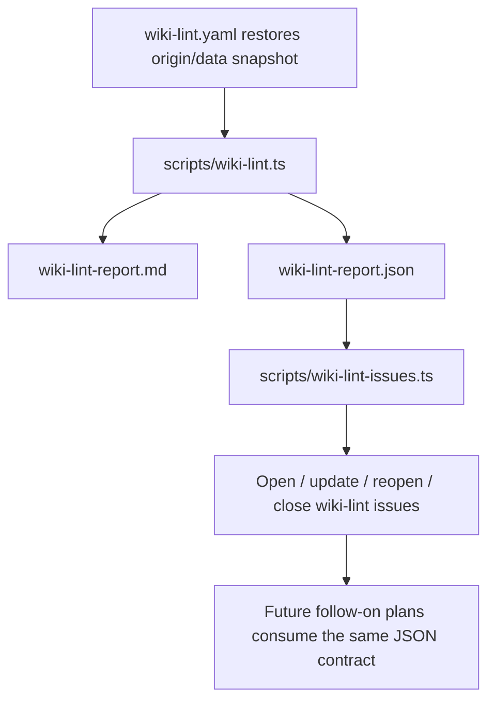

## Overview

Extend `wiki-lint` beyond v1's detect/report-only baseline without breaking the repo's `data`-branch authority model. This follow-on plan focuses on the immediate foundation work that is implementable now: a stable machine-readable lint artifact plus a durable issue lifecycle for deterministic findings and execution failures. It also records the explicit triggers for the later deferred features, stale-claim threshold tuning and repair proposals, without pretending those phases are ready to execute yet.

## Problem Frame

`wiki-lint` v1 intentionally stopped at authoritative-snapshot restore, finding classification, workflow summary output, and markdown artifact upload. That solved the core control-plane gap, but it left the deferred post-v1 work untouched: weekly runs still require humans to inspect artifacts manually, advisory stale-claim thresholds are still a single global constant, and there is no explicit path for safe deterministic repairs after signal quality is proven.

The follow-on work must not reintroduce the stale Unit 17 model that treated lint as a second autonomous write path. The authoritative wiki still lives on `data`, `scripts/wiki-lint.ts` still needs to stay detect/report focused, and any later mutation must be explicit, rerun against the latest `origin/data` snapshot, and flow back through the existing `data -> main` promotion path. That makes the immediate post-v1 work narrower than the full deferred roadmap: first make lint machine-consumable and operator-visible, then use live evidence to decide whether threshold tuning or repair automation deserves its own follow-on plan.

## Requirements Trace

### Immediate foundation

- R1. Preserve `origin/data` as the authoritative wiki source for every post-v1 `wiki-lint` path.
- R2. Keep `scripts/wiki-lint.ts` focused on detection and report generation rather than hidden GitHub or wiki mutation side effects.
- R3. Add a stable machine-readable artifact that downstream automation can consume without scraping markdown.
- R4. Escalate deterministic findings and execution failures into durable control-plane issues with dedupe, reopen, update, and close-on-clear behavior.
- R6. Keep detection, issue escalation, and wiki repair as explicit phases with separate status accounting; no silent green runs when a required follow-on step fails.

### Future-gated follow-ons

- R5. Capture enough weekly freshness telemetry to justify a later page-type stale-policy plan instead of hard-coding new thresholds now.
- R7. Restrict automated repair proposals to an explicit allowlist of unambiguous finding kinds and route any resulting wiki writes through the `data` branch under Fro Bot identity.

## Scope Boundaries

- Advisory findings remain artifact-only; this plan does not add issue escalation or semantic auto-fixes for `stale-claim`, `missing-cross-reference`, or `knowledge-gap`.
- `scripts/wiki-lint.ts` does not become a GitHub Issues client or a wiki mutation entrypoint.
- This plan does not change the weekly `data -> main` promotion model, branch protections, or `scripts/check-wiki-authority.ts` guardrails.

### Deferred to Separate Tasks

- Stale-claim threshold tuning after durable observation storage and six weekly runs exist.
- Repair proposal automation after issue-sync is stable enough to justify a separate follow-on plan.
- Richer semantic lint heuristics beyond the current deterministic/advisory finding set.
- Broader auto-repair beyond catalog drift (`index-drift`, `orphan-page`) once real production data proves other findings are both low-noise and unambiguous to heal.
- Long-term retention policy changes for any new `wiki-lint` issues if the initial lifecycle proves too noisy.

## Context & Research

### Relevant Code and Patterns

- `.github/workflows/wiki-lint.yaml` restores `knowledge/` from `origin/data`, runs `node scripts/wiki-lint.ts`, and always uploads a markdown report artifact.
- `scripts/wiki-lint.ts` currently owns the pure lint engine, markdown report generation, step-summary output, and execution-failure reporting.
- `scripts/wiki-lint.test.ts` already covers the authoritative-snapshot contract, output writing, alias-backed links, and workflow-shape assertions.
- `scripts/reconcile-repos.ts` is the strongest local pattern for hidden issue markers, explicit issue labels, reopen/update/close lifecycle, and "try every issue op, but keep failures visible" behavior.
- `scripts/wiki-ingest.ts` and `scripts/rebuild-wiki-index.ts` are the sanctioned building blocks for `data`-branch wiki writes and deterministic catalog repair.
- `.github/workflows/manage-issues.yaml` shows the repo's existing automation around old report issues, but it is intentionally broader and less precise than the close-on-clear lifecycle needed here.

### Institutional Learnings

- `docs/solutions/integration-issues/wiki-lint-authoritative-data-snapshot-reporting-2026-05-02.md` establishes the v1 contract: authoritative `data` snapshot, separate failure reporting, and no hidden remediation inside lint.
- `docs/solutions/runtime-errors/autonomous-pipeline-silent-failures-2026-04-19.md` shows why aggregate workflow status must include every required downstream step and why recovery tooling must match production shape, not just happy-path tests.
- `docs/solutions/integration-issues/merge-data-pr-github-422-race-recovery-2026-05-02.md` reinforces bounded retries, transient-vs-permanent GitHub failure classification, and durable operator-facing surfaces.
- `docs/solutions/workflow-issues/github-actions-step-output-interpolation-2026-04-21.md` is the workflow-shell pattern to follow when new steps pass structured data around.

## Key Technical Decisions

- **Versioned JSON artifact alongside markdown report**: downstream issue sync and repair workflows will consume a stable JSON contract rather than parsing the markdown report.
- **The JSON artifact is a fail-closed control-plane contract**: it must include schema version, fingerprint version, scan completeness, authoritative snapshot SHA when available, run metadata, and repair eligibility so downstream jobs can reject incomplete or unknown payloads instead of inferring behavior from ad hoc fields.
- **One issue per stable finding fingerprint or failure class**: deterministic findings will dedupe on fingerprint (`kind + path + target?`), execution failures on a smaller failure-class key. This avoids one-issue-per-run churn while preserving close-on-clear behavior in the immediate plan.
- **Issue sync is a separate workflow job, not a side effect inside lint**: detection remains pure, while escalation runs in a distinct job with App-token auth and its own failure accounting.
- **Close-on-clear only happens after a complete authoritative scan**: issue-sync may close or reconcile finding issues only when the JSON artifact represents a completed authoritative scan (`clean` or `findings`), never on `execution-failure`.
- **Freshness telemetry must outlive a single artifact retention window**: Unit 1's JSON contract has to emit per-page freshness data now so a later stale-threshold plan can rely on observed data instead of retrofitting the schema after the fact.
- **Future repair automation should use `workflow_call` for automatic handoff**: if a later repair plan is approved, the automatic path should stay in the same run graph with `workflow_call`, while `workflow_dispatch` remains the manual operator entrypoint.

## Open Questions

### Resolved During Planning

- **Issue grouping model**: use per-fingerprint issues for deterministic findings and per-failure-class issues for execution failures rather than a weekly rollup issue.
- **Execution-failure granularity**: split at least into `snapshot-restore`, `lint-execution`, and `repair-proposal` classes so recurrence and closure are specific.
- **Repairable finding scope**: first repair phase is limited to `index-drift` and `orphan-page`; `broken-wikilink`, `missing-frontmatter`, and `invalid-frontmatter` remain issue-only.
- **Staleness source of truth**: continue using frontmatter `updated`; do not introduce git-history heuristics in this follow-on plan.
- **Repair rollout control**: use a repo variable gate (for example, `WIKI_LINT_AUTO_REPAIR`) so the repair workflow can exist before automatic dispatch is enabled.

### Deferred to Implementation

- Exact page-type stale thresholds once at least six weekly JSON artifacts exist to justify non-global values.
- Exact label strings and issue body wording, as long as the lifecycle contract and hidden marker strategy remain intact.
- Which durable store should back the later stale-threshold observation window if weekly artifact retention remains shorter than the required six-run sample.
- Whether a future repair commit path should append a `knowledge/log.md` entry through a small extracted helper in `scripts/wiki-ingest.ts` or leave auditability to issues + workflow artifacts; that remains a follow-on decision.

## Output Structure

```text
.github/
  workflows/
    wiki-lint.yaml                # modified: lint + issue sync
    settings.yml                  # modified: repo-local wiki-lint labels if new labels are introduced
scripts/
  wiki-lint.ts                    # modified: JSON artifact, finding fingerprints, richer status contract
  wiki-lint.test.ts               # modified: output contract, threshold policy, workflow assertions
  wiki-lint-issues.ts             # new: issue lifecycle sync for deterministic findings / execution failures
  wiki-lint-issues.test.ts        # new: issue dedupe, reopen, close-on-clear, failure handling
```

## High-Level Technical Design

> _This illustrates the intended approach and is directional guidance for review, not implementation specification. The implementing agent should treat it as context, not code to reproduce._



## Phased Delivery

### Phase 1

- Ship the machine-readable artifact and durable issue lifecycle first.
- Let the workflow operate for multiple weekly cycles so future planning can use real issue churn and freshness data instead of guesses.

### Phase 2

- If freshness telemetry is still useful after six weekly runs and a durable observation store exists, create a separate stale-threshold plan using the data from Phase 1.

### Phase 3

- If issue-sync stays clean and low-noise across multiple scheduled runs, create a separate repair-plan that uses `workflow_call` for automatic handoff and keeps manual `workflow_dispatch` as the operator fallback.

## Implementation Units

- [ ] **Unit 1: Add versioned `wiki-lint` JSON output and finding fingerprints**

**Goal:** Extend `wiki-lint`'s artifact contract so downstream automation can consume structured status, snapshot metadata, and stable finding fingerprints without scraping markdown.

**Requirements:** R1, R2, R3, R6

**Dependencies:** None

**Files:**

- Modify: `scripts/wiki-lint.ts`
- Modify: `scripts/wiki-lint.test.ts`
- Modify: `.github/workflows/wiki-lint.yaml`

**Approach:**

- Add a versioned JSON artifact written on every path that currently produces a markdown report: `clean`, `findings`, and `execution-failure`.
- Include enough machine-readable metadata for downstream consumers to reason about recurrence and authority: schema version, fingerprint version, scan completeness, lint status, `origin/data` snapshot SHA when available, generated timestamp, deterministic/advisory findings, execution-failure class, repair eligibility, stable finding fingerprints, and per-page freshness telemetry sufficient for later threshold analysis.
- Preserve the existing markdown report contract and step summary output rather than replacing them.
- Update the workflow to upload both artifacts and to pass snapshot metadata through environment variables instead of shell interpolation.
- Make downstream consumers fail closed on unknown schema/fingerprint versions or incomplete scans.

**Execution note:** Start with failing tests for the JSON artifact contract and workflow artifact upload across clean, findings, and execution-failure paths.

**Patterns to follow:**

- `scripts/wiki-lint.ts` output helpers and status contract
- `docs/solutions/workflow-issues/github-actions-step-output-interpolation-2026-04-21.md`

**Test scenarios:**

- Happy path: a clean snapshot writes matching markdown + JSON artifacts with `status: clean` and zero findings.
- Happy path: a deterministic finding writes a fingerprint that is stable across repeated runs of the same snapshot.
- Happy path: the JSON artifact includes per-page freshness telemetry even when a page is not currently stale.
- Edge case: a consumer-facing JSON payload with an unknown schema or fingerprint version is treated as unusable rather than partially processed.
- Error path: restore or execution failure writes `status: execution-failure` with a classified failure type and still produces both artifacts.
- Integration: workflow-shape assertions prove both artifacts are uploaded and available to downstream jobs on every path.

**Verification:**

- The workflow produces a markdown report and a versioned JSON artifact for `clean`, `findings`, and `execution-failure` runs.
- Re-running the linter against the same snapshot produces identical fingerprints for unchanged findings.
- The JSON artifact contains enough freshness telemetry to support a later stale-threshold plan without changing the schema first.

---

- [ ] **Unit 2: Add durable issue lifecycle for deterministic findings and execution failures**

**Goal:** Turn `wiki-lint` findings into durable operator-facing issues that dedupe, reopen, update, and close automatically instead of forcing humans to poll artifacts manually.

**Requirements:** R3, R4, R6

**Dependencies:** Unit 1

**Files:**

- Create: `scripts/wiki-lint-issues.ts`
- Create: `scripts/wiki-lint-issues.test.ts`
- Modify: `.github/workflows/wiki-lint.yaml`
- Modify: `.github/settings.yml`

**Approach:**

- Add a second job to `wiki-lint.yaml` that always runs after lint, downloads the JSON artifact, and reconciles open `wiki-lint` issues under an App token.
- Use hidden markers and stable fingerprints in issue bodies so the script can find, reopen, update, and close the correct issues without title matching.
- Create issues only for deterministic findings and execution failures; advisory findings remain artifact-only.
- Attempt every needed issue operation in a single run, but make the job fail if any required issue operation fails so the workflow cannot report green while escalation is broken.
- Skip close-on-clear reconciliation for deterministic finding issues whenever the JSON artifact says the authoritative scan was incomplete or ended in `execution-failure`.
- Emit machine-readable lifecycle counters (`opened`, `updated`, `reopened`, `closed`, `failed`) so rollout decisions can rely on evidence instead of eyeballing issue state.

**Execution note:** Start with failing lifecycle tests for "same finding updates existing issue", "cleared finding closes issue", and "closed issue reopens on recurrence" before wiring GitHub I/O.

**Patterns to follow:**

- `scripts/reconcile-repos.ts` issue markers, labels, and close-on-clear behavior
- `scripts/journal-entry.ts` for compact GitHub issue client usage

**Test scenarios:**

- Happy path: a new deterministic finding opens one labeled issue with its fingerprint marker.
- Happy path: the same fingerprint on a later run updates or comments on the existing open issue instead of opening a duplicate.
- Edge case: a previously closed issue with the same fingerprint reopens when the finding recurs.
- Edge case: a clean run closes any previously open issue whose fingerprint is absent from the current JSON artifact.
- Edge case: an `execution-failure` artifact still opens or updates the correct failure-class issue but does not close existing deterministic-finding issues.
- Error path: a failed issue create/update/close makes the issue-sync job fail after recording which operations were attempted.
- Integration: a workflow-level assertion proves the issue-sync job runs even on `status: clean`, so close-on-clear is not skipped.
- Integration: the workflow summary or outputs expose the lifecycle counters needed for rollout decisions.

**Verification:**

- One repeated deterministic finding or execution failure churns a single durable issue instead of one issue per run.
- A clean authoritative snapshot closes the corresponding open issue on the next run.
- The workflow is red when issue sync is required and fails.
- Operators can verify issue-sync health from explicit counters instead of manual repo inspection.

## Follow-on Triggers

### Future Plan A: Stale-Threshold Tuning

Create a separate follow-on plan for R5 only when both of these are true:

- six scheduled `wiki-lint` runs have produced Unit 1 freshness telemetry
- the repo has a durable observation store that survives longer than the current artifact retention window

The later plan should stay advisory-only, keep freshness based on frontmatter `updated`, and introduce a dedicated `scripts/wiki-lint-policy.ts` + `scripts/wiki-lint-policy.test.ts` pair only if the observed data justifies page-type-specific thresholds.

### Future Plan B: Repair Proposal Automation

Create a separate follow-on plan for R7 only when all of these are true:

- issue-sync from Unit 2 has stayed stable across at least three consecutive scheduled runs
- explicit lifecycle counters show zero duplicate issues, zero missed close-on-clear events on complete scans, and zero unclassified execution failures
- a human operator approves enabling repair planning

That later plan should:

- use `workflow_call` for the automatic path from `wiki-lint.yaml`
- keep `workflow_dispatch` as the manual operator entrypoint
- make the repair workflow emit the same versioned artifact/status shape so `repair-proposal` failures participate in the same durable issue lifecycle
- limit the first repair allowlist to deterministic catalog drift only

## System-Wide Impact

- **Interaction graph:** `wiki-lint.yaml` becomes a two-stage control that restores `origin/data`, emits structured artifacts, and syncs issues. Future stale-policy and repair plans consume the same artifact contract rather than adding hidden branches now.
- **Error propagation:** lint engine failures stay inside `scripts/wiki-lint.ts`; issue-sync failures become a separate job failure so required downstream work cannot disappear behind a green lint job.
- **State lifecycle risks:** stable finding fingerprints and close-on-clear logic prevent issue duplication, but only when scan completeness is explicit and respected.
- **Run overlap risks:** issue sync and repair must key their work to one authoritative artifact/snapshot at a time so overlapping weekly or manual runs do not reopen/close thrash or create duplicate repair proposals.
- **API surface parity:** markdown report output remains intact while the JSON artifact adds a second, machine-readable surface; downstream automation must consume JSON rather than scraping markdown.
- **Integration coverage:** workflow assertions need to cover artifact upload, issue-sync job execution on `clean` and `execution-failure`, and counter publication; pure unit tests alone will not prove the full control-plane contract.
- **Unchanged invariants:** `scripts/wiki-lint.ts` still does not mutate wiki content or call GitHub Issues directly, advisory findings remain artifact-only, and `main` remains protected from direct autonomous wiki writes.

## Risks & Dependencies

| Risk | Mitigation |
| --- | --- |
| Stable finding fingerprints are too coarse or too noisy, causing issue churn | Include fingerprint regression tests in Unit 1 and lifecycle tests in Unit 2 before enabling issue sync |
| Workflow status regresses into another silent-failure class | Treat issue sync and repair proposal as separate required jobs with explicit red-state behavior when they fail |
| Incomplete scans close live finding issues incorrectly | Allow close-on-clear only for complete authoritative scans; `execution-failure` runs update failure issues only |
| Repair writes mutate stale state or paper over unrepairable findings | Re-run lint against the latest `origin/data` snapshot immediately before repair and limit the first allowlist to index rebuild cases |
| Threshold tuning overfits sparse weekly data or lacks durable evidence | Keep threshold tuning out of this plan until six scheduled runs plus durable observation storage exist |
| New repo-local labels drift from repo settings | Manage `wiki-lint` labels in `.github/settings.yml`, not the org-wide `common-settings.yaml` contract |
| Overlapping manual and scheduled runs race on issue or repair state | Use workflow concurrency plus snapshot-aware no-op behavior for superseded artifacts before issue sync or repair writes |

## Documentation / Operational Notes

- Update the `wiki-lint` learning doc after Units 1 and 2 land so the documented contract includes JSON output and issue escalation.
- Document any new labels and operator expectations in the workflow README surface if the issue-sync job adds a new recurring operational surface.

### Rollout Criteria

- Treat issue-sync as stable enough for later follow-on planning only after three consecutive scheduled runs show zero duplicate issues, zero missed close-on-clear cases on complete scans, and zero unclassified execution failures.

### Rollback / Containment

- Immediate containment for noisy issue-sync behavior is to disable or bypass the issue-sync job, leaving `wiki-lint` artifact-only.
- If issue-sync misbehaves, close or relabel noisy issues with an operator note rather than leaving the repo in a flood state.
- If a future repair plan is approved and later misbehaves, contain it by reverting the repair commit on `data`, closing any resulting promotion PR, and verifying that no additional repair runs remain in flight.

### Live Verification

- Verify on first deploy that every run still uploads both artifacts and reports an unambiguous aggregate status.
- Verify on the first recurring deterministic finding that the same issue is updated rather than duplicated.
- Verify on the first clean run after an open finding that close-on-clear happens only when the scan was complete.
- Verify that workflow summaries or outputs expose the lifecycle counters needed for rollout decisions.

### Failure Policy

- One transient weekly red run is acceptable if rerun evidence proves the downstream dependency failure was temporary.
- Do not start later stale-threshold or repair planning while issue-sync still shows transient or permanent failure churn.

## Sources & References

- Prior control-plane plan: `docs/plans/2025-04-15-001-feat-frobot-control-plane-plan.md`
- Related learning: `docs/solutions/integration-issues/wiki-lint-authoritative-data-snapshot-reporting-2026-05-02.md`
- Related learning: `docs/solutions/runtime-errors/autonomous-pipeline-silent-failures-2026-04-19.md`
- Related learning: `docs/solutions/integration-issues/merge-data-pr-github-422-race-recovery-2026-05-02.md`
- Related code: `.github/workflows/wiki-lint.yaml`, `scripts/wiki-lint.ts`, `scripts/wiki-ingest.ts`, `scripts/rebuild-wiki-index.ts`, `scripts/reconcile-repos.ts`
- Related issue: `#3148`
