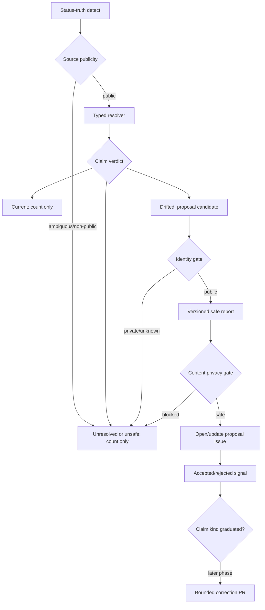

# feat: Add status-truth maintenance loop

## Overview

Add the first A2 semantic truth-maintenance loop for the `.github` control plane. The loop scans
public status claims, checks them against live public GitHub reality, opens or updates
fingerprinted proposal issues, and records counts-only accuracy signals before any correction PR
autonomy is enabled.

Bounded PRs stay in this plan as a second phase: once proposal outcomes show a claim kind is
reliable, Fro Bot can open small human-reviewed correction PRs under strict privacy, branch, path,
and diff gates.

## Problem Frame

Recent rollout work around #3512, #48, #907, #1033, release-versus-deploy state, and live
verification required manual reconciliation before the next action was safe. The repo already has
structural wiki lint, learning capture, issue dedupe, privacy gates, and data-branch authority
rules. It lacks a loop that verifies public coordination claims against live state and turns drift
into reviewable work.

## Requirements Trace

- R1. Status-truth claims that affect the next operator action are the first A2 slice.
- R2. The first inventory covers public issue, PR, release, plan, and rollout-tracker status
  claims in `.github` docs, plans, and issue bodies.
- R3. The loop rejects vague prose audits; every finding comes from a typed claim kind.
- R4. Each claim kind defines a pattern, source of truth, confidence rule, suppression rule, and
  proposal body fields.
- R5. New claim kinds are reviewable repo changes.
- R6-R8. Live public GitHub state and current files win; conflicts, unavailable state, and private
  or unknown identity fail closed.
- R9-R14. Drift becomes fingerprinted proposal issues with outcome state and accuracy counters.
- R15-R19. Bounded PRs are a later phase gated by observed signal, tight diff rules, human merge,
  and no branch-protection bypass.
- R20-R26. All public output is privacy-gated, schema-limited, credential-separated, and free of
  private identity or secret-bearing data.

## Scope Boundaries

- First implementation targets only `fro-bot/.github` public status-truth claims.
- Supported v1 sources are public repo docs, public plan/brainstorm files, public `.github` issue
  bodies/comments, and public GitHub issue/PR/release state needed to verify those claims.
- Deferred sources are Project board field state, private repo references, memory stores,
  dashboard/operator runtime state, Discord/social surfaces, and non-public workflow logs.
- Proposal issues are in scope; broad issue/PR lifecycle management is not.
- Phase 1 does not open correction PRs.
- Phase 2 can open bounded correction PRs only after Phase 1 produces accepted/rejected signal.
- No writes to `knowledge/`, `metadata/`, wiki authority surfaces, repo settings, secrets,
  workflows, hooks, persona files, or release configuration.
- No org-wide scanning, dependency hygiene, broad CI hardening, review-to-fix, A1 capture,
  autonomous authoring, dashboard UI, autonomous merges, or automerge enablement.

### Deferred to Separate Tasks

- Claim kinds beyond status truth: separate A2 follow-up after the first loop proves useful.
- Metadata/wiki authority repair: separate loop because it touches authority semantics.
- Bounded PR graduation for additional claim kinds: later expansion after the first PR-capable
  claim kind demonstrates accuracy.

## Context & Research

### Relevant Code and Patterns

- `scripts/wiki-lint.ts`: pure core plus I/O shell, structured JSON report, deterministic and
  advisory finding separation, markdown report output.
- `scripts/wiki-lint-issues.ts`: fingerprint markers, open/update/reopen/close lifecycle, and
  issue body helpers.
- `scripts/capture-learnings-privacy.ts`: shared privacy primitives for private-token and secret
  scanning.
- `scripts/capture-learnings-open.ts`: proposal issue creation, runtime label creation, and
  same-run dedupe discipline.
- `scripts/merge-data-pr.ts`: PR lifecycle resilience, rediscovery, branch comparison, labeling,
  and explicit no-automerge posture.
- `.github/workflows/main.yaml`: shared setup action, Node 24 strip-only script-load gate, and
  required verification shape.

### Institutional Learnings

- `docs/solutions/documentation-gaps/doc-drift-cleanup-pattern-2026-04-18.md`: derive live facts
  before updating docs; split drift work into small reviewable units.
- `docs/solutions/best-practices/github-issues-api-same-run-eventual-consistency-2026-05-20.md`:
  carry an in-memory created-key set because GitHub issue listing can lag same-run writes.
- `docs/solutions/security-issues/verify-whole-public-perimeter-2026-06-22.md`: verify every
  public surface before claiming a value is non-leaking.
- `docs/solutions/best-practices/privacy-gate-promotion-leak-prevention-2026-06-04.md`: enforce
  privacy gates at the trusted chokepoint and fail closed on ambiguous identity.

### External References

- Renovate and Dependabot validate the broad pattern: confidence-tiered bot PRs, durable tracking,
  human merge, and branch protection as the hard boundary.
- GitHub Copilot coding agent validates the safety boundary: bot-created branches and PRs are
  reviewable artifacts, not self-merged changes.
- API/docs drift tools validate typed claim tuples over vague AI comparison.
- Verification-first agent research validates the premise that self-improvement compounds only
  where success is machine-checkable.

## Key Technical Decisions

- **Two-phase delivery:** Phase 1 ships proposal issues and accuracy signal; Phase 2 adds bounded
  PRs only after the signal exists.
- **Typed claim inventory:** Claim kinds are code-level definitions, not prompt-only instructions.
  The first inventory includes PR state, issue state, release/tag state, plan status, and
  rollout-tracker status.
- **Source resolver typology:** Claim resolvers are not one generic shape. API resolvers (PR,
  issue, release/tag) are network-dependent and rate-limit-aware. File-parse resolvers (plan
  status) are deterministic and local. Compound resolvers (rollout-tracker) compose sub-resolvers
  and inherit their failure modes. Each resolver declares its type and failure policy.
- **Proposal issues as state:** V1 stores proposal state in GitHub issues using hidden markers,
  labels, and comments. No metadata file is added.
- **Source and identity gates before rendering:** Claim sources are classified as public,
  ambiguous, or non-public before extraction proceeds. Referenced repos, issues, PRs, and authors
  pass an identity gate before any proposal text is rendered. Ambiguous or non-public sources
  become blocked counters, not rendered artifacts.
- **Privacy gate before every public emit:** Proposal titles, bodies, comments, workflow summaries,
  run display names, future PR titles/bodies/labels, future PR commit messages, and branch names
  pass through the same public-output gate.
- **Versioned report contract:** The detect step emits a typed report with schema and fingerprint
  versions before the open step can write. Unknown versions, malformed reports, prohibited fields,
  or count mismatches block the write step.
- **Counts-only workflow telemetry:** Workflow summaries carry aggregate counters only. Evidence
  lives in proposal issues after privacy gating.
- **Read/write credential split:** Detect runs with read-only credentials. Proposal/PR creation
  uses a separate app token restricted to this repository and the minimum issue/contents scopes
  needed for the active phase. Tokens are constrained at mint time to the permitted phase scope;
  missing, over-scoped, or non-introspectable write credentials fail closed before any write.
- **Sanitized artifacts only:** Structured handoff artifacts contain machine-safe verdict fields and
  counters, not raw private identity, secrets, source snippets, workflow logs, or ungated rendered
  proposal content.
- **Per-claim isolation:** One blocked or unresolved claim does not prevent unrelated safe claims
  from becoming proposals. A privacy-gate module or configuration failure blocks the whole write
  phase; a per-claim gate failure blocks only that claim.
- **No LLM comparison in v1:** The first loop is deterministic. LLM-authored semantic comparison
  can be considered after typed claim extraction proves signal.

## Open Questions

### Resolved During Planning

- **Should bounded PRs be part of v1?** Yes, but only as Phase 2 after Phase 1 creates accepted
  versus rejected signal.
- **Where does proposal state live?** GitHub issue surfaces: hidden fingerprint markers, labels,
  and state-transition comments.
- **Which claim kinds start the inventory?** PR state, issue state, release/tag state, plan status,
  and rollout-tracker status.
- **Should v1 add a metadata state file?** No; proposal issues are enough and avoid a new write
  authority path.

### Deferred to Implementation

- Exact parser boundaries for natural-language status phrases may be adjusted while writing
  claim-kind tests.
- Exact label color/description can follow existing label conventions when runtime label creation
  is implemented.
- Exact accuracy threshold for Phase 2 graduation should be encoded conservatively after Phase 1
  behavior is observable.

## High-Level Technical Design

> *This illustrates the intended approach and is directional guidance for review, not
> implementation specification. The implementing agent should treat it as context, not code to
> reproduce.*

## Implementation Units

- [x] **Unit 1: Status-claim model and detector core**

**Goal:** Define the typed claim inventory and pure detection core for public status-truth claims.

**Requirements:** R1, R2, R3, R4, R5, R6, R7, R8

**Dependencies:** None

**Files:**
- Create: `scripts/status-truth-detect.ts`
- Test: `scripts/status-truth-detect.test.ts`

**Approach:**
- Model each claim kind as a declarative definition with claim pattern, source resolver, confidence
  rule, suppression rule, and proposal fields.
- Define the status-truth report envelope before implementing any resolver: schema version,
  fingerprint version, report status (`clean`, `findings`, or `execution-failure`), scan-complete
  flag, failure class, repair eligibility, findings, and aggregate counts.
- Each resolver definition declares whether it is API, file-parse, or compound. Compound resolvers
  list their sub-resolvers so dependency ordering and cascade-failure rules are explicit.
- Start with public PR state, issue state, release/tag state, plan status, and rollout-tracker
  status.
- Use this v1 source precedence:
  - PR state: GitHub PR API state wins over narrative status text; unavailable or inaccessible PRs
    are unresolved.
  - Issue state: GitHub issue API state wins over narrative status text; unavailable or inaccessible
    issues are unresolved.
  - Release/tag state: GitHub release/tag API state wins over plan or issue status text; published
    release does not imply deployed runtime state.
  - Plan status: current plan frontmatter wins over prose references to the same plan; conflicting
    frontmatter/prose is unresolved.
  - Rollout-tracker status: use the existing rollout-tracker snapshot shape instead of re-deriving
    tracker truth. Project access failure, snapshot failure, or referenced-state disagreement is
    unresolved rather than drifted.
- Process claim kinds in dependency order: file-parse resolvers first, API resolvers second,
  compound resolvers last. Compound claims become unresolved when any required sub-resolver is
  unavailable.
- Keep line numbers out of fingerprints; use path, claim kind, source reference, and a one-way hash
  of normalized claim text so unrelated line shifts do not create duplicate proposals without
  exposing reconstructable claim text.
- Treat the fingerprint as a public identifier. Every fingerprint input is privacy-checked as a
  unit, and blocked inputs prevent proposal, label, branch, or PR metadata generation.
- Classify checks as current, drifted, unresolved, or unsafe to emit.
- Treat unavailable source state, conflicting source state, and private/unknown identity as blocked
  rather than drifted.

**Execution note:** Implement new domain behavior test-first; this is the core correctness seam.

**Patterns to follow:**
- `scripts/wiki-lint.ts` for pure report construction and deterministic finding shape.
- `scripts/wiki-lint-issues.ts` for stable fingerprinting discipline.

**Test scenarios:**
- Happy path: a public PR-open claim whose live PR is closed becomes a drifted claim with a stable
  fingerprint and proposed correction.
- Happy path: a current release/tag claim is classified as current and produces no proposal.
- Happy path: a report with known schema/fingerprint versions is accepted by the lifecycle planner.
- Edge case: a claim line moves but the normalized text and source reference stay the same; the
  fingerprint stays stable.
- Edge case: a rollout-tracker claim is unresolved when its snapshot source fails or any required
  sub-resolver is unavailable.
- Error path: an unknown report schema or fingerprint version is rejected before any write planning.
- Error path: GitHub state is unavailable; the claim is unresolved and not proposal-eligible.
- Error path: the source resolves to private or unknown identity; the claim is unsafe to emit.
- Edge case: no supported claims are present; the report contains zero findings and zero
  proposal-eligible actions.
- Integration: multiple claim kinds in one document produce distinct report entries and aggregate
  counts.

**Verification:**
- The detector can produce a structured report without performing any GitHub writes.

- [x] **Unit 2: Public-output privacy gate adapter**

**Goal:** Centralize the rendering safety gate for every proposal, comment, summary, and future PR
surface.

**Requirements:** R20, R21, R22, R23, R24, R25, R26

**Dependencies:** Unit 1

**Files:**
- Create: `scripts/status-truth-public-output.ts`
- Modify: `scripts/status-truth-detect.ts`
- Test: `scripts/status-truth-public-output.test.ts`

**Approach:**
- Wrap the existing privacy helpers instead of forking their logic.
- Keep source-publicity classification and identity resolution separate from content scanning.
  Source and identity gates run before rendering; content gates run only over already-safe rendered
  strings.
- Load private-token and redacted canonical-id token sets in the I/O shell before the pure gate is
  called. Load failure blocks proposal/PR output rather than treating the token set as empty.
- Gate every rendered public artifact after rendering, not just raw claim data.
- Expose a strict public-output schema for proposal title/body/comment, recurrence comment,
  workflow job summary, workflow step summary, workflow run display name, future PR title/body,
  future PR commit messages, future PR branch name, and future PR labels.
- Reserve Phase 2 surfaces in the Phase 1 schema so future PR metadata cannot bypass the gate when
  PR support is enabled later.
- Keep fingerprints out of workflow summaries, run display names, and step summaries; those surfaces
  are counts-only even when the fingerprint is opaque.
- Return blocked counters without returning blocked claim text.
- Reserve opaque fixed-prefix metadata generation for Phase 2 PR branch/title surfaces.

**Execution note:** Add mutation-style tests for blocked content before wiring the adapter into the
open step.

**Patterns to follow:**
- `scripts/capture-learnings-privacy.ts` for private-token and secret detection.
- `docs/solutions/security-issues/verify-whole-public-perimeter-2026-06-22.md` for public-surface
  enumeration.

**Test scenarios:**
- Happy path: a known-public claim proposal passes and returns sanitized title/body fields.
- Happy path: source-publicity and identity gates run before proposal rendering.
- Error path: private repo token appears in a rendered proposal body; output is blocked and only a
  counter remains.
- Error path: secret-like content appears in a proposed correction; output is blocked.
- Error path: privacy token loading fails; no proposal or PR output is emitted.
- Error path: replacing the gate with an identity passthrough fails a private-identity mutation test.
- Edge case: a fingerprint appears in a proposal issue body but never in workflow summary output.
- Integration: proposal title, proposal body, recurrence comment, workflow summary row, future PR
  title/body, commit message, label, and future branch name all pass through the same gate function.

**Verification:**
- No public-render helper can bypass the shared gate.

- [x] **Unit 3: Proposal lifecycle planner**

**Goal:** Convert drifted, privacy-safe status claims into GitHub issue lifecycle actions.

**Requirements:** R9, R10, R11, R12, R13, R14

**Dependencies:** Units 1 and 2

**Files:**
- Create: `scripts/status-truth-proposals.ts`
- Test: `scripts/status-truth-proposals.test.ts`

**Approach:**
- Parse existing proposal issues using hidden markers, outcome labels, and state-transition
  comments. Fetch open proposal issues plus recent closed proposal issues so terminal state survives
  across runs.
- Map one unique fingerprint to one proposal issue. Multiple drifted claims in the same file remain
  separate issues so outcomes can differ per claim.
- Plan open, update, reopen, suppress, and close-on-clear actions without touching GitHub.
- If a matching open issue exists and drift details are unchanged, plan no action to avoid comment
  spam. If live-state details changed, plan one update comment.
- Treat closed issues labeled false-positive or rejected as terminal suppression unless claim text
  or source reference materially changes.
- Treat closed issues without terminal labels as non-terminal. If the exact drift returns, plan a
  reopen action, recurrence comment, and removal of resolved/manually-fixed labels.
- Plan close-on-clear only when the latest scan is complete and not an execution failure; partial
  scans never close proposals.
- Maintain a same-run created-key set so GitHub list-after-create lag cannot duplicate proposals.
- Track accepted, rejected, false-positive, superseded, manually-fixed, resolved, and recurring
  outcomes via labels and hidden markers rather than prose parsing.

**Execution note:** Implement lifecycle behavior with pure tests before adding Octokit calls.

**Patterns to follow:**
- `scripts/wiki-lint-issues.ts` for issue lifecycle planning and hidden marker parsing.
- `scripts/capture-learnings-open.ts` for same-run dedupe and runtime label creation.

**Test scenarios:**
- Happy path: a new drifted claim plans one new proposal issue.
- Happy path: an open matching proposal with unchanged drift plans zero comments or updates.
- Happy path: an open matching proposal whose live-state details changed plans one update comment.
- Edge case: a recently created key is not returned by GitHub listing; a second proposal is still
  suppressed in the same run.
- Edge case: an open proposal missing from a complete non-failure scan plans a close action with a
  resolved label.
- Edge case: a closed non-terminal proposal whose drift returns plans reopen and clears resolving
  labels.
- Error path: a matching false-positive proposal exists; the finding is suppressed and counted.
- Error path: malformed outcome markers are ignored and counted for operator attention.
- Integration: resolved drift closes or comments on the matching open proposal without closing
  unrelated proposals.

**Verification:**
- Lifecycle planning is deterministic from report plus existing issue state.

- [x] **Unit 4: Detect/open CLI shells and workflow wiring**

**Goal:** Add runnable scripts and a scheduled/manual workflow that detects status-truth drift and
opens proposal issues with separated credentials.

**Requirements:** R6-R14, R20-R25

**Dependencies:** Units 1-3

**Files:**
- Create: `.github/workflows/status-truth.yaml`
- Modify: `scripts/status-truth-detect.ts`
- Modify: `scripts/status-truth-proposals.ts`
- Test: `scripts/status-truth-detect.test.ts`
- Test: `scripts/status-truth-proposals.test.ts`

**Approach:**
- Keep detect read-only: checkout, setup, scan repo docs/issues, fetch live public GitHub state,
  emit structured report and counts-only summary.
- Detect-step auth is intentionally current-repo scoped for Phase 1. Cross-repo references are
  classified as unavailable unless explicitly supported by a later read-only App-token design.
- Keep open write-scoped: consume the report artifact, mint a minimally scoped app token, and
  perform proposal issue actions only after privacy gating.
- Mint write credentials with explicit phase-scoped permissions: Phase 1 gets issue-write plus
  read-only content access for this repository; Phase 2 adds content-write and pull-request-write
  only when bounded PR creation is enabled.
- Treat missing, malformed, or unexpectedly broad write credentials as a hard failure before any
  public output is emitted.
- Use workflow dispatch and schedule triggers, plus workflow_call if later orchestration needs it.
- Serialize workflow runs with `cancel-in-progress: false` so a detect-to-open sequence is never
  interrupted halfway through proposal planning.
- Define a dry-run mode that runs detect, planning, gating, and reporting, but never creates,
  updates, closes, or comments on GitHub issues. The summary clearly marks dry-run status and
  reports action counts only.
- Use sanitized file artifacts for structured handoff rather than multiline GitHub outputs; artifacts
  must omit claim text, source snippets, private identity, secret-like content, and raw rendered
  proposal bodies.
- Validate the artifact before any write planning: expected schema version, fingerprint version,
  required fields, prohibited-field absence, and aggregate count consistency.
- Keep console output counts-only. Script stdout/stderr must not include raw claim text, source
  paths, rendered bodies, fingerprints, or credential values; runtime errors use claim kind and
  opaque counters only.
- Add runtime label creation for `status-truth` and outcome labels only if they are missing.
- Fail closed if required labels cannot be confirmed; unlabeled proposals would evade future
  seen-set queries and repeat forever.
- Exclude existing `status-truth` proposal issues from claim extraction so the loop does not scan
  and propose corrections to its own proposal state.

**Patterns to follow:**
- `.github/actions/setup/action.yaml` for bootstrap.
- `scripts/wiki-lint-issues.ts` and `scripts/capture-learnings-open.ts` for Octokit shell style.
- `.github/workflows/wiki-lint.yaml` and `.github/workflows/capture-learnings.yaml` patterns where
  applicable.

**Test scenarios:**
- Integration: detect output feeds open planning without reading claim text from workflow summary.
- Integration: detect output artifact contains safe machine fields and counters but no raw claim text
  or source snippets.
- Integration: dry-run emits planned action counts and performs no issue mutations.
- Error path: app token creation or write API failure leaves report artifacts intact and does not
  mutate partial state beyond completed issue actions.
- Error path: artifact schema mismatch, prohibited fields, or count mismatch blocks the open step.
- Error path: required label creation/confirmation fails; no proposal opens.
- Error path: stdout/stderr from script failure does not contain test claim text, source paths, or
  fingerprint-like values.
- Error path: privacy gate blocks one proposal but does not block unrelated safe proposals.
- Edge case: workflow runs with no findings and emits zero counts without opening issues.

**Verification:**
- The workflow can run in dry or mocked mode during tests without public writes.
- Script-load CI can import every new production script under Node 24 strip-only execution.

- [x] **Unit 5: Accuracy signal and operator-facing proposal UX**

**Goal:** Make accepted/rejected outcomes visible enough for Fro Bot to improve claim-kind quality.

**Requirements:** R10, R12, R13, R14, R24

**Dependencies:** Units 3 and 4

**Files:**
- Modify: `scripts/status-truth-proposals.ts`
- Test: `scripts/status-truth-proposals.test.ts`
- Modify: `README.md`

**Approach:**
- Define outcome labels and comment markers for accepted, rejected, false-positive, superseded,
  manually-fixed, and recurring findings.
- Distinguish terminal labels from non-terminal labels: rejected and false-positive suppress future
  matching findings; accepted, manually-fixed, resolved, and recurring preserve history but allow
  re-open or auto-close transitions.
- Summarize aggregate counts by claim kind in workflow summary without emitting paths or
  fingerprints.
- Calculate per-kind usefulness from accepted versus rejected/false-positive outcomes, excluding
  malformed or unknown labels from automated accuracy math while still counting them for operator
  attention.
- Document how Marcus marks a proposal as false-positive, accepted, or superseded.
- Ensure proposal bodies are concise, evidence-backed, and free of internal session narration.

**Patterns to follow:**
- `scripts/wiki-lint-issues.ts` recurrence comments.
- `scripts/capture-learnings-open.ts` proposal labels and issue bodies.

**Test scenarios:**
- Happy path: accepted and rejected proposal labels produce per-kind accuracy counters.
- Happy path: manually-fixed proposals auto-close with a resolved label when drift clears.
- Edge case: a closed proposal without an outcome marker is treated conservatively and not
  silently re-opened as a brand-new finding.
- Error path: malformed outcome markers are ignored and counted for operator attention.
- Integration: proposal body has enough evidence for review while workflow summary remains
  counts-only.

**Verification:**
- A reviewer can classify proposal usefulness without reading workflow logs.

- [x] **Unit 6: Bounded PR graduation gate**

**Goal:** Add the second-phase pathway for reliable claim kinds to open tightly scoped correction
PRs after proposal signal exists.

**Requirements:** R15, R16, R17, R18, R19, R20, R21, R22, R23, R25, R26

**Dependencies:** Units 1-5

**Files:**
- Create: `scripts/status-truth-prs.ts`
- Test: `scripts/status-truth-prs.test.ts`
- Modify: `.github/workflows/status-truth.yaml`

**Approach:**
- Gate PR eligibility on claim-kind graduation, privacy-safe output, approved docs path, literal or
  tightly bounded substitution, and one PR per run.
- Run path authorization before computing any correction diff. Disallowed paths downgrade to
  proposal-only without extracting correction text, rendering PR metadata, or creating a branch.
- Use a reviewed path allowlist defined by claim kind. Path traversal segments or prompt-provided
  path overrides are automatic blocks.
- Use opaque branch names and fixed-prefix titles generated from fingerprints, never source text.
- Refuse force-push, retargeting, automerge, or approval actions.
- Abort PR creation on any ambiguity in branch naming, title generation, diff eligibility, path
  validation, base branch, existing branch ownership, or privacy-gate result; leave only proposal
  state behind.
- Never mutate an existing branch or PR unless its opaque fingerprint, bot ownership, target branch,
  and planned diff all match the current finding.
- Link PRs back to proposal issues and let branch protection plus human review remain the merge
  boundary.
- Downgrade all non-eligible or overflow candidates to proposal-only output.

**Execution note:** Treat this unit as dependent on observable Phase 1 signal; if implemented in
the same PR, keep the feature disabled until graduation criteria are met.

**Patterns to follow:**
- `scripts/merge-data-pr.ts` for PR rediscovery and retry boundaries.
- GitHub Copilot coding agent and Renovate safety patterns: bot branch, human review, no self-merge.

**Test scenarios:**
- Happy path: a graduated claim kind produces one correction PR with opaque branch/title metadata.
- Edge case: two PR-eligible findings appear in one run; one PR is opened and the rest become
  proposals.
- Error path: proposed diff touches a forbidden path; no PR opens and a proposal is created.
- Error path: branch or title candidate fails the privacy gate; no PR opens.
- Error path: existing branch metadata does not match the current fingerprint; no branch is mutated
  and the finding remains proposal-only.
- Integration: existing open status-truth PR is rediscovered instead of creating a duplicate.

**Verification:**
- No code path can merge, approve, enable automerge, force-push, or target non-main branches.

## System-Wide Impact

- **Interaction graph:** The loop reads public repo files and public GitHub issue/PR/release state,
  emits reports, then writes proposal issues and future PRs through separated workflow steps.
- **Error propagation:** Detection uncertainty blocks public output. Write-step failures report
  counts and leave already-completed issue actions auditable.
- **Privacy-gate failure semantics:** Per-claim gate errors block that claim and increment a
  gate-error counter. Module-load or configuration failures block the entire write phase before any
  proposal is emitted.
- **State lifecycle risks:** Proposal state lives in GitHub issue surfaces, so dedupe must account
  for same-run eventual consistency and closed terminal states.
- **Artifact boundary:** Handoff artifacts are internal workflow plumbing and still use the public
  output safety model. The detect-to-open artifact is a declared schema with safe fields only;
  raw claim text, source snippets, API response bodies, node IDs, database IDs, and credential data
  are prohibited rather than merely hidden by artifact retention.
- **API surface parity:** Future agent workflows can invoke the same status-truth workflow rather
  than embedding status reconciliation in prompts.
- **Integration coverage:** Tests must cover detect-to-proposal handoff, privacy gating, proposal
  lifecycle state, and future PR gating.
- **Unchanged invariants:** `data` branch writes, wiki authority, metadata writes, branch
  protection, and human merge controls are unchanged.

## Risks & Dependencies

| Risk | Mitigation |
|------|------------|
| Proposal spam from noisy claim kinds | Start with typed status claims, cap outputs, track accepted/rejected and false-positive outcomes by claim kind. |
| Proposal overload from unexpected drift volume | Cap new proposals per run and per rolling window; excess findings stay counted-only until the operator raises the cap. |
| Noisy claim kind erodes trust before measurement | Auto-suspend claim kinds whose accepted rate falls below the configured threshold until operator action re-enables them. |
| Private identity leak through public proposals | Gate rendered output, fail closed on unknown identity, and keep workflow summaries counts-only. |
| Private identity leak through artifacts or logs | Sanitize artifacts, avoid raw claim/source snippets, and keep logs limited to aggregate counters and error codes. |
| Over-scoped write token | Split read/write credentials, restrict write credentials to this repo and active-phase scopes, and fail before output if scope is wrong or unavailable. |
| Duplicate proposals from GitHub eventual consistency | Carry same-run created fingerprints and parse existing open/closed proposal issues. |
| Circular detection from the loop's own proposals | Exclude issues labeled `status-truth` from claim extraction. |
| GitHub API incident or rate limiting | Classify affected claims as unresolved, emit counts-only health signal, and write no proposal based on incomplete state. |
| PR autonomy before signal exists | Ship Phase 1 first; gate Phase 2 on claim-kind accuracy and keep human merge required. |
| Authority surface mutation | Forbid writes to metadata, wiki authority, workflows, settings, hooks, secrets, persona files, and release config. |

## Rollout Sequence

| Gate | Check | Duration |
|------|-------|----------|
| 1. Manual dry-run | Run detect and proposal planning with no issue writes; review planned actions before enabling writes. | 1-2 runs |
| 2. Single claim kind | Enable one low-risk claim kind manually and review proposal quality before adding the next kind. | 3-7 days per kind |
| 3. Full claim inventory | Enable all v1 claim kinds, still manually triggered. | Until every kind has at least one observed cycle |
| 4. Scheduled low cadence | Enable the schedule at low frequency with proposal caps and pause controls active. | 1-2 weeks |
| 5. Desired cadence | Increase only if proposal volume and false-positive rate stay reviewable. | Ongoing |

Hard gates between steps:

- Step 2 requires zero blocker-class false positives for the chosen kind.
- Step 3 requires each enabled kind to have acceptable per-kind signal, not just good aggregate
  accuracy.
- Step 4 requires proposal volume to stay reviewable within normal operator flow.
- Any unexpected failure mode reverts to the prior gate until the claim kind or lifecycle state
  machine is fixed.

## Documentation / Operational Notes

- Update `README.md` once the workflow exists, using live workflow names only.
- Phase 1 status-truth is advisory and must not be added as a required `main` check. If a future
  iteration promotes it to a required check, the exact check name must be byte-identical across the
  workflow, `.github/settings.yml`, and operator docs, with YAML quoting when needed.
- Add a short operator note explaining proposal outcome labels and false-positive handling.
- Document the pause controls: repository-level pause, per-claim-kind suspension, and workflow
  disable as the hard stop.
- Document first-30-day health signals: proposals per run, accepted/rejected/false-positive rate by
  kind, workflow failure rate, proposal review latency, and repeated proposal recurrence.
- Record a `docs/solutions/` learning after implementation if the proposal state machine or PR
  graduation gate reveals a reusable pattern.

## Sources & References

- **Origin document:** [docs/brainstorms/2026-06-26-a2-self-maintenance-portfolio-requirements.md](../brainstorms/2026-06-26-a2-self-maintenance-portfolio-requirements.md)
- Related scripts: `scripts/wiki-lint.ts`, `scripts/wiki-lint-issues.ts`,
  `scripts/capture-learnings-privacy.ts`, `scripts/capture-learnings-open.ts`,
  `scripts/merge-data-pr.ts`, `scripts/rollout-tracker-snapshot.ts`
- Related workflows: `.github/workflows/main.yaml`, `.github/actions/setup/action.yaml`,
  `.github/workflows/wiki-lint.yaml`, `.github/workflows/capture-learnings.yaml`
- Related learnings: `docs/solutions/documentation-gaps/doc-drift-cleanup-pattern-2026-04-18.md`,
  `docs/solutions/best-practices/github-issues-api-same-run-eventual-consistency-2026-05-20.md`,
  `docs/solutions/security-issues/verify-whole-public-perimeter-2026-06-22.md`,
  `docs/solutions/best-practices/privacy-gate-promotion-leak-prevention-2026-06-04.md`,
  `docs/solutions/best-practices/pure-core-privacy-gates-shared-module-2026-06-22.md`,
  `docs/solutions/best-practices/credential-mint-time-permission-scoping-2026-06-22.md`,
  `docs/solutions/workflow-issues/quoted-required-status-check-context-2026-06-09.md`
