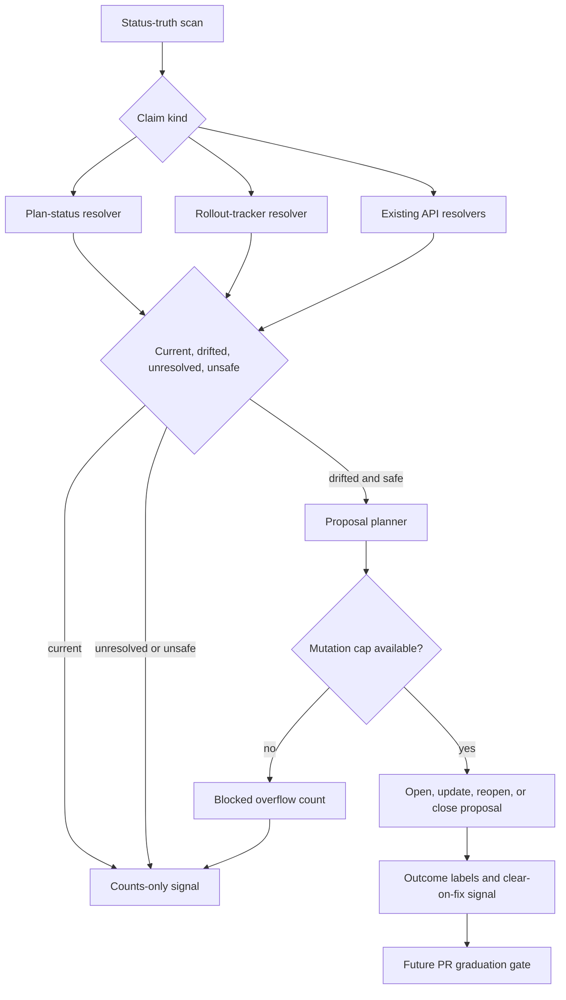

# feat: Complete status-truth signal generation

## Overview

Complete the next A2 status-truth slice by turning the merged foundation from a safe advisory loop
into a proposal-signal producer. The work finishes the missing status resolvers, keeps proposal
volume bounded, and makes operator outcomes measurable enough to decide whether any claim kind can
later graduate to bounded correction PRs.

Bounded PR execution remains out of scope. The current foundation has not collected accepted,
rejected, or false-positive proposal history, so opening correction PRs now would skip the safety
gate that the origin requirements and prior plan both depend on.

---

## Problem Frame

The merged status-truth workflow now scans public docs and issue surfaces, verifies current-repo and
confirmed-public cross-repo issue/PR/release claims, and can plan privacy-gated proposal issues. A
manual dry-run on `main` proved the loop is operational and counts-only, but it produced one current
cross-repo issue finding and no drift or proposals.

That is the right safety posture for a foundation, but it is not yet enough for dependent A2 work.
The A2 arc needs durable proposal outcomes by claim kind before bounded correction PRs can be
enabled. The immediate gap is therefore signal generation: finish the resolver types that were
intentionally deferred, exercise them against representative coordination claims, and prevent the
first useful drift run from becoming noisy issue spam.

---

## Requirements Trace

- R1. Finish status-truth claim kinds that affect the next operator action without adding broad prose
  auditing.
- R2. Resolve plan-status claims from authoritative plan metadata rather than narrative text.
- R3. Resolve rollout-tracker claims from the existing tracker snapshot contract rather than
  re-deriving Project truth in prompts.
- R4. Classify unavailable snapshot, missing file, malformed metadata, private identity, and API
  failures as unresolved or blocked, never as drift.
- R5. Keep workflow summaries and logs counts-only; proposal details appear only after public-output
  gating.
- R6. Cap issue mutations per run and preserve overflow as counts so a high-drift run cannot spam the
  issue tracker.
- R7. Treat operator outcomes as the decision log: accepted, resolved, manually-fixed, rejected,
  false-positive, superseded, recurring, and unlabeled manual closure must have explicit semantics.
- R8. Preserve the Phase 1 proposal-only boundary; no PR execution, no automerge, no branch-protection
  bypass, and no new authority writes.
- R9. Use identity-safe fixtures and public artifacts: examples, tests, reports, logs, summaries, and
  docs may contain only synthetic, redacted, or already-public non-sensitive identifiers.

---

## Success Criteria

- A manual dry-run on `main` can produce useful current/drifted/unresolved signal for the completed
  resolver kinds without emitting raw claim text, fingerprints, private identity, or tracker payloads
  in workflow-visible output.
- When proposal-eligible drift exists, a manual live run can open or update a reviewable, privacy-safe
  bounded set of proposal issues instead of creating unbounded issue noise.
- A high-drift fixture run cannot exceed five mutating proposal actions and reports every overflowed
  action as blocked counts.
- Operator outcomes produce per-kind accuracy signal that distinguishes explicit acceptance, resolved
  positives, rejection, false positives, malformed/conflicting labels, and unresolved closure states.
- A closed-without-outcome proposal remains closed for seven days, then reopens only if the same drift
  persists and no terminal/resolution label was added.
- The slice reduces future manual reconciliation work by moving stale coordination claims into a
  durable proposal queue; it does not require PR execution to prove that value.

---

## Scope Boundaries

- In scope: `plan-status` file parsing, `rollout-tracker-status` compound resolution, proposal caps,
  overflow reporting, outcome-signal accuracy math, and a capped set of identity-safe fixtures from
  current status-truth plan prose and prior rollout-style coordination prose.
- In scope: manual dry-run and optional manual live proposal runs after implementation, with schedule
  remaining conservative.
- Out of scope: bounded correction PR execution, PR branch cleanup, new required checks, Project board
  writes, dashboard UI, org-wide scanning, private repo claims, broad docs linting, and dependency
  hygiene.
- Out of scope: any new PR creation/update/merge logic, branch mutation, branch-protection changes,
  contents-write scope, pull-request-write scope, or transition code for PR execution.

### Deferred to Separate Tasks

- Bounded correction PR execution: separate plan after proposal outcomes prove at least one claim kind
  is reliable.
- Additional claim kinds beyond status truth: separate A2 expansion after this slice produces useful
  signal.
- Refreshing stale older solution docs: separate compound-refresh pass if those docs block future work.
- `docs/solutions/` capture: conditional on this slice surfacing a reusable implementation lesson;
  otherwise update only operator-facing and plan-status docs.

---

## Context & Research

### Relevant Code and Patterns

- `scripts/status-truth-detect.ts`: typed claim definitions, source-publicity gates, resolver
  typology, report contract, and scan shell.
- `scripts/status-truth-proposals.ts`: proposal lifecycle planner, outcome labels, same-run dedupe,
  label preflight, and write shell.
- `scripts/status-truth-public-output.ts`: shared public-output gate for proposal and summary surfaces.
- `scripts/status-truth-prs.ts`: pure PR planner only; useful for later graduation boundaries, not
  execution in this slice.
- `scripts/rollout-tracker-snapshot.ts`: existing tracker snapshot and hash contract to reuse as the
  compound source of truth.
- `.github/workflows/status-truth.yaml`: dry-run-first detect/open workflow and disabled PR placeholder.
- `scripts/wiki-lint.ts` and `scripts/wiki-lint-issues.ts`: pure report construction, issue lifecycle
  markers, and same-run created-key discipline.
- `scripts/capture-learnings-open.ts`: proposal issue creation, runtime label preflight, and issue cap
  precedent.
- `scripts/capture-learnings-privacy.ts`: private-token and secret gate primitives.

### Institutional Learnings

- `docs/solutions/best-practices/github-issues-api-same-run-eventual-consistency-2026-05-20.md`:
  carry an in-memory created-key set so same-run issue listing lag cannot duplicate proposals.
- `docs/solutions/best-practices/privacy-gate-promotion-leak-prevention-2026-06-04.md`: fail closed
  on ambiguous identity and keep public-output gates at trusted chokepoints.
- `docs/solutions/best-practices/pure-core-privacy-gates-shared-module-2026-06-22.md`: keep privacy
  gate load failures in the I/O shell and mutation-test the chokepoint.
- `docs/solutions/security-issues/verify-whole-public-perimeter-2026-06-22.md`: verify every public
  surface before claiming no private identity can leak.
- `docs/solutions/best-practices/credential-mint-time-permission-scoping-2026-06-22.md`: privilege is
  constrained by mint-time permissions, not by having a second token.
- `docs/solutions/integration-issues/wiki-lint-authoritative-data-snapshot-reporting-2026-05-02.md`:
  snapshot unavailability should still produce a durable report artifact.

---

## Key Technical Decisions

- **Complete signal before PR autonomy:** This slice targets proposal-quality signal, not correction
  PR execution. Graduation still requires observed outcomes.
- **Plan metadata is authoritative for plan status:** A claim about a plan's status resolves against
  current plan frontmatter. The claim must identify its target by explicit repo-relative plan path or
  unique plan title; ambiguous self-references, missing files, malformed frontmatter, or unsupported
  status values are unresolved rather than drifted.
- **Tracker snapshot is the rollout source of truth:** Rollout-tracker claims resolve through a fixed
  claim-to-snapshot field map. The map is code-reviewed and tested; arbitrary snapshot fields do not
  become claim sources by accident. Snapshot access failure, malformed snapshot data, stale snapshot
  schema, or source disagreement blocks proposal output.
- **Snapshot output is untrusted input:** The resolver validates snapshot schema before use and never
  echoes raw snapshot payloads, Project field values, issue titles, or tracker internals into public
  workflow output.
- **Overflow is a blocked outcome, not hidden work:** Once the per-run mutation cap is reached,
  additional proposal actions remain counted and visible without creating issue noise. The initial cap
  is five mutating proposal actions per run, evaluated after privacy blocking and same-run dedupe.
- **Mutation priority is deterministic:** When the cap is exhausted, actions are budgeted in this
  order: close cleared existing proposals, update existing proposals, reopen recurring proposals, then
  open new proposals. Overflowed actions remain planned-but-blocked counts.
- **Resolved drift is positive signal without impersonating human judgment:** Auto-close-on-clear can
  count as a useful detection, but it should stay distinguishable from an explicit operator
  `accepted` label.
- **Manual closure without outcome label is not a command to fight the operator:** The next run should
  not immediately reopen the issue. It should enter a seven-day needs-outcome cooldown from the issue
  `closed_at` timestamp; terminal or resolution labels override the cooldown, and persistent same-
  fingerprint drift after the cooldown may reopen with a recurrence/needs-outcome comment.
- **Schedules stay conservative:** Scheduled runs remain safe and low-noise. Any first live proposal
  run should be manually dispatched after dry-run counts are reviewed.
- **Credential split is explicit:** The rollout snapshot path uses the existing tracker credential only
  inside the snapshot step because the default `GITHUB_TOKEN` cannot read the Fro Bot Project. Proposal
  mutation paths still mint issue-write credentials only for non-dry-run proposal writes. This slice
  never mints contents-write or pull-request-write credentials; a dedicated Project-read credential is
  a future hardening improvement.

### Outcome State Contract

| Semantic state | Storage signal | Accuracy role | Lifecycle effect |
| --- | --- | --- | --- |
| Proposed | Open proposal with `status-truth` label and fingerprint marker | Pending | Remains open until drift clears or operator labels it. |
| Explicit accepted | `status-truth:accepted` | Positive, human-confirmed | Eligible input for future graduation math. |
| Resolved positive | `status-truth:resolved` or `status-truth:manually-fixed` after close-on-clear | Positive, bot-inferred | Counts separately from explicit accepted. |
| Rejected | `status-truth:rejected` | Negative | Terminal suppression for same fingerprint. |
| False positive | `status-truth:false-positive` | Negative | Terminal suppression for same fingerprint. |
| Superseded | `status-truth:superseded` | Excluded from accuracy | Suppresses the old fingerprint until claim/source changes. |
| Recurring | `status-truth:recurring` | Attention signal | Reopened non-terminal drift after cooldown/clearance rules. |
| Needs outcome | Closed proposal with no recognized terminal/resolution label | Excluded from accuracy | Cooldown before any reopen; counted for operator attention. |
| Conflicting labels | Mutually exclusive outcome labels present together | Excluded from accuracy | Counted for attention; no graduation input. |

### Public Artifact Contract

| Surface | Allowed content | Prohibited content |
| --- | --- | --- |
| Workflow summary and logs | Counts, claim kinds, failure classes, dry-run/live status | Raw claim text, snippets, fingerprints, file paths, repo paths, tracker payloads, issue titles, credentials |
| Detect/open artifacts | Versioned machine fields, counts, safe source refs after identity proof | Private identity, raw API responses, node IDs, database IDs, secrets, ungated rendered bodies |
| Proposal issue title/body/comments | Sanitized public location and checked public source after public-output gate | Private/unknown repo identity, secret-like values, tracker internals, workflow logs, credential data |
| Tests and docs fixtures | Synthetic, redacted, or already-public non-sensitive examples | Handles, emails, private repo links, private canonical IDs, copied sensitive coordination text |

---

## Open Questions

### Resolved During Planning

- **Should the next slice build PR execution?** No. PR execution is gated on proposal outcomes; adding
  it now would violate the two-phase delivery decision.
- **Should proposal-volume protection wait until drift appears?** No. The first useful resolver can
  reveal multiple stale claims at once, so caps need to land with signal generation.
- **Should unlabeled manual closures reopen immediately?** No. Immediate reopen creates a bot-versus-
  operator loop. Treat unlabeled closure as a needs-outcome state with cooldown semantics.
- **What cap applies to proposal mutations?** Start with five mutating proposal actions per run,
  counted after privacy blocking and same-run dedupe using the deterministic mutation priority order.

### Deferred to Implementation

- Exact plan-status phrase grammar should be grounded from current plan prose while writing tests.
- Exact tracker snapshot field names should be characterized from the live snapshot contract while
  preserving the plan's fixed claim-to-field mapping requirement.
- Exact cooldown copy can follow existing issue-lifecycle conventions, but start, end, and override
  conditions are fixed here and must be explicit in tests: seven days from issue `closed_at`, terminal
  or resolution label overrides, same-fingerprint drift after cooldown may reopen.

---

## High-Level Technical Design

> *This illustrates the intended approach and is directional guidance for review, not implementation
> specification. The implementing agent should treat it as context, not code to reproduce.*

---

## Implementation Units

### U1. Plan-status file resolver

Status: complete.

**Goal:** Resolve public claims about plan status against current plan metadata.

**Requirements:** R1, R2, R4, R5

**Dependencies:** Existing status-truth detect foundation.

**Files:**
- Modify: `scripts/status-truth-detect.ts`
- Test: `scripts/status-truth-detect.test.ts`
- Test fixtures: representative plan-status prose in existing status-truth tests

**Approach:**
- Add a file-parse resolver for plan-status claims using current plan frontmatter as the authoritative
  state.
- Normalize supported status vocabulary conservatively; unsupported or malformed values become
  unresolved.
- Keep raw claim text and source snippets out of artifacts, logs, and workflow summaries.
- Use representative plan prose to prevent a grammar that only passes synthetic examples.
- Limit fixtures to a small set of synthetic or redacted snippets derived from current plan and prior
  rollout-style prose; do not sweep the repository for arbitrary examples.

**Execution note:** Implement behavior test-first; this resolver is a correctness seam for future file
claims.

**Patterns to follow:**
- `scripts/wiki-lint.ts` for pure local file analysis and structured report building.
- Existing status-truth API resolver tests for current/drifted/unresolved classification shape.

**Test scenarios:**
- Happy path: a public plan-status claim matches frontmatter and is classified current.
- Happy path: a public plan-status claim conflicts with frontmatter and becomes drifted.
- Edge case: a plan-status claim has no explicit target path or unique title; classify unresolved.
- Edge case: referenced plan file is missing; classify unresolved and emit no proposal-eligible
  finding.
- Edge case: frontmatter exists but status is missing or unsupported; classify unresolved.
- Error path: file read failure increments the file-parse failure class and does not emit a clean
  report.
- Privacy path: artifacts and stdout omit raw claim text, source snippets, fingerprints, and private
  identity tokens.

**Verification:**
- Plan-status findings participate in the same report contract and proposal eligibility rules as
  existing API-backed findings.

### U2. Rollout-tracker compound resolver

Status: complete.

**Goal:** Resolve rollout-tracker claims through the existing tracker snapshot rather than treating
them as permanently unavailable.

**Requirements:** R1, R3, R4, R5

**Dependencies:** U1 only for shared test helpers; otherwise can proceed independently from the same
foundation.

**Files:**
- Modify: `scripts/status-truth-detect.ts`
- Modify: `scripts/rollout-tracker-snapshot.ts` if pure exports need a small extraction seam
- Modify: `.github/workflows/status-truth.yaml`
- Test: `scripts/status-truth-detect.test.ts`
- Test: `scripts/rollout-tracker-snapshot.test.ts` if the extraction seam changes behavior

**Approach:**
- Treat the rollout snapshot as a compound sub-resolver source. Detection consumes a sanitized,
  schema-validated snapshot result and compares claim state only against the fixed field map this unit
  defines.
- Keep Project access and snapshot failures as unresolved, not drifted, so incomplete source data does
  not create public proposals.
- Keep raw snapshot payloads private to the resolver boundary. Public artifacts may contain counts,
  claim kind, and failure class only.
- Preserve read/write credential separation. Snapshot access must not widen the proposal write token
  or route Project credentials into public output.
- Emit a durable report artifact even when the snapshot is unavailable, matching the existing
  authoritative-snapshot failure pattern.

**Execution note:** Characterize current snapshot output before changing imports or workflow plumbing.

**Patterns to follow:**
- `scripts/rollout-tracker-snapshot.ts` for tracker truth and digest semantics.
- `docs/solutions/integration-issues/wiki-lint-authoritative-data-snapshot-reporting-2026-05-02.md`
  for unavailable-snapshot reporting.

**Test scenarios:**
- Happy path: tracker claim matches snapshot state and is classified current.
- Happy path: tracker claim conflicts with snapshot state and becomes drifted when all source data is
  public and complete.
- Edge case: snapshot source is unavailable; classify unresolved and do not close existing proposals.
- Edge case: snapshot payload contains unexpected fields or schema version; classify unresolved or
  execution-failure without echoing payload details.
- Edge case: compound sub-resolver disagreement blocks proposal eligibility.
- Error path: snapshot parsing fails; the run emits an execution-failure or unresolved report rather
  than a fake clean report.
- Integration: workflow dry-run consumes the snapshot path without minting write credentials.

**Verification:**
- Rollout-tracker claims produce current/drifted/unresolved counts from the snapshot contract without
  adding Project writes or leaking tracker internals to public summaries.

### U3. Proposal caps and overflow reporting

**Goal:** Prevent a useful drift run from opening too many issues or comments at once.

**Requirements:** R5, R6, R8

**Dependencies:** Existing proposal planner; can be developed before U1/U2 and exercised with fixture
findings.

**Files:**
- Modify: `scripts/status-truth-proposals.ts`
- Test: `scripts/status-truth-proposals.test.ts`
- Modify: `.github/workflows/status-truth.yaml`

**Approach:**
- Add a per-run cap for mutating proposal actions: open, update-comment, reopen, and close.
- Preserve same-run dedupe before cap accounting so the cap measures real unique work.
- Apply privacy blocking before cap accounting so blocked/unsafe findings do not consume mutation
  budget.
- Use the deterministic priority order from Key Technical Decisions: close, update, reopen, then open.
- Represent overflow as blocked planned work in counts and summaries, without rendering claim text or
  creating partial issue state.
- Ensure dry-run exercises the same cap logic and reports what would be blocked.

**Execution note:** Add planner tests before touching the Octokit shell.

**Patterns to follow:**
- `scripts/capture-learnings-open.ts` for maximum proposal discipline.
- `scripts/status-truth-proposals.ts` existing same-run fingerprint dedupe.

**Test scenarios:**
- Happy path: fewer planned mutations than the cap execute normally.
- Edge case: more drifted findings than the cap produce allowed actions plus overflow counts.
- Edge case: close/update/reopen/open actions compete for the cap; the fixed priority order is honored.
- Edge case: same-run duplicate fingerprints do not consume cap slots twice.
- Error path: cap overflow never creates, comments, reopens, or closes issues beyond the limit.
- Integration: workflow summary reports mutation and overflow counts only.

**Verification:**
- A synthetic high-drift report cannot create unbounded issue noise in dry-run or live mode.

### U4. Outcome classification and accuracy math

**Goal:** Classify proposal outcomes into a stable usefulness signal without mutating issue state.

**Requirements:** R7, R8

**Dependencies:** U3 for cap-aware lifecycle planning.

**Files:**
- Modify: `scripts/status-truth-proposals.ts`
- Test: `scripts/status-truth-proposals.test.ts`
- Modify: `README.md`

**Approach:**
- Treat explicit accepted, rejected, false-positive, superseded, recurring, resolved, and
  manually-fixed states as distinct semantic outcomes using the Outcome State Contract.
- Count clear-on-fix as positive usefulness without converting it into an explicit operator-accepted
  label.
- Handle conflicting outcome labels conservatively: exclude the issue from accuracy math and surface a
  needs-attention count.
- Treat manual closure without terminal outcome as `needs outcome`: excluded from accuracy math and
  surfaced for attention, with no reopen behavior in this unit.
- Keep workflow summaries aggregate-only; operator details stay in the proposal issue thread.

**Execution note:** Start with label-set table tests; these states are easy to regress with label
changes.

**Patterns to follow:**
- Existing status-truth proposal planner outcome labels.
- `scripts/wiki-lint-issues.ts` recurrence comments and close-on-clear behavior.

**Test scenarios:**
- Happy path: explicit accepted and rejected labels contribute to per-kind usefulness counts.
- Happy path: drift clears after a proposal and contributes a distinct resolved positive count.
- Edge case: an issue has conflicting accepted/rejected labels; it is excluded from accuracy math and
  counted for attention.
- Edge case: closed-without-outcome contributes to needs-outcome counts but not usefulness math.
- Error path: malformed outcome markers do not crash planning and do not inflate accuracy.
- Integration: workflow summary reports aggregate usefulness and attention counts only.

**Verification:**
- Operator outcome labels can drive future graduation decisions without requiring workflow-log review.

### U5. Manual closure cooldown and recurrence behavior

**Goal:** Prevent bot-versus-operator loops while preserving recurrence handling for unresolved drift.

**Requirements:** R7, R8

**Dependencies:** U4.

**Files:**
- Modify: `scripts/status-truth-proposals.ts`
- Test: `scripts/status-truth-proposals.test.ts`
- Modify: `README.md`

**Approach:**
- Store manual closure without a terminal/resolution label as a derived planning condition, not a new
  label.
- Define cooldown as seven days from the proposal issue `closed_at` timestamp. During cooldown, keep the
  issue closed, count it as needs-outcome, and do not open a duplicate proposal for the same
  fingerprint.
- After cooldown, if the same drift still exists and no terminal/resolution label was added, reopen the
  issue with a concise recurrence/needs-outcome comment.
- Terminal labels override cooldown. Resolved or manually-fixed labels clear cooldown and allow normal
  close-on-clear behavior. Conflicting labels block mutation and surface needs-attention counts.
- Reopen removes resolving labels only when the issue was previously non-terminal and the same drift
  recurs after cooldown.

**Execution note:** Implement as pure lifecycle planning before wiring Octokit mutation behavior.

**Patterns to follow:**
- `scripts/wiki-lint-issues.ts` recurrence comments and close-on-clear behavior.
- Existing status-truth proposal planner reopen and close actions.

**Test scenarios:**
- Happy path: closed-without-outcome during cooldown is not reopened and does not create a duplicate.
- Happy path: closed-without-outcome after cooldown reopens with a recurrence/needs-outcome comment.
- Edge case: terminal rejected or false-positive label suppresses recurrence forever for the same
  fingerprint.
- Edge case: resolved or manually-fixed label prevents recurrence while the drift is clear, but a changed
  claim/source fingerprint can create a new proposal.
- Error path: missing `closed_at` on a closed issue is treated conservatively as needs-attention with
  no mutation.
- Integration: reopened issues remove stale resolving labels and add recurring state without leaking
  claim text into workflow summaries.

**Verification:**
- Manual proposal closure cannot cause immediate bot aggression, and persistent recurrence still has a
  documented path back to operator attention.

### U6. Documentation and operational calibration

**Goal:** Keep the plan, operator docs, and reusable learnings aligned with the completed signal slice.

**Requirements:** R5, R6, R7, R8

**Dependencies:** U1-U5.

**Files:**
- Modify: `docs/plans/2026-06-26-001-feat-status-truth-maintenance-loop-plan.md`
- Modify: `README.md`
- Create if warranted: `docs/solutions/best-practices/status-truth-resolver-typology-2026-06-30.md`

**Approach:**
- Update the existing status-truth plan implementation status without overstating PR graduation.
- Document supported claim kinds, proposal caps, overflow, and operator outcome labels from the
  operator perspective.
- Capture the resolver typology learning only if implementation produces a reusable pattern worth
  preserving: API, file-parse, compound, unavailable, unresolved, and why unresolved findings are
  honest signal rather than failure.
- After merge, manually run a dry-run on `main`; only run live proposal opening when dry-run counts are
  reviewable and proposal-eligible drift exists.

**Patterns to follow:**
- Existing README Status-Truth Proposals section.
- `docs/solutions/` frontmatter conventions for reusable best-practice learnings.

**Test scenarios:**
- Documentation expectation: README labels and operator flow match the label constants and workflow
  behavior.
- Documentation expectation: plan status update does not mark bounded PR execution complete.
- Documentation expectation: any solution doc created contains no private identifiers, internal session
  narration, or public-surface unsafe examples.

**Verification:**
- A future implementer can tell which claim kinds are active, which are deferred, how proposal caps
  work, and why PR execution remains gated.

---

## System-Wide Impact

- **Interaction graph:** Status-truth detect reads repo docs/issues/comments and live public GitHub
  state, optionally consumes tracker snapshot data, emits a safe report, then proposal planning may
  mutate GitHub issues under caps.
- **Error propagation:** Missing or inaccessible resolver state becomes unresolved/blocked signal and
  prevents close-on-clear. Privacy module failures block public output before any proposal mutation.
- **State lifecycle risks:** Proposal issues remain the decision log. Same-run dedupe, terminal labels,
  cooldowns, and overflow counts must compose without creating duplicate or adversarial issue loops.
- **API surface parity:** Future A2 workflows should invoke this status-truth loop instead of embedding
  ad hoc status reconciliation in prompts.
- **Integration coverage:** Tests must cover report-to-proposal handoff, snapshot unavailable state,
  cap overflow, manual closure semantics, and output-gate boundaries.
- **Unchanged invariants:** `main` branch protection, human merge, `data` branch authority, metadata
  writes, wiki authority, workflow settings, hooks, secrets, and release config remain unchanged.

---

## Risks & Dependencies

| Risk | Mitigation |
|------|------------|
| Resolver grammar creates false positives | Ground grammar in representative real coordination prose and keep unsupported forms unresolved. |
| Snapshot access failure causes fake clean runs | Emit unresolved or execution-failure reports and never close proposals from incomplete scans. |
| First useful run opens too many issues | Land mutation caps and overflow counts with resolver completion. |
| Bot fights operator manual closures | Use cooldown/needs-outcome semantics instead of immediate reopen. |
| Usefulness math overstates confidence | Keep explicit accepted, resolved positive, rejected, false-positive, malformed, and conflicting states separate. |
| Private identity leaks through new resolver sources | Reuse public identity gates and rendered-output privacy gates; fail closed on unknown or ambiguous identity. |
| PR execution sneaks in early | Keep workflow PR job disabled and do not add contents-write or pull-request-write execution in this plan. |

---

## Rollout / Verification Notes

- Keep the scheduled workflow conservative while the resolver slice lands.
- Require at least one manual dry-run on merged `main` before any live proposal run.
- Run a live non-dry-run only when dry-run output shows reviewable proposal-eligible drift and no
  blocker-class privacy or resolver failures.
- Do not enable bounded correction PRs until proposal outcomes establish per-kind reliability.

---

## Sources & References

- **Origin document:** [docs/brainstorms/2026-06-26-a2-self-maintenance-portfolio-requirements.md](../brainstorms/2026-06-26-a2-self-maintenance-portfolio-requirements.md)
- Prior plan: [docs/plans/2026-06-26-001-feat-status-truth-maintenance-loop-plan.md](2026-06-26-001-feat-status-truth-maintenance-loop-plan.md)
- Related scripts: `scripts/status-truth-detect.ts`, `scripts/status-truth-proposals.ts`,
  `scripts/status-truth-public-output.ts`, `scripts/status-truth-prs.ts`,
  `scripts/rollout-tracker-snapshot.ts`
- Related workflow: `.github/workflows/status-truth.yaml`
- Related learnings: `docs/solutions/best-practices/github-issues-api-same-run-eventual-consistency-2026-05-20.md`,
  `docs/solutions/best-practices/privacy-gate-promotion-leak-prevention-2026-06-04.md`,
  `docs/solutions/best-practices/pure-core-privacy-gates-shared-module-2026-06-22.md`,
  `docs/solutions/security-issues/verify-whole-public-perimeter-2026-06-22.md`,
  `docs/solutions/best-practices/credential-mint-time-permission-scoping-2026-06-22.md`,
  `docs/solutions/integration-issues/wiki-lint-authoritative-data-snapshot-reporting-2026-05-02.md`
