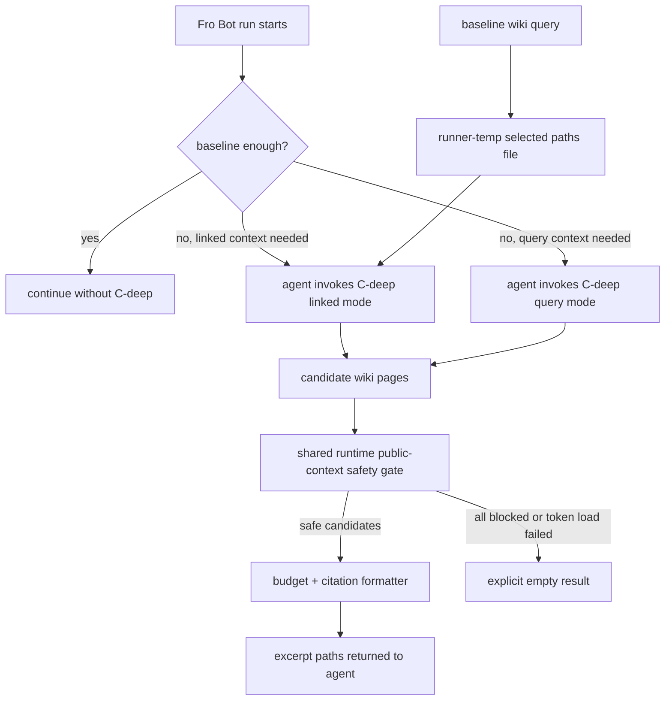

# feat: Add agent-invoked deep wiki traversal

## Overview

Add C-deep: a deterministic wiki deepening CLI Fro Bot can invoke during a run when baseline wiki context is insufficient. The baseline prompt stays cheap; the agent may request a bounded expansion by following first-hop wikilinks from the current baseline pages or by submitting a short grounded wiki query.

This is an honest control-plane aid, not a sandbox. The tool hard-caps each invocation and the prompt tells Fro Bot when to use it, but a worker with shell access can always rerun commands. The plan avoids fake enforcement and hardens the real boundaries: input validation, public-safe corpus filtering, output caps, and log hygiene.

## Problem Frame

The current A1 path injects shallow wiki context before the agent starts. That works for common runs, but it does not let the agent request adjacent wiki context after reading the task and baseline excerpt. The failure mode is an agent manually guessing which wiki pages or repo files to inspect instead of using a bounded, auditable retrieval move.

This plan keeps deepening agent-invoked and read-only. It does not add automatic expansion, wiki writes, generated learnings, recurring-pattern synthesis, or operator-web surfacing.

## Requirements Trace

- R1. C-deep is optional and agent-invoked, never appended to every run by default.
- R2. Linked mode starts from the current run's baseline-selected wiki pages and follows only explicit first-hop wikilinks.
- R3. Query mode accepts a short grounded query and returns ranked wiki excerpts or an explicit empty result.
- R4. Both modes share the same corpus, budget, safety gate, citation format, and output shape.
- R5. Each invocation returns at most 3 additional pages and at most 8 KiB of excerpt text.
- R6. Returned excerpts include wiki paths; empty results are explicit and non-fatal.
- R7. Candidate pages and emitted fields must pass the public-context safety gate before any excerpt, path, alias, or metadata is returned.
- R8. External logs and workflow outputs stay closed-vocabulary and counts-only; they do not echo query text, excerpt bodies, token values, handoff paths, raw workflow context, hidden state, or agent reasoning.
- R9. Query inputs are validated before corpus access: fixed mode values only, bounded length, bounded character set, no path separators, no shell metacharacters, no prompt-delimiter mimicry, and no overbroad stopword-only searches.
- R10. The workflow prompt presents C-deep as an escape hatch with allowed triggers, not a default crutch.
- R11. The implementation has fixture coverage for linked mode, query mode, empty/no-match, unsafe filtering, budget caps, prompt optionality, and workflow handoff.

## Scope Boundaries

- No automatic expansion of every baseline wiki match.
- No multi-hop traversal in v1.
- No adaptive or large-budget traversal in v1.
- No fake per-run security boundary for a shell-capable agent; per-invocation budget is enforced, repeated command execution is an agent-use policy concern.
- No write path to `knowledge/`, `metadata/`, `docs/solutions/`, or generated learnings.
- No arbitrary repository search under the C-deep label.
- No operator-web decision-log surfacing, true recurring-pattern synthesis, or improvement metric work in this slice.

### Deferred to Separate Tasks

- True cross-run recurring-pattern synthesis.
- A1 improvement metric instrumentation.
- Operator-web decision-log surfacing after the operator spine/dashboard work is rebaselined.
- Multi-hop or adaptive-budget traversal, if live evidence proves the tight v1 budget is too small.

## Context & Research

### Relevant Code and Patterns

- `scripts/wiki-query.ts` — baseline wiki scoring, page collection, byte budgeting, selected-path output, and `GITHUB_OUTPUT` writing pattern.
- `scripts/wiki-query.test.ts` — current fixture style for baseline wiki retrieval.
- `scripts/solutions-query.ts` — newer sibling for prompt context assembly, private-token loading, byte-safe truncation, and fail-soft context output.
- `scripts/wiki-lint.ts` — canonical wikilink parsing and alias-aware target resolution patterns.
- `scripts/wiki-slug.ts` — shared private token construction; do not create a second private-token vocabulary.
- `scripts/check-wiki-private-presence.ts` and `scripts/check-private-leak.ts` — public/private boundary patterns and redaction helpers to reuse or extract from.
- `.github/workflows/fro-bot.yaml` — current wiki overlay, baseline wiki query, and prompt injection surface.
- `knowledge/schema.md` — wiki frontmatter and wikilink semantics.

### Institutional Learnings

- `docs/solutions/best-practices/pure-core-privacy-gates-shared-module-2026-06-22.md` — put safety gates in a pure core and make the I/O shell distinguish empty data from failed loads.
- `docs/solutions/security-issues/survey-workflow-side-privacy-gate-2026-05-16.md` — verify the boundary inside the trusted workflow, not only upstream.
- `docs/solutions/security-issues/verify-whole-public-perimeter-2026-06-22.md` — enumerate every public surface before claiming private identifiers cannot leak.
- `docs/solutions/best-practices/closed-vocabulary-telemetry-keys-from-public-bodies-2026-07-03.md` — external telemetry must use fixed keys, not content-derived labels.
- `docs/solutions/runtime-errors/node-strip-only-typescript-2026-04-18.md` — scripts must load under Node 24 strip-only TypeScript.
- `docs/solutions/best-practices/test-the-integration-seam-not-the-endpoints-2026-07-06.md` — test the agent/tool seam rather than asserting on model prose.

## Key Technical Decisions

- **One CLI with explicit modes:** Linked and query traversal share a single command because agent discovery is simpler with one surface, but the plan separates shared pure-core invariants from mode-specific I/O. Shared invariants are corpus loading, runtime safety filtering, budget enforcement, and stdout formatting. Mode-specific I/O is the baseline handoff file for linked mode and the validated query input for query mode.
- **Concrete agent invocation surface:** Fro Bot invokes the CLI through the normal shell tool during the agent run. The workflow exposes the command contract and environment variables; it does not pre-run C-deep or inject a deep-context block.
- **Run-local baseline handoff:** Baseline wiki query writes selected paths to a JSON array file under the runner temp directory, and the agent step receives the handoff path through a step-scoped environment variable. The file contains only selected wiki paths, not excerpt bodies, queries, task text, or workflow context.
- **Per-invocation hard budget:** The CLI enforces the 3-page and 8 KiB caps every time it runs. Repeated calls are discouraged by prompt policy but not misrepresented as a hard security boundary; repeat-query enumeration remains an accepted operator-audited risk.
- **Two-layer safety model:** The data-branch promotion gate remains the upstream provenance guard. C-deep adds a runtime public-context safety chokepoint that scans every candidate field before formatting, using the private token vocabulary from `scripts/wiki-slug.ts`. A token-load failure blocks all candidates and returns an explicit empty result.
- **Data-branch corpus snapshot:** C-deep reads the wiki corpus restored from the data branch at workflow start, not agent-written working-tree pages created later in the same run. If the restored corpus is unavailable, C-deep returns empty rather than reading arbitrary repository files.
- **Read-only retrieval:** C-deep never writes wiki, metadata, solution docs, issues, PRs, or artifacts beyond its run-local selected-path handoff.
- **Validated command contract:** Mode is a fixed value, query text is bounded and sanitized before corpus access, and workflow code never interpolates query text into shell strings. Implementation may choose argv or env transport, but validation is the security boundary.
- **Stdout-only result contract:** C-deep writes deterministic JSON to stdout for the agent to consume. It does not write `GITHUB_OUTPUT`; stderr is reserved for fixed, content-free status tokens.

## Open Questions

### Resolved During Planning

- Should linked and query traversal use one command or separate commands? One command with explicit modes; shared invariants matter more than separate entry points.
- Should C-deep be a workflow pre-step or an agent-invoked tool? Agent-invoked tool; automatic pre-injection violates the brainstorm's cost/control goal.
- Should v1 pretend to enforce one total call per run? No. The real enforceable control is per-invocation budget; repeated shell calls are an agent-use policy limitation.

### Deferred to Implementation

- Exact helper extraction names for shared safety and wiki parsing; implementation should choose the smallest clear module boundary.
- Exact score weights for query mode beyond reusing the baseline scoring shape; tests should pin behavior, not arbitrary weight constants.

## Public Surface Contract

| Surface | Allowed content | Explicitly forbidden |
| --- | --- | --- |
| CLI stdout | Deterministic JSON containing safe excerpts, safe wiki paths, byte counts, mode, status, reason, and closed-vocabulary counters | Token values, raw workflow context, raw query text, raw errors, hidden state, unsafe paths |
| CLI stderr | Fixed status tokens and numeric counts only | Query text, excerpt bodies, handoff paths, selected path file contents, token names, raw error messages |
| Workflow logs/summaries | Whether C-deep was available and counts-only status | Returned excerpts, query text, handoff file contents, sensitive env values |
| Agent output/comments | Wiki paths only when the agent uses returned excerpts to justify a recommendation | Private identifiers, unsafe paths, raw C-deep diagnostics |
| Runner-temp handoff file | JSON array of selected baseline wiki paths | Excerpt bodies, query text, task text, token-derived values, workflow context |

Closed stderr vocabulary is limited to fixed event/status/reason values such as `wiki-deepen:linked:ok`, `wiki-deepen:linked:empty`, `wiki-deepen:query:ok`, `wiki-deepen:query:empty`, `wiki-deepen:safety:excluded`, `wiki-deepen:budget:cap`, `wiki-deepen:error:load`, and `wiki-deepen:error:internal`, plus numeric counts.

## High-Level Technical Design

> *This illustrates the intended approach and is directional guidance for review, not implementation specification. The implementing agent should treat it as context, not code to reproduce.*

Mode behavior matrix:

| Mode | Input | Candidate source | Empty result when |
| --- | --- | --- | --- |
| Linked | Runner-temp baseline selected paths JSON array | First-hop wikilinks resolved through wiki path/slug/alias targets, excluding pages already in baseline | No baseline file, malformed handoff, no links, no resolvable safe candidates |
| Query | Short grounded query after validation | Ranked wiki corpus matches | Empty query after validation, invalid characters, overbroad query, no safe matches |

## Implementation Units

- [x] **Unit 1: Shared wiki page parsing and safety gate**

**Goal:** Create the smallest shared primitives C-deep needs: page collection, wikilink/alias target resolution, byte-safe excerpt formatting, and candidate/output safety filtering.

**Requirements:** R4, R5, R6, R7, R8, R10

**Dependencies:** None

**Files:**
- Create: `scripts/wiki-utils.ts`
- Create or modify: `scripts/wiki-context-safety.ts` or one equivalent small helper
- Modify: `scripts/wiki-query.ts`
- Modify: `scripts/wiki-lint.ts` if extracted helpers move out of that script
- Test: `scripts/wiki-query.test.ts` and/or a new helper test file matching the chosen helper boundary

**Approach:**
- Keep the pure core independent from process env and filesystem where possible.
- Reuse existing private-token vocabulary from `scripts/wiki-slug.ts`.
- Extract the stricter `splitFrontmatter` behavior from `scripts/wiki-lint.ts` into `scripts/wiki-utils.ts`; malformed frontmatter must be observable to the safety layer.
- Extract wikilink collection and page-target collection into the same utility module instead of importing heavy `scripts/wiki-lint.ts` into runtime retrieval code.
- Apply safety to every emitted field: excerpt body, path header, selected path, resolved canonical path, title, alias-derived target, and any count label.
- Preserve Node 24 strip-only constraints: no enums, namespaces, parameter properties, TS import aliases, or type suppression.

**Execution note:** Implement behavior test-first; start with fixtures that fail if the safety gate is bypassed.

**Patterns to follow:**
- `scripts/wiki-query.ts` for page collection and byte budget style.
- `scripts/solutions-query.ts` for byte-safe truncation and private-token input.
- `scripts/wiki-lint.ts` for wikilink and alias resolution.

**Test scenarios:**
- Happy path: wiki page frontmatter and body parse into a page record with path, title/slug, aliases, tags, and body.
- Happy path: `[[wikilink]]` targets resolve through page path, slug, and alias.
- Happy path: linked target resolution uses an indexed path/slug/alias map and returns resolved page records, not lint findings.
- Edge case: ambiguous or missing link targets are skipped, not fuzzy-matched.
- Edge case: multi-byte text truncates within the byte cap without replacement characters.
- Error path: a candidate containing a private token is excluded before excerpt formatting.
- Privacy regression: unsafe path and alias values are filtered/redacted before output, not only unsafe bodies.
- Privacy regression: removing the candidate safety call makes a fixture test fail.

**Verification:**
- Shared helpers are imported by tests without executing script I/O.
- Candidate safety is proven before any excerpt payload is assembled.

- [x] **Unit 2: Baseline selected-path handoff**

**Goal:** Make linked mode robust by storing the baseline wiki query's selected paths in a runner-temp file that the agent-invoked CLI can read later.

**Requirements:** R1, R2, R6, R8, R9, R10

**Dependencies:** Unit 1 if selected-path formatting moves into a helper; otherwise none.

**Files:**
- Modify: `scripts/wiki-query.ts`
- Modify: `scripts/wiki-query.test.ts`
- Modify: `.github/workflows/fro-bot.yaml`

**Approach:**
- Extend the baseline wiki query shell to optionally write selected paths to a file path supplied by the workflow.
- Store the file under the runner temp directory and pass the path to the agent step through an environment variable.
- Keep existing `GITHUB_OUTPUT` fields stable for `wiki_context` and `wiki_selected_paths`.
- Name the file under runner temp with run and attempt scoping, e.g. a `wiki-deepen-handoff-${{ github.run_id }}-${{ github.run_attempt }}.json` pattern.
- Write atomically: write a temporary file, rename it into place, and set restrictive permissions when the platform supports it.
- The handoff file contains only selected wiki paths; it does not contain excerpt bodies, queries, task text, workflow context, or token-derived data.
- Missing, malformed, or non-array handoff content remains a non-fatal empty result for linked mode.
- Workflow logs must not echo the handoff file contents or path; only fixed status tokens are allowed.

**Execution note:** Characterize current `wiki-query.ts` output behavior before changing its I/O shell.

**Patterns to follow:**
- Existing `writeGithubOutput` delimiter style in `scripts/wiki-query.ts`.
- Existing fail-soft wiki overlay behavior in `.github/workflows/fro-bot.yaml`.

**Test scenarios:**
- Happy path: when a handoff path is provided, selected paths are written as deterministic JSON array.
- Regression: existing `GITHUB_OUTPUT` values remain unchanged.
- Edge case: no selected paths writes an empty list, not a missing or malformed file.
- Error path: an unwritable handoff path fails soft and does not break baseline wiki context output.
- Error path: malformed handoff content is rejected by the reader as empty, not interpreted partially.
- Workflow contract: the agent step receives the handoff path without logging selected paths or excerpts.

**Verification:**
- Existing baseline wiki query behavior is backward-compatible.
- Workflow provides the handoff path to the agent step without exposing additional excerpt bodies.

- [x] **Unit 3: Agent-invoked deepening CLI**

**Goal:** Add the read-only C-deep CLI with linked and query modes, shared safety filtering, shared budget enforcement, argv-only inputs, and explicit empty-result behavior.

**Requirements:** R1, R2, R3, R4, R5, R6, R7, R8, R9, R10

**Dependencies:** Units 1–2

**Files:**
- Create: `scripts/wiki-deepen.ts`
- Create: `scripts/wiki-deepen.test.ts`
- Modify if needed: `package.json` only if existing scripts need an explicit command alias; otherwise no script alias.

**Approach:**
- Build a pure `assembleWikiDeepContext`-style core that accepts corpus files, mode input, private token set, selected baseline paths, and budget settings.
- Keep CLI I/O thin: parse fixed mode values, validate query length/tokens, load only `knowledge/wiki/**` files from the data-branch-restored corpus, load private tokens, read the baseline handoff file for linked mode, and write deterministic JSON to stdout.
- Use `MAX_DEEPEN_BYTES = 8 * 1024` and `MAX_DEEPEN_PAGES = 3`-style constants to avoid confusing this budget with baseline `MAX_CONTEXT_BYTES`.
- Linked mode indexes wiki pages once, resolves first-hop links through path/slug/alias targets, excludes pages already in the baseline set, and never recurses through links found in returned pages.
- Query mode uses a query-specific tokenizer, not the baseline event tokenizer. It rejects empty, stopword-only, path-like, delimiter-shaped, shell-metacharacter, prompt-injection-shaped, too-long, or overbroad queries before corpus access.
- The empty result shape is structurally identical for no-match, invalid-query, overbroad, and safety-excluded cases so query mode does not become a fine-grained corpus oracle.
- Never interpolate query text into a shell string. Tests should call the script through Node/argv or the pure core, not a shell pipeline.
- The CLI may print closed-vocabulary status to stderr, but never query text, selected path file contents, handoff path, excerpt bodies, token names, raw error messages, or environment values.

**Execution note:** Implement test-first; the CLI exists to serve the agent, so pin the command contract before filling out ranking details.

**Patterns to follow:**
- `scripts/wiki-query.ts` and `scripts/solutions-query.ts` for pure core + I/O shell structure.
- `scripts/cross-repo-dispatch.ts` and `scripts/check-private-leak.ts` for mode/flag parsing style without shell interpolation.

**Test scenarios:**
- Happy path: linked mode returns first-hop cited pages from baseline-selected paths.
- Happy path: query mode returns ranked cited pages from a grounded query.
- Edge case: linked mode excludes second-hop pages.
- Edge case: linked mode caps output at 3 pages and 8 KiB.
- Edge case: query mode returns empty for no-match, stopword-only, path-like, delimiter-shaped, shell-metacharacter, prompt-injection-shaped, too-long, and overbroad queries.
- Edge case: linked mode excludes pages already present in the baseline selected-path set.
- Error path: missing or malformed baseline handoff file returns empty for linked mode, not a crash.
- Error path: private-token load failure returns empty/fails closed according to the shared gate contract, never silently disables the gate.
- Error path: attempts to load outside `knowledge/wiki/**` fail closed.
- Privacy/output: result shape contains only safe excerpts, safe selected paths, byte length, mode, and closed-vocabulary counts/reasons.
- Log hygiene: stderr and stdout never include raw query text when the query contains sensitive-looking or path-like content.
- Test convention: import dynamically with the existing `.js` suffix pattern, use fixture helpers, and include mutation-style tests proving the safety gate is active.
- Node 24 smoke: importing the script does not execute the CLI and uses only erasable TypeScript syntax.

**Verification:**
- C-deep can run locally against fixtures in both modes.
- Unsafe candidates are filtered before formatting.
- Every invocation respects the v1 budget.

- [x] **Unit 4: Workflow prompt/tool contract and docs**

**Goal:** Expose C-deep to Fro Bot as an optional CLI tool in the agent prompt, wire the runner-temp handoff path through the workflow, and document the operator-facing behavior without automatic deep-context injection.

**Requirements:** R1, R8, R9, R10

**Dependencies:** Units 2–3

**Files:**
- Modify: `.github/workflows/fro-bot.yaml`
- Modify: tests that validate workflow prompt/contracts if present; otherwise add the smallest workflow contract test near existing workflow tests.
- Modify: `README.md` only if the automation table or control-plane feature summary needs the new C-deep capability.
- Modify: `docs/plans/2026-07-07-003-feat-deep-wiki-traversal-plan.md`

**Approach:**
- Add prompt guidance that says C-deep is optional and names the allowed triggers: baseline is insufficient, linked context is needed, or a short grounded query is available.
- Do not add a `<wiki_deep_context>` precomputed block.
- Provide the agent step with the baseline handoff path and the command contract needed to invoke linked or query mode.
- Use the workflow-contract test pattern from existing workflow tests: parse YAML, locate the relevant steps, assert ordering/env/prompt invariants, and assert no `wiki_deep_context` precomputed block exists.
- Keep workflow logs counts-only; do not echo handoff paths, returned excerpts, query text, or token values in step summaries.
- Keep docs terse: C-deep is an optional deepening tool, not a new always-on retrieval layer.

**Execution note:** Test the prompt/tool seam, not model behavior.

**Patterns to follow:**
- Existing `<wiki_context>` and `<solutions_context>` prompt framing in `.github/workflows/fro-bot.yaml`.
- Existing workflow lint/test patterns in `scripts/*workflow*.test.ts` if available.

**Test scenarios:**
- Happy path: workflow prompt includes C-deep as optional tool guidance, not as mandatory instruction.
- Regression: baseline wiki context remains injected as before.
- Regression: no `<wiki_deep_context>` block is introduced by the workflow.
- Edge case: workflow passes the handoff path without logging excerpts, query text, or token values.
- Integration: prompt contract test confirms the agent has enough information to invoke linked or query mode.

**Verification:**
- Workflow lint passes.
- Agent prompt contract is explicit without encouraging default use.
- Requirements trace remains accurate and this plan can be marked complete after Units 1–4 pass review/gate.

## System-Wide Impact

- **Interaction graph:** Baseline wiki query remains the default. C-deep adds a read-only agent-invoked path from baseline context to deeper wiki excerpts.
- **Error propagation:** Empty/no-match/unsafe/no-handoff cases return explicit empty results; private-token load failures fail closed according to the shared safety gate contract.
- **State lifecycle risks:** Runner-temp handoff files are ephemeral and contain only selected wiki paths. They must not become durable metadata or public artifacts.
- **API surface parity:** The CLI is the primary surface. Workflow prompt guidance and tests must match the CLI modes.
- **Integration coverage:** The important seam is workflow prompt → agent invocation contract → CLI result shape; tests should pin this seam without asserting on model prose.
- **Unchanged invariants:** No wiki writes, no data-branch writes, no solution-doc writes, no automatic context expansion, no multi-hop traversal.

## Risks & Dependencies

| Risk | Mitigation |
| --- | --- |
| C-deep becomes prompt bloat by default | Agent-invoked only; no precomputed `<wiki_deep_context>` block; per-invocation cap. |
| Repeated invocations enumerate wiki contents across a run | Accepted limitation of shell-capable agent use; prompt policy discourages repeated calls and logs stay closed-vocabulary. |
| Empty vs non-empty query result becomes a corpus oracle | Empty result shape is structurally identical for no-match, invalid-query, overbroad, and safety-excluded cases. |
| Private-token source is stale during a run | Use the data-branch overlay snapshot available at workflow start; treat staleness as the same accepted residual as baseline wiki retrieval. |
| Query mode dumps unrelated corpus content | Query validation, stopword/min-token pruning, overbroad-query empty result, 3-page and 8 KiB caps. |
| Private identifiers leak through excerpts or paths | Shared safety chokepoint before formatting; path/body/alias filtering; closed-vocabulary telemetry. |
| Linked mode is brittle because baseline paths are hidden in prompt prose | Runner-temp selected-path handoff written by baseline query step. |
| Handoff file leaks selected paths or is partially written | Store only selected paths, write atomically under runner temp, validate JSON shape on read, and never echo the file content/path. |
| Sparse wiki links make linked mode low-value | Query mode is included in v1 and shares the same budget/safety gate. |
| New script crashes under Node native TS | Follow existing script syntax constraints and import smoke patterns. |
| Prompt wording alone does not force tool use | Treat C-deep as an aid, not a guarantee; tests pin the exposed contract and CLI behavior, not model compliance. |

## Documentation / Operational Notes

- C-deep is for investigation and grounding, not routine lint, formatting, or dependency update work.
- The agent should cite returned wiki paths only when C-deep output materially grounds a recommendation.
- C-deep reads from the data-branch-restored wiki corpus, not agent-created wiki pages from later in the same run.
- If live runs show frequent empty results, improve wiki link coverage or query fixtures before raising the budget.

## Sources & References

- **Origin document:** [docs/brainstorms/2026-07-07-a1-phase-3-deep-wiki-traversal-requirements.md](../brainstorms/2026-07-07-a1-phase-3-deep-wiki-traversal-requirements.md)
- Parent requirements: [docs/brainstorms/2026-06-22-skill-saving-grow-and-learn-requirements.md](../brainstorms/2026-06-22-skill-saving-grow-and-learn-requirements.md)
- North-star map: [docs/brainstorms/2026-06-15-fro-bot-personal-agent-north-star-requirements.md](../brainstorms/2026-06-15-fro-bot-personal-agent-north-star-requirements.md)
- Baseline retrieval plan: [docs/plans/2026-06-22-001-feat-solutions-retrieval-injection-plan.md](2026-06-22-001-feat-solutions-retrieval-injection-plan.md)
- Baseline wiki query: `scripts/wiki-query.ts`
- Workflow prompt surface: `.github/workflows/fro-bot.yaml`
- Wiki schema: `knowledge/schema.md`
