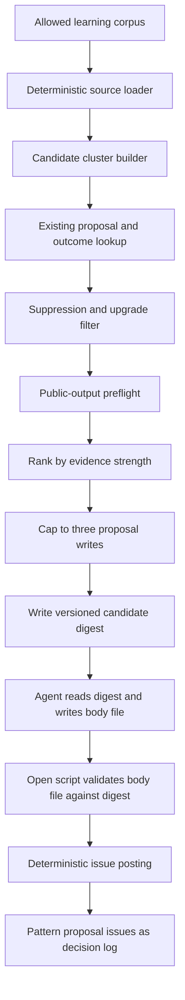

# feat: Recurring pattern synthesis

## Overview

Add the A1 C4 proposal-only synthesis loop. The loop reads the public-safe learning corpus, identifies repeated correction patterns, asks the agent to draft decision-ready pattern proposals, then opens at most three public-safe proposal issues per run.

## Problem Frame

A1 captures individual learnings, but repeated lessons remain scattered across solution docs and learning-proposal issues. The next self-improvement step is to surface recurring correction patterns without creating fake insight, private-output risk, or another uncontrolled proposal queue.

The implementation must behave like the existing A1 capture loop: deterministic scripts own source loading, identity, deduplication, privacy gates, labels, caps, and issue mutations; the agent only judges and drafts bounded proposal bodies from a curated digest.

## Requirements Trace

- R1-R3. Synthesize only from accepted `docs/solutions/` docs and learning-proposal issues in this repo; proposal issues remain the decision log.
- R4-R7. Distinguish repeated correction behavior from keyword overlap and produce decision-ready proposal content.
- R8-R11. Stay proposal-only, cap new proposals at three per run, and preserve issue outcomes for later metric planning.
- R12-R15. Use stable source-ID-based cluster identity, suppress repeats, allow carefully bounded upgraded evidence, and avoid durable state for unsafe clusters.
- R16-R19. Reuse the deterministic public-output validation class from A1 learning proposals and omit private or opaque evidence.
- R20-R21. Do not edit prompts, persona, workflows, skills, or solution docs directly; do not claim measurable improvement.

## Scope Boundaries

- No autonomous `docs/solutions/` authoring or editing.
- No prompt/persona/skill/workflow-instruction self-editing beyond the workflow wiring needed to run this loop.
- No dashboard/operator-web surfacing.
- No O8 improvement metric.
- No raw transcript, workflow-log, unpublished note, private-only artifact, or cross-repo issue-body mining.
- No new persistent store beyond issue markers, labels, and existing GitHub issue state.

### Deferred to Separate Tasks

- O8 improvement metric: use actual C4 proposal outcomes after this loop produces data.
- Autonomous durable-doc authoring: only after proposal quality is proven and a separate quarantine/write path is planned.
- Operator-web surfacing: wait for synthesis state and the dashboard/spine work.

## Context & Research

### Relevant Code and Patterns

- `scripts/capture-learnings-harvest.ts` — source harvesting, `learning-proposal` label constants, merge-SHA markers, solution-doc overlap, hard caps, digest writing, and GitHub issue pagination.
- `scripts/capture-learnings-open.ts` — deterministic issue opening from agent-authored bodies, label preflight, same-run duplicate handling, fail-closed label behavior.
- `scripts/capture-learnings-privacy.ts` — private-token loading; C4 should reuse this fail-closed token boundary.
- `scripts/status-truth-public-output.ts` — general public-output gate (`makePublicOutputTokens` / `applyPublicOutputGate`) for public issue bodies, summaries, and emitted metadata. It already calls `learningBodyHasPrivateLeak`; do not duplicate the same gate in a second call site.
- `scripts/status-truth-proposals.ts` — redacted canonical ID loading (`loadRedactedCanonicalIdsFromDisk`), proposal lifecycle precedent, hidden markers, outcome classification, and counts-only summaries.
- `scripts/fro-bot-workflow-wiki-handoff.test.ts` — workflow YAML contract-test precedent for asserting step/env wiring.
- `.github/workflows/capture-learnings.yaml` — deterministic harvest → agent body authoring → deterministic open pattern.
- `.github/settings.yml` — repository label definitions for proposal/state labels.

### Institutional Learnings

- `docs/solutions/best-practices/status-truth-synthetic-self-audit-claim-kinds-2026-07-03.md` — stable fingerprints must not be derived from mutable rendered text.
- `docs/solutions/best-practices/closed-vocabulary-telemetry-keys-from-public-bodies-2026-07-03.md` — hidden markers + closed vocabulary make public issue bodies safe to parse later.
- `docs/solutions/security-issues/verify-whole-public-perimeter-2026-06-22.md` — validate every public surface, not only the obvious proposal body.
- `docs/solutions/best-practices/pure-core-privacy-gates-shared-module-2026-06-22.md` — reuse shared privacy gates and mutation-proof tests; do not treat missing private token data as an empty safe set.
- `docs/solutions/best-practices/github-issues-api-same-run-eventual-consistency-2026-05-20.md` — carry in-memory created identity sets during issue-opening runs.
- `docs/solutions/workflow-issues/classifying-github-review-events-for-iteration-signals-2026-06-22.md` — model actual correction behavior, not superficial state names.
- `docs/solutions/best-practices/test-the-integration-seam-not-the-endpoints-2026-07-06.md` — test the raw-source → cluster → body → gate seam, not only isolated helpers.
- `docs/solutions/best-practices/autonomous-pipeline-minimum-progress-floor-2026-05-17.md` — counts-only summaries must distinguish healthy idle from scan failure.

### External References

External research skipped. Existing repo patterns directly cover proposal loops, privacy gates, issue markers, outcome labels, and workflow integration.

## Key Technical Decisions

- **Mirror the A1 sequence, not a monolith.** Use deterministic source-loading/clustering/open scripts with an agent-only drafting step between them. Source loading must handle file-system docs and GitHub issue APIs as separate failure domains before converging into a unified source model.
- **Split clustering from opening.** Keep source/cluster/digest behavior separate from deterministic issue opening so the cluster → digest → body-file → gate seam is testable.
- **Fingerprint source IDs, not prose.** Cluster identity is lowercase hex SHA-256 of newline-joined, sorted source IDs; generated pattern wording is display metadata only.
- **Use stable source IDs.** Solution docs use filename stems as source IDs; learning-proposal issues use captured merge-SHA markers. Evidence links are display-only and can change without changing identity.
- **Filter before cap.** Deduped, suppressed, weak, unsafe, and invalid candidates are removed before applying the three-proposal write cap.
- **Outcome labels are closed vocabulary.** Use `pattern-proposal` as the primary label and namespaced outcomes (`pattern-proposal:accepted`, `pattern-proposal:deferred`, `pattern-proposal:rejected`, `pattern-proposal:superseded`). `needs-outcome` is a derived state, not an operator label.
- **Rejected and no-outcome closures suppress by default.** Adding one weak source cannot resurrect a rejected/no-outcome pattern; upgraded evidence requires the threshold planned below.
- **Proposal issues are the store.** Hidden markers and labels on pattern proposals are the only durable state this slice adds.
- **Separate validation surfaces.** Proposal bodies use the public-output gate; workflow logs/stdout/stderr/step summaries/result JSON are counts-only and never carry proposal prose, hidden markers, fingerprints, source titles, or source links.
- **Manual live rollout first.** The workflow is manual-first with `dry_run` defaulting to true. Scheduled runs, if added, stay dry-run until proposal quality is proven.

## Open Questions

### Resolved During Planning

- **Should cluster identity include the generated pattern statement?** No. LLM wording drift would bypass suppression. Use source IDs only for the fingerprint and keep the statement as display metadata.
- **Should capped candidates count before or after privacy filtering?** After. The cap limits writes, not analysis.
- **Should C4 write docs directly?** No. The first slice is proposal-only.

### Deferred to Implementation

- Exact evidence-strength score weights after source fixtures reveal the current corpus shape.
- Exact issue label colors/descriptions, as long as names remain stable and documented in `.github/settings.yml` and README.
- Final helper names and script boundaries if implementation reveals a smaller shape while preserving behavior.

## High-Level Technical Design

> *This illustrates the intended approach and is directional guidance for review, not implementation specification. The implementing agent should treat it as context, not code to reproduce.*

## Implementation Units

- [x] **Unit 1: Source corpus and pattern proposal metadata model**

**Goal:** Define the allowed source corpus, proposal markers, outcome labels, and source-ID model used by later units.

**Requirements:** R1-R3, R11-R13, R16-R18

**Dependencies:** None

**Files:**
- Create: `scripts/capture-patterns-synthesis.ts`
- Create: `scripts/capture-patterns-synthesis.test.ts`
- Modify: `.github/settings.yml`

**Approach:**
- Model source artifacts as accepted solution docs and learning-proposal issues only.
- Enumerate solution docs from the canonical `docs/solutions/` subdirectories: `best-practices`, `documentation-gaps`, `integration-issues`, `runtime-errors`, `security-issues`, and `workflow-issues`.
- Give each source a stable public ID:
  - solution docs use the filename stem, independent of subdirectory moves and frontmatter edits; duplicate stems fail source loading for those docs and increment invalid-source counts;
  - learning-proposal issues use the captured merge-SHA marker; issues with missing or malformed markers are excluded from clustering and counted as invalid sources.
- Generate source links separately from identity: solution docs use SHA-pinned GitHub blob URLs for the checked-out HEAD, and learning-proposal issues use stable `https://github.com/fro-bot/.github/issues/<number>` URLs.
- Define C4 hidden markers explicitly: `pattern-proposal:fingerprint=<sha256>`, `pattern-proposal:source-ids=<comma-separated sorted IDs>`, and optional `pattern-proposal:supersedes=<sha256>`.
- Define labels explicitly: primary `pattern-proposal`; mutually exclusive outcomes `pattern-proposal:accepted`, `pattern-proposal:deferred`, `pattern-proposal:rejected`, `pattern-proposal:superseded`; derived state `needs-outcome` is not a label.
- Parse existing pattern proposal issues across open and closed states with full pagination (`state: all`) into open/closed maps keyed by fingerprint so later units can suppress or upgrade candidates.

**Execution note:** Implement new behavior test-first; start with marker parsing and outcome classification before adding source collection.

**Patterns to follow:**
- `buildMergeShaMarker` / `parseMergeShaMarker` in `scripts/capture-learnings-harvest.ts` as a namespace pattern only; do not reuse the `captured-learning:` marker namespace.
- `extractProposalFingerprint` / `classifyProposalOutcome` patterns in `scripts/status-truth-proposals.ts`.
- Label descriptor + fail-closed preflight pattern in `scripts/capture-learnings-open.ts`.

**Test scenarios:**
- Happy path: parses a solution doc and a learning-proposal issue into two source artifacts with stable IDs.
- Happy path: parses existing pattern proposal markers and closed-vocabulary outcome labels from open and closed issues.
- Edge case: malformed or missing learning-proposal merge-SHA markers exclude that issue from source clustering and increment invalid-source counts.
- Edge case: solution-doc subdirectory move or frontmatter title/category edit does not change source identity when the filename stem is unchanged.
- Edge case: malformed pattern-proposal markers are ignored and counted, not treated as a matching suppression.
- Error path: inability to fetch existing proposals fails closed before issue writes can happen in later units.
- Privacy: source IDs and markers never contain private repo names, branch names, issue titles, raw body excerpts, or private canonical IDs.

**Verification:**
- The pure model can load and classify sources/proposals without opening issues or invoking the agent.

- [x] **Unit 2: Candidate clustering, scoring, and suppression planner**

**Goal:** Build deterministic cluster candidates and decide which candidates may be sent to the agent for proposal drafting.

**Requirements:** R4-R7, R9, R12-R15, R21

**Dependencies:** Unit 1

**Files:**
- Create: `scripts/capture-patterns-cluster.ts`
- Create: `scripts/capture-patterns-cluster.test.ts`
- Modify: `scripts/capture-patterns-synthesis.ts`
- Modify: `scripts/capture-patterns-synthesis.test.ts`

**Approach:**
- Start conservative: cluster by repeated correction substance derived from structured frontmatter fields, problem type, module, tags, title/body summary tokens, and known proposal evidence, but reject clusters that only share generic tags. Use `computeOverlapScore` as the model for low-signal scoring rather than inventing a separate keyword heuristic.
- Compute cluster fingerprint as lowercase hex SHA-256 of newline-joined, sorted source IDs.
- Rank evidence strength by unique independent sources first, then by accepted solution-doc presence, then recency, then deterministic lexical source-ID order. Topic-bucket fairness is a tiebreaker only, derived from `module`/`problem_type`; it must not override stronger evidence.
- Apply filters in this order: weak cluster → open proposal overlap → hard suppression → soft suppression without upgrade threshold → unsafe evidence placeholder → rank → cap.
- Suppress candidates that are subsets or weak supersets of currently open proposals to avoid overlapping review queues.
- Treat rejected and closed-without-outcome clusters as hard-suppressed for exact source sets and weak supersets unless at least two new independent public-safe sources were added after rejection.
- Treat superseded clusters as permanently hard-suppressed.
- Treat deferred clusters as soft-suppressed until at least one new independent public-safe source is added; new versions link back to the deferred issue.
- Treat accepted pattern proposals as immediately retiring their source IDs from active clustering, regardless of whether the issue is open or closed.
- Exclude source artifacts already represented by an accepted pattern proposal so codified source material does not immediately re-propose itself.
- Build a versioned candidate digest schema with allowed fields only: fingerprint, source IDs, SHA-pinned source links, public-safe source titles, evidence counts, score bucket, suggested next actions, and run counts. Source titles must pass the public-output gate before entering the digest.

**Execution note:** Add characterization fixtures from existing `docs/solutions/` frontmatter before tuning scoring.

**Patterns to follow:**
- `buildCandidateDigest` in `scripts/capture-learnings-harvest.ts`.
- `selectWithCiFixFloor` for deterministic cap/floor mechanics, using fairness only as a tiebreaker in v1.
- `applyEnrichmentScanAvailability` for clearing enriched evidence when privacy scanning is unavailable.
- Same-run created identity set pattern from issue-opening scripts.

**Test scenarios:**
- Happy path: multiple artifacts describing the same correction behavior produce one candidate with sorted source IDs and a stable fingerprint.
- Edge case: artifacts sharing only a generic tag are skipped as low-signal.
- Edge case: a candidate matching or overlapping an open proposal is skipped as duplicate/open-overlap.
- Edge case: a candidate whose sources are a subset or weak superset of a rejected/no-outcome proposal is suppressed.
- Edge case: a superseded proposal never reopens through a superset.
- Edge case: a deferred proposal with one new source produces a new-version candidate that references the deferred issue.
- Edge case: an accepted proposal's source IDs are immediately retired from future clusters even while the proposal issue remains open.
- Error path: unsafe candidate evidence increments skipped-unsafe counts but does not create suppression state.
- Ordering: privacy/suppression filtering happens before the three-proposal cap.
- Determinism: equal-strength candidates sort by topic-bucket tiebreaker, recency, and then stable source-ID order.

**Verification:**
- Planner outputs a counts-only digest distinguishing proposed, capped, low-signal, duplicate/open-overlap, hard-suppressed, soft-suppressed, unsafe, invalid-source, no-op, and failed states.

- [x] **Unit 3: Agent proposal digest and deterministic issue opener**

**Goal:** Let the agent draft bounded pattern proposal bodies, then deterministically validate and open proposal issues.

**Requirements:** R5-R11, R16-R21

**Dependencies:** Units 1-2

**Files:**
- Create: `scripts/capture-patterns-open.ts`
- Create: `scripts/capture-patterns-open.test.ts`
- Modify: `scripts/capture-patterns-synthesis.ts`
- Modify: `scripts/capture-patterns-synthesis.test.ts`

**Approach:**
- The agent reads only the versioned candidate digest and writes a versioned temp JSON body file keyed by fingerprint. It does not call GitHub, read the corpus, receive private token data, or write repo files.
- Body file schema supports two per-candidate outcomes: `drafted` with allowed fields, or `agent-skipped` with a closed reason such as `insufficient-evidence` or `different-behaviors`. Missing body is treated separately from agent judgment.
- The open script validates the body-file schema version, reads the digest and bodies, confirms required labels, validates every title/body/comment surface through `makePublicOutputTokens` + `applyPublicOutputGate`, injects required hidden markers, and opens at most three issues.
- Construct `PublicOutputTokens` only after both private tokens and redacted canonical IDs load successfully; never pass an empty set as a failed-load proxy.
- Allowed proposal-body fields are: pattern statement, rationale, public-safe source references, evidence count, suggested next action, and hidden machine markers. Unknown fields reject that candidate.
- Invalid drafted bodies fail soft per candidate: skip the invalid proposal, increment a counts-only reason, and post remaining valid proposals. Systemic failures such as token-load failure, label preflight failure, or missing validation gate fail closed for all writes.
- If private tokens or public-output tokens cannot load, the open script fails closed and posts nothing. Token values, token-load errors, body text, markers, and source links must not be written to stdout, stderr, or step summaries.
- Maintain a same-run created fingerprint set threaded through planner/opener boundaries, and rely on workflow-level concurrency plus all-state existing-proposal pagination to prevent cross-run duplicates.

**Execution note:** Start with a failing seam test that drives a realistic digest + body through marker injection, privacy validation, label preflight, and issue creation.

**Patterns to follow:**
- `scripts/capture-learnings-open.ts` body-file, `ensureLabelsExist`, and label-preflight pattern.
- `loadPrivateTokensFromDisk` in `scripts/capture-learnings-privacy.ts`.
- `loadRedactedCanonicalIdsFromDisk`, `extractProposalFingerprint`, and counts-only output patterns in `scripts/status-truth-proposals.ts`.
- `makePublicOutputTokens` / `applyPublicOutputGate` in `scripts/status-truth-public-output.ts`.

**Test scenarios:**
- Happy path: clean agent-authored body opens a labeled pattern proposal with fingerprint/source markers and visible source evidence.
- Error path: missing body for a candidate skips that candidate and reports no-body counts.
- Error path: explicit `agent-skipped` body outcome increments agent-skipped counts and opens no issue for that fingerprint.
- Error path: label preflight failure skips all opens fail-closed.
- Error path: token-load failure is reported as a distinct counts-only field and writes nothing.
- Privacy: body containing private token, raw log text, private link, branch-like secret, unsafe source title, private canonical ID, fingerprint on counts-only surface, or unapproved field is blocked before posting.
- Same-run duplicate: two bodies for the same fingerprint open at most one issue.
- Cross-run duplicate: an existing open or closed proposal with the same fingerprint prevents opening.
- Mutation-proof: tests fail if the public-output gate is removed from issue title, issue body, stdout/result JSON, or workflow summary surfaces.
- Output: stdout/result JSON and workflow summaries contain counts only and no proposal body, hidden marker, fingerprint, source title, source link, private token, or raw error.
- Empty path: zero candidates after filtering is a successful no-op with explicit skipped/candidate counts, not a failure.

**Verification:**
- The opener is safe to run after an agent drafting step and cannot post unvalidated proposal prose.

- [ ] **Unit 4: Workflow integration and operator docs**

**Goal:** Wire the synthesis loop into CI as a scheduled/manual proposal-only workflow and document the operator contract.

**Requirements:** R1-R21

**Dependencies:** Units 1-3

**Files:**
- Create: `.github/workflows/capture-patterns.yaml`
- Create: `scripts/capture-patterns-workflow.test.ts` if implementation adds nontrivial workflow env/step wiring
- Modify: `README.md`
- Modify: `docs/plans/2026-07-07-004-feat-recurring-pattern-synthesis-plan.md`
- Test: actionlint plus workflow parser tests for digest/body-file env wiring and credential boundaries.

**Approach:**
- Add a separate `capture-patterns.yaml` workflow with concurrency group `capture-patterns`, `cancel-in-progress: false`, `workflow_dispatch` dry-run default `true`, and no live scheduled writes in v1.
- Split detect/digest and open jobs: detect uses read-only credentials; the open job performs the data-branch metadata overlay, loads privacy tokens, and mints an App token with `issues: write` only when live mode is explicitly requested.
- Use `uses: ./.github/actions/setup` for Node/pnpm setup and the same SHA-pinned `actions/create-github-app-token` version already used in repo workflows. Scope the App token to this repository only.
- Keep the agent prompt bounded: read only the digest path, write only the configured body-file path in the temp directory, never edit source files, and never receive private token sets, hidden markers, raw issue bodies, or raw solution text.
- Publish counts-only step summaries: sources loaded, invalid sources, candidates scanned, low-signal skipped, duplicate/open-overlap, hard-suppressed, soft-suppressed, unsafe, capped, token-load-failure, agent-skipped, bodies missing, proposals opened, zero-candidate no-op, and scan failure.
- Document the label/outcome contract and the fact that proposal issues are the decision log for C4.
- Mark implementation checkpoints only after each unit passes tests and review.

**Patterns to follow:**
- `.github/workflows/capture-learnings.yaml` harvest → agent → open structure.
- `.github/workflows/status-truth.yaml` dry-run default, detect/open split, data-branch metadata overlay, and live-token mint boundary.
- `scripts/fro-bot-workflow-wiki-handoff.test.ts` workflow YAML contract-test style.

**Test scenarios:**
- Workflow shape: synthesis agent step cannot run without the deterministic digest file.
- Workflow shape: scheduled/default runs are dry-run and do not mint an issue-writing token.
- Workflow shape: issue-writing token is scoped to this repo and not reused for agent work.
- Workflow shape: workflow concurrency prevents overlapping scheduled/manual C4 runs.
- Workflow shape: data-branch metadata overlay happens before the privacy-gated open step.
- Workflow shape: agent prompt contains the temp-file-only write contract and no instruction to edit repo files.
- Docs: README describes pattern proposals as human-reviewed and does not imply auto-authoring or measurable improvement.

**Verification:**
- Actionlint passes; full repo gate passes; workflow surface remains proposal-only and human-review-gated.

## System-Wide Impact

- **Interaction graph:** Adds a new A1 proposal loop using the same GitHub issue review surface as learning proposals. It does not affect Status Truth, A3 dispatch, or wiki repair loops.
- **Error propagation:** Source/query/privacy/label failures fail closed with counts-only results and zero issue writes. A healthy empty run is a successful no-op with explicit counts.
- **State lifecycle risks:** Suppression state lives in proposal issues; malformed markers are ignored and counted, not trusted. Open, accepted, rejected, superseded, and closed-without-outcome proposals all affect suppression.
- **API surface parity:** CLI result JSON, stdout/stderr, workflow summaries, issue titles, issue bodies, and issue comments must each have explicit public-surface tests.
- **Integration coverage:** Unit tests must cover raw sources through clustering, body rendering, privacy gate, and issue creation; isolated scoring tests are insufficient.
- **Workload bounds:** v1 scans the full allowed corpus because current repo scale is small. Revisit lookback/indexing if solution docs exceed 250 or learning-proposal issues exceed 500.
- **Unchanged invariants:** Human review remains required. No docs, prompts, persona, skills, or workflows are auto-edited by the synthesis loop beyond this implementation's workflow wiring.

## Risks & Dependencies

| Risk | Mitigation |
| --- | --- |
| Fake insight from shallow clustering | Require repeated correction behavior, suppress keyword-only clusters, and start proposal-only. |
| Suppression bypass through prose drift | Fingerprint sorted source IDs only; keep pattern text out of the hash. |
| Superset spam after rejection | Hard-suppress weak supersets unless the upgrade threshold is met. |
| Private data leakage in proposals | Use `makePublicOutputTokens`/`applyPublicOutputGate` with both private tokens and redacted canonical IDs loaded fail-closed; block private/opaque evidence links and keep logs counts-only. |
| Proposal queue noise | Filter before capping, open at most three proposals per run, use fairness only as a tiebreaker, and publish skip counts. |
| Same-run or cross-run duplicate issue creation | Carry an in-memory created-fingerprint set, serialize workflow runs with concurrency, and query all existing pattern proposals with pagination. |
| Interrupted run between agent drafting and opening | Re-query existing proposal fingerprints in the open step before posting and delete stale temp files at the start of each run. |
| Single invalid agent draft blocks valid proposals | Fail soft per candidate for body validation errors; fail closed only for systemic gate/token/label failures. |
| Workflow accidentally writes from schedule | Default dry-run to true, keep scheduled runs dry-run in v1, and mint write token only for explicit manual live runs. |

## Documentation / Operational Notes

- New pattern proposal labels should be documented in README and `.github/settings.yml`.
- Operators apply exactly one terminal/outcome label when deciding a proposal: `pattern-proposal:accepted`, `pattern-proposal:deferred`, `pattern-proposal:rejected`, or `pattern-proposal:superseded`. `needs-outcome` is derived from closed proposals without one of those labels.
- Accepted labels immediately retire the proposal source IDs from active clustering, even if follow-up doc work is still pending.
- Closed-without-outcome proposals are conservatively suppressed to prevent immediate re-creation.
- Label definitions must land before the workflow can open visible proposals; label preflight remains fail-closed if settings have not applied yet.
- The first production run should be reviewed for proposal quality before planning O8 metrics or enabling any scheduled live-write behavior.
- This slice writes issues only; it does not touch `metadata/`, `commit-metadata.ts`, the data branch, auto-merge, or `docs/status.md` status claims.

## Sources & References

- Origin document: [docs/brainstorms/2026-07-07-a1-recurring-pattern-synthesis-requirements.md](../brainstorms/2026-07-07-a1-recurring-pattern-synthesis-requirements.md)
- A1 origin: [docs/brainstorms/2026-06-22-skill-saving-grow-and-learn-requirements.md](../brainstorms/2026-06-22-skill-saving-grow-and-learn-requirements.md)
- Existing harvest: [scripts/capture-learnings-harvest.ts](../../scripts/capture-learnings-harvest.ts)
- Existing opener: [scripts/capture-learnings-open.ts](../../scripts/capture-learnings-open.ts)
- Existing privacy gate: [scripts/capture-learnings-privacy.ts](../../scripts/capture-learnings-privacy.ts)
- Existing workflow: [.github/workflows/capture-learnings.yaml](../../.github/workflows/capture-learnings.yaml)
