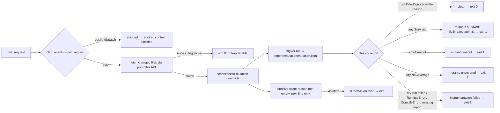

# feat: Counterexample-proven guards via scoped mutation testing

## Overview

Add a required `Main` job that runs StrykerJS mutation testing over an enumerated set of gate modules and fails when any mutant survives. A surviving mutant is a check that can be removed without a test noticing — the vacuous-counterexample class that bit three times in two weeks. Exceptions are Stryker's line-scoped comment directives with a mandatory reason. The check runs only on pull requests that change what is mutated or how mutants execute, and is skipped (not left pending) everywhere else.

## Problem Frame

The repository's guards almost all have negative tests and several carry hand-written mutation proofs, but nothing verifies a negative test is load-bearing. Three guards this fortnight passed with their checks removed: a rewrite test whose fixture never reached the regex, two scaling guards that could not distinguish the vulnerable implementation from the fixed one, and a boundary test reading two of ninety-eight files. The only detector was a human asking "would this fail if I deleted the `if`?" (see origin: `docs/brainstorms/2026-09-04-counterexample-proven-guards-requirements.md`).

## Requirements Trace

- R1. A surviving mutant in a mutated module fails the check → Units 2, 3, 4
- R2. The mutated set is enumerated and limited to guard code → Units 2, 3
- R3. Timing guards are excluded from mutation and keep their meta-test → Unit 2
- R4. Per-mutant exceptions with a stated reason; no numeric threshold → Unit 2
- R5. Exceptions live in the repository and appear in the diff → Unit 2 (comment directives)
- R6. Exceptions are line-scoped; file- or region-wide suppression is rejected → Unit 2
- R7. Required status resolved by a job-level skip, never a workflow path filter → Units 4, 6
- R8. Runs when mutated modules, their tests, the mutation config, runner config, manifest, or lockfile change → Unit 4
- R9. Instrumentation failure, runner crash, and timeout fail closed with a distinct class → Unit 2
- R10. Each survivor reported with file, location, and mutation → Unit 2
- R11. Spike proves native-TS instrumentation before any wiring lands → Unit 1
- R12. Cleanup baseline before the check becomes required → Unit 5, then Unit 6

## Scope Boundaries

- Timing and complexity guards (`packages/wiki-write-core/src/regex-redos-regressions.test.ts`) are excluded from the mutation test set; the existing discrimination meta-test is unchanged.
- The mutated set is enumerated. No wholesale globbing of `scripts/**` or `packages/**`.
- A single exception mechanism: Stryker comment directives. No repository-owned ignorer plugin, no calendar expiry (see origin: Key Decisions).
- CI-topology fidelity for guards generally, and a guard registry, are separate ideas from the same ideation and are not folded in.

### Deferred to Separate Tasks

- `fro-bot/dashboard` `wiki-writer` guards: adopt the same shape once proven here — separate plan in that repository.
- Narrowing the manifest/lockfile trigger to dependency bumps that touch the mutation or test toolchain, if Renovate churn makes the cost material — future iteration after Unit 6 lands and cost is observed.
- A `docs/solutions/` learning capturing the vacuous-counterexample class and this remedy — write after Unit 6 via the compound workflow.

## Context & Research

### Relevant Code and Patterns

- `.github/workflows/main.yaml` `check-wiki-authority`: required job gated by job-level `if: github.event_name == 'pull_request'` — the skip shape R7 reuses. Every job uses `./.github/actions/setup`.
- `scripts/check-private-leak.ts`: reads the pull request's changed-file set via `gh api repos/{owner}/{repo}/pulls/{n}/files --paginate` — the changed-file pattern Unit 4 reuses. No workflow in this repository uses a path-filter action.
- `scripts/build-wiki-write-core.ts` `--check` and the `Check Wiki Write Core Dist` job: a `scripts/check-*.ts` wrapper that runs a tool, classifies its outcome, exits non-zero with a locatable message, and is registered as a required context — the wrapper shape Unit 2 mirrors.
- `.github/settings.yml` `required_status_checks.contexts`: the registration surface for Unit 6. Context strings must match job `name:` byte-for-byte.
- Existing hand-written mutation proofs stay: `scripts/wiki-lockfile-gates.test.ts` (`MUTATION-PROOF: a tampered lock with one entry removed fails coverage`), `scripts/wiki-context-safety.test.ts` (`… — mutation gate proof (body)`), `scripts/build-wiki-write-core.test.ts`, `packages/wiki-write-core/src/regex-redos-regressions.test.ts` (`proves the scaling helper discriminates quadratic work`).
- Import boundary: `scripts/*.ts` import the shared package by name (`@fro-bot/wiki-write-core/...`), which resolves to committed `packages/wiki-write-core/dist/`. Package tests import `./module.ts` relatively. A mutant in `packages/wiki-write-core/src/` is visible only to tests in the same tree.
- `vitest.config.ts`: includes `scripts/**/*.test.ts` and `packages/**/*.test.ts`, 10-second default timeout, no aliases.
- `Test Scripts Load` job: imports every non-test `scripts/*.ts` under Node's strip-only loader; any new script must load without transpilation.
- `.gitignore`: already ignores `coverage`, `.vitest-cache`, `dist` (with the `packages/wiki-write-core/dist/` exception).
- Renovate (`.github/renovate.json5`): patch updates disabled except `python`/`typescript`; devDependencies pinned exact.

### Institutional Learnings

- `docs/solutions/workflow-issues/quoted-required-status-check-context-2026-06-09.md` — context strings must be identical across workflow, `settings.yml`, and docs; a mismatch leaves branch protection waiting on a ghost.
- `docs/solutions/best-practices/verify-in-the-ci-topology-not-just-locally-2026-07-11.md` — environment-sensitive claims (native-TS instrumentation, sandbox symlinks) must be verified in the workflow, not on a laptop.
- `docs/solutions/best-practices/make-failure-boundaries-and-shared-predicates-explicit-2026-08-25.md` — name failure states before side effects; "failed to instrument" is not "mutant survived".
- `docs/solutions/best-practices/status-vocabulary-must-cover-every-report-surface-2026-08-31.md` — the closed vocabulary must reach the step summary, the exit message, and the tests together.
- `docs/solutions/best-practices/calibrate-classifiers-on-adjudicated-ground-truth-2026-07-11.md` — tightening a gate exposes fixtures that passed for the wrong reason; keep the cleanup baseline separate from enforcement.
- `docs/solutions/workflow-issues/lockfiles-are-advisory-until-gated-2026-07-11.md` — a devDependency claim is advisory until the CI path installs and exercises it.
- `docs/solutions/best-practices/pure-core-privacy-gates-shared-module-2026-06-22.md` — gates are pure cores behind thin CLI wrappers; mutate the core, not the shell.

### External References

- StrykerJS configuration: `mutate` globs with `!` exclusion, `testRunner: "vitest"`, `vitest.related` (default true), `testFiles`; the Vitest runner forces `coverageAnalysis: perTest`. https://stryker-mutator.io/docs/stryker-js/configuration/ and `/vitest-runner/`
- Disabling mutants: `// Stryker disable next-line <Mutator>[: reason]`; reason is optional natively and, when present, is recorded in the report. `disable all` / `restore` are region directives. https://stryker-mutator.io/docs/stryker-js/disable-mutants/
- Exit codes do not distinguish threshold failure, dry-run failure, and runner crash; the JSON report carries per-mutant `status` (`Killed`, `Survived`, `Timeout`, `Ignored`, `RuntimeError`, `CompileError`), `statusReason`, `location`, `mutatorName`. `thresholds.break: null` disables the numeric gate.
- `@stryker-mutator/typescript-checker` is optional; Stryker mutates TypeScript via Babel and re-emits source. Compatibility with Node's strip-only loader is undocumented — the spike's purpose.
- Stryker 10.0.0 (2026-08-14); Vitest 4 supported since 9.4.0; Node ≥ 22. Open upstream issues: #5928 (Vitest 4 coverage), #5459 (fixtures).

## Prior-Art Survey

```json
{
  "schema_version": 2,
  "verdict": "build-new-within-scope",
  "scope": "scripts + packages/wiki-write-core",
  "freshness": {
    "vcs_reference": "3443d38"
  },
  "budget": {
    "max_search_passes": 2,
    "max_candidate_inspections": 6,
    "exhausted": false
  },
  "candidates": [
    {
      "path_or_symbol": "packages/wiki-write-core/src/regex-redos-regressions.test.ts",
      "description": "scaling meta-test that proves the helper discriminates quadratic work",
      "disposition": "insufficient",
      "insufficiency_reason": "detects complexity regressions, not a deliberately injected surviving mutant in a named gate module"
    },
    {
      "path_or_symbol": "scripts/build-wiki-write-core.test.ts",
      "description": "build-input and invalid-TS rejection tests for committed dist generation",
      "disposition": "insufficient",
      "insufficiency_reason": "verifies build invariants, not test-suite mutation survival"
    },
    {
      "path_or_symbol": "scripts/wiki-context-safety.test.ts",
      "description": "field-by-field private-token gate with mutation-proof cases",
      "disposition": "insufficient",
      "insufficiency_reason": "hand-written negative tests; no framework mutates the module and fails CI when tests stay green"
    },
    {
      "path_or_symbol": "scripts/wiki-lockfile-gates.test.ts",
      "description": "lockfile coverage and integrity rejection tests with a tampered-lock proof",
      "disposition": "insufficient",
      "insufficiency_reason": "proves specific examples, not a CI check that reports surviving mutants"
    }
  ]
}
```

## Key Technical Decisions

- **Same-tree test pairing.** Each mutated module runs only against tests in its own tree: `packages/wiki-write-core/src/*.test.ts` for package modules, `scripts/*.test.ts` for script modules. Scripts reach the package through committed `dist/`, so a package mutant is invisible to scripts tests; pairing across the boundary would report green while blind. A Vitest alias from the package name to `src/` was considered and rejected — it would change what every test exercises, not just the mutation run.
- **Wrapper classifies the JSON report; the exit code is not trusted.** `scripts/check-mutation-guards.ts` runs Stryker with `thresholds.break: null` and `reporters: ["json", "clear-text"]`, then derives one verdict from the closed set in the design table below. Only `clean` and `not-applicable` exit zero. `NoCoverage` — guard code no test reaches — is its own failing verdict, because an unreached rejection branch is the vacuity this check exists to find, and Stryker reports it separately from `Survived`. Tool failure and policy breach are separate verdicts (`instrumentation-failed`, `directive-violation`) so an operator can tell "the tool broke" from "a rule was violated" without reading logs; the repository's `scan_result: success|detection|error` and `verified-clean / could-not-check` conventions make the same distinction.
- **Comment directives are the only exception mechanism; the wrapper enforces what Stryker leaves optional.** Every `Ignored` mutant in the report must carry a non-empty `statusReason`; every `Stryker disable` in a mutated module must be `next-line` scoped. A bare `Stryker disable all` or region form fails the check. Enforcing from the report uses Stryker's own parser for reasons; the region ban is a conservative textual rule where a false positive fails loudly (see origin: Key Decisions).
- **Enumeration guarded by a shape test, not by memory.** A colocated test asserts two exhaustiveness rules: every non-test file under `packages/wiki-write-core/src/` appears in `mutate` or in a `not-mutated` list with a reason; every `scripts/` file matching `check-*.ts`, `wiki-*-gates.ts`, `wiki-context-safety.ts`, or `build-wiki-write-core.ts` does likewise. Path exhaustiveness for the package and name patterns for scripts replace the export-name heuristic from the first draft, which false-negatives on `runCheck` (`check-repo-onboarded.ts`) and false-positives on validators like `assertCorrectionsFile`. A new guard file that matches neither list fails `pnpm test` before it can bypass the check.
- **Cores are the target; shells are covered or listed.** Every candidate script already exports its decision logic (`checkWikiAuthority`, `runCheck`, and `checkPrivateLeak` from the package) behind a thin `main()`. Mutants in `main()` will report `NoCoverage` unless the assembled flow is tested. Unit 5 resolves each such file one of two ways, in order of preference: cover `main()` through the injected-seam pattern the repository already uses for assembled-flow tests, or list the file `not-mutated` naming the module that carries its core. Line-by-line directives over a shell are not an option — that is region suppression by another name (R6).
- **Changed-file detection reuses the pull-request files API.** The job always runs on `pull_request`; its first step fetches the changed paths the way `scripts/check-private-leak.ts` does and exits zero with a "not applicable" summary when none match the trigger set. `push` and `workflow_dispatch` are skipped by job-level `if`. No path-filter action is introduced.
- **Timing guards excluded by test file, not by module.** `regex-redos-regressions.test.ts` is omitted from `testFiles` so no mutant can trip a timing bound; the modules it exercises remain mutated against their correctness tests.
- **Spike targets a package core module.** `packages/wiki-write-core/src/corrections-survival.ts` is pure logic with colocated tests and no I/O, so the spike isolates the one unknown — does Stryker's re-emitted TypeScript load under Node's strip-only loader — from everything else.
- **Renovate pull requests run the check.** Manifest and lockfile changes are in the trigger set because a bump of the mutation or test toolchain is precisely a change that can blind the check. The cost is single-digit minutes per Renovate pull request; narrowing is deferred until observed.

## Open Questions

### Resolved During Planning

- Exception mechanism: line-scoped comment directive with enforced reason; content-bound ignorer rejected (see origin: Key Decisions).
- Where the changed-file set comes from: the pull-request files API, reused from `scripts/check-private-leak.ts`.
- Which package module the spike uses: `corrections-survival.ts`.
- Candidate list corrections: the origin doc's `privacy.ts` does not exist (the core is `private-leak.ts`); `gate-contract.ts` is constants and is not a rejection surface — excluded with a reason in the `not-mutated` list.
- Importable cores: `check-wiki-authority.ts` exports `checkWikiAuthority`, `check-repo-onboarded.ts` exports `runCheck`, `check-private-leak.ts` delegates to the package's `checkPrivateLeak`; all three stay in `mutate`.
- Changed-file listing: `fetchChangedFiles` and `readPullRequestContext` are already exported from `scripts/check-private-leak.ts`; Unit 4 imports them rather than extracting a helper module.
- Enumeration criterion: path exhaustiveness for the package plus name patterns for scripts; the export-name heuristic was rejected after it false-negatived on `runCheck` and false-positived on `assertCorrectionsFile`.
- Unit 3 disposition, `scripts/check-mutation-guards.ts`: `not-mutated`. A directive scanner cannot describe its own grammar in comments without matching it; the classifier and scanner are covered by their fixture tests, not by mutation.
- Unit 3 disposition, `packages/wiki-write-core/src/wiki-write-core.test.ts`: stays in `testFiles` without a 1:1 `mutate` filename partner. It imports `./index.ts` relatively and reaches `private-leak.ts` and `corrections-survival.ts` through the barrel, so it is a real same-tree test of listed modules; Unit 3's pairing check must accept a same-tree test that covers a listed module via relative import, not require 1:1 filename pairing.

### Deferred to Implementation

- Exact `mutate`/`testFiles` globs. The spike settled the shape: `related` over-selects because `regex-redos-regressions.test.ts` imports `wiki-ingest.ts`, which directly imports `corrections-survival.ts` — a real import edge, not a barrel artifact, so no barrel restructuring fixes it. `testFiles` is an explicit same-tree list and `vitest.related` is set `false`.
- Whether each script's `main()` is covered by an assembled-flow test today or reports `NoCoverage` on the first full run; decided by the run itself in Unit 5, with the two allowed resolutions named there.
- Stryker `timeoutMS` and `dryRunTimeoutMinutes` values. The spike saw 5 timeouts in 183 mutants at default settings on one module (58.47% score = (102 killed + 5 timeout) / 183 — Stryker's default score counts `Timeout` as detected). The wrapper's closed vocabulary already refuses that conflation: `mutant-timeout` is its own failing verdict, never counted as killed. Local runs are roughly 2.2× faster than the hosted runner; the calibration input is the post-fix CI figure recorded in Unit 1's result (19 s Stryker / 20.9 s wall), with headroom, never a local number — otherwise a slow-but-terminating mutant on a loaded runner reclassifies as `Timeout` and the guard grades itself higher under load.
- Whether incremental mode (`--incremental`) is worth enabling on pull requests; content-based reuse is safe, but Vitest reports test locations per file, so gains may be small.
- Whether a mutant that flips the `import.meta.main` guard in `scripts/build-wiki-write-core.ts` runs a build inside the Stryker sandbox; if so, that line gets a directive with reason.

## High-Level Technical Design

> *This illustrates the intended approach and is directional guidance for review, not implementation specification. The implementing agent should treat it as context, not code to reproduce.*



Verdict vocabulary (closed set, rendered identically in the exit message, the step summary, and the tests; precedence top to bottom when several apply):

| verdict | meaning | exit |
|---|---|---|
| `instrumentation-failed` | report missing or unreadable, dry run failed, any `RuntimeError`/`CompileError` mutant | 1 |
| `directive-violation` | a `Stryker disable` without `next-line` scope or without a reason; an `Ignored` mutant with empty `statusReason` | 1 |
| `mutant-timeout` | at least one mutant timed out (not counted as killed) | 1 |
| `mutants-uncovered` | at least one mutant has `NoCoverage` — no test reaches that guard code | 1 |
| `mutants-survived` | at least one mutant survived a test that reached it | 1 |
| `clean` | every mutant killed, or ignored with a reason | 0 |
| `not-applicable` | no trigger-set file changed | 0 |

The mermaid sketch above collapses the four failing report classes into two nodes for readability; the table is authoritative.

## Implementation Units

- [x] **Unit 1: Spike — instrument one package module under native TypeScript**

**Result:** the assumption holds. 183 mutants over `corrections-survival.ts`: 102 killed, 61 survived, 15 uncovered, 5 timeout, zero `RuntimeError`/`CompileError` — Node's strip-only loader accepted every re-emitted variant. Discrimination proven both directions at `corrections-survival.ts:60:29 ObjectLiteral`. Runtime 8–14 s for one module. Three findings feed Unit 2: (1) `plugins: ["@stryker-mutator/vitest-runner"]` must be explicit — the default plugin glob does not resolve under pnpm's layout; (2) `vitest.related` selected four test files including `regex-redos-regressions.test.ts` — not through any `index.ts` barrel, but because `regex-redos-regressions.test.ts` imports `wiki-ingest.ts`, which imports `corrections-survival.ts` directly, so Vitest's related-file analysis correctly (and unhelpfully) follows that direct edge; no barrel restructuring can break this coupling, so `testFiles` must be explicit and `vitest.related` set `false` for same-tree pairing; (3) a source-introspecting test asserted a byte-exact import line and failed under instrumentation because the generator re-emits `import { x } from '...';` — fixed with a whitespace-tolerant match, and any future test that reads its subject's source must tolerate generator formatting. CI-observed figures (hosted runner), identical mutant counts to local in every run (102 killed, 5 timeout, 61 survived, 15 uncovered, 0 errors): 26 s wall clock before `testFiles` was set; **19 s by Stryker's accounting, 20.9 s wall clock after** — this post-fix CI number is the calibration input for Unit 2. Local after the same fix: the dry run selects exactly one test file (`corrections-survival.test.ts`, 29 tests), ~8–9.7 s wall clock. The local/CI ratio is roughly 2.2× in both conditions.

**Goal:** Prove Stryker 10 with the Vitest runner can mutate a strip-only TypeScript module, load the mutated source under Node 24, run its colocated tests, and kill mutants — in the CI topology, not only locally. Measure runtime.

**Requirements:** R11

**Dependencies:** None. Operator approval for the devDependency and lockfile change.

**Files (as shipped):**
- Modify: `package.json` (`@stryker-mutator/core`, `@stryker-mutator/vitest-runner`, exact pins), `pnpm-lock.yaml`, `pnpm-workspace.yaml` (`qs: '>=6.15.2'` override for GHSA-q8mj-m7cp-5q26, reached only through Stryker's `typed-rest-client`)
- Create: `stryker.config.json` (spike scope: `mutate` = `corrections-survival.ts`, explicit `testFiles`, `vitest.related: false`, explicit `plugins`, `thresholds.break: null`, `reporters: ["json","clear-text"]`, `tempDirName: ".stryker-tmp"`, `allowConsoleColors: false`)
- Modify: `.gitignore` (`/.stryker-tmp/`, `/reports/` — root-anchored), `vitest.config.ts` (`test.exclude` spreads `defaultExclude` — the option replaces Vitest's defaults — plus coverage excludes), `eslint.config.ts` ignores, `.github/codeql/codeql-config.yml` `paths-ignore`
- Modify: `packages/wiki-write-core/src/corrections-survival.test.ts` (whitespace-tolerant source-introspection assertion)
- Create: `.github/workflows/mutation-spike.yaml` (temporary; `pull_request` on its own dependency paths plus `workflow_dispatch`, since dispatch resolves workflow files from the default branch; concurrency group as `main.yaml`; deleted in Unit 4 when the real job lands)

**Approach:**
- Install and run Stryker against the single module locally first; record whether the dry run passes and how many mutants are killed, survived, no-coverage, compile-error, runtime-error.
- Run the same config from the temporary workflow so the sandbox, symlinked `node_modules`, and Node version match `Main`.
- Deliberately plant a vacuous test: disable one assertion so a known mutant survives, run again, confirm it reports `Survived` at the expected location. Restore.
- Record: runtime for the one module, mutant count, any operators producing output the loader rejects, whether `vitest.related` selected the right test file.
- If mutated output fails to load under the strip-only loader for any operator, stop and report before Unit 2 — the design assumption is false and the plan needs revising, not patching.

**Patterns to follow:**
- `.github/workflows/main.yaml` job shape (checkout → `./.github/actions/setup` → run).
- `docs/solutions/best-practices/verify-in-the-ci-topology-not-just-locally-2026-07-11.md`.

**Test scenarios:**
- Happy path: Stryker dry run passes; the colocated test kills mutants; JSON report written with per-mutant `status` and `location`.
- Integration: the same run succeeds inside the workflow with `node_modules` symlinked into the sandbox.
- Discrimination: with one assertion disabled, at least one mutant reports `Survived` at the expected line; with it restored, that mutant is `Killed`.
- Error path: an operator whose output the loader rejects surfaces as `RuntimeError`/`CompileError` in the report, not as a silent kill.

**Verification:**
- The spike PR description records mutant counts, runtime, and the discrimination result; the plan's Deferred-to-Implementation items about globs and timeouts are answered there.
- `pnpm test`, `pnpm lint`, `pnpm check-types`, and `Test Scripts Load` still pass with the new devDependencies installed.

- [x] **Unit 2: Wrapper script with closed verdict vocabulary and directive rules**

**Result:** 84 classifier and directive tests on fixture reports (grown across several post-review fixes to the directive scanner (including multi-directive-per-line evaluation), exit-code contract, empty-report handling, missing-mutate-file detection matching minimatch's grammar, report-path injection, a report-key cross-check against the `mutate` list, a per-file all-Ignored check, a reporter/report-path config cross-check routed through its own injectable seam, and a named unreadable-report sentinel); three discrimination proofs (precedence, empty-reason, `next-line`) each went red with the rule removed — and the third exposed a fixture that passed for the wrong reason, now replaced. `timeoutMS: 30000` derived from Unit 1's CI figure (5 s default × 2.2 runner ratio, doubled for a cold runner); `dryRunTimeoutMinutes` widened from 5 to 8 for more headroom against a ~3 min extrapolation. First live run over ten modules: **`mutant-timeout`** — 725 survived, 429 uncovered, 7 timeout, 0 errors, 1m42s local; the dry run passes for every paired test file. Heaviest: `check-private-leak.ts` 239/81, `corrections.ts` 171/109, `build-wiki-write-core.ts` 100/57. That is Unit 5's baseline.

**Goal:** A `scripts/check-*.ts`-style wrapper that runs Stryker over the configured set, classifies the JSON report into the closed verdict set, enforces directive rules, and prints locatable survivors.

**Requirements:** R1, R3, R4, R5, R6, R9, R10

**Dependencies:** Unit 1 (spike results calibrate timeouts and globs).

**Files:**
- Create: `scripts/check-mutation-guards.ts`
- Create: `scripts/check-mutation-guards.test.ts`
- Modify: `stryker.config.json` (full enumerated `mutate` and `testFiles`; `regex-redos-regressions.test.ts` excluded from `testFiles`; timeouts from the spike)
- Modify: `package.json` (`check:mutation-guards` script)

**Approach:**
- Separate the pure classifier (report JSON in → verdict + located mutant list out) from the runner (spawns Stryker, reads the report file) so the classifier is unit-testable with fixture reports and is itself a candidate for the mutated set later.
- Classify by the precedence table in the design section: `instrumentation-failed` → `directive-violation` → `mutant-timeout` → `mutants-uncovered` → `mutants-survived` → `clean`. Every failing verdict lists every mutant in every failing class, not only the class that won precedence, so one run gives the whole picture.
- Directive scan over the `mutate` file set: every line containing `Stryker disable` must contain `next-line` and a `: ` followed by non-whitespace; anything else → `directive-violation` naming file and line. Conservative by design — a false positive fails loudly.
- The script must be inert on import: all execution sits behind an `import.meta.main` guard, exactly as `scripts/build-wiki-write-core.ts` does, because `Test Scripts Load` imports every non-test `scripts/*.ts`. An import-time Stryker spawn would make that job either run the mutation suite or fail.
- Output: one line per survivor `path:line:col mutatorName` plus the verdict as the last line, and the same content into `GITHUB_STEP_SUMMARY` when set (reuse the summary pattern from `scripts/check-private-leak.ts`).
- Never read the exit code for classification; use it only to detect "Stryker did not run at all".
- Set `timeoutMS`/`dryRunTimeoutMinutes` from the CI-observed runtime with headroom, not the local one — the spike's local runtime ran ~2× faster than the hosted runner, and Stryker's default score already counts `Timeout` as detected, so a tight local-derived timeout would silently reclassify slow-but-terminating mutants as `mutant-timeout` under CI load. The wrapper's closed vocabulary keeps `mutant-timeout` a distinct failing verdict, never counted as killed, so this conflation cannot leak into `clean`.

**Patterns to follow:**
- `scripts/build-wiki-write-core.ts` for the wrapper/`--check` shape and message style.
- `scripts/check-private-leak.ts` for step-summary writing and the `scan_result`-style structured outcome.
- `docs/solutions/best-practices/make-failure-boundaries-and-shared-predicates-explicit-2026-08-25.md`.

**Test scenarios:**
- Happy path: fixture report with all `Killed` → `clean`, exit 0.
- Happy path: fixture with `Ignored` + non-empty `statusReason` → `clean`.
- Error path: one `Survived` → `mutants-survived`, output includes `file:line:col mutator` for it.
- Error path: one `NoCoverage` → `mutants-uncovered`, located the same way.
- Error path: one `Timeout` → `mutant-timeout`.
- Error path: `RuntimeError` or `CompileError` present → `instrumentation-failed`.
- Error path: report file missing or malformed JSON → `instrumentation-failed`, never `clean`.
- Error path: `Ignored` with empty `statusReason` → `directive-violation` naming the mutant.
- Edge case: a report with both a `Timeout` and a `Survived` reports `mutant-timeout` as the verdict and lists both mutants.
- Edge case: directive `// Stryker disable next-line ConditionalExpression: reason` passes; `// Stryker disable all`, `// Stryker disable next-line X` (no reason), `// Stryker disable next-line X:` (empty reason) each → `directive-violation` with file and line.
- Edge case: importing the module in a test spawns nothing and produces no output (the `import.meta.main` guard).
- Edge case: a directive inside a string literal or a non-mutated file is not scanned (scan is limited to the `mutate` set).
- Integration: running the wrapper end to end against the spike module produces the same verdict as classifying its report by hand.

**Verification:**
- `pnpm check:mutation-guards` prints a verdict from the closed set as its last line and exits non-zero for every verdict except `clean`/`not-applicable`.
- Every scenario above has a test; the classifier's tests use fixture JSON, not live Stryker runs.
- `Test Scripts Load` imports the new script without error and without side effects.

- [ ] **Unit 3: Enumeration guard and same-tree pairing test**

**Goal:** Make the mutated set structurally complete and the pairing structurally safe: a new guard file cannot be forgotten, and a package module cannot be paired with scripts tests.

**Requirements:** R2, R3

**Dependencies:** Unit 2 (config shape settled).

**Files:**
- Create: `scripts/mutation-guards-config.test.ts`
- Modify: `stryker.config.json` (add a top-level comment-free sibling list, or a small `mutation-guards.json` if JSON comments are unavailable, holding `not-mutated: [{path, reason}]`)

**Approach:**
- Test 1 (package, exhaustive): every non-test `.ts` under `packages/wiki-write-core/src/` appears in `mutate` or `not-mutated`. Anything unlisted fails with the path and the two lists it could join.
- Test 2 (scripts, by name): every file matching `scripts/check-*.ts`, `scripts/wiki-*-gates.ts`, `scripts/wiki-context-safety.ts`, `scripts/build-wiki-write-core.ts` appears in `mutate` or `not-mutated`.
- Test 3 (same-tree pairing): for each `mutate` entry under `packages/`, every `testFiles` entry lives under `packages/`; for each under `scripts/`, under `scripts/`. A cross-tree pairing fails naming both paths.
- Test 4: `regex-redos-regressions.test.ts` is not in `testFiles`.
- Test 5: every `not-mutated` reason is non-empty and names the module that carries the core when the entry is a shell.
- Initial dispositions from research, to be confirmed by reading each file: `mutate` — `check-private-leak.ts`, `check-wiki-authority.ts` (exports `checkWikiAuthority`), `check-repo-onboarded.ts` (exports `runCheck`), `wiki-lockfile-gates.ts`, `wiki-context-safety.ts`, `build-wiki-write-core.ts`, and in the package `private-leak.ts` (covered through `private-leak-adapter.test.ts` and the `index.ts` barrel: 47 killed in Unit 2's live run), `private-leak-adapter.ts`, `corrections.ts`, `corrections-survival.ts`; `not-mutated` pending relocation — `wiki-lint.ts`, whose real tests are `scripts/wiki-lint.test.ts` reaching it through `dist/` (same-tree pairing measured 441 uncovered / 10 killed); Unit 5 moves those tests beside the module they test, then Unit 3's list flips it to `mutate`; `not-mutated` with reason — `gate-contract.ts` (constants), and the transform/type modules (`frontmatter.ts`, `rendering-policy.ts`, `wiki-ingest.ts`, `wiki-slug.ts`, `wiki-utils.ts`, `markdown-links.ts`, `schemas.ts`, `index.ts`) unless reading shows a rejection path.

**Patterns to follow:**
- `scripts/wiki-write-core-contract.test.ts` and `scripts/improvement-metrics-workflow.test.ts` — tests that parse a config artifact and assert structural properties.
- The set-equality contract test shape used for `failure_code_descriptions` (assert the full set so a new key forces a conscious update).

**Test scenarios:**
- Happy path: current config passes all five tests.
- Discrimination: inject a fake `packages/wiki-write-core/src/new-gate.ts` into the file list → Test 1 fails naming it.
- Discrimination: inject a fake `scripts/check-fake.ts` → Test 2 fails naming it; inject `scripts/helper.ts` → no failure (pattern miss is intended).
- Discrimination: move one package module's test path into `scripts/` in an injected config → Test 3 fails naming both.
- Discrimination: inject the redos test into `testFiles` → Test 4 fails.
- Edge case: a `not-mutated` entry with whitespace-only reason → Test 5 fails.

**Verification:**
- `pnpm test` includes the new file; each discrimination scenario has been run red-then-green and the outputs recorded in the PR.

- [ ] **Unit 4: `Main` job with changed-file gating (not yet required)**

**Goal:** Land the `Check Mutation Guards` job in `Main`, always running on `pull_request`, short-circuiting to `not-applicable` when nothing in the trigger set changed, skipped on other events.

**Requirements:** R7, R8

**Dependencies:** Unit 2. Unit 3 should land first or together so the config is guarded before it is enforced.

**Files:**
- Modify: `.github/workflows/main.yaml` (new job `check-mutation-guards`, `name: Check Mutation Guards`)
- Delete: `.github/workflows/mutation-spike.yaml`
- Modify: `scripts/check-mutation-guards.ts` (changed-file step inside the wrapper: `readPullRequestContext` and `fetchChangedFiles(prNumber, fullName)` imported from `scripts/check-private-leak.ts`, which already exports both; compare against the trigger set)
- Create: `scripts/main-workflow.test.ts` (no shape test for `main.yaml` exists today; mirror `scripts/merge-data-workflow.test.ts`: `readFileSync` + `parse`, a narrowing `assertMainWorkflow`, then assertions on the job: present, `if:` is `github.event_name == 'pull_request'`, uses `./.github/actions/setup`, permissions `contents: read` + `pull-requests: read`, `name:` equals `Check Mutation Guards`)
- Test: `scripts/check-mutation-guards.test.ts` (trigger-set matching)

**Approach:**
- Trigger set: the `mutate` and `testFiles` entries, `stryker.config.json`, `mutation-guards.json` (if introduced), `vitest.config.ts`, `package.json`, `pnpm-lock.yaml`, `scripts/check-mutation-guards.ts`, `scripts/mutation-guards-config.test.ts`. Derive it from the config, not a second hand-maintained list.
- The changed-file step is a function of the wrapper, not a separate script: one script, one `import.meta.main`, one entry in `Test Scripts Load`.
- `not-applicable` is a real verdict: exit 0, summary line says which trigger set was checked and that nothing matched.
- Fork pull requests: the files API is readable with the default token on a public repository; no write permission is requested.
- Do not add the context to `.github/settings.yml` in this unit.
- The real job must carry a `concurrency` group like `main.yaml`'s other jobs — the spike workflow lacked one.

**Patterns to follow:**
- `check-wiki-authority` job in `.github/workflows/main.yaml`.
- `scripts/check-private-leak.ts` for `GITHUB_EVENT_PATH` parsing and paginated file listing.
- `docs/solutions/workflow-issues/quoted-required-status-check-context-2026-06-09.md` — fix the job `name:` now; it becomes the required context string in Unit 6.

**Test scenarios:**
- Happy path: changed set `['docs/x.md']` → `not-applicable`.
- Happy path: changed set includes a `mutate` entry → proceeds to run.
- Edge case: changed set includes only `pnpm-lock.yaml` → proceeds to run.
- Edge case: changed set includes only a `not-mutated` file → `not-applicable` (it is not in the trigger set).
- Error path: files API call fails → `instrumentation-failed`, never `not-applicable` (fail closed, per R9).
- Integration: `scripts/main-workflow.test.ts` asserts the job's `if:`, name, permissions, and setup action, and fails if the job is removed.

**Verification:**
- On a docs-only pull request the job reports success in seconds with a `not-applicable` summary; on a pull request touching a mutated module it runs Stryker and reports a verdict.
- The job is visible in `Main` but not yet listed in `.github/settings.yml`.

- [ ] **Unit 5: Cleanup baseline**

**Goal:** Run the full enumerated set once and drive it to `clean`: fix every vacuous test or add a line-scoped directive with a reason.

**Requirements:** R12

**Dependencies:** Unit 4 (job exists), Unit 3 (set is complete).

**Files:**
- Modify: whichever `*.test.ts` files under `scripts/` and `packages/wiki-write-core/src/` have surviving mutants; whichever mutated modules need a directive.

**Approach:**
- One pull request per module or small cluster, not one giant baseline PR — each survivor is a small, reviewable fix with its own reasoning.
- Prefer fixing the test over adding a directive. A directive is for mutants that are genuinely inert (logging branches, message text, defensive duplicates) — the reason must say why the mutation has no rejection consequence.
- For `mutants-uncovered` in a script's `main()`: cover the assembled flow with the injected-seam pattern already used in `scripts/check-private-leak.test.ts` and `scripts/wiki-context-safety.test.ts`, or move the file to `not-mutated` naming the module that carries its core. Never a directive per line.
- Each pull request records the before/after survivor count in its description.

**Execution note:** For every survivor fixed by a test change, keep the mutant's location in the commit message so the pairing is auditable.

**Test scenarios:**
- Test expectation: none as a unit — this unit is the application of Units 2–4's checks to existing code; each fix carries its own test change or directive.

**Verification:**
- `pnpm check:mutation-guards` reports `clean` on the full set on `main`.
- Every directive in the mutated set has a non-empty reason and is `next-line` scoped (enforced by Unit 2).

- [ ] **Unit 6: Register the required context and document the check**

**Goal:** Make `Check Mutation Guards` a required status on `main`, and document the verification command and the exception rule.

**Requirements:** R7, R12

**Dependencies:** Unit 5 (`clean` on `main`). Operator approval for the branch-protection change.

**Files:**
- Modify: `.github/settings.yml` (add `Check Mutation Guards` to `required_status_checks.contexts`)
- Modify: `.github/copilot-instructions.md` (verification commands: add `pnpm check:mutation-guards` under the "if you touched gate code" guidance; one paragraph on the directive rule)
- Modify: `README.md` if it lists CI checks
- Test: the existing settings/required-context test if one asserts the context list, else `scripts/main-workflow.test.ts` asserting the job name equals the settings context string byte-for-byte

**Approach:**
- The context string is the job `name:` from Unit 4, unchanged.
- After the settings workflow applies, confirm the check appears in the branch-protection required list via the `Update Repo Settings` run, not by assumption.

**Test scenarios:**
- Happy path: settings context equals the workflow job name exactly.
- Integration: a pull request that changes nothing in the trigger set still merges (job reports `not-applicable` and the required context is satisfied).

**Verification:**
- `Update Repo Settings` run succeeds after merge; a subsequent unrelated pull request shows `Check Mutation Guards` as a satisfied required check.

## System-Wide Impact

- **Interaction graph:** `Main` gains one job; `Test Scripts Load` imports one more script (inert on import); `pnpm test` gains three test files (`check-mutation-guards`, `mutation-guards-config`, `main-workflow`). Renovate pull requests now run the mutation job whenever they touch `package.json` or the lockfile. No runtime script behavior changes.
- **Error propagation:** all failing verdicts exit 1 with the verdict as the last stdout line and in the step summary, listing every mutant in every failing class; the workflow surfaces it as a failed required check with a locatable list.
- **State lifecycle risks:** Stryker's sandbox (`.stryker-tmp/`) and report directory (`reports/`) are gitignored, and must also be excluded from `pnpm coverage`'s include globs, ESLint's file set, and any CodeQL path config so the sandbox copy is never linted, covered, or scanned as source. A mutant of `build-wiki-write-core.ts` that runs a build does so inside the sandbox copy, not the working tree (verified in Unit 1's deferred item).
- **Build invariant:** `scripts/` tests resolve the package through committed `dist/`, and Stryker invokes Vitest directly without the `pnpm build` step that `pnpm test` runs first. The mutation run therefore assumes `dist/ == build(src)`. That assumption is enforced independently on every pull request by the required `Check Wiki Write Core Dist` job; the mutation job does not rebuild and does not need to.
- **API surface parity:** none — no exported package surface changes. `stryker.config.json` becomes a build-verified artifact via Unit 3's tests.
- **Integration coverage:** Unit 1 proves the loader path in CI; Unit 4's docs-only and gate-touching pull requests prove both branches of the trigger; Unit 6's post-merge unrelated pull request proves the required context resolves.
- **Unchanged invariants:** hand-written mutation proofs remain; `regex-redos-regressions.test.ts` remains the sole detector for complexity regressions; the `Check Wiki Write Core Dist` drift check is untouched; `dist/` stays the import target for `scripts/`; the pure-core-behind-thin-shell shape of every `scripts/check-*.ts` is unchanged (no logic moves).

## Risks & Dependencies

| Risk | Mitigation |
|------|------------|
| Stryker's re-emitted TypeScript uses syntax Node's strip-only loader rejects | Unit 1 exists to find this first; a failure there halts the plan for revision, not a workaround. |
| Package mutants paired with scripts tests → green while blind | Same-tree pairing decision plus Unit 3's cross-tree test; Unit 1's discrimination run proves a package mutant is killed. |
| Directive scanner more permissive than Stryker's parser → silent bypass | Reasons enforced from the report (Stryker's parser); scope enforced by a conservative textual ban that fails on anything not `next-line`. |
| New gate module silently outside the set | Unit 3's enumeration test fails `pnpm test` on any unlisted match. |
| Renovate pull requests pay single-digit minutes per bump | Accepted; toolchain bumps are exactly when the check can go blind. Narrowing deferred until cost is observed. |
| Flaky timeouts under contention (the #3818 class) | `Timeout` is its own verdict, never counted as killed or survived; timeouts calibrated from the spike, not guessed. |
| Shell `main()` mutants report `NoCoverage` and the baseline stalls | Two named resolutions in Unit 5 (assembled-flow test via the existing injected-seam pattern, or `not-mutated` naming the core); per-line directives over a shell are ruled out. |
| Sandbox copy linted, covered, or scanned as source | `.stryker-tmp/` and `reports/` excluded from `.gitignore`, coverage globs, ESLint, and CodeQL in Unit 1/2. |
| A test reads its subject's source text and breaks under instrumentation | Seen once in the spike. Such tests must match structurally (whitespace-tolerant), never byte-exact; Unit 5 treats a dry-run failure of this shape as a test fix, not a directive. |
| Required context string drifts from job name | Unit 6 test asserts byte equality; the learnings doc on quoted contexts is cited in the unit. |
| Exceptions accrete into a threshold by another name | Every directive carries a reviewable reason and sits on the excused line; Unit 5 prefers test fixes over directives. |
| Timeouts calibrated from a fast machine | Derive from CI-observed runtime with headroom; `Timeout` is its own failing verdict. |

## Documentation / Operational Notes

- Two operator gates inside this plan: the devDependency/lockfile change (Unit 1) and the branch-protection change (Unit 6). Neither lands without explicit approval.
- After Unit 6, write the `docs/solutions/` learning for the vacuous-counterexample class (deferred above).

## Sources & References

- **Origin document:** [docs/brainstorms/2026-09-04-counterexample-proven-guards-requirements.md](../brainstorms/2026-09-04-counterexample-proven-guards-requirements.md)
- Ideation: `docs/ideation/2026-09-04-open-ideation.md` (idea 1; rejected alternatives)
- Related code: `.github/workflows/main.yaml`, `scripts/check-private-leak.ts`, `scripts/build-wiki-write-core.ts`, `.github/settings.yml`, `vitest.config.ts`
- Related PRs: #3810 (removed two non-discriminating guards), #3813 (fixture that could not fail), #3818 (timing-guard deflake)
- External docs: https://stryker-mutator.io/docs/stryker-js/configuration/ · https://stryker-mutator.io/docs/stryker-js/vitest-runner/ · https://stryker-mutator.io/docs/stryker-js/disable-mutants/
