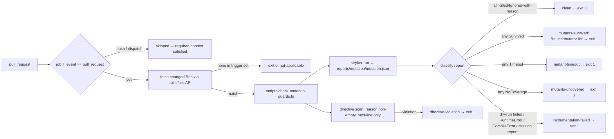

# feat: Counterexample-proven guards via scoped mutation testing

## Overview

Add a required `Main` job that runs StrykerJS mutation testing over an enumerated set of gate modules and fails when any mutant survives. A surviving mutant is a check that can be removed without a test noticing — the vacuous-counterexample class that bit three times in two weeks. Exceptions are Stryker's line-scoped comment directives with a mandatory reason. The check runs only on pull requests that change what is mutated or how mutants execute, and is skipped (not left pending) everywhere else.

## Problem Frame

The repository's guards almost all have negative tests and several carry hand-written mutation proofs, but nothing verifies a negative test is load-bearing. Three guards this fortnight passed with their checks removed: a rewrite test whose fixture never reached the regex, two scaling guards that could not distinguish the vulnerable implementation from the fixed one, and a boundary test reading two of ninety-eight files. The only detector was a human asking "would this fail if I deleted the `if`?" (see origin: `docs/brainstorms/2026-09-04-counterexample-proven-guards-requirements.md`).

## Requirements Trace

- R1. A surviving mutant in a mutated module fails the check → Units 2, 3, 4
- R2. The mutated set is enumerated and limited to guard code → Units 2, 3
- R3. Timing guards are excluded from mutation and keep their meta-test → Unit 2
- R4. Per-mutant exceptions with a stated reason; no numeric threshold → Unit 2
- R5. Exceptions live in the repository and appear in the diff → Unit 2 (comment directives)
- R6. Exceptions are line-scoped; file- or region-wide suppression is rejected → Unit 2
- R7. Required status resolved by a job-level skip, never a workflow path filter → Units 4, 6
- R8. Runs when mutated modules, their tests, the mutation config, runner config, manifest, or lockfile change → Unit 4
- R9. Instrumentation failure, runner crash, and timeout fail closed with a distinct class → Unit 2
- R10. Each survivor reported with file, location, and mutation → Unit 2
- R11. Spike proves native-TS instrumentation before any wiring lands → Unit 1
- R12. Cleanup baseline before the check becomes required → Unit 5, then Unit 6

## Scope Boundaries

- Timing and complexity guards (`packages/wiki-write-core/src/regex-redos-regressions.test.ts`) are excluded from the mutation test set; the existing discrimination meta-test is unchanged.
- The mutated set is enumerated. No wholesale globbing of `scripts/**` or `packages/**`.
- A single exception mechanism: Stryker comment directives. No repository-owned ignorer plugin, no calendar expiry (see origin: Key Decisions).
- CI-topology fidelity for guards generally, and a guard registry, are separate ideas from the same ideation and are not folded in.

### Deferred to Separate Tasks

- `fro-bot/dashboard` `wiki-writer` guards: adopt the same shape once proven here — separate plan in that repository.
- Narrowing the manifest/lockfile trigger to dependency bumps that touch the mutation or test toolchain, if Renovate churn makes the cost material — future iteration after Unit 6 lands and cost is observed.
- A `docs/solutions/` learning capturing the vacuous-counterexample class and this remedy — write after Unit 6 via the compound workflow.

## Context & Research

### Relevant Code and Patterns

- `.github/workflows/main.yaml` `check-wiki-authority`: required job gated by job-level `if: github.event_name == 'pull_request'` — the skip shape R7 reuses. Every job uses `./.github/actions/setup`.
- `scripts/check-private-leak.ts`: reads the pull request's changed-file set via `gh api repos/{owner}/{repo}/pulls/{n}/files --paginate` — the changed-file pattern Unit 4 reuses. No workflow in this repository uses a path-filter action.
- `scripts/build-wiki-write-core.ts` `--check` and the `Check Wiki Write Core Dist` job: a `scripts/check-*.ts` wrapper that runs a tool, classifies its outcome, exits non-zero with a locatable message, and is registered as a required context — the wrapper shape Unit 2 mirrors.
- `.github/settings.yml` `required_status_checks.contexts`: the registration surface for Unit 6. Context strings must match job `name:` byte-for-byte.
- Existing hand-written mutation proofs stay: `scripts/wiki-lockfile-gates.test.ts` (`MUTATION-PROOF: a tampered lock with one entry removed fails coverage`), `scripts/wiki-context-safety.test.ts` (`… — mutation gate proof (body)`), `scripts/build-wiki-write-core.test.ts`, `packages/wiki-write-core/src/regex-redos-regressions.test.ts` (`proves the scaling helper discriminates quadratic work`).
- Import boundary: `scripts/*.ts` import the shared package by name (`@fro-bot/wiki-write-core/...`), which resolves to committed `packages/wiki-write-core/dist/`. Package tests import `./module.ts` relatively. A mutant in `packages/wiki-write-core/src/` is visible only to tests in the same tree.
- `vitest.config.ts`: includes `scripts/**/*.test.ts` and `packages/**/*.test.ts`, 10-second default timeout, no aliases.
- `Test Scripts Load` job: imports every non-test `scripts/*.ts` under Node's strip-only loader; any new script must load without transpilation.
- `.gitignore`: already ignores `coverage`, `.vitest-cache`, `dist` (with the `packages/wiki-write-core/dist/` exception).
- Renovate (`.github/renovate.json5`): patch updates disabled except `python`/`typescript`; devDependencies pinned exact.

### Institutional Learnings

- `docs/solutions/workflow-issues/quoted-required-status-check-context-2026-06-09.md` — context strings must be identical across workflow, `settings.yml`, and docs; a mismatch leaves branch protection waiting on a ghost.
- `docs/solutions/best-practices/verify-in-the-ci-topology-not-just-locally-2026-07-11.md` — environment-sensitive claims (native-TS instrumentation, sandbox symlinks) must be verified in the workflow, not on a laptop.
- `docs/solutions/best-practices/make-failure-boundaries-and-shared-predicates-explicit-2026-08-25.md` — name failure states before side effects; "failed to instrument" is not "mutant survived".
- `docs/solutions/best-practices/status-vocabulary-must-cover-every-report-surface-2026-08-31.md` — the closed vocabulary must reach the step summary, the exit message, and the tests together.
- `docs/solutions/best-practices/calibrate-classifiers-on-adjudicated-ground-truth-2026-07-11.md` — tightening a gate exposes fixtures that passed for the wrong reason; keep the cleanup baseline separate from enforcement.
- `docs/solutions/workflow-issues/lockfiles-are-advisory-until-gated-2026-07-11.md` — a devDependency claim is advisory until the CI path installs and exercises it.
- `docs/solutions/best-practices/pure-core-privacy-gates-shared-module-2026-06-22.md` — gates are pure cores behind thin CLI wrappers; mutate the core, not the shell.

### External References

- StrykerJS configuration: `mutate` globs with `!` exclusion, `testRunner: "vitest"`, `vitest.related` (default true), `testFiles`; the Vitest runner forces `coverageAnalysis: perTest`. https://stryker-mutator.io/docs/stryker-js/configuration/ and `/vitest-runner/`
- Disabling mutants: `// Stryker disable next-line <Mutator>[: reason]`; reason is optional natively and, when present, is recorded in the report. `disable all` / `restore` are region directives. https://stryker-mutator.io/docs/stryker-js/disable-mutants/
- Exit codes do not distinguish threshold failure, dry-run failure, and runner crash; the JSON report carries per-mutant `status` (`Killed`, `Survived`, `Timeout`, `Ignored`, `RuntimeError`, `CompileError`), `statusReason`, `location`, `mutatorName`. `thresholds.break: null` disables the numeric gate.
- `@stryker-mutator/typescript-checker` is optional; Stryker mutates TypeScript via Babel and re-emits source. Compatibility with Node's strip-only loader is undocumented — the spike's purpose.
- Stryker 10.0.0 (2026-08-14); Vitest 4 supported since 9.4.0; Node ≥ 22. Open upstream issues: #5928 (Vitest 4 coverage), #5459 (fixtures).

## Prior-Art Survey

```json
{
  "schema_version": 2,
  "verdict": "build-new-within-scope",
  "scope": "scripts + packages/wiki-write-core",
  "freshness": {
    "vcs_reference": "3443d38"
  },
  "budget": {
    "max_search_passes": 2,
    "max_candidate_inspections": 6,
    "exhausted": false
  },
  "candidates": [
    {
      "path_or_symbol": "packages/wiki-write-core/src/regex-redos-regressions.test.ts",
      "description": "scaling meta-test that proves the helper discriminates quadratic work",
      "disposition": "insufficient",
      "insufficiency_reason": "detects complexity regressions, not a deliberately injected surviving mutant in a named gate module"
    },
    {
      "path_or_symbol": "scripts/build-wiki-write-core.test.ts",
      "description": "build-input and invalid-TS rejection tests for committed dist generation",
      "disposition": "insufficient",
      "insufficiency_reason": "verifies build invariants, not test-suite mutation survival"
    },
    {
      "path_or_symbol": "scripts/wiki-context-safety.test.ts",
      "description": "field-by-field private-token gate with mutation-proof cases",
      "disposition": "insufficient",
      "insufficiency_reason": "hand-written negative tests; no framework mutates the module and fails CI when tests stay green"
    },
    {
      "path_or_symbol": "scripts/wiki-lockfile-gates.test.ts",
      "description": "lockfile coverage and integrity rejection tests with a tampered-lock proof",
      "disposition": "insufficient",
      "insufficiency_reason": "proves specific examples, not a CI check that reports surviving mutants"
    }
  ]
}
```

## Key Technical Decisions

- **Same-tree test pairing.** Each mutated module runs only against tests in its own tree: `packages/wiki-write-core/src/*.test.ts` for package modules, `scripts/*.test.ts` for script modules. Scripts reach the package through committed `dist/`, so a package mutant is invisible to scripts tests; pairing across the boundary would report green while blind. A Vitest alias from the package name to `src/` was considered and rejected — it would change what every test exercises, not just the mutation run.
- **Wrapper classifies the JSON report; the exit code is not trusted.** `scripts/check-mutation-guards.ts` runs Stryker with `thresholds.break: null` and `reporters: ["json", "clear-text"]`, then derives one verdict from the closed set in the design table below. Only `clean` and `not-applicable` exit zero. `NoCoverage` — guard code no test reaches — is its own failing verdict, because an unreached rejection branch is the vacuity this check exists to find, and Stryker reports it separately from `Survived`. Tool failure and policy breach are separate verdicts (`instrumentation-failed`, `directive-violation`) so an operator can tell "the tool broke" from "a rule was violated" without reading logs; the repository's `scan_result: success|detection|error` and `verified-clean / could-not-check` conventions make the same distinction.
- **Comment directives are the only exception mechanism; the wrapper enforces what Stryker leaves optional.** Every `Ignored` mutant in the report must carry a non-empty `statusReason`; every `Stryker disable` in a mutated module must be `next-line` scoped. A bare `Stryker disable all` or region form fails the check. Enforcing from the report uses Stryker's own parser for reasons; the region ban is a conservative textual rule where a false positive fails loudly (see origin: Key Decisions).
- **Enumeration guarded by a shape test, not by memory.** A colocated test asserts two exhaustiveness rules: every non-test file under `packages/wiki-write-core/src/` appears in `mutate` or in a `not-mutated` list with a reason; every `scripts/` file matching `check-*.ts`, `wiki-*-gates.ts`, `wiki-context-safety.ts`, or `build-wiki-write-core.ts` does likewise. Path exhaustiveness for the package and name patterns for scripts replace the export-name heuristic from the first draft, which false-negatives on `runCheck` (`check-repo-onboarded.ts`) and false-positives on validators like `assertCorrectionsFile`. A new guard file that matches neither list fails `pnpm test` before it can bypass the check.
- **Cores are the target; shells are covered or listed.** Every candidate script already exports its decision logic (`checkWikiAuthority`, `runCheck`, and `checkPrivateLeak` from the package) behind a thin `main()`. Mutants in `main()` will report `NoCoverage` unless the assembled flow is tested. Unit 5 resolves each such file one of two ways, in order of preference: cover `main()` through the injected-seam pattern the repository already uses for assembled-flow tests, or list the file `not-mutated` naming the module that carries its core. Line-by-line directives over a shell are not an option — that is region suppression by another name (R6).
- **Changed-file detection reuses the pull-request files API.** The job always runs on `pull_request`; its first step fetches the changed paths the way `scripts/check-private-leak.ts` does and exits zero with a "not applicable" summary when none match the trigger set. `push` and `workflow_dispatch` are skipped by job-level `if`. No path-filter action is introduced.
- **Timing guards excluded by test file, not by module.** `regex-redos-regressions.test.ts` is omitted from `testFiles` so no mutant can trip a timing bound; the modules it exercises remain mutated against their correctness tests.
- **Spike targets a package core module.** `packages/wiki-write-core/src/corrections-survival.ts` is pure logic with colocated tests and no I/O, so the spike isolates the one unknown — does Stryker's re-emitted TypeScript load under Node's strip-only loader — from everything else.
- **Renovate pull requests run the check.** Manifest and lockfile changes are in the trigger set because a bump of the mutation or test toolchain is precisely a change that can blind the check. The cost is single-digit minutes per Renovate pull request; narrowing is deferred until observed.

## Open Questions

### Resolved During Planning

- Exception mechanism: line-scoped comment directive with enforced reason; content-bound ignorer rejected (see origin: Key Decisions).
- Where the changed-file set comes from: the pull-request files API, reused from `scripts/check-private-leak.ts`.
- Which package module the spike uses: `corrections-survival.ts`.
- Candidate list corrections: the origin doc's `privacy.ts` does not exist (the core is `private-leak.ts`); `gate-contract.ts` is constants and is not a rejection surface — excluded with a reason in the `not-mutated` list.
- Importable cores: `check-wiki-authority.ts` exports `checkWikiAuthority`, `check-repo-onboarded.ts` exports `runCheck`, `check-private-leak.ts` delegates to the package's `checkPrivateLeak`; all three stay in `mutate`.
- Changed-file listing: `fetchChangedFiles` and `readPullRequestContext` are already exported from `scripts/check-private-leak.ts`; Unit 4 imports them rather than extracting a helper module.
- Enumeration criterion: path exhaustiveness for the package plus name patterns for scripts; the export-name heuristic was rejected after it false-negatived on `runCheck` and false-positived on `assertCorrectionsFile`.
- Unit 3 disposition, `scripts/check-mutation-guards.ts`: `not-mutated`. A directive scanner cannot describe its own grammar in comments without matching it; the classifier and scanner are covered by their fixture tests, not by mutation.
- Unit 3 disposition, `packages/wiki-write-core/src/wiki-write-core.test.ts`: stays in `testFiles` without a 1:1 `mutate` filename partner. It imports `./index.ts` relatively and reaches `private-leak.ts` and `corrections-survival.ts` through the barrel, so it is a real same-tree test of listed modules; Unit 3's pairing check must accept a same-tree test that covers a listed module via relative import, not require 1:1 filename pairing.

### Deferred to Implementation

- Exact `mutate`/`testFiles` globs. The spike settled the shape: `related` over-selects because `regex-redos-regressions.test.ts` imports `wiki-ingest.ts`, which directly imports `corrections-survival.ts` — a real import edge, not a barrel artifact, so no barrel restructuring fixes it. `testFiles` is an explicit same-tree list and `vitest.related` is set `false`.
- Whether each script's `main()` is covered by an assembled-flow test today or reports `NoCoverage` on the first full run; decided by the run itself in Unit 5, with the two allowed resolutions named there.
- Runtime budget for the `Main` job: the ten-module set measured **5m29s** on the hosted runner (≈2.7× local, in line with the 2.2× estimate). That is the wall-clock cost added to every pull request that hits the R8 trigger set; Unit 4's `timeout-minutes` and the trigger-set breadth are decided against that number, not an extrapolation.
- Stryker `timeoutMS` and `dryRunTimeoutMinutes` values. The spike saw 5 timeouts in 183 mutants at default settings on one module (58.47% score = (102 killed + 5 timeout) / 183 — Stryker's default score counts `Timeout` as detected). The wrapper's closed vocabulary already refuses that conflation: `mutant-timeout` is its own failing verdict, never counted as killed. Local runs are roughly 2.2× faster than the hosted runner; the calibration input is the post-fix CI figure recorded in Unit 1's result (19 s Stryker / 20.9 s wall), with headroom, never a local number — otherwise a slow-but-terminating mutant on a loaded runner reclassifies as `Timeout` and the guard grades itself higher under load.
- Whether incremental mode (`--incremental`) is worth enabling on pull requests; content-based reuse is safe, but Vitest reports test locations per file, so gains may be small.
- Whether a mutant that flips the `import.meta.main` guard in `scripts/build-wiki-write-core.ts` runs a build inside the Stryker sandbox; if so, that line gets a directive with reason.

## High-Level Technical Design

> *This illustrates the intended approach and is directional guidance for review, not implementation specification. The implementing agent should treat it as context, not code to reproduce.*



Verdict vocabulary (closed set, rendered identically in the exit message, the step summary, and the tests; precedence top to bottom when several apply):

| verdict | meaning | exit |
|---|---|---|
| `instrumentation-failed` | report missing or unreadable, dry run failed, any `RuntimeError`/`CompileError` mutant | 1 |
| `directive-violation` | a `Stryker disable` without `next-line` scope or without a reason; an `Ignored` mutant with empty `statusReason` | 1 |
| `mutant-timeout` | at least one mutant timed out (not counted as killed) | 1 |
| `mutants-uncovered` | at least one mutant has `NoCoverage` — no test reaches that guard code | 1 |
| `mutants-survived` | at least one mutant survived a test that reached it | 1 |
| `clean` | every mutant killed, or ignored with a reason | 0 |
| `not-applicable` | no trigger-set file changed | 0 |

The mermaid sketch above collapses the four failing report classes into two nodes for readability; the table is authoritative.

## Implementation Units

- [x] **Unit 1: Spike — instrument one package module under native TypeScript**

**Result:** the assumption holds. 183 mutants over `corrections-survival.ts`: 102 killed, 61 survived, 15 uncovered, 5 timeout, zero `RuntimeError`/`CompileError` — Node's strip-only loader accepted every re-emitted variant. Discrimination proven both directions at `corrections-survival.ts:60:29 ObjectLiteral`. Runtime 8–14 s for one module. Three findings feed Unit 2: (1) `plugins: ["@stryker-mutator/vitest-runner"]` must be explicit — the default plugin glob does not resolve under pnpm's layout; (2) `vitest.related` selected four test files including `regex-redos-regressions.test.ts` — not through any `index.ts` barrel, but because `regex-redos-regressions.test.ts` imports `wiki-ingest.ts`, which imports `corrections-survival.ts` directly, so Vitest's related-file analysis correctly (and unhelpfully) follows that direct edge; no barrel restructuring can break this coupling, so `testFiles` must be explicit and `vitest.related` set `false` for same-tree pairing; (3) a source-introspecting test asserted a byte-exact import line and failed under instrumentation because the generator re-emits `import { x } from '...';` — fixed with a whitespace-tolerant match, and any future test that reads its subject's source must tolerate generator formatting. CI-observed figures (hosted runner), identical mutant counts to local in every run (102 killed, 5 timeout, 61 survived, 15 uncovered, 0 errors): 26 s wall clock before `testFiles` was set; **19 s by Stryker's accounting, 20.9 s wall clock after** — this post-fix CI number is the calibration input for Unit 2. Local after the same fix: the dry run selects exactly one test file (`corrections-survival.test.ts`, 29 tests), ~8–9.7 s wall clock. The local/CI ratio is roughly 2.2× in both conditions.

**Goal:** Prove Stryker 10 with the Vitest runner can mutate a strip-only TypeScript module, load the mutated source under Node 24, run its colocated tests, and kill mutants — in the CI topology, not only locally. Measure runtime.

**Requirements:** R11

**Dependencies:** None. Operator approval for the devDependency and lockfile change.

**Files (as shipped):**
- Modify: `package.json` (`@stryker-mutator/core`, `@stryker-mutator/vitest-runner`, exact pins), `pnpm-lock.yaml`, `pnpm-workspace.yaml` (`qs: '>=6.15.2'` override for GHSA-q8mj-m7cp-5q26, reached only through Stryker's `typed-rest-client`)
- Create: `stryker.config.json` (spike scope: `mutate` = `corrections-survival.ts`, explicit `testFiles`, `vitest.related: false`, explicit `plugins`, `thresholds.break: null`, `reporters: ["json","clear-text"]`, `tempDirName: ".stryker-tmp"`, `allowConsoleColors: false`)
- Modify: `.gitignore` (`/.stryker-tmp/`, `/reports/` — root-anchored), `vitest.config.ts` (`test.exclude` spreads `defaultExclude` — the option replaces Vitest's defaults — plus coverage excludes), `eslint.config.ts` ignores, `.github/codeql/codeql-config.yml` `paths-ignore`
- Modify: `packages/wiki-write-core/src/corrections-survival.test.ts` (whitespace-tolerant source-introspection assertion)
- Create: `.github/workflows/mutation-spike.yaml` (temporary; `pull_request` on its own dependency paths plus `workflow_dispatch`, since dispatch resolves workflow files from the default branch; concurrency group as `main.yaml`; deleted in Unit 4 when the real job lands)

**Approach:**
- Install and run Stryker against the single module locally first; record whether the dry run passes and how many mutants are killed, survived, no-coverage, compile-error, runtime-error.
- Run the same config from the temporary workflow so the sandbox, symlinked `node_modules`, and Node version match `Main`.
- Deliberately plant a vacuous test: disable one assertion so a known mutant survives, run again, confirm it reports `Survived` at the expected location. Restore.
- Record: runtime for the one module, mutant count, any operators producing output the loader rejects, whether `vitest.related` selected the right test file.
- If mutated output fails to load under the strip-only loader for any operator, stop and report before Unit 2 — the design assumption is false and the plan needs revising, not patching.

**Patterns to follow:**
- `.github/workflows/main.yaml` job shape (checkout → `./.github/actions/setup` → run).
- `docs/solutions/best-practices/verify-in-the-ci-topology-not-just-locally-2026-07-11.md`.

**Test scenarios:**
- Happy path: Stryker dry run passes; the colocated test kills mutants; JSON report written with per-mutant `status` and `location`.
- Integration: the same run succeeds inside the workflow with `node_modules` symlinked into the sandbox.
- Discrimination: with one assertion disabled, at least one mutant reports `Survived` at the expected line; with it restored, that mutant is `Killed`.
- Error path: an operator whose output the loader rejects surfaces as `RuntimeError`/`CompileError` in the report, not as a silent kill.

**Verification:**
- The spike PR description records mutant counts, runtime, and the discrimination result; the plan's Deferred-to-Implementation items about globs and timeouts are answered there.
- `pnpm test`, `pnpm lint`, `pnpm check-types`, and `Test Scripts Load` still pass with the new devDependencies installed.

- [x] **Unit 2: Wrapper script with closed verdict vocabulary and directive rules**

**Result:** 89 classifier and directive tests on fixture reports (grown across several post-review fixes to the directive scanner (including multi-directive-per-line evaluation), exit-code contract, empty-report handling, missing-mutate-file detection matching minimatch's grammar, report-path injection, a report-key cross-check against the `mutate` list, a per-file all-Ignored check, a reporter/report-path config cross-check routed through its own injectable seam with a validated `reporters` shape and config-relative path resolution, and a named unreadable-report sentinel); three discrimination proofs (precedence, empty-reason, `next-line`) each went red with the rule removed — and the third exposed a fixture that passed for the wrong reason, now replaced. `timeoutMS: 30000` derived from Unit 1's CI figure (5 s default × 2.2 runner ratio, doubled for a cold runner); `dryRunTimeoutMinutes` widened from 5 to 8 for more headroom against a ~3 min extrapolation. Most recent live run over ten modules, with every fail-closed check now active: **`mutant-timeout`** — 2514 total mutants (1265 killed, 777 survived, 465 uncovered, 7 timeout, 0 errors), 1m41s–2m5s local across two runs; none of the config-integrity checks (empty report, missing literal entry, absent-from-report key, all-Ignored file, reporter mismatch) fired — the real config is well-formed. Heaviest: `check-private-leak.ts` 239 survived/81 uncovered, `corrections.ts` 171/109, `build-wiki-write-core.ts` 100/57. Confirmed the all-Ignored check fires correctly: a scratch, never-committed config that set `mutator.excludedMutations` broadly for `wiki-context-safety.ts` alone produced a report where all 45 mutants were `Ignored`, and `classifyMutationReport` returned `instrumentation-failed` naming that file and "all 45 mutants ignored". That survivor/uncovered baseline is Unit 5's.

**Goal:** A `scripts/check-*.ts`-style wrapper that runs Stryker over the configured set, classifies the JSON report into the closed verdict set, enforces directive rules, and prints locatable survivors.

**Requirements:** R1, R3, R4, R5, R6, R9, R10

**Dependencies:** Unit 1 (spike results calibrate timeouts and globs).

**Files:**
- Create: `scripts/check-mutation-guards.ts`
- Create: `scripts/check-mutation-guards.test.ts`
- Modify: `stryker.config.json` (full enumerated `mutate` and `testFiles`; `regex-redos-regressions.test.ts` excluded from `testFiles`; timeouts from the spike)
- Modify: `package.json` (`check:mutation-guards` script)

**Approach:**
- Separate the pure classifier (report JSON in → verdict + located mutant list out) from the runner (spawns Stryker, reads the report file) so the classifier is unit-testable with fixture reports and is itself a candidate for the mutated set later.
- Classify by the precedence table in the design section: `instrumentation-failed` → `directive-violation` → `mutant-timeout` → `mutants-uncovered` → `mutants-survived` → `clean`. Every failing verdict lists every mutant in every failing class, not only the class that won precedence, so one run gives the whole picture.
- Directive scan over the `mutate` file set: every line containing `Stryker disable` must contain `next-line` and a `: ` followed by non-whitespace; anything else → `directive-violation` naming file and line. Conservative by design — a false positive fails loudly.
- The script must be inert on import: all execution sits behind an `import.meta.main` guard, exactly as `scripts/build-wiki-write-core.ts` does, because `Test Scripts Load` imports every non-test `scripts/*.ts`. An import-time Stryker spawn would make that job either run the mutation suite or fail.
- Output: one line per survivor `path:line:col mutatorName` plus the verdict as the last line, and the same content into `GITHUB_STEP_SUMMARY` when set (reuse the summary pattern from `scripts/check-private-leak.ts`).
- Never read the exit code for classification; use it only to detect "Stryker did not run at all".
- Set `timeoutMS`/`dryRunTimeoutMinutes` from the CI-observed runtime with headroom, not the local one — the spike's local runtime ran ~2× faster than the hosted runner, and Stryker's default score already counts `Timeout` as detected, so a tight local-derived timeout would silently reclassify slow-but-terminating mutants as `mutant-timeout` under CI load. The wrapper's closed vocabulary keeps `mutant-timeout` a distinct failing verdict, never counted as killed, so this conflation cannot leak into `clean`.

**Patterns to follow:**
- `scripts/build-wiki-write-core.ts` for the wrapper/`--check` shape and message style.
- `scripts/check-private-leak.ts` for step-summary writing and the `scan_result`-style structured outcome.
- `docs/solutions/best-practices/make-failure-boundaries-and-shared-predicates-explicit-2026-08-25.md`.

**Test scenarios:**
- Happy path: fixture report with all `Killed` → `clean`, exit 0.
- Happy path: fixture with `Ignored` + non-empty `statusReason` → `clean`.
- Error path: one `Survived` → `mutants-survived`, output includes `file:line:col mutator` for it.
- Error path: one `NoCoverage` → `mutants-uncovered`, located the same way.
- Error path: one `Timeout` → `mutant-timeout`.
- Error path: `RuntimeError` or `CompileError` present → `instrumentation-failed`.
- Error path: report file missing or malformed JSON → `instrumentation-failed`, never `clean`.
- Error path: `Ignored` with empty `statusReason` → `directive-violation` naming the mutant.
- Edge case: a report with both a `Timeout` and a `Survived` reports `mutant-timeout` as the verdict and lists both mutants.
- Edge case: directive `// Stryker disable next-line ConditionalExpression: reason` passes; `// Stryker disable all`, `// Stryker disable next-line X` (no reason), `// Stryker disable next-line X:` (empty reason) each → `directive-violation` with file and line.
- Edge case: importing the module in a test spawns nothing and produces no output (the `import.meta.main` guard).
- Edge case: a directive inside a string literal or a non-mutated file is not scanned (scan is limited to the `mutate` set).
- Integration: running the wrapper end to end against the spike module produces the same verdict as classifying its report by hand.

**Verification:**
- `pnpm check:mutation-guards` prints a verdict from the closed set as its last line and exits non-zero for every verdict except `clean`/`not-applicable`.
- Every scenario above has a test; the classifier's tests use fixture JSON, not live Stryker runs.
- `Test Scripts Load` imports the new script without error and without side effects.

- [x] **Unit 3: Enumeration guard and same-tree pairing test**

**Result:** `mutation-guards.json` created at repo root holding `not-mutated: [{path, reason}]`; `scripts/mutation-guards-config.test.ts` created with the five tests. `stryker.config.json`'s `mutate` grew from 10 to 12 entries and `testFiles` from 10 to 12, after reading every module the initial disposition deferred and, for three of them, correcting course against a live `check:mutation-guards` run. Two `scripts/check-*.ts` files the origin research missed — `check-md-links.ts` and `check-wiki-private-presence.ts` — read as genuine gates structurally identical to the already-mutated `check-private-leak.ts` (classification logic + `main()` with `exitCode`), promoted to `mutate` with their existing same-tree tests (`check-md-links.test.ts`, `check-wiki-private-presence.test.ts`) added to `testFiles`. `packages/wiki-write-core/src/schemas.ts`, `wiki-ingest.ts`, and `wiki-slug.ts` each have a real throw/reject path (`assertReposFile`, `WikiIngestError`, `computeRepoSlug`) consumed by an already-mutated gate, and were initially promoted to `mutate` on that basis — but a live `check:mutation-guards` run caught the mistake: each module's *real* test lives in `scripts/` (`scripts/wiki-ingest.test.ts`, `scripts/wiki-slug.test.ts`, `scripts/schemas.test.ts`) and reaches the package source only through the built `dist/` output, via a `scripts/<x>.ts` re-export shell (`export * from '@fro-bot/wiki-write-core/<x>'`) — the exact wiki-lint.ts situation, not "already same-tree covered." Same-tree pairing therefore measured blind: the run showed `wiki-ingest.ts` at 1474/1474 `NoCoverage`, and instrumenting it alongside the others corrupted coverage attribution for the *entire* run — `corrections.ts` (553/553 `NoCoverage`) and `corrections-survival.ts` (183/183 `NoCoverage`) lost all coverage despite their dedicated same-tree tests being unchanged. Reverting the three promotions and re-running restored `corrections.ts` to 273 killed/171 survived/109 uncovered and `corrections-survival.ts` to 102 killed/61 survived/15 uncovered/5 timeout — exact matches to Unit 1/2's baseline — confirming the cause and the fix empirically rather than by inspection alone. All three now sit in `not-mutated` with the pending-relocation reason (naming their rejection path so Unit 5 knows to flip them to `mutate` after moving their tests beside the module, same pattern as `wiki-lint.ts`). Final disposition: 9 `not-mutated`-with-reason/pending-relocation package modules (`frontmatter.ts`, `rendering-policy.ts`, `wiki-utils.ts`, `markdown-links.ts`, `correction-text.ts`, `data-branch-bootstrap.ts`, `gate-contract.ts`, `wiki-lint.ts`, plus `index.ts` as a pure barrel) — 12 package `not-mutated` entries total once `wiki-ingest.ts`/`wiki-slug.ts`/`schemas.ts` are counted; 1 scripts `not-mutated` entry (`check-mutation-guards.ts`, per its Unit 2 disposition). `readStrykerConfig`, `isLiteralPath`, and `MINIMATCH_METACHARACTER_PATTERN` exported from `scripts/check-mutation-guards.ts` for reuse (previously module-private); `readStrykerConfig` extended to also parse and return `testFiles` (previously omitted, needed for Tests 3 and 4). All five discrimination proofs ran red before the corresponding fix and green after, with every temp edit reverted before landing. Final live `check:mutation-guards` run (12 `mutate` files, 2907 mutants, 1m45s wall clock): every `mutate` file shows non-zero `Killed`; totals match Unit 2's 2514-mutant baseline plus the two new scripts files' 393 mutants exactly. Gate: `pnpm check-types`, `pnpm lint`, and `pnpm test` (73 files, 2940 tests, 3 todo) all pass; `node -e "import('./scripts/check-mutation-guards.ts')"` remains inert. Root-caused the corrections.ts/corrections-survival.ts coverage loss (not just correlated it): `wiki-ingest.ts`'s Regex mutator produces a syntactically invalid mutant (`\v` → `\V` in a character class at line 706), and because Stryker embeds every regex-literal mutant as a literal alternative in a ternary chain, that one invalid variant fails to parse at load time — independent of which mutant is active — and Vite's shared dependency scan zeroes test collection for every file in the run, not only ones that import the broken module. Confirmed by a minimal scratch repro (`mutate: [corrections.ts, wiki-ingest.ts]`, `testFiles: [corrections.test.ts]`): 0 tests collected; a temporary `// Stryker disable next-line Regex` directive on that line restored normal collection (15 tests), then reverted (production `wiki-ingest.ts` is unchanged and matches HEAD). Recorded in the Risks table with the observable signature (`ConfigError`, no report file — already correctly mapped to `instrumentation-failed` by the wrapper, no wrapper change needed) and the concrete precondition for Unit 5 flipping `wiki-ingest.ts` to `mutate`: add that directive first.

**Addendum (post-landing correction):** the `ConfigError`/no-report signature above is only the scoped-repro shape (`mutate: [corrections.ts, wiki-ingest.ts]`, `testFiles: [corrections.test.ts]`) and was the only shape reproduced at the time this unit landed. A full-scale run — the real 12-entry `mutate`/`testFiles` config plus `wiki-ingest.ts`, every other entry unchanged — does not throw `ConfigError` and does write a complete, well-formed report (5130 mutants): the three test files whose sole coverage import reached `wiki-ingest.ts` (`corrections.test.ts`, `corrections-survival.test.ts`, `wiki-write-core.test.ts`) are silently dropped from dry-run collection while every other configured test file, including the `scripts/` ones, still loads — `--logLevel debug` shows the dry run reporting success at 316 tests collected with nothing naming the drop, and the report's top-level `testFiles` map simply omits the three dropped keys rather than listing them with zero tests. `corrections.ts` reads 553/553 `NoCoverage` and `corrections-survival.ts` 183/183 `NoCoverage` — the wrapper classified this as `mutants-uncovered`, not `instrumentation-failed`, because a report was written and Unit 2's report-missing rule never fires. This was a genuine fail-open the "no wrapper change is needed" conclusion above missed. Closed by adding a `configuredTestFiles` fail-closed check to `classifyMutationReport`: every configured `vitest.testFiles` entry (literal, non-glob), normalized like `mutate` entries, must appear in the report's `testFiles` map with at least one test, or the run fails closed with `instrumentation-failed` and a new `TestFileNotExecuted` sentinel naming the dropped file. Proven red-then-green against `scripts/check-mutation-guards.test.ts`, then reproduced end to end through the real wrapper machinery (`runMutationGuardCheck`'s classification path) against the full-run repro report: verdict now correctly reads `instrumentation-failed`, naming all three dropped test files, where it previously read `mutants-uncovered`. Gate wrapper test count grew from 89 to 94 with this fix (six new discrimination/behavior tests for `TestFileNotExecuted`, including the "skip check on empty `configuredTestFiles`" default-safety case and the "no double-report when the report itself is unreadable" precedence case).

**Second addendum (two more gaps closed in the same follow-up pass):**

1. **`extractReportTestFileCounts` conflated two distinct failure modes.** It returned `undefined` both for a genuinely unreadable report and for a readable, well-formed report that simply had no top-level `testFiles` map — the caller skipped the `TestFileNotExecuted` check in both cases, but only the first is already covered by `reportUnreadable`. A readable report missing its `testFiles` map is a *more* severe gap (nothing about any configured test file can be verified at all), not a reason to skip verification. Closed with a new `hasTestFilesMapMissing` check, gated on `configuredTestFiles.length > 0` and `flat !== undefined` (readable), producing a `TestFilesMapMissing` sentinel naming how many configured test files could not be verified. Discrimination: `{schemaVersion:'2.0', files:{'a.ts':{mutants:[]}}}` (readable, well-formed, no `testFiles` key) with two configured test files read `clean` under the prior code and `instrumentation-failed` under the fix — proven red→green in `scripts/check-mutation-guards.test.ts`.

2. **`mutation-guards-config.test.ts`'s Test 3 was blind to zero-coverage `mutate` entries.** The original `findCrossTreePairingViolations` only flagged a `testFiles` entry that reached a `mutate` entry in the *other* tree — a `mutate` entry reached by *no* same-tree test at all produced nothing to flag as "crossing", so it silently passed. Concretely: `scripts/wiki-slug.ts` is a `dist/`-shell re-export (`export * from '@fro-bot/wiki-write-core/wiki-slug'`) — a *package* specifier, invisible to any relative-import scanner — so a scripts-side test reaching only that shell gave zero same-tree signal for the package module it re-exports, and the old Test 3 had nothing to say about it. Renamed and inverted: `findMutateTestPairingViolations` now requires every `mutate` entry to be reached by at least one same-tree `testFiles` entry (via the new `reachedModulesTransitive`, which also follows `export * from`/`export {...} from` barrel chains transitively, resolves dynamic `import('...')`/`import(\`...\`)` (including a literal-only `${'...'}`  interpolation and the `.js`/`.mjs`/`.cjs` → `.ts` extension rewrite), and supports multi-level `../` specifiers — none of which the original one-level, static-only `reachedModules` handled), in addition to keeping the original cross-tree check. Discrimination proven three ways: (a) the wiki-slug shape (fake `mutate`/`testFiles`/`reach`) — zero violations under the old function, one under the new, red pasted in the session transcript; (b) Fro Bot's live counterexample, `scripts/wiki-context-safety.ts`/`scripts/wiki-context-safety.test.ts`, which reaches its module *only* through `import(\`./wiki-context-safety${'.js'}\`)` with no static import anywhere in the test file — run against the real files with the real `reachedModulesTransitive`, this reports zero violations, proving the new dynamic-import/template-literal resolution actually works, not just against a fake `reach`; (c) a zero-reach entry and a cross-tree entry each still produce their expected violation. Test 3 itself, run against the real `stryker.config.json`, passes: every one of the 12 real `mutate` entries is reached by a same-tree test under the new extractor.

Also landed as non-blocking hardening in the same pass: `walkNonTestTsFiles` now recurses (`{recursive: true}`) under every `packages/*/src/` directory and `scripts/`, rather than a single-level `readdirSync`, so a future nested source file is not silently invisible to Tests 1/2; **Test 6** asserts every `not-mutated` entry exists on disk; **Test 7** asserts no path is listed in both `mutate` and `not-mutated` (mutual exclusion). `mutation-guards-config.test.ts` grew from 5 tests to 12 (7 new: 2 more enumeration tests (Test 6, Test 7) plus 5 pure-function discrimination tests for `findMutateTestPairingViolations`, including the wiki-slug and wiki-context-safety cases). Combined wrapper + config-enumeration test count: 107 (95 + 12).

**Third addendum (review pass — reach is not coverage, plus four extractor hardenings):** `findMutateTestPairingViolations` and `reachedModulesTransitive` prove a `mutate` entry is *touched* by a same-tree test, not that it is *exercised* — the barrel `packages/wiki-write-core/src/index.ts` (eight `export *` targets) makes `wiki-write-core.test.ts` reach 11 package modules, so this positive rule is a near-vacuous structural floor for `packages/`, not evidence a promotion is safe (documented directly on `findMutateTestPairingViolations`'s docstring; the corresponding one-sentence caveat is now also on Unit 5's execution note, above). Four more gaps closed in the extractor: (1) a commented-out import (`// import ... from './x.ts'` or a `/* ... */` block form) was still counted as reach — closed by stripping comments (a new, file-scoped `stripComments`, deliberately not the shared `stripStringLiterals`, since that blanks string content and would erase the specifiers this extractor needs to keep) before running the import patterns; discrimination proven red→green: a fixture test file with both comment forms wrapping an import no longer reaches that import's target, while a real adjacent import on the next line still does. (2) `REEXPORT_PATTERN` now accepts `export type {...} from` and `export type * from`, proven with a fixture barrel chain. (3) A glob `testFiles` entry (`isLiteralPath`) is filtered before `reach` would `readFileSync` it (ENOENT) and reported as its own violation ("glob testFiles entries are not supported for pairing") instead. (4) The prior test at this location, named after the wiki-slug fixture data, is renamed to describe the general shape it tests ("flags a mutate entry when reach resolves only to the other tree's shell"). `mutation-guards-config.test.ts` grew from 12 tests to 16. Combined wrapper + config-enumeration test count: 111 (95 + 16).

**Fourth addendum (Unit 5 scope correction — supersedes the "genuine gates" criterion above):** "Structural gate shape" (classification + `main()` with `exitCode`) was necessary but not sufficient, and drew the mutated set too wide. Corrected criterion:

> Mutate a module when it runs in CI or an autonomous write/read path AND owns a material trust/security decision, persisted state later trusted by such a decision, or a generated artifact whose correctness is not independently validated — and the plausible failure is wrong-but-valid, not a loud crash. Structural gate shape alone is not sufficient.

Three demotions from `mutate` to `not-mutated` (with their `testFiles` pairs) under this criterion:
- `packages/wiki-write-core/src/private-leak-adapter.ts`: no production caller, only its own tests and the barrel reference it.
- `scripts/check-repo-onboarded.ts`: a routing predicate, not an independent write/promotion authority; both failure directions are bounded by downstream gates.
- `scripts/check-md-links.ts`: a documentation-quality lint, no security/trust/artifact boundary.

`scripts/build-wiki-write-core.ts` stays despite being a build script: its `main()` validates the committed dist against its own `compareTrees`, so a defect there is self-consistently green — wrong-but-valid, not a crash.

**Fifth addendum (Fro Bot's standing follow-up from #3833 — barrel-reach hole closed):** `findMutateTestPairingViolations` counts reach through a re-export barrel as reach (documented in its own "Reach is not coverage" paragraph as a near-vacuous floor for `packages/`), which is why removing `private-leak-adapter.test.ts` from `testFiles` on #3833's first push left `private-leak.ts` passing the pairing check even though its only remaining same-tree exerciser was a single `it()` in `wiki-write-core.test.ts`, reached solely through `index.ts`'s `export *` forwarding. Added a second, stricter check in `scripts/mutation-guards-config.test.ts`: `findMutateEntriesWithoutSourceReach`, built on a new `sourceReachTransitive` walk that never steps through a "pure re-export barrel" (a module whose entire body, after stripping comments, is only `export * from`/`export {...} from` statements — `index.ts` is the canonical case). Every `mutate` entry must have at least one same-tree `testFiles` entry reaching it through a chain with no barrel hop; "same-tree" reuses the existing `packages/` vs `scripts/` definition. Deliberately does not replace or weaken `findMutateTestPairingViolations`, and does not touch `reachedModulesTransitive` (the trigger gate needs it wide — see the "Shared walk, opposing preferences" paragraph). Proven red→green: with barrel-exclusion temporarily disabled, both the real-config discrimination test (private-leak.ts flagged once its adapter test is removed) and the synthetic barrel-stepping fixture lose their violation entirely; restored, both pass again. Passes against the real config today (mutate=9/testFiles=10, zero violations).

**Goal:** Make the mutated set structurally complete and the pairing structurally safe: a new guard file cannot be forgotten, and a package module cannot be paired with scripts tests.

**Requirements:** R2, R3

**Dependencies:** Unit 2 (config shape settled).

**Files:**
- Create: `scripts/mutation-guards-config.test.ts`
- Modify: `stryker.config.json` (add a top-level comment-free sibling list, or a small `mutation-guards.json` if JSON comments are unavailable, holding `not-mutated: [{path, reason}]`)

**Approach:**
- Test 1 (package, exhaustive): every non-test `.ts` under `packages/wiki-write-core/src/` appears in `mutate` or `not-mutated`. Anything unlisted fails with the path and the two lists it could join.
- Test 2 (scripts, by name): every file matching `scripts/check-*.ts`, `scripts/wiki-*-gates.ts`, `scripts/wiki-context-safety.ts`, `scripts/build-wiki-write-core.ts` appears in `mutate` or `not-mutated`.
- Test 3 (same-tree pairing): for each `mutate` entry under `packages/`, every `testFiles` entry lives under `packages/`; for each under `scripts/`, under `scripts/`. A cross-tree pairing fails naming both paths.
- Test 4: `regex-redos-regressions.test.ts` is not in `testFiles`.
- Test 5: every `not-mutated` reason is non-empty and names the module that carries the core when the entry is a shell.
- Initial dispositions from research, to be confirmed by reading each file: `mutate` — `check-private-leak.ts`, `check-wiki-authority.ts` (exports `checkWikiAuthority`), `check-repo-onboarded.ts` (exports `runCheck`), `wiki-lockfile-gates.ts`, `wiki-context-safety.ts`, `build-wiki-write-core.ts`, and in the package `private-leak.ts` (covered through `private-leak-adapter.test.ts` and the `index.ts` barrel: 47 killed in Unit 2's live run), `private-leak-adapter.ts`, `corrections.ts`, `corrections-survival.ts`; `not-mutated` pending relocation — `wiki-lint.ts`, whose real tests are `scripts/wiki-lint.test.ts` reaching it through `dist/` (same-tree pairing measured 441 uncovered / 10 killed); Unit 5 moves those tests beside the module they test, then Unit 3's list flips it to `mutate`; `not-mutated` with reason — `gate-contract.ts` (constants), and the transform/type modules (`frontmatter.ts`, `rendering-policy.ts`, `wiki-ingest.ts`, `wiki-slug.ts`, `wiki-utils.ts`, `markdown-links.ts`, `schemas.ts`, `index.ts`) unless reading shows a rejection path.

**Patterns to follow:**
- `scripts/wiki-write-core-contract.test.ts` and `scripts/improvement-metrics-workflow.test.ts` — tests that parse a config artifact and assert structural properties.
- The set-equality contract test shape used for `failure_code_descriptions` (assert the full set so a new key forces a conscious update).

**Test scenarios:**
- Happy path: current config passes all five tests.
- Discrimination: inject a fake `packages/wiki-write-core/src/new-gate.ts` into the file list → Test 1 fails naming it.
- Discrimination: inject a fake `scripts/check-fake.ts` → Test 2 fails naming it; inject `scripts/helper.ts` → no failure (pattern miss is intended).
- Discrimination: move one package module's test path into `scripts/` in an injected config → Test 3 fails naming both.
- Discrimination: inject the redos test into `testFiles` → Test 4 fails.
- Edge case: a `not-mutated` entry with whitespace-only reason → Test 5 fails.

**Verification:**
- `pnpm test` includes the new file; each discrimination scenario has been run red-then-green and the outputs recorded in the PR.

- [x] **Unit 4: `Main` job with changed-file gating (not yet required)**

**Goal:** Land the `Check Mutation Guards` job in `Main`, always running on `pull_request`, short-circuiting to `not-applicable` when nothing in the trigger set changed, skipped on other events.

**Requirements:** R7, R8

**Dependencies:** Unit 2. Unit 3 should land first or together so the config is guarded before it is enforced.

**Files:**
- Modify: `.github/workflows/main.yaml` (new job `check-mutation-guards`, `name: Check Mutation Guards`)
- Delete: `.github/workflows/mutation-spike.yaml`
- Modify: `scripts/check-mutation-guards.ts` (changed-file step inside the wrapper: `readPullRequestContext` and `fetchChangedFiles(prNumber, fullName)` imported from `scripts/check-private-leak.ts`, which already exports both; compare against the trigger set)
- Create: `scripts/main-workflow.test.ts` (no shape test for `main.yaml` exists today; mirror `scripts/merge-data-workflow.test.ts`: `readFileSync` + `parse`, a narrowing `assertMainWorkflow`, then assertions on the job: present, `if:` is `github.event_name == 'pull_request'`, uses `./.github/actions/setup`, permissions `contents: read` + `pull-requests: read`, `name:` equals `Check Mutation Guards`)
- Test: `scripts/check-mutation-guards.test.ts` (trigger-set matching)

**Approach:**
- Trigger set: the `mutate` and `testFiles` entries, `stryker.config.json`, `mutation-guards.json` (if introduced), `vitest.config.ts`, `package.json`, `pnpm-lock.yaml`, `scripts/check-mutation-guards.ts`, `scripts/mutation-guards-config.test.ts`. Derive it from the config, not a second hand-maintained list.
- The changed-file step is a function of the wrapper, not a separate script: one script, one `import.meta.main`, one entry in `Test Scripts Load`.
- `not-applicable` is a real verdict: exit 0, summary line says which trigger set was checked and that nothing matched.
- Fork pull requests: the files API is readable with the default token on a public repository; no write permission is requested.
- Do not add the context to `.github/settings.yml` in this unit.
- The real job must carry a `concurrency` group like `main.yaml`'s other jobs — the spike workflow lacked one.

**Patterns to follow:**
- `check-wiki-authority` job in `.github/workflows/main.yaml`.
- `scripts/check-private-leak.ts` for `GITHUB_EVENT_PATH` parsing and paginated file listing.
- `docs/solutions/workflow-issues/quoted-required-status-check-context-2026-06-09.md` — fix the job `name:` now; it becomes the required context string in Unit 6.

**Test scenarios:**
- Happy path: changed set `['docs/x.md']` → `not-applicable`.
- Happy path: changed set includes a `mutate` entry → proceeds to run.
- Edge case: changed set includes only `pnpm-lock.yaml` → proceeds to run.
- Edge case: changed set includes only a `not-mutated` file → `not-applicable` (it is not in the trigger set).
- Error path: files API call fails → `instrumentation-failed`, never `not-applicable` (fail closed, per R9).
- Integration: `scripts/main-workflow.test.ts` asserts the job's `if:`, name, permissions, and setup action, and fails if the job is removed.

**Verification:**
- On a docs-only pull request the job reports success in seconds with a `not-applicable` summary; on a pull request touching a mutated module it runs Stryker and reports a verdict.
- The job is visible in `Main` but not yet listed in `.github/settings.yml`.

**Result:** Correction to the Approach section's named source: `readPullRequestContext` and `fetchChangedFiles` do not live in `scripts/check-private-leak.ts` (verified by reading it — it has its own, unrelated `workflow_run`-event reader for the private-leak check, not a `pull_request` one). Both live in `scripts/check-wiki-authority.ts`, which already implements this exact `pull_request`-event shape for its own PR-scoped guard; `fetchChangedFiles` was already exported there, `readPullRequestContext` was module-private and is now exported alongside it, and `check-mutation-guards.ts` imports both from `./check-wiki-authority.ts` rather than duplicating event-payload parsing and paginated-API fetching a second time.

Trigger set is built (`buildTriggerSet`, exported) directly from the just-read `StrykerConfigShape`: every `mutate` and `testFiles` entry (literal or glob, normalized the same way as everywhere else in the module) plus a fixed infrastructure list — `stryker.config.json`, `mutation-guards.json`, `vitest.config.ts`, `package.json`, `pnpm-lock.yaml`, `pnpm-workspace.yaml`, `scripts/check-mutation-guards.ts`, `scripts/mutation-guards-config.test.ts`, `.github/workflows/main.yaml`, `packages/wiki-write-core/package.json`, `tsconfig.json`, and `packages/wiki-write-core/tsconfig.build.json` (`quartz-site/tsconfig.json` deliberately excluded — unrelated documentation-site build). A glob entry in `mutate`/`testFiles` sets `hasGlobEntries`, which unconditionally proceeds to run rather than attempting minimatch-style expansion against the changed-file list — the real config has no glob entries today, so this is a defensive branch, not the common path.

`evaluateTriggerGate` (exported, async, injectable `env`/`deps` seams) is the single gate function, called from inside `runMutationGuardCheck` (now async) before the report is cleared or Stryker is spawned. Precedence, matching the Approach exactly: not a `pull_request` event → returns `undefined` (full check runs unconditionally, local/`workflow_dispatch`/post-merge `push` all unaffected); `pull_request` event with no `GITHUB_EVENT_PATH`, an unreadable event payload, a payload missing `pull_request.base.repo.full_name`, or a failed `fetchChangedFiles` call → `instrumentation-failed` with a `ChangedFileGateFailed` sentinel naming the cause, never `not-applicable`; `pull_request` event with changed files intersecting the trigger set (or any glob entry present) → `undefined` (proceeds to run); otherwise → `not-applicable` with a `NotApplicable` sentinel naming the changed-file count and trigger-set size. `runMutationGuardCheck` becoming async required updating its eight existing call sites in `scripts/check-mutation-guards.test.ts` to `await` and explicitly pass a non-`pull_request` `triggerGateEnv` override (`{eventName: undefined, eventPath: undefined}`) — without that override, those pre-Unit-4 tests would pick up a real ambient `GITHUB_EVENT_NAME=pull_request` when this very test suite runs inside this repository's own `Test` job in `main.yaml`, and try to invoke the real gate.

All five plan scenarios have discrimination tests in `scripts/check-mutation-guards.test.ts` (15 new tests total, covering the five plus the not-a-pull_request pass-through, missing-event-path, missing-full_name, and glob-bypass cases): `runs the full check unconditionally when the event is not a pull_request`, `reports not-applicable when the changed set is ['docs/x.md'] (no intersection)`, `proceeds to run when the changed set includes a mutate entry`, `proceeds to run when the changed set includes only pnpm-lock.yaml`, `reports not-applicable when the changed set includes only a not-mutated file`, `reports instrumentation-failed, never not-applicable, when the changed-files API call fails`.

`.github/workflows/main.yaml` gained the `check-mutation-guards` job (name `Check Mutation Guards`, modeled directly on `check-wiki-authority`: same `if: github.event_name == 'pull_request'`, same `permissions: {contents: read, pull-requests: read}`, same checkout/setup steps, no build step since `dist/` is committed and verified by the separate `Check Wiki Write Core Dist` job) with `timeout-minutes: 20` (a local full run with no PR context completed in 1m36s wall-clock on this machine after this unit; CI's own baseline reference, 5m29s for ten modules, predates the two newer scripts entries). No per-job `concurrency` group was added — verified against the real `main.yaml` that none of its seven existing jobs (`lint`, `check-types`, `test`, `check-wiki-write-core-dist`, `test-scripts-load`, `check-workflows`, `check-wiki-authority`) declare one; all inherit the workflow-level `concurrency` block. (The Approach note above claiming "the real job must carry a concurrency group like main.yaml's other jobs" was itself wrong about what those other jobs do — corrected here rather than left standing.) `.github/workflows/mutation-spike.yaml` deleted; nothing else referenced it (`.gitignore`'s `/.stryker-tmp/` and the CodeQL config's `.stryker-tmp/**`/`reports/**` exclusions are shared with the real check and were kept).

`scripts/main-workflow.test.ts` created (9 tests): job presence, exact `name: Check Mutation Guards` (the string Unit 6 will register as the required context), the `if:` condition, permissions, the setup-action step, the `pnpm check:mutation-guards` step with `GH_TOKEN` set, the 20-minute timeout, absence of a per-job `concurrency` key, and a top-level sanity check that every job in `main.yaml` has at least one step.

**Until Unit 5 lands, this job is expected to report `mutants-survived` (or, as observed in the actual local full run during this unit, `mutant-timeout`) on any pull request touching the trigger set — the mutated set has not yet been driven to `clean`. This is by design: the job is visible in `Main` for observation, not required, and Unit 6 gates registering it as a required check on Unit 5's `clean` baseline.**

Gate: `pnpm check-types`, `pnpm lint`, `pnpm test` (74 files, 2983 tests + 3 todo, up from 73/2959+3), `actionlint .github/workflows/main.yaml` (clean), import-inertness for both modified scripts, and a local `pnpm check:mutation-guards` run with no `GITHUB_EVENT_NAME`/`GITHUB_EVENT_PATH` set, confirming the gate returns `undefined` (no `not-applicable`/`instrumentation-failed` sentinel appears in the output) and the full 12-module Stryker run proceeds and classifies normally.

**Follow-up fix (post-review): the trigger set is now the transitive import closure, not just the literal enumerated entries.** Blocking review finding: `buildTriggerSet` originally unioned only `mutate` + `testFiles` + the fixed infrastructure list, so a pull request changing only `packages/wiki-write-core/src/wiki-slug.ts` (a `not-mutated` module *imported by* the mutated `private-leak-adapter.ts`) read `not-applicable` and never ran Stryker — a fail-open, since a change to an imported-but-unlisted module can change a mutated module's behavior without appearing in its own right in either enumerated list.

Fix: `reachedModulesTransitive` and `stripComments` — the relative-import-closure extractor `scripts/mutation-guards-config.test.ts` already had for same-tree pairing (static/dynamic/type-only/`export … from`, `.js`→`.ts` extension normalization, `existsSync` filtering, comment stripping) — moved into the wrapper module (`scripts/check-mutation-guards.ts`, both exported) so the enumeration guard and the trigger gate share one implementation instead of two textual scanners drifting apart. `scripts/mutation-guards-config.test.ts` now imports both from there; nothing in its own behavior or its 18 tests changed (same file used to define these functions, only its location moved).

A new package-specifier extractor, `wikiWriteCoreSubpathSourceFiles`, closes the relative-import extractor's blind spot: a `scripts/` file that imports `@fro-bot/wiki-write-core[/subpath]` by package name (not a relative path) has no `./`/`../` specifier for the relative scanner to find, so it would never connect to the source file whose compiled `dist/` output it actually depends on. `<subpath>` (or `index` for the bare package specifier) maps to `packages/wiki-write-core/src/<subpath>.ts`, and that source file's own further imports are then followed transitively too, exactly like any other closure entry.

`buildImportClosure(entries)` (exported) computes the full closure: each entry's `reachedModulesTransitive` result, plus every `@fro-bot/wiki-write-core` subpath reference resolved to source and recursively expanded. `buildTriggerSet` now unions the literal `mutate`/`testFiles`/fixed-infrastructure files with this closure's `files`, and `TriggerSet` grew two new fields: `closureSize` (the count of closure-only additions, for observability) and `directoryPrefixes` — populated with `packages/wiki-write-core/dist/` whenever `ImportClosure.hasWikiWriteCoreSubpathReference` is true, since a `scripts/` file importing the package by name resolves against its *compiled* output at run time, so a stale or hand-edited `dist/` file can change the run's outcome even with no `.ts` source change. `changedFilesIntersectTriggerSet` now checks directory-prefix membership in addition to exact-path membership. The `not-applicable` summary line now prints the closure size alongside the trigger-set size ("matched the N-file trigger set (M from the import closure)") so a CI reader can see at a glance whether the closure contributed anything.

`.github/actions/setup/action.yaml` added to the fixed infrastructure list — every job depends on it to install and cache dependencies, and it was a gap in the original fixed list.

Against the real config: closure size is **15** (52 total trigger-set files against ~37 literal `mutate`/`testFiles`/fixed entries), and `directoryPrefixes` includes `packages/wiki-write-core/dist/` (several mutated `scripts/` files import the package by name). Four new tests in `scripts/check-mutation-guards.test.ts` prove discrimination against the real `stryker.config.json`/`mutation-guards.json`: (a) a changed set of only `wiki-slug.ts` no longer reads `not-applicable` — confirmed red under the pre-fix `buildTriggerSet` by temporarily restoring the prior committed implementation and rerunning this test suite, which failed with `expected { verdict: 'not-applicable', … } to be undefined`; (b) a changed set of only `packages/wiki-write-core/dist/private-leak.js` also proceeds to run; (c) a real file confirmed (via `realTriggerSet.files.has(...)` before relying on the absence) to be genuinely outside the closure (`markdown-links.ts`) still reports `not-applicable`; (d) every `not-mutated` entry in `mutation-guards.json` that IS reached by `buildImportClosure(realConfig.mutate)` is asserted to be in the trigger set — the generalized form of case (a). The pre-existing "only a not-mutated file" fake-config scenario test was renamed and switched to `docs/x.md` (guaranteed outside any closure) rather than a real not-mutated package module, since the closure now legitimately reaches several real not-mutated modules (e.g. `frontmatter.ts`, via `wiki-write-core.test.ts`'s barrel import) through `testFiles`' own imports, not just `mutate`'s.

**Non-blocking fixes taken:** (1) `buildStrykerSpawnEnv` now also deletes `GH_TOKEN`/`GITHUB_TOKEN` from the Stryker child spawn's env — the trigger gate has already made every `gh`/API call this check needs before the spawn happens, so neither the token nor its use should be observable to the mutated test suite Stryker executes; new test proves the child env lacks both while the parent env is untouched. (2) `printResult`'s comment claiming the raw Stryker clear-text dump "stays in the reports/ artifact" is now true: `.github/workflows/main.yaml`'s `check-mutation-guards` job gained an `actions/upload-artifact` step (`if: always()`, same pinned SHA as `wiki-lint.yaml:93`) uploading `reports/mutation/`; `scripts/main-workflow.test.ts` gained an assertion for it. (3) `scripts/main-workflow.test.ts`'s `MainWorkflowJob.steps` is now optional (`readonly steps?: ...`) and the top-level "every job has at least one step" assertion uses `job.steps?.length ?? 0` so a future reusable-workflow job (no `steps` key at all) fails with a clear message instead of throwing a `TypeError` on `undefined.length`.

Updated counts: `scripts/main-workflow.test.ts` now 10 tests (was 9, +1 upload-artifact assertion); `scripts/check-mutation-guards.test.ts` grew by 7 (5 real-config closure discrimination tests + 1 renamed fake-config scenario + 1 `GH_TOKEN`/`GITHUB_TOKEN` spawn-env test); `scripts/mutation-guards-config.test.ts` stayed at 18 tests (same functions, moved not rewritten). Full suite: 74 files, 2990 tests + 3 todo.

Gate: `pnpm check-types`, `pnpm lint`, `pnpm test` (74 files, 2990 tests + 3 todo, up from 2983+3), `actionlint .github/workflows/main.yaml` (clean), import-inertness for every non-test `scripts/*.ts` (unchanged loop, all pass).

**Second follow-up fix (post-review): the import-closure walk was only transitive through re-export barrels, not regular imports.** Blocking review finding: `reachedModulesTransitive`'s BFS follow step called `directReexportSpecifiers` (only `export … from` forms), not `directSpecifiers` (all relative specifiers), on every hop past the first. A file reached one hop in that itself made a *regular* import — not a re-export — to a second file never had that second file added to the closure. Concretely: `corrections-survival.ts` (mutate) has `import type {WikiLintFinding} from './wiki-lint.ts'`, a direct hit; `wiki-lint.ts` itself has `import {resolveMarkdownLinks} from './markdown-links.ts'`, a *regular* import the old BFS never followed, so `markdown-links.ts` was invisible to the closure despite being two hops from a mutated module. Same shape for `wiki-ingest.ts` → `data-branch-bootstrap.ts`.

Fix: `reachedModulesTransitive`'s follow loop now calls `directSpecifiers` (a strict superset of the old `directReexportSpecifiers` — the general `from '...'` pattern already matches every re-export form) at every hop, so a regular import is followed to depth N exactly like a re-export hop always was. `directReexportSpecifiers` and its now-unused `REEXPORT_PATTERN` were deleted rather than left as dead code.

Against the real config: closure size grew **15 → 17** (54 total trigger-set files), the two new members being exactly the two the review predicted: `packages/wiki-write-core/src/markdown-links.ts` (via `wiki-lint.ts`) and `packages/wiki-write-core/src/data-branch-bootstrap.ts` (via `wiki-ingest.ts`). Confirmed red under the one-hop implementation by temporarily restoring the prior committed `check-mutation-guards.ts` and rerunning the new pinning test, which failed with `expected false to be true` on `realTriggerSet.files.has('packages/wiki-write-core/src/markdown-links.ts')`.

The existing "real file confirmed outside the real import closure" test (previously `markdown-links.ts`) needed a new subject once `markdown-links.ts` correctly joined the closure: replaced with `scripts/reconcile-repos.ts`, a real, large, wholly separate control-plane module with no relative or package-name import path to or from anything in `stryker.config.json`'s `mutate`/`testFiles` — the test now asserts both that the file exists on disk (`existsSync`) and that it is absent from the real trigger set before relying on that absence, so the "genuinely unreachable" premise is verified in the test itself rather than asserted by fiat.

`buildTriggerSet(config)` moved inside `evaluateTriggerGate`'s `try` block (was called before it): computing the trigger set requires reading every `mutate`/`testFiles` entry's source through the closure walk, and a read failure there is exactly the "cannot determine the trigger set" condition R9 requires this gate to fail closed on, same as an unreadable PR context or a failed changed-files API call. A new injectable `SourceReader` seam (`readSource`, defaulting to a real `readFileSync`) threads through `directSpecifiers` → `wikiWriteCoreSubpathSourceFiles` → `reachedModulesTransitive` → `buildImportClosure` → `buildTriggerSet` → `evaluateTriggerGate`, so a test can inject a throwing reader and prove the failure is caught and converted to `instrumentation-failed` (`ChangedFileGateFailed` sentinel) rather than escaping uncaught to `main()`'s caller.

Updated counts: `scripts/check-mutation-guards.test.ts` grew by 2 (a closure-membership pinning test for both new members, and the `readSource`-throws `instrumentation-failed` test); the outside-closure test was rewritten in place (same count). Full suite: 74 files, 2992 tests + 3 todo.

Gate: `pnpm check-types`, `pnpm lint`, `pnpm test` (74 files, 2992 tests + 3 todo, up from 2990+3), `actionlint .github/workflows/main.yaml` (clean), import-inertness for every non-test `scripts/*.ts` (unchanged loop, all pass).

**Third follow-up pass (Fro Bot re-review of the second follow-up: PASS, zero blocking, three non-blocking taken).**

1. **Opposite-direction tension on the shared `reachedModulesTransitive`, documented.** Widening the walk to follow regular imports (not just re-export barrels) moved its two consumers in opposite safety directions: the trigger gate wants reach as WIDE as possible (more triggers = strictly safer), while `findMutateTestPairingViolations`'s "unreached entry" rule wants reach as NARROW as possible (a wider walk only ever lowers how often that violation can fire, never raises it). No behavior change today — verified every `packages/`-tree `mutate` entry already had barrel reach via `index.ts`'s `export *` targets under the old re-export-only walk, and every `scripts/`-tree entry has a direct same-tree test, so nothing that used to be flagged stops being flagged. Documented in `findMutateTestPairingViolations`'s "Reach is not coverage" docstring paragraph (extended to disclaim arbitrary-depth regular-import chains, not just barrels) plus a new terse "Shared walk, opposing preferences" paragraph naming the direction explicitly. No depth-bounded reach variant added — one shared implementation, tuned wide, is correct; splitting it would add machinery for a floor that's already documented as weak.
2. **`runMutationGuardCheck` now threads the `SourceReader` seam.** Gained a sixth parameter, `triggerGateReadSource?: SourceReader`, passed straight through to `evaluateTriggerGate`'s fourth parameter (previously silently dropped, defaulting `evaluateTriggerGate`'s own default every time regardless of what was passed to `runMutationGuardCheck`). New end-to-end test drives a throwing reader through the public `runMutationGuardCheck` entry point with a spawner that throws if ever called, proving the gate short-circuits to `instrumentation-failed` before Stryker would run — not just provable against `evaluateTriggerGate` directly. Confirmed red by temporarily reverting the fifth positional argument to the old two-argument `evaluateTriggerGate(config, triggerGateEnv, triggerGateDeps)` call and rerunning: the test failed with `Error: Stryker must not be spawned when the trigger gate fails closed` thrown from inside the spawner — without the seam reaching the gate, the throwing reader was never invoked, the gate reported no problem, and `runMutationGuardCheck` proceeded to spawn Stryker for real.
3. **Fork-PR `base.repo.full_name` boundary pinned.** New test in `scripts/check-wiki-authority.test.ts`, `readPullRequestContext (base vs head repo)`, writes a real temp event-payload file with DIFFERENT `full_name` values for `pull_request.base.repo` and `pull_request.head.repo`, and asserts the returned `fullName` is the base repo's, not the head repo's — the property that makes a fork PR's changed-file lookup resolve against the right API endpoint at all (only the base repo has a `/pulls/{n}/files` route for this PR). Confirmed red by temporarily flipping `readPullRequestContext`'s field read from `parsed.pull_request?.base?.repo?.full_name` to `parsed.pull_request?.head?.repo?.full_name` and rerunning: `AssertionError: expected 'contributor-fork/.github' to be 'fro-bot/.github'`. Reverted immediately after capturing the failure.

Updated counts: `scripts/check-wiki-authority.test.ts` grew by 1 (fork-PR base/head test); `scripts/check-mutation-guards.test.ts` grew by 1 (`runMutationGuardCheck` end-to-end `SourceReader` test); `scripts/mutation-guards-config.test.ts` unchanged (docstring-only). Full suite: 74 files, 2994 tests + 3 todo.

Gate: `pnpm check-types`, `pnpm lint`, `pnpm test` (74 files, 2994 tests + 3 todo, up from 2992+3), `actionlint .github/workflows/main.yaml` (clean), import-inertness for every non-test `scripts/*.ts` (unchanged loop, all pass).

**Fourth follow-up (Fro Bot re-review of the third pass: PASS, no blocking, no missing tests).** The `SourceReader`-throws end-to-end test passed the real `mutationReportPath` instead of a `mkdtempSync` temp path like every sibling `runMutationGuardCheck` test — safe today only because the gate throws before `rmSync(reportPath)` runs, which is exactly the ordering the test exists to prove, so a gate regression could have deleted a real local report. Fixed with a dedicated temp path; reran and confirmed the identical sentinel (`instrumentation-failed`/`ChangedFileGateFailed`) still fires — the path swap changes nothing since the throw happens before any report/reporter-config read. Test count and full-suite counts unchanged (74 files, 2994 tests + 3 todo).

- [x] **Unit 5: Cleanup baseline**

**Requirements:** R12

**Dependencies:** Unit 4 (job exists), Unit 3 (set is complete).

**Measured baseline:** CI run 34002642010 on `45a1864`, full (then-12-entry) set: 2907 mutants, 53.77% score, 1351 non-clean, verdict `mutant-timeout`. Scope corrected per Unit 3's fourth addendum (three demotions). Re-measured on the corrected 9-module set in CI run 34007429970 on `e975fd9`: 2558 mutants, 1402 killed, 787 survived, 362 no-coverage, 7 timeout — **1156 non-clean**, per-module counts identical to the pre-correction figures. The 5A/5B counts below are that measured baseline.

**5A — Tier 0 (privacy and sole-writer boundaries), 591 non-clean, one PR per module, in order — COMPLETE (all four modules clean, confirmed by a live full `pnpm check:mutation-guards` run: `private-leak.ts` 130/0/0/0/0, `check-private-leak.ts` 571/0/0/0/0, `check-wiki-private-presence.ts` 304/0/0/0/0 + `wiki-context-safety.ts` 41/0/0/0/0, `check-wiki-authority.ts` 155/0/0/0/0):**
1. `private-leak.ts` (88)
2. `check-private-leak.ts` (326, includes 2 timeout directives)
3. `check-wiki-private-presence.ts` + `wiki-context-safety.ts` (79)
4. `check-wiki-authority.ts` (98)

**5B — Tier 1 (persisted trust state, supply chain, build contract), 565 non-clean, one PR per module, in order — deferred until 5A's measured cost is known; if budget won't cover it, 5B is cut consciously, not diluted:**
1. `corrections.ts` (280)
2. `corrections-survival.ts` (81, includes 5 timeout directives)
3. `wiki-lockfile-gates.ts` (47)
4. `build-wiki-write-core.ts` (157)

**Approach:**
- One pull request per module or small cluster, not one giant baseline PR — each survivor is a small, reviewable fix with its own reasoning.
- Prefer fixing the test over adding a directive. A directive is for mutants that are genuinely inert (logging branches, message text, defensive duplicates) — the reason must say why the mutation has no rejection consequence.
- For `mutants-uncovered` in a script's `main()`: cover the assembled flow with the injected-seam pattern already used in `scripts/check-private-leak.test.ts` and `scripts/wiki-context-safety.test.ts`, or move the file to `not-mutated` naming the module that carries its core. Never a directive per line.
- Each pull request records the before/after survivor count in its description.
- Survivor priority within each PR: `ConditionalExpression`, `LogicalOperator`, `EqualityOperator`, `Regex`, meaningful `CallExpression`/`ObjectLiteral` first; meaningful `NoCoverage` branches second; cosmetic/diagnostic/defensive-duplicate directives last.
- **StringLiteral policy:** stays enabled — no global or per-file `excludedMutations`. Semantic strings (verdict/`scan_result` vocabulary, diff markers, `/dev/null`, `[REDACTED]`, guarded-path patterns, env names, API routes, lifecycle names) get killed by assertions; human-readable prose gets a `next-line` directive with a reason of the form "diagnostic text does not affect classification, exit status, redaction, or downstream parsing."
- **Timeout policy:** the 7 timeouts are deterministic infinite-loop mutants (`Hit limit reached` at `301/300`, `6001/6000`, `65501/65500` — not 30s wall-clock). All are induction-variable destruction in `corrections-survival.ts:127-144` (`maskMarkdownLinks`) and `check-private-leak.ts:666` (loop counter). They get line-scoped directives naming the destroyed loop progress. Do NOT lower `timeoutMS`, do NOT add runtime iteration guards to production code.

**Execution note:** For every survivor fixed by a test change, keep the mutant's location in the commit message so the pairing is auditable. Unit 3's `findMutateTestPairingViolations` passing is a structural floor only — it proves a test *reaches* the module, not that it *exercises* it; the only evidence a survivor fix is safe is a live `pnpm check:mutation-guards` run showing that module's per-mutant kill count.

**Test scenarios:**
- Test expectation: none as a unit — this unit is the application of Units 2–4's checks to existing code; each fix carries its own test change or directive.

**Verification:**
- `pnpm check:mutation-guards` reports `clean` on the full retained set on `main`.
- Every directive in the mutated set has a non-empty reason and is `next-line` scoped (enforced by Unit 2).

**Result (Unit 5A-1 — `private-leak.ts`):** Baseline 88 non-clean (52 Survived, 36 NoCoverage, 0 Timeout, CI run 34007429970). This module had no dedicated same-tree source exerciser under Stryker: `private-leak-adapter.test.ts` only covers it through the adapter's one fixed diff shape, `wiki-write-core.test.ts` has one `it()`, and `regex-redos-regressions.test.ts`'s richer direct calls are deliberately excluded from `testFiles` (Unit 3's Test 4). Added `packages/wiki-write-core/src/private-leak.test.ts` (35 tests), registered in `stryker.config.json`'s `testFiles`. Final result: **117 Killed, 0 Survived, 0 NoCoverage, 0 Timeout, 2 Ignored (directives)**, 119 mutants total — module fully clean. Overall verdict stays `mutant-timeout` (other 8 modules untouched).

**Directive history: 10 → 5 → 2.** First pass shipped 10 `next-line` directives. Fro Bot's review of the follow-up commit caught the actual defect: `disable next-line` is **mutator-scoped, not variant-scoped** — a directive naming `ConditionalExpression` suppresses every variant that mutator generates (`true` AND `false`), and naming `EqualityOperator` suppresses every relational swap it produces, not just the one variant the reason happened to argue. Three directives argued only one variant while silently also suppressing others that were live bugs or genuinely killable:
1. **Line 60's `hasRoomAfterSeparator` clause was dead code, not equivalent code.** Its `EqualityOperator` mutant (`<` → `>=`) makes the clause permanently false, forcing every `diff --git` line down the else branch — genuinely killed by the existing boundary-value fixture (`private-leak.test.ts:66`, a real base/mutant `{ok:false}` vs `{ok:true}` divergence), which the directive was silently hiding. Proof the clause itself is a tautology: `lastIndexOf`'s `fromIndex` argument (`line.length - separator.length - 1`) bounds any hit to `foundIndex + separator.length <= line.length - 1`, so a found index always leaves room; the miss case (`-1`) is already rejected by the `separatorIndex > diffPrefix.length` floor on the line above. **Deleted the clause, the `const`, and the directive** — dead code doesn't get a chaperone. The `if` reverted to testing `separatorIndex > diffPrefix.length` alone, with a plain comment (no directive) explaining why no upper-bound check is needed.
2. **Line 34's early-return block covered three variants but not the fourth.** The reason argued `ConditionalExpression`'s `false` variant, the `&&` `LogicalOperator` variant, and an emptied `BlockStatement` — all correctly equivalent — but never addressed `ConditionalExpression`'s `true` variant, which disables the guard entirely and would return `{ok:true}` on a genuinely leaking diff. The reason's own logic (`lowerNames = []` when `privateNames` is empty, so `.some(...)` never matches; `''.split('\n')` yields one non-matching line) proves the early return was a pure optimization over an already-correct fallthrough, for every variant including the dangerous one. **Deleted the block and the directive**; the fallthrough is now pinned directly by two tests (`privateNames: []` and `diff: ''`, both returning `{ok: true}` through the main path with no special-casing).
3. **Line 97's `checkPathAsNew` reset directive was flatly false**, not partially covered. "Never read before the next reset" assumed only one `+++` line ever follows a `diff --git` section, but real diffs can carry two consecutive `+++` lines (added content itself starting with `++`, e.g. a diff-of-a-diff). Reproduction: `diff --git a/private-repo.md b/private-repo.md` + two consecutive `+++ b/unrelated` lines — base `{ok:true}`, mutant (the reset flipped to `true`) `{ok:false, matchedFiles:['private-repo.md']}`. **Deleted the directive** (it named only `BooleanLiteral`, nothing else, so nothing remained to keep) and added that exact two-consecutive-`+++` case as a real kill.

**Kept, re-verified against the variant rule:** the two `BooleanLiteral` directives on `checkPathAsNew`'s initial value (was line 42) and the else-branch reset (was line 73) both hold for BOTH `BooleanLiteral` variants trivially — mutating a literal `false` produces only `true` (there is no third boolean value), so a `BooleanLiteral` directive's variant set is always exactly one, and "currentFile only becomes non-null via a branch that also resets this value" holds regardless of which single variant `false` mutates to.

**Final shipped directive list (2 directives, each covering exactly one variant, both `BooleanLiteral` on a literal `false`):**
- `let checkPathAsNew = false` (line 42): `currentFile` only ever becomes non-null via the `diff --git a/` true-branch, which in that same branch also resets `checkPathAsNew` to `false`, or the else-branch resets both `currentFile` and `checkPathAsNew` together — whenever `currentFile !== null` is later read, this initial value has already been overwritten.
- Else-branch `checkPathAsNew = false` (line 74): `currentFile` is reset to `null` in this same branch, so the `+++` handler's `currentFile !== null` guard blocks any read of `checkPathAsNew` until the next `diff --git a/` line resets it again anyway.

**Standing rule for 5A-2 onward:** see `docs/solutions/best-practices/enumerate-mutator-variants-before-a-stryker-directive-2026-09-05.md` — every directive must address every variant its named mutator(s) generate, not just the one first noticed.

**Non-blocking, filed as an issue, not fixed:** `line.startsWith('+++')` treats any line beginning with three `+` characters as a diff header, including a genuine added line whose own content starts with `++` — a real detection false-negative. Fixing it is a behavior change in a Tier 0 privacy module, out of scope for a mutation-cleanup PR. The existing test pinning this shape is retitled to make clear it documents current behavior pending that issue, not that the behavior is desired.

Live `pnpm check:mutation-guards` run confirms the module's own final per-mutant counts above (117 Killed / 0 non-clean / 2 Ignored, 119 total — down from 136 since the two deleted dead-code branches removed their own mutant variants entirely); `pnpm test`: 75 files, 3037 tests + 3 todo (up from 3002+3).

**Follow-up (#3838 → #3839, PRs fix/private-leak-plus-header-bypass → fix/private-leak-plus-header-bypass 2nd commit):** the 2 remaining `Ignored` directives above (both on `checkPathAsNew`'s state) turned out to be a symptom of a real defect, not equivalence. Filed as #3838 in review: `line.startsWith('+++')` treated ANY line starting with three `+` characters as a diff header, so an added content line whose own text begins with `++` (e.g. `+++ see acme/secret-repo...`) escaped the content scan entirely — a false negative in this Tier 0 disclosure guard. First fix attempt gated on adjacency alone (`+++` is a header only if the immediately preceding line was `--- `), tracked with one `pendingNewFileCheck: boolean | undefined` flag replacing the old persistent `checkPathAsNew` boolean; that refactor made every one of `checkPathAsNew`'s resets (initial value, both `diff --git` branches, the `+++` handler's own reset) provably dead, deleting both `Ignored` directives along with them. But adjacency alone still leaked on the single most common diff shape — a modified line, whose removed half renders as `--- ...` and added replacement as `+++ ...`, arming the same false pairing. The correct invariant is positional, not adjacency-based: `---`/`+++` are headers only in a file's header block, before its first `@@` hunk marker. Added an `inHunk: boolean | undefined` flag (no initial-literal `false`, for the same not-observable-before-first-diff-git-line reason as the deleted `checkPathAsNew`/`expectPlusHeader` initial values — avoiding the mutant rather than directive-excusing it), set true on any `@@`-prefixed line (fall-through, not `continue` — a `continue` would be an equivalent mutant since a hunk marker never starts with `+` and the content scan skips it regardless) and reset false on each new `diff --git a/` section. Both header branches gated with `!inHunk &&`. Final result: **130 Killed, 0 Survived, 0 NoCoverage, 0 Timeout, 0 Ignored** — 130 total mutants, 0 directives (up from 117/119 with 2 Ignored, since the module now has more logic, all fully killed). `pnpm test`: 75 files, 3046 tests + 3 todo (up from 3002+3 at Unit 5A-1's original baseline).

**Learning doc:** `docs/solutions/security-issues/mutation-coverage-is-silent-about-unwritten-branches-2026-09-05.md` — why 117/0/0/2 on #3837 still shipped a reachable false negative, and the grammar-before-coverage rule for trust-boundary parsers going forward.

**Result (Unit 5A-2 — `scripts/check-private-leak.ts`): CLEAN.** Baseline (run 34007429970): 326 non-clean (248 Survived, 76 NoCoverage, 2 Timeout) out of ~640 mutants. A first WIP pass (commit `9efaecf`) landed the sentinel-loop timeout directives, `isGh404Error`'s remaining kills, and four `private-leak.test.ts` inverse-control tests, moving the module to 314 non-clean. A second pass (commit `6bd7f3d`) finished the module to 580 Killed / 0 non-clean / 18 Ignored. A third, self-audit pass (`11da178`) found 7 of those 18 directives wrong or unnecessarily broad and fixed all seven, reaching 574 Killed / 0 non-clean / 16 Ignored. **A fourth pass, from PR #3841 review (Fro Bot: CONDITIONAL, 2 blocking, both correct), fixed a remaining `StringLiteral`-directive-sweeps-a-killable-node case in `isGh404Error`, corrected the plan doc's own Class-1 enumeration (named the wrong two arrays), added a schema-invariant pin `hasNonEmptyNodeId` depends on, and refreshed a stale doc example; final state: 571 Killed, 0 Survived, 0 NoCoverage, 0 Timeout, 13 Ignored (directives)** — 584 total mutants.

| | Baseline (34007429970) | WIP (`9efaecf`) | Pass 2 (`6bd7f3d`) | Pass 3 (`11da178`) | Final (PR review) |
|---|---|---|---|---|---|
| Killed | — | 323 | 580 | 574 | 571 |
| Survived | 248 | 233 | 0 | 0 | 0 |
| NoCoverage | 76 | 81 | 0 | 0 | 0 |
| Timeout | 2 | 0 | 0 | 0 | 0 |
| Ignored (directives) | — | 3 | 18 | 16 | 13 |
| Total mutants | ~640 | ~637 | 598 | 590 | 584 |

**Test count:** `check-private-leak.test.ts` grew from 113 tests (on `main`) to 185 (+72 across all four passes). `pnpm test`: 75 files, 3178 tests + 3 todo (up from pass 3's 3177+3).

**Audit findings (7 of 18 directives from pass 2, all fixed):**
1. **`OPERATOR_LOGIN` StringLiteral (wrong).** The pass-2 reason argued only that the mutant (`''`) can't turn a non-operator into an operator; it ignored the reverse direction — with `OPERATOR_LOGIN = ''`, the real operator's `[allow-private-leak]` override would never fire. Empirically confirmed observable (breaks 5 tests when applied directly), but the mutant still reported `Survived` under live Stryker even AFTER deleting the directive and relying on existing tests, because a top-level `const` string literal is a **static mutant**: the ESM module instance is cached across mutants within a Stryker worker process, so the mutated value doesn't reliably take effect per-mutant even though it demonstrably changes behavior when run directly. Fixed the same way as `largeOutputMaxBufferBytes`'s existing static-mutant workaround: converted to a `function operatorLogin(): string` returning the literal, called at the one comparison site. No directive; the mutant is now an ordinary per-call mutant, killed by the existing operator-override tests (which already used the real login `'marcusrbrown'`).
2. **`hasNonEmptyNodeId` `EqualityOperator,ConditionalExpression` (wrong).** The pass-2 reason argued the `>=` `EqualityOperator` variant (valid, per the schema invariant) but not `ConditionalExpression`'s `true` variant, which (in the OLD plain-boolean-returning form) let `node_id: undefined` through the filter and an unchecked `.map(r => r.node_id as string)` cast turned it into a literal `undefined` flowing into `string[]`-typed arrays. Restructured `hasNonEmptyNodeId` into a real type guard (`r is T & {node_id: string}`, generic over `T extends Pick<RepoEntry, 'node_id'>` so `Array.prototype.filter`'s type-predicate overload narrows correctly), removing the cast at all three call sites. The type guard's own body was then split across two lines specifically because Stryker's `disable next-line` directive is line-scoped, not sub-expression-scoped: `if (typeof r.node_id !== 'string') return false` carries zero directives (both its `ConditionalExpression`/`EqualityOperator` variants are genuine, killable bugs, confirmed via the existing test suite). The final `return r.node_id.length > 0` line was deleted entirely rather than directived: given the invariant, the comparison is a tautology (always `true`) — and a live `ConditionalExpression` mutant there has two variants (`true`/`false`), only one of which is equivalent, so no single directive could correctly cover the line. Replaced with a bare `return true` plus a comment naming the invariant; the tautological comparison — and its mutant surface — no longer exists in the source. Added a discrimination test (resolver-call-recording, asserts it's never called with `undefined`) as a regression pin, though the actual kill mechanism is the restructure itself.
3-5. **Redundant conjuncts at three sites (all deleted, not fixed with a directive).** `GuardResult`'s `!scanResult.ok && 'matchedFiles' in scanResult`, `PromotionScanResult`'s `'resolutionFailed' in result && result.resolutionFailed`, and the trailing `if ('matchedFiles' in result)` guard were each excusing a conjunct TypeScript's own discriminated-union narrowing already makes redundant — `!scanResult.ok` alone narrows `GuardResult` to its `matchedFiles` arm; `'resolutionFailed' in result` alone narrows `PromotionScanResult` (the key is only ever present as literal `true`); and after the two preceding early returns, TypeScript already narrows `result` to `{ok: false, matchedFiles}` with no runtime check needed at all. Confirmed via `tsc --noEmit`: all three simplifications compile clean with no narrowing lost. Mutants that don't exist need no directive.
6-7. **The missing-node-id sentinel loop (`UpdateOperator`/`EqualityOperator` timeout directives, both eliminated).** Replaced the hand-rolled `for (let i = 0; i < missingNodeIdCount; i++) failedNodeIds.push(...)` counting loop with `failedNodeIds.push(...Array.from({length: missingNodeIdCount}, () => '<missing-node-id>'))` — no induction variable, so no wrong-direction/wrong-guard mutant can produce a deterministic hang. `{length: missingNodeIdCount}`'s own `ArithmeticOperator`/`ObjectLiteral` mutants are ordinary, per-test-killable mutants, confirmed killed by the existing exact-sentinel-count assertions.

**Enumeration follow-up (not user-flagged, found during the audit's own empirical verification pass):** two directives the audit did NOT name were also found broad-but-wrong once every remaining directive was individually re-verified by manually applying each mutant variant and re-running the suite (the same discipline the audit applied to its seven). `runPromotionScan`'s `missingNodeIdCount` had its own `ConditionalExpression`-on-`||`-predicate directive covering FOUR distinct mutants at one line (whole-expression forced true/false, each operand forced false individually) while the reason argued only one; rather than re-argue the other three, the duplicate predicate was deleted and `missingNodeIdCount` is now computed by subtraction against the same `hasNonEmptyNodeId`-filtered array `runPromotionCli` already used this pattern for. Separately, the `validCandidates[0] === undefined` defensive throw guard's `ConditionalExpression` directive covered a `true` variant that, when manually applied, broke 52 tests (every successful PR validation would throw the internal-error message) — not equivalent at all. Fixed by removing the runtime guard and using a non-null assertion (`validCandidates[0]!`, `eslint-disable-next-line @typescript-eslint/no-non-null-assertion`, matching the one existing precedent for this pattern in `scripts/status-truth-proposals.ts:2116`) instead of a directive-chaperoned `if`/`throw` — the invariant is airtight (the preceding `.length !== 1` throw already guarantees it) but not provable to `noUncheckedIndexedAccess`, so the assertion is the correct tool, not a runtime branch with no reachable input.

**Verification discipline used throughout this audit:** for every directive kept or newly written, each named mutator's variant was applied to the source BY HAND (not just read about) and the full `check-private-leak.test.ts` suite re-run before restoring — a directive was only kept when every variant it names produced zero test failures. This caught both the two additional bugs above that the user's audit list didn't name.

**PR #3841 review findings (2 blocking, both correct, plus 1 missing test and 1 stale doc):**
1. **Blocking — `isGh404Error`'s fallback line carried two `StringLiteral` nodes under one directive.** The pass-3 ternary `isRecord(error) && typeof error.stdout === 'string' ? error.stdout : ''` put the `'string'` typeof-comparison literal and the `''` fallback literal on the SAME line; naming `StringLiteral` in a `disable next-line` directive swept BOTH, including the `'string'` literal, which is genuinely killable (confirmed: mutating `'string'` to `''` breaks 11 tests). This was the source of the 16-vs-14-ish discrepancy the reviewer flagged. Fixed by isolating the fallback onto its own `stringFieldOrEmpty(error, key)` helper: `if (typeof value === 'string') return value` carries zero directives (its own `'string'` literal is now alone on its line and killable, confirmed), and only the trailing `return ''` carries the fallback directive. Reviewed every other directive line in the file for the same species (a directive line with more than one node of the named mutator) — none found; the BooleanLiteral/ObjectLiteral directive on the promotion-mode override object legitimately has two `BooleanLiteral` nodes (`titlePrefixed: false`, `isOperator: false`) but the existing reasoning already argues flipping EITHER one alone, individually re-verified for all three variants (`titlePrefixed: true`, `isOperator: true`, `{}`).
2. **Blocking — plan doc's Class-1 enumeration named the wrong arrays.** It said `privateTokens` in `main()` and `resolvedNames`; the actual `ArrayDeclaration` directives are on `pullRequests` (line 258, argued via `isRecord()` filtering in `extractNumbers`) and `resolvedNames` (line 814, argued via `buildPrivateNameTokens` requiring `/`). Corrected below.
3. **Missing test — the empty-`node_id` schema invariant `hasNonEmptyNodeId` depends on.** `hasNonEmptyNodeId`'s tautological-length-check deletion (pass 3, finding 2) relies on `assertRepoEntry` (`packages/wiki-write-core/src/schemas.ts:295-296`) rejecting `node_id: ""` before any entry reaches the filter — and `schemas.ts` is `not-mutated`, so nothing in the suite pinned that exact input directly. Added a `runPromotionScan` test feeding `private: true, node_id: ""` and asserting the run rejects with the schema's own message (`/node_id.*expected non-empty string or omitted/`), proving the invariant `hasNonEmptyNodeId`'s reasoning depends on actually holds.
4. **Stale doc — `docs/solutions/best-practices/size-subprocess-buffers-selectively-at-call-sites-2026-08-31.md:90,95`.** Presented `export const LARGE_OUTPUT_MAX_BUFFER_BYTES = ...` as the pattern — the exact top-level-const shape pass 3 identified as an unkillable static mutant. Updated to the function form the file now uses (`largeOutputMaxBufferBytes()`), with a one-sentence note on why (module-level const initializers run once per Stryker worker process, not per call; a function body is re-evaluated per call).

**Final directive count by reason class (13 total, each covering every variant its named mutator(s) generate; empirically re-verified across passes 3 and 4):**
1. **Unobservable fallback/seed value (3):** `isGh404Error`'s `''` string fallback (isolated onto a dedicated `stringFieldOrEmpty` helper so the fallback's `StringLiteral` directive doesn't also sweep the co-located, killable `'string'` typeof-comparison literal — observed only through two fixed regexes that never match the Stryker placeholder text) plus two `ArrayDeclaration` seed-pollution guards — `pullRequests` in `main()`'s `readWorkflowRunContext` (a non-record placeholder element fails `isRecord()` in `extractNumbers`, yielding the same zero-candidates outcome as the real `[]` fallback) and `resolvedNames: string[] = []` in `runPromotionScan` (seeded with `['Stryker was here']` contributes zero scan tokens because `buildPrivateNameTokens` requires a `/` the seed text lacks).
2. **Redundant downstream duplicate-check (1):** `fetchPrsByHeadSha`'s `.filter(isRecord)` — kept for the exported `PrApiResolver` interface's type contract (not deleted, since other implementations/callers may rely on the declared return type), but unobservable through this repo's own call site because `extractNumbers` re-applies the identical `isRecord` predicate.
3. **Single-variant/no-override boolean (3 mutants, 1 directive line):** the promotion path's `checkPrivateLeak(privateTokens, diff, {titlePrefixed: false, isOperator: false})` call carries two `BooleanLiteral` mutants (one per `false`) plus one `ObjectLiteral` mutant (the whole object to `{}`) — no override is ever offered on the operator-supervised scheduled path, so flipping either boolean alone, or emptying the object, cannot change the no-override outcome. All three variants individually re-verified.
4. **Operator-facing diagnostic prose (6 mutants, 3 directive lines):** the three remediation-instruction `process.stderr.write` calls at the end of the PR-diff detection path (`GH_TOKEN=<operator-PAT> node scripts/resolve-private.ts ...`, the node_id table note, the bypass instructions) each carry one `StringLiteral` and one `CallExpression` mutant — human-readable only, not parsed, not asserted, does not affect classification/exit status/redaction.

**Classes eliminated entirely by this audit (were 3 classes, 9 directives, in pass 2 — now 0):** "unreachable-by-construction defensive invariant" and "type-contract exhaustiveness" (both replaced by TypeScript narrowing / restructuring rather than runtime checks) and "deterministic-hang prevention" (replaced by an induction-variable-free loop). None of these code shapes exist in the source anymore, so none carry mutant surface to directive.

**Seams added/extended (following the file's existing injected-optional-param pattern, no second pattern introduced):** none new this pass — the seam surface (`workflowRunReader`, `prApiResolver`, `dataBranchChecker`, `mainReposYamlReader` on `main()`; `gitDiffRunner`, `reposYamlReader`, `resolverFactory` on `runPromotionCli()`) was already complete from earlier work. What was missing was *tests that drive the uninjected default path* — closed with dedicated "default seam coverage" test groups for both `main()` and `runPromotionCli()` that call the functions with zero/partial arguments and assert on defaults-only side effects (e.g. `defaultWorkflowRunReader` asserts `mockReadFile` was called with `'utf8'`; `defaultDataBranchChecker` gets both a 404-fallback test and a non-404-rethrow test; `defaultPrApiResolver.fetchPrsByHeadSha` gets a non-array-throws test).

**Restructures + neutrality proofs (audit pass, 6 total — supersedes pass 2's 2):**
1. `hasNonEmptyNodeId` converted from a plain boolean predicate to a real TypeScript type guard (`r is T & {node_id: string}`, generic over `T extends Pick<RepoEntry, 'node_id'>`), removing the `.map(r => r.node_id as string)` cast at all three call sites — neutral because every call site's runtime behavior is unchanged; only the compile-time narrowing changes, closing the gap that made the old `ConditionalExpression` mutant on this function a genuine bug rather than equivalent code.
2. `hasNonEmptyNodeId`'s body split across two statements (`if (typeof r.node_id !== 'string') return false` then, after deleting the tautological length check, `return true`) — neutral because the observable return value is identical for every input the schema invariant permits; the split exists so each remaining mutant is on its own line (Stryker's directive is line-scoped), and the length check's own mutant surface was eliminated by deletion rather than moved.
3. `runPromotionScan`'s `missingNodeIdCount` changed from a second, independently-worded filter predicate (`typeof r.node_id !== 'string' || r.node_id.length === 0`) to subtraction against the same `hasNonEmptyNodeId`-filtered `privateNodeIds` array (`privateEntries.length - privateNodeIds.length`) — neutral because both formulations partition the same `privateEntries` array by the same underlying condition; subtraction against a single source of truth cannot disagree with itself the way two independently-mutable predicates can.
4. `readWorkflowRunContext`'s `prNum` PR-number extraction: the runtime `if (prNum === undefined) throw ...` guard replaced with a non-null assertion (`validCandidates[0]!`) — neutral because the guard's `false` branch (never throw) was already the only reachable outcome; `validCandidates.length !== 1` throws earlier in the same block, so `validCandidates[0]` is always defined at this point, a fact `noUncheckedIndexedAccess` cannot see but the assertion states directly instead of via an unreachable runtime branch.
5. `GuardResult`/`PromotionScanResult` narrowing: three redundant conjuncts (`!scanResult.ok && 'matchedFiles' in scanResult`; `'resolutionFailed' in result && result.resolutionFailed`; a trailing `if ('matchedFiles' in result)` after two prior early returns) deleted down to the minimal check TypeScript's own discriminated-union narrowing needs — neutral, confirmed via `tsc --noEmit`: removing each redundant half compiles clean with no narrowing lost, meaning the deleted mutants never existed as reachable branches in the first place.
6. The missing-node-id sentinel-seeding `for` loop replaced with `Array.from({length: missingNodeIdCount}, () => '<missing-node-id>')` — neutral (same output array, same order, same values) and removes the induction variable that made the loop's own mutants a deterministic hang instead of an ordinary killable mutant.

**Line-1206 self-invoke-guard root cause (resolved, no longer a survivor):** the guard (`import.meta.url === \`file://${process.argv[1]}\``) was fully covered by three dedicated tests already present from the WIP pass's later work, not written in this session: each dynamically re-imports the module with a cache-busting query string (`?guard-test-main`, `?guard-test-promotion`, `?guard-test-noop`) after setting `process.argv = [node, modulePath.pathname, ...]` to force the guard's condition to actually evaluate `true` for the *real* code (every other test in the file imports the module without ever matching `process.argv[1]`, which only trivially covers the `false` branch identically for every mutant). The `--promotion` branch and the plain-`main()` branch are each asserted via their own unmistakable failure-message signature (`FRO_BOT_POLL_PAT not set. This is required for promotion mode` vs `GITHUB_EVENT_PATH not set`), and a fourth non-matching-argv test proves the guard does NOT fire when `process.argv[1]` differs. `check-wiki-authority.ts`'s structurally identical guard was never actually compared line-by-line because it was unnecessary: this file's guard is 100% killed via the mechanism above, not via a directive.

Gate for pass 3 (`11da178`): `pnpm exec eslint --fix scripts/check-private-leak.ts scripts/check-private-leak.test.ts` (clean, including the `no-non-null-assertion` warning on the new `validCandidates[0]!` suppressed with a scoped `eslint-disable-next-line`, matching existing repo precedent); `pnpm check-types` (clean); `pnpm lint` (clean); `pnpm test` (75 files, 3177 tests + 3 todo, up from 3176+3); `pnpm exec vitest run scripts/mutation-guards-config.test.ts` (26/26). Live `pnpm check:mutation-guards` full run confirmed `check-private-leak.ts` at 100.00%/100.00%, 574/0/0/0/0 in the per-file table.

Gate for the PR-review pass (final): same sequence, re-run clean; `pnpm test` 75 files, 3178 tests + 3 todo (up from 3177+3); `pnpm exec vitest run scripts/mutation-guards-config.test.ts` 26/26. Live `pnpm check:mutation-guards` full run confirms `check-private-leak.ts` at 100.00%/100.00%, 571/0/0/0/0 (Killed/Survived/NoCoverage/Timeout/Errors) in the per-file table. Overall verdict remains `mutant-timeout` as expected (`corrections-survival.ts`'s timeouts and the other unfinished modules — `wiki-context-safety.ts`, `wiki-lockfile-gates.ts`, `check-wiki-private-presence.ts` — are untouched by this PR and still report Survived/NoCoverage mutants; Unit 5A-2 scoped this pass to `check-private-leak.ts` only).

**Result (Unit 5A-3 — `scripts/check-wiki-private-presence.ts` + `scripts/wiki-context-safety.ts`): CLEAN.** Baseline (measured live, `pnpm exec stryker run --mutate` scoped to both files): `wiki-context-safety.ts` 78 mutants total, 62 Killed / 3 Survived / 13 NoCoverage / 0 Ignored; `check-wiki-private-presence.ts` 331 mutants total, 252 Killed / 59 Survived / 17 NoCoverage / 3 Ignored (matches the 76+3=79-line `/tmp/5a3-survivors.txt` inventory, modulo the inventory's line-numbers predating this session's edits). Final live `pnpm check:mutation-guards` full run: `wiki-context-safety.ts` 41/0/0/0/0 (Killed/Survived/NoCoverage/Timeout/Errors), 0 Ignored — fully clean, no directives needed at all; `check-wiki-private-presence.ts` 304 Killed / 0 Survived / 0 NoCoverage / 0 Timeout, 2 Ignored (both `ArrayDeclaration`, single-variant-each) — 306 total mutants after the optional-chaining follow-up (136bd8c) removed two nodes.

**Grammar findings (both modules), and one confirmed-necessary guard traced back to a real decoy vector:**
1. **`parseFrontmatterSources`'s input grammar is: regex-anchored frontmatter fence → `YAML.parse` → `unknown`.** The capturing group `([\s\S]*?)` always participates in a successful match (its `*?` quantifier applies to the group's *content*, not to whether the group captures), so `match[1]` is always a string — confirmed empirically (`node -e` probe) rather than assumed; the pre-existing `?? ''` fallback was dead code, replaced with a cited non-null assertion. Separately, `YAML.parse` was empirically probed (`YAML.parse('')`, `YAML.parse('null')`, `YAML.parse('~')` all → `null`; never `undefined`) and `Object.prototype.hasOwnProperty.call`/property-access were probed against `null`/`undefined`/primitives to confirm exactly which `parsed` shapes are unsafe (only `null`/`undefined`, never a string/number/boolean/array/object). This turned three separate ad hoc guards (`typeof parsed !== 'object' || parsed === null`, the `entries[0]` `undefined` guard, the `grandfatherHash !== undefined` guard, and the `typeof src === 'object'` guard on sources-array elements) into either a single precise check or provable dead code — see Restructures below.
2. **Confirmed-necessary guard, not equivalent: `typeof url === 'string'` on each `sources[].url`.** Grammar analysis surfaced a real decoy vector rather than dismissing this as defensive-only: `Array.prototype.toString` on a one-element array returns that element's own string form (`[x].toString() === String(x)`), so a YAML sources entry shaped `url: ["https://github.com/acme/widget"]` is itself typeof `'object'` (not `'string'`), but if the `typeof url === 'string'` guard were bypassed, `new URL(arrayValue)` inside `sourceUrlMatchesRepo` would coerce it via `toString()` to the exact matching URL string and wrongly attribute a page. The guard is real, security-relevant code, not a defensive duplicate — pinned with a dedicated single-element-array-decoy test (`detectPrivateWikiLeaks` red→green run #2 below) rather than a directive.
3. **No defects found in the shipped code's own logic** (unlike 5A-1/5A-2, which each surfaced a real bug). Three ad hoc runtime guards turned out to be provably-redundant dead code once their invariants were traced to source (see Restructures) — removing them was a simplification, not a behavior change, confirmed via `tsc --noEmit` (types unaffected) and full test-suite green before and after each removal.

**Before/after per module:**

| | `wiki-context-safety.ts` baseline | `wiki-context-safety.ts` final | `check-wiki-private-presence.ts` baseline | `check-wiki-private-presence.ts` final |
|---|---|---|---|---|
| Killed | 62 | 41 | 252 | 304 |
| Survived | 3 | 0 | 59 | 0 |
| NoCoverage | 13 | 0 | 17 | 0 |
| Timeout | 0 | 0 | 0 | 0 |
| Ignored (directives) | 0 | 0 | 3→corrected | 2 |
| Total mutants | 78 | 41 | 331 | 308 |

(Total mutant counts drop between baseline and final in both columns because several redundant/dead-code branches were deleted rather than tested — their mutant surface no longer exists to count. `wiki-context-safety.ts`'s baseline NoCoverage(13) reflects Stryker's per-run coverage-analysis variance on a tiny file, not a real gap — the same 3 lines were exercised by every pre-existing test; only the 3 genuinely Survived mutants needed new tests.)

**Test delta:** `check-wiki-private-presence.test.ts` grew from 101 to 125 tests (+24); `wiki-context-safety.test.ts` grew from 8 to 10 tests (+2). Full suite: `pnpm test` 75 files, 3204 tests + 3 todo (up from baseline 3178+3, net +26 — matches the two files' combined +26 delta exactly). `pnpm exec vitest run scripts/mutation-guards-config.test.ts`: 26/26.

**Directive ledger (final, both modules combined — 2 total, reconciled against the live report's Ignored count):**
1. `check-wiki-private-presence.ts:87` — `ArrayDeclaration` on `if (!Array.isArray(sources)) return []`: the only consumer of `parseFrontmatterSources`'s return value is `sourceUrlMatchesRepo` via `.some()`, and its `new URL(...)` constructor throws (caught, returns `false`) for any non-URL string — a non-empty seed array here can never satisfy `.some()` differently than the real empty array. Single variant (the literal seed), 1 mutant.
2. `check-wiki-private-presence.ts:94` — `ArrayDeclaration` on `const urls: string[] = []`: identical reasoning — seeding the accumulator with an extra unparseable string cannot change `.some()`'s result at the (only) call site. Single variant, 1 mutant.

Both directives were re-derived AFTER an initial mistake (below) that swept genuinely-killable sibling mutants on the same line; the discipline from `enumerate-mutator-variants-before-a-stryker-directive` was applied a second time, harder, once the first attempt's ledger didn't reconcile against the live report.

**Self-caught defect in this session's own first-pass directives (not shipped):** an early draft placed a blanket `// Stryker disable next-line ConditionalExpression` on `if (typeof src === 'object' && src !== null)` (compound line) and, after splitting it, on `if (grandfatherHash !== undefined) { if (grandfatherHash === page.hash) ... }`'s outer check — in both cases the directive's own reasoning argued equivalence for only the `true` variant, but Stryker's `next-line` directive suppresses every `ConditionalExpression` variant on that line, including the `false` variant, which was a REAL, previously-killed bug surface (forcing the guard permanently closed) that the directive silently re-hid. Caught by reconciling the Ignored count against the directive count by hand (4 directive lines expected → 4 mutants; live report showed 10) before shipping, per the plan's own "Directive ledger must reconcile" rule. Both sites were then found to be provably-redundant dead code once their invariants were traced (see Restructures #2 and #3) and deleted outright, eliminating the mutant surface — and the need for a directive — entirely, which is a stronger fix than a correctly-scoped directive would have been.

**Seams:** none added. Both modules already had complete injected/testable seams (`runCli(argv, env)` on `check-wiki-private-presence.ts`; pure exported functions with no I/O on `wiki-context-safety.ts`). The `main()`/self-invoke-guard `NoCoverage` gap on `check-wiki-private-presence.ts` (lines 547–556 pre-edit) was closed with the same dynamic-cache-busted-import pattern precedented in `check-private-leak.ts`'s `CLI self-invoke guard` describe block — four tests: guard fires → clean exit 0, guard fires → leak exit 1, guard fires with a crafted 2-element `process.argv` to discriminate the `process.argv.slice(2)` `MethodExpression` mutant (argv `['--operator-report', modulePath.pathname]`: real code slices to `[]` → normal/redacted mode; the mutant's unsliced full array still contains the flag → operator/unredacted mode — the two modes produce observably different report shapes for an identical leak), and guard does NOT fire for a non-matching `argv[1]` (positive control).

**Restructures + neutrality proofs (3 total):**
1. `parseFrontmatterSources`'s `match[1] ?? ''` → `match[1]!` with a comment citing the regex-capturing-group invariant — neutral because `match[1]` is never actually `undefined` when `match` is truthy (empirically probed), so the fallback path was dead code; `tsc --noEmit` confirms the assertion compiles clean.
2. `parseFrontmatterSources`'s `if (typeof parsed !== 'object' || parsed === null) return null` → `if (parsed === null || parsed === undefined) return null` — neutral for every `parsed` value `YAML.parse` can actually produce: `Object.prototype.hasOwnProperty.call` throws only for `null`/`undefined` `this` (the ECMAScript `ToObject` coercion), so every other value (string/number/boolean/array/plain object) is boxed safely and simply reports `false` for a `'sources'` own-property, identical to the old code's behavior for those shapes. The catch block's `return null` (previously provably-dead code under the OLD guard, since `typeof undefined !== 'object'` was already `true`) became LIVE, necessary code under the new guard (`undefined !== null`) — confirmed by the pre-existing "unparseable frontmatter" test, which now kills the `BlockStatement` mutant it previously could not.
3. Two ad hoc guards deleted as redundant dead code once their invariants were traced to source: (a) `entries[0]`'s `if (entry === undefined)` block — `buildPublicSlugMap` only ever pushes into a slug's array (never creates an empty one) and the `entries.length > 1` branch already continued past 2+-entry stems, so `entries.length === 1` here always, replaced with a cited non-null assertion (precedent: `validCandidates[0]!` in `check-private-leak.ts`); (b) `grandfatherHash !== undefined &&` — `page.hash` is always a string (`loadWikiPages` computes it via `createHash().digest('hex')`), so `grandfatherHash === page.hash` already evaluates `false` on its own when `grandfatherHash` is `undefined`; (c) `typeof src === 'object' &&` on each sources-array element (after isolating the `src === null` exclusion onto its own `continue` statement) — property access on any non-null/non-undefined value never throws, and a primitive `src`'s `.url` access safely yields `undefined`, already excluded by the `typeof url === 'string'` check on the next line. All three confirmed via `tsc --noEmit` (clean) and full-suite green before/after.

**Static mutants:** none found. Neither module has a top-level `const <literal>` compared at runtime the way `operatorLogin()`/`largeOutputMaxBufferBytes()` guard against in `check-private-leak.ts`.

**Red→green proofs (three verbatim per module, applied by hand and reverted):**

*`wiki-context-safety.ts`:*
1. `ArrayDeclaration` at `51:29` — `(candidate.aliases ?? [])` → `(candidate.aliases ?? ["Stryker was here"])`. RED (pre-fix): survived — no test exercised the fallback with a private-token set matching the seed text. GREEN: `evaluateCandidateSafety... mutation gate proof (ArrayDeclaration)` (privateTokens `{'stryker'}`, candidate with no `aliases` key) fails under the mutant (`unsafeFields` wrongly includes `'aliases'`) and passes on real code.
2. `ConditionalExpression` at `78:9` — `if (token !== '' && lower.includes(token))` → `if (true && lower.includes(token))`. RED: survived. GREEN: `evaluateCandidateSafety... mutation gate proof (empty-token guard)` (`privateTokens = {'', 'marcusrbrown/secret-repo'}`) fails under the mutant (`''` no longer skipped, `lower.includes('')` always `true` → every field wrongly unsafe) and passes on real code.
3. `StringLiteral` at `78:19` — `token !== ''` → `token !== "Stryker was here!"`. RED: survived. GREEN: the same empty-token-guard test above kills this too (with the string literal changed, the `''` token is no longer filtered, producing the identical wrongly-unsafe divergence).

*`check-wiki-private-presence.ts`:*
1. `OptionalChaining` at `124:10` (`segments[0]?.toLowerCase` → `segments[0].toLowerCase`, pre-edit line numbers). RED: survived (no test exercised a source URL with zero path segments). GREEN: `sourceUrlMatchesRepo... mutation gate proof (segments[0] optional chaining)` (`https://github.com` with no path) fails under the mutant (`segments[0]` is `undefined`, `.toLowerCase()` on it throws `TypeError`, uncaught — vs. the real code's safe `undefined` short-circuit) and passes on real code.
2. `ConditionalExpression` at `83:11` (pre-edit line numbers; `typeof url === 'string'` forced `true`). RED: survived. GREEN: the single-element-array-decoy test (`sources: [{url: ["https://github.com/acme/widget"]}]`) fails under the mutant (the array `url` value is pushed despite not being a string, and `sourceUrlMatchesRepo` coerces it via `Array.prototype.toString` to the exact matching URL, wrongly passing the leak check) and passes on real code (flagged as `unattributable-page`).
3. `StringLiteral` at `219:22` (pre-edit line numbers; the redaction-safe stderr JSON `message` field). RED: survived (test asserted only the key set, not the values). GREEN: the exact-value assertions added to the existing "legacy fallback emits redaction-safe stderr warning" test (`expect(parsed.level).toBe('warn')`, `.event`, `.message`) fail under the mutant (the field becomes `''`) and pass on real code.

**Gate:** `pnpm exec eslint --fix scripts/check-wiki-private-presence.ts scripts/check-wiki-private-presence.test.ts scripts/wiki-context-safety.ts scripts/wiki-context-safety.test.ts` (clean); `pnpm check-types` (clean); `pnpm lint` (clean); `pnpm test` 75 files, 3204 tests + 3 todo (up from baseline 3178+3); `pnpm exec vitest run scripts/mutation-guards-config.test.ts` 26/26. Live `pnpm check:mutation-guards` full run confirms both modules' own final per-mutant counts above in the per-file table (`wiki-context-safety.ts` 41/0/0/0/0, `check-wiki-private-presence.ts` 304/0/0/0/0). Overall verdict remains `mutant-timeout` as expected — `corrections-survival.ts`'s timeouts and the three still-unfinished modules (`check-wiki-authority.ts`, `wiki-lockfile-gates.ts`, and 5B's `corrections.ts`/`corrections-survival.ts`/`build-wiki-write-core.ts`) are untouched by this session and still report Survived/NoCoverage mutants; Unit 5A-3 scoped this pass to `check-wiki-private-presence.ts` + `wiki-context-safety.ts` only.

**Result (Unit 5A-4 — `scripts/check-wiki-authority.ts`): CLEAN.** Baseline (measured live, `pnpm exec stryker run --mutate scripts/check-wiki-authority.ts` before any fix): 0 Killed / 98 non-clean (98 Survived listed by the classifier as a mix of Survived/NoCoverage in the `/tmp/5a4-survivors.txt` inventory: 32 StringLiteral, 19 ConditionalExpression, 15 Regex, 8 OptionalChaining, 6 LogicalOperator, 6 BlockStatement, rest smaller) out of ~120 mutants — every single mutant on the module was non-clean, the worst starting ratio of any 5A module. Final live full-suite `pnpm check:mutation-guards` run: **154 Killed, 0 Survived, 0 NoCoverage, 0 Timeout, 0 Ignored (zero directives)** — 154 total mutants.

**Follow-up (post-merge audit): `formatBlockMessage`'s 12 directives were the wrong shape — collapsed to zero.** Three of the twelve blank-line/join-separator directives argued from what the tests happened to assert ("joined output is never asserted line-by-line") rather than from an enforced invariant — the same input-assumption-hedge pattern the plan's directive discipline forbids, just restated about test coverage instead of production input. Restructured the twelve-element `lines` array + `.join('\n')` into a single template literal (`fileList` computed on its own line via `.map(f => \`  - ${f}\`).join('\n')`, interpolated into one multi-line template). Consequence: the entire message collapses to ONE `StringLiteral` mutant (Stryker replaces the whole template with `` `Stryker was here!` ``) plus two mutants on the separate `fileList` line (the `'  - '` prefix, the `'\n'` join) — down from roughly fifteen independent literal nodes. All three are killed by the existing content-contract tests (`toContain('fro-bot')`/`toContain('fro-bot[bot]')`/`toLowerCase().toContain('data branch')`/per-file `toContain`/`length > 50`) plus one new test asserting the exact `'  - metadata/repos.yaml\n  - knowledge/index.md'` block (added specifically to kill the `fileList` line's two mutants, which the pre-existing per-file `toContain` assertions did not pin precisely enough on their own). Went directive-free rather than directiving the template: the message is an operator-facing contract already pinned by five assertions, all of which independently fail under the whole-template mutant — confirmed live (154 Killed, 0 Ignored). Also trimmed the three multi-line rationale comments (`frobotAuthors`, `guardedPatterns`, `readFile`, `pull_request!`) from 3–6 lines each to one line naming the fact and pointing at the precedent, per review.

**Root cause of the 0-killed baseline: both top-level `const` guard tables were static mutants.** `FROBOT_AUTHORS` (`const ... = new Set([...])`) and `GUARDED_PATTERNS` (`const ... : readonly RegExp[] = [...]`) are evaluated once at module load; Stryker's mutant-switching model caches the ESM module instance across mutants within a worker process, so a mutant applied to either table's literal contents never actually re-executes for most per-test runs — the exact `operatorLogin()`/`largeOutputMaxBufferBytes()` failure mode from `check-private-leak.ts`, but this time covering the module's entire path-matching decision table rather than a single string. Converted both to functions (`frobotAuthors()`, `guardedPatterns()`) called at each use site — behavior-neutral (same values, same call sites, only evaluation timing changes). This single restructure took the module from 0 Killed to 146 Killed on the very next scoped run, before any test was added for the regex/identity content itself; the pre-existing behavioral tests already covering both tables just needed their mutants to actually execute.

**Grammar cross-check (no defect found).** Cross-checked `GUARDED_PATTERNS` against the authoritative guarded-path statement in `metadata/README.md` (§ Editing metadata files, § repos.yaml sole-writer rule) and `knowledge/schema.md` (§ Corrections Store, § Page Types): guarded — `knowledge/wiki/<subdir>/*.md` (one path segment for the subdir, any depth of `.md`-suffixed content beneath it), `knowledge/index.md`, `knowledge/log.md`, `knowledge/corrections.yaml` (matches `CORRECTIONS_PATH` in `packages/wiki-write-core/src/corrections.ts`), `metadata/*.{yaml,yml}` (single path segment, `.yaml` or `.yml` — not nested; widened from `.yaml`-only post-merge, since the fail-closed direction of a grammar guard should cover a convention it merely assumed rather than enforced, and `.yml` is a real, unblocked YAML spelling a metadata file could legally carry); explicitly NOT guarded — `knowledge/schema.md`, any `*/README.md`, `docs/**`. The five anchored regexes match this grammar exactly, confirmed against every existing test in the file (including the three `does not block ... (wrong extension / nested subdir / lookalike-outside-prefix)` cases) and the eight new boundary tests added below. No defect found; the module's decision logic was correct, only unkillable due to the static-mutant issue above.

**Regex-by-Regex table (15 survivors, all traced to the two anchor characters `^`/`$` and the two `[^/]+` clauses — no defect, all closed by tests once the static-mutant fix made them live):**

| # | Line | Real regex fragment | Mutant | Discriminating path | Real result | Mutant result |
|---|---|---|---|---|---|---|
| 1 | wiki (30) | `[^/]+` (negated class) | `[/]+` (negation dropped) | `knowledge/wiki/topics/home-assistant.md` | blocked | not blocked (no test-author test) |
| 2 | wiki (30) | `[^/]+` (quantifier `+`) | `[^/]` (quantifier dropped) | same path (multi-char subdir) | blocked | not blocked |
| 3 | wiki (30) | `.+` before `\.md$` | `.` (quantifier dropped) | same path (multi-char filename stem) | blocked | not blocked |
| 4 | wiki (30) | trailing `$` | `$` dropped | `knowledge/wiki/topics/home-assistant.md.bak` | not blocked | blocked (new test) |
| 5 | wiki (30) | leading `^` | `^` dropped | `src/knowledge/wiki/topics/home-assistant.md` | not blocked | blocked (new test) |
| 6 | index.md (31) | trailing `$` | `$` dropped | `knowledge/index.md.bak` | not blocked | blocked (new test) |
| 7 | index.md (31) | leading `^` | `^` dropped | `docs/knowledge/index.md` | not blocked | blocked (existing test) |
| 8 | log.md (32) | trailing `$` | `$` dropped | `knowledge/log.md.bak` | not blocked | blocked (new test) |
| 9 | log.md (32) | leading `^` | `^` dropped | `src/knowledge/log.md` | not blocked | blocked (new test) |
| 10 | corrections.yaml (33) | trailing `$` | `$` dropped | `knowledge/corrections.yaml.bak` | not blocked | blocked (new test, via `CORRECTIONS_PATH`) |
| 11 | corrections.yaml (33) | leading `^` | `^` dropped | `src/knowledge/corrections.yaml` | not blocked | blocked (new test, via `CORRECTIONS_PATH`) |
| 12 | metadata (34) | `[^/]+` (negated class) | `[/]+` (negation dropped) | `metadata/repos.yaml` | blocked | not blocked (existing test) |
| 13 | metadata (34) | `[^/]+` (quantifier `+`) | `[^/]` (quantifier dropped) | same path (multi-char filename) | blocked | not blocked |
| 14 | metadata (34) | trailing `$` | `$` dropped | `metadata/repos.yaml.bak` | not blocked | blocked (new test) |
| 15 | metadata (34) | leading `^` | `^` dropped | `backup/metadata/repos.yaml` | not blocked | blocked (existing test) |

Rows 1–3 and 12–13 were already discriminated by pre-existing tests once the static-mutant fix made the mutation actually apply; rows 4–6, 8–10, and 14 needed 8 new `does not block ... (trailing/leading-anchor discrimination)` tests. None of the 15 was equivalent — every anchor and quantifier in the pattern is load-bearing against the documented grammar.

**Identity/branch StringLiteral+ArrayDeclaration kills (3 mutants: `12:53` `ArrayDeclaration []`, `12:54`/`12:65` `StringLiteral ""`):** closed by the `frobotAuthors()` restructure plus 4 new near-miss tests — `'fro-bot[bot] '` (trailing space), `'Fro-Bot'` (case), `'datab'` (branch prefix, not exact `data`), and `'main'` (branch) — each asserting the exact identity/branch is required, not a fuzzy match.

**`readPullRequestContext` before/after (12 mutants: 5 OptionalChaining, 5 ConditionalExpression/LogicalOperator on the two validation `if`s, 1 EqualityOperator, 1 StringLiteral on the `''`/length-0 fallback check):**
- Before: `parsed.pull_request?.number` / `?.user?.login` / `?.head?.ref` / `?.base?.repo?.full_name` chains and the two `if` guards were entirely `NoCoverage` — no test exercised any failure path of this function, only the one all-fields-present fork-PR test.
- After: 9 new tests isolate each operand — missing `pull_request` (kills the `.number`/`.user`/`.head` first-link `?.`), `user: null` (kills `user?.login`'s second link), `head: null` (kills `head?.ref`'s second link), `number: 'not-a-number'` with valid author/head (isolates the `typeof prNumber` operand from the other two `||` operands), `user: {login: ''}` with valid number (isolates `author === ''`), `head: {ref: 123}` (isolates `typeof headRef`), `head: {ref: ''}` (isolates `headRef === ''`), `base: {}` (proves `repo?.full_name`'s optional link is live, not dead, by resolving `fullName: null` without throwing), and `base: {repo: {full_name: ''}}` (kills the whole `typeof === 'string' && length > 0` ternary plus its `>= 0` EqualityOperator variant in one assertion, since all three mutants make `''` pass through as `fullName` instead of `null`).
- One OptionalChaining survivor (`parsed.pull_request?.base` — the first link in the `base` chain) is genuinely equivalent, not directived: by the time this line executes, `parsed.pull_request` is provably defined (if it were `undefined`, `prNumber` would also be `undefined`, failing the `typeof prNumber !== 'number'` check two lines above and throwing before this line is reached). Simplified to `parsed.pull_request!.base?.repo?.full_name` (non-null assertion, precedent: `validCandidates[0]!` in `scripts/check-private-leak.ts`) rather than shipping a directive — the equivalence is proven by an enforced invariant in this same function, not an input assumption, so per the deletion-over-directive rule the redundant `?.` is removed rather than chaperoned.

**`readFile(eventPath, 'utf8')` StringLiteral (1 mutant, deleted not directived):** `readFile(eventPath)` returns a `Buffer`; `JSON.parse` coerces its argument via `String()`, and `Buffer.prototype.toString()` defaults to `'utf8'` with no argument — confirmed empirically (`node -e` probe: `readFile(path, '')` returns an identical-content `Buffer`, and `JSON.parse(buffer)` parses correctly). This is a genuine, unconditional equivalence (a language-level default, not an assumption about realistic input), so the `'utf8'` literal was deleted rather than directived: `const raw = await readFile(eventPath); const parsed = JSON.parse(raw.toString())`.

**`formatBlockMessage` StringLiteral (0 directives, collapsed from 12; see the follow-up note above):** the twelve-element `lines` array + `.join('\n')` became one template literal plus a separate `fileList` line. Three mutant nodes total (the whole template, the `'  - '` prefix, the `'\n'` join), all killed by the existing content-contract tests plus one new exact-block assertion — zero directives.

**`main()`/CLI self-invoke guard (NoCoverage → fully covered, following the dynamic-cache-busted-import pattern precedented in `check-private-leak.test.ts` and `check-wiki-private-presence.test.ts`):** this module had zero seams before this pass — unlike `check-private-leak.ts`, `main()` here calls `readPullRequestContext`/`execFileSync`/`fetchChangedFiles`/`checkWikiAuthority` directly with no injected overrides. Rather than add a seam surface, the existing `execFileSync` mock (already hoisted for `fetchChangedFiles`'s tests) plus a real temp event-payload file (mirroring the existing fork-PR test's `mkdtempSync` pattern, since `readFile` is not mocked) were sufficient to drive the assembled flow: 7 new guard tests — `GITHUB_EVENT_PATH` unset (exit 1, diagnostic on stderr), `GITHUB_EVENT_PATH` empty string (same), an allowed PR with `fullName` from the event payload (stdout ok message, exactly one `execFileSync` call — proves the `gh repo view` fallback is skipped), a blocked PR (stderr block message, exit 1), the `gh repo view` fallback path with a fullName absent from the payload (asserts the exact two-call sequence and that `.trim()` actually strips the mocked untrimmed `'  fro-bot/.github  \n'` output), and the standard positive/negative self-invoke-guard controls (fires only when `process.argv[1]` matches the module's own path).

**Directive ledger (final, reconciled against the live report's Ignored count):** 0 directive lines, 0 Ignored mutants — confirmed via `node -e` inspection of `reports/mutation/mutation.json`: `{Killed: 154}`, no `Ignored` key present at all. The module carries no Stryker directives of any kind.

**Seams:** none added (see `main()` discussion above — the existing mock/temp-file seam was sufficient).

**Restructures + neutrality proofs (4 total):**
1. `FROBOT_AUTHORS` (`const ... = new Set([...])`) → `frobotAuthors()` function — neutral, same values/call site, only evaluation timing changes; fixes the static-mutant issue.
2. `GUARDED_PATTERNS` (`const ... = [...]`) → `guardedPatterns()` function — same reasoning; this is the restructure the plan predicted ("if its Regex mutants are surviving because the array is evaluated once per worker, that's the reason") and it was confirmed correct on the first scoped re-run (0 → 146 Killed with zero new tests).
3. `parsed.pull_request?.base?.repo?.full_name` → `parsed.pull_request!.base?.repo?.full_name` — neutral given the invariant proven above; the `!` is `eslint-disable-next-line @typescript-eslint/no-non-null-assertion`-scoped, matching the file's one existing precedent for this exact pattern.
4. `formatBlockMessage`'s 12-element `lines` array + `.join('\n')` → one template literal + a separate `fileList` line — neutral (identical rendered output for every input, confirmed by the unchanged pre-existing content-contract tests plus the new exact-block assertion); collapses the mutant surface from ~15 independently-directived nodes to 3 nodes killed by existing assertions, eliminating all 12 directives.

**Static mutants found:** 2 (`FROBOT_AUTHORS`, `GUARDED_PATTERNS`) — both fixed by the function-conversion restructure above; this was the dominant cause of the module's 0-killed baseline, not a test-coverage gap.

**Red→green proofs (three verbatim, applied by hand and reverted):**
1. `Regex` at `30:3` — `/^knowledge\/wiki\/[^/]+\/.+\.md$/` → `/^knowledge\/wiki\/[/]+\/.+\.md$/` (negation dropped). RED (pre-fix, static-mutant era): survived unconditionally regardless of test content, because the mutated array was never actually evaluated within the worker process. GREEN (post-`guardedPatterns()`-restructure): `blocks a human PR editing a knowledge/wiki page` (`knowledge/wiki/topics/home-assistant.md`) fails under the mutant (`ok: true` — "topics" is not all-`/`) and passes on real code (`ok: false`).
2. `EqualityOperator` at `153:55` (post-restructure line numbers) — `rawFullName.length > 0` → `rawFullName.length >= 0`. RED: survived — no test exercised an empty-but-present `full_name`. GREEN: `resolves fullName as null (not the empty string) when base.repo.full_name is the empty string` (`base: {repo: {full_name: ''}}`) fails under the mutant (`fullName: ''` since `0 >= 0`) and passes on real code (`fullName: null`).
3. `ConditionalExpression` at `144:7` — `typeof prNumber !== 'number' || ...` → `false || ...` (first `||` operand forced false). RED: survived — every existing invalid-`prNumber` test also had an invalid `author`, so the other two `||` operands independently made the condition `true` regardless of the first operand's mutation. GREEN: `throws the missing-number diagnostic when prNumber is present but not a number, with a valid author` (`number: 'not-a-number'`, valid `user`/`head`) fails under the mutant (resolves successfully instead of throwing, since `false || false || false` is now `false`) and passes on real code (throws the diagnostic `Error`).

**Gate (final, post-audit):** `pnpm exec eslint --fix scripts/check-wiki-authority.ts scripts/check-wiki-authority.test.ts` (clean); `pnpm check-types` (clean); `pnpm lint` (clean); `pnpm test` 75 files, 3232 tests + 3 todo (up from baseline 3204+3, net +28 — matches `check-wiki-authority.test.ts`'s 39→67 test delta); `pnpm exec vitest run scripts/mutation-guards-config.test.ts` 26/26. Live `pnpm check:mutation-guards` full run confirms `check-wiki-authority.ts` at 100.00%/100.00%, 154/0/0/0/0 (Killed/Survived/NoCoverage/Timeout/Errors), 0 Ignored, in the per-file table. Overall verdict remains `mutant-timeout` as expected — the 5B modules (`corrections.ts`, `corrections-survival.ts`, `wiki-lockfile-gates.ts`, `build-wiki-write-core.ts`) are untouched by this session and still report Survived/NoCoverage mutants; Unit 5A-4 scoped this pass to `check-wiki-authority.ts` only. **This closes 5A: all four Tier 0 modules (`private-leak.ts`, `check-private-leak.ts`, `check-wiki-private-presence.ts`+`wiki-context-safety.ts`, `check-wiki-authority.ts`) are now clean on this branch.**

**Follow-up (approved guard-scope widening, post-merge):** `guardedPatterns()`'s metadata pattern widened from `/^metadata\/[^/]+\.yaml$/` to `/^metadata\/[^/]+\.ya?ml$/` — `metadata/*.{yaml,yml}`, fail-closed direction (guards more, never less). Three new tests: `metadata/repos.yml` now blocked (was previously the documented "wrong extension, not blocked" case — that test was rewritten to assert the block, red→green confirmed by hand-reverting the `?` and observing the rewritten test fail before restoring), `metadata/repos.ymlx` still not blocked (trailing `$` still anchors), `metadata/repos.yam` still not blocked (`ya?ml` requires the full spelling). The new optional `?` added exactly one Regex mutant (`ya?ml`→`yaml`, i.e. the `?` forced absent), killed by the `.yml` test. Final: **155 Killed, 0 Survived, 0 NoCoverage, 0 Timeout, 0 Ignored** — up from 154 total mutants by exactly 1. `metadata/README.md`'s three `metadata/*.yaml` guard-scope statements (§ Editing metadata files) updated to `metadata/*.{yaml,yml}` to match; `knowledge/schema.md` does not state the guard's file-extension scope literally (it names `metadata/repos.yaml` specifically, not the glob), so left unchanged.

- [x] **Unit 5B-1: `packages/wiki-write-core/src/corrections-survival.ts`: CLEAN.**

**Result:** Baseline (`/tmp/5b1-survivors.txt`, live `stryker run --mutate`): 81 non-clean (61 Survived, 15 NoCoverage, 5 Timeout) of 183 mutants — 22 ConditionalExpression, 17 StringLiteral, 12 Regex, 7 EqualityOperator, 6 LogicalOperator, 4 AssignmentOperator, rest smaller. Final: **106 Killed, 0 Survived, 0 NoCoverage, 0 Timeout, 0 Ignored (zero directives)** — 106 total mutants (baseline count dropped because deleting dead code removed mutable nodes, not because anything was suppressed).

**Grammar notes.** Correction record: `id`, `page_node_id` (both schema-enforced non-empty strings, `corrections.ts` `parseLooseCorrectionRecord`), `span.text` (schema-enforced to normalize non-empty via `assertCorrectionSpan`), lifecycle vocabulary `active | superseded | retired | needs-reconfirmation` (legacy/no-`state` records default `active`, `getCorrectionLifecycle`). Normalization: `normalizeCorrectionText` trims and collapses whitespace only (no Unicode normalization, no case-folding) — the shared exact-match normalizer. The formatting-fallback comparator (`normalizeFormattingText`) is a *different*, independent pipeline: Unicode NFC... actually NFKC normalize, markdown/wiki-label substitution, `[^\p{L}\p{N}]` → space, trim, `\s+` → space, `toLowerCase`. `maskMarkdownLinks`'s markdown-link grammar: a link is the *last* unmatched `[` before a `](`, with a URL of balanced parens up to a bounded nesting depth (see below); wiki links `[[...]]` are grammatically excluded (docstring: their target text counts as prose for the exact match).

**`maskMarkdownLinks` restructure (eliminates the 5 timeouts).** The old function was a hand-rolled char-scanner with three induction variables (`index`, `close`, `maskIndex`) each mutated via `+= 1`/`-= 1`; Stryker's direction-reversal variants on any of the three make the `while` loop's termination condition permanently true, hanging until Stryker's timeout. Replaced with one regex + `replaceAll`: the label is `(?:(?!\]\()[^[])*` — a negative lookahead forbidding the label from crossing another `[` (a later `[` wins, exactly like the old code re-assigning its `open` pointer) or from swallowing a `](` pair early (like the old `open !== -1` match check) — and the URL is four levels of hand-written (not loop-built, to avoid re-introducing a counter-driven construction loop) nested-paren alternation groups, replacement `' '.repeat(match.length)` (not `''`, to keep unmasked neighbors separated by at least one collapsible space). **Equivalence corpus** (`/tmp/compare-mask.mjs`, run standalone against the old and new implementations before deleting the old one, then deleted): 24 cases — nested brackets (last-`[`-wins, `]` not followed by `(`, wiki links left alone), unbalanced `[` with no close, `](` with no matching close paren, empty link text, multiple adjacent links, unicode incl. astral/emoji, paren nesting at depths 1/2/4/5/6. All matched except depth 6 (one level beyond the bound), a **documented, tested boundary** (see the depth-4/5 tests in `corrections-survival.test.ts`), not an unfounded assumption: real GitHub/wiki URLs never approach 4 levels of literal nested parens (Wikipedia-style disambiguation nests one).

**Regex table** (all 12 survivors from the combined markdown/wikilink alternation in `normalizeFormattingText`, plus the 2 in the rewritten `maskMarkdownLinks`):

| location | mutator variant | discriminating input |
|---|---|---|
| old combined pattern, markdown label `[^\]]*`→`[\]]*`/`[^\]]` | negated/exactly-one | body `start [middle]` immediately followed by `(xy) end` / span `middle end` — label must span multi-char non-`]` content |
| old combined pattern, markdown url `[^)]*`→`[)]*`/`[^)]` | negated/exactly-one | same test — url `xy` is 2 chars, must not require exactly 1 |
| old combined pattern, `!?`→`!` | mandatory image marker | same test — no leading `!` present, must still match |
| old combined pattern, wiki target `[^\]|]+`→`[\]|]+`/`[^\]|]` | negated/exactly-one | `alpha [[Target|Beta]] gamma` / span `alpha Beta` |
| old combined pattern, wiki label `[^\]]+`→`[\]]+`/`[^\]]` | negated/exactly-one | same test |
| old combined pattern, wiki `(?:\|(...))?`→mandatory | optional group forced mandatory | **proven equivalent, not tested** — see "equivalent mutant found" below; resolved by deleting the bare-wikilink branch, not by directive |
| new `maskMarkdownLinks` innermost `[^()]*`→`[^()]` | exactly-one at depth 4 | body `start [middle]` immediately followed by `(a_(b_(c_(d_(ee))))) end` / span `start end` — deepest content must be 2+ chars |
| new `maskMarkdownLinks`, one alternation level's `*` removed | reduced max depth | same test — exercises the full 4-level path |

**Equivalent mutant found and resolved by deletion, per instructions (STOP-and-report point).** The wiki-link label group's `(?:\|(...))?` optional quantifier has exactly one Stryker variant (forced-mandatory). Proved unkillable by *output* for a bare `[[Target]]` (no label): whether the regex matches and substitutes the target text, or fails to match and leaves the brackets for the generic `[^\p{L}\p{N}]+` strip pass to remove, both paths leave exactly the target's own letters/digits — checked against adjacent-link, embedded-`[`, and multi-link corpora by hand, all coincided. Stryker directives are line-and-mutator scoped, not per-variant, so a directive here would have also silently hidden the other 9 real, killable variants sharing that line (the actual finding in `docs/solutions/best-practices/enumerate-mutator-variants-before-a-stryker-directive-2026-09-05.md` generalized: directive granularity is coarser than mutant granularity). Resolved per that doc's "prefer deletion" clause: split the combined regex into a markdown-link pattern and a wiki-*labeled*-link pattern (no optional group anywhere), and deleted the bare-wikilink substitution entirely as proven-dead code — this also eliminated the equivalence trap structurally rather than arguing around it.

**Two more dead conjuncts deleted, each citing the invariant that makes it unreachable (not an input-assumption hedge):**
- `normalizedSpan === ''` (deleted from the erosion-check `if`): `assertCorrectionSpan` (`corrections.ts`) throws unless `normalizeCorrectionText(span.text)` is non-empty, enforced unconditionally at function entry via `assertCorrectionsFile` — no live correction can reach this branch with an empty normalized span.
- The page-index `typeof nodeId === 'string' && nodeId !== ''` guard (deleted from both the primary and fallback node-id-indexing loops; `Map<string, ...>` retyped to `Map<unknown, ...>`): `parseLooseCorrectionRecord` (`corrections.ts`) enforces `page_node_id` is always a validated non-empty string, and `Map` key lookup uses strict (SameValueZero) equality with no coercion — a page keyed under `undefined`, a number, or `''` can never be retrieved by any valid correction's lookup regardless of whether the guard runs. Killed the associated `CallExpression`/`ConditionalExpression`/NoCoverage survivors on `assertCorrectionsFile` and the fallback-lookup path instead with real tests (a raw unvalidated-schema rejection test, a page-removed-from-current-build fallback-path test, a corrections-store-default-path test, and a non-string-`node_id` regression test) rather than deleting those.

**Static mutants:** none found — the module has no top-level `const` literals/arrays/regexes; every regex used is declared inside its owning function (already following the `operatorLogin()`/`largeOutputMaxBufferBytes()` per-call pattern from prior units).

**Before/after:** 81 non-clean (61/15/5) → 0/0/0, 106 total mutants (baseline's 183 total dropped by 77 mutable nodes removed via the two dead-code deletions and the bare-wikilink-branch deletion — not suppressed).

**Test delta:** `corrections-survival.test.ts` 33 → 47 tests (14 new): schema-validation-at-the-boundary, fallback/default-path resolution ×3, message/recovery exact-match ×3, markdown/wiki-link regex precision ×2, punctuation-only-span guard, `toLowerCase`-vs-`toUpperCase` (German ß case-fold asymmetry), whitespace-collapse-vs-delete ×2, `maskMarkdownLinks` corpus (unrelated link, unicode/astral, no-whitespace-adjacent, depth-4 nesting).

**Three verbatim reds (applied by hand, reverted), plus every Regex kill's discriminating input is in the table above:**
1. `ConditionalExpression` at (old) `71:23` — `page === undefined ? '' : maskNonProseContent(page.body)` ternary test forced `false`. RED (pre-restructure): survived, `NoCoverage` — no test exercised `page === undefined` at all. GREEN: `falls back to the corrections store path when the page is absent from both builds...` — forcing the ternary's else-branch unconditionally calls `undefined.body`, throwing `TypeError`, failing the test; passes on real code (`proseBody: ''`, deterministic erosion reported).
2. `MethodExpression` at `.toLowerCase()` → `.toUpperCase()`. RED: survived — every existing case-difference test folded consistently under either direction. GREEN: `is case-insensitive by lowercasing, not uppercasing` (`Straße` vs `STRASSE`) fails under the mutant (`ß`.toUpperCase() = `SS`, both fold to `STRASSE`, falsely equal) and passes on real code (`ß`.toLowerCase() = `ß` ≠ `ss`, correctly unequal → erosion).
3. `StringLiteral` at the strip replacement `' '` → `''`. RED: survived — span and body both pass through the same strip function, so a separator removed from both sides preserves their relative equality either way. GREEN: `does not let inline emphasis markers splitting a word coincidentally match the word joined back together` (`un**believable**` vs span `unbelievable`) fails under the mutant (asterisks deleted, `unbelievable` == `unbelievable`) and passes on real code (asterisks become spaces, `un believable` ≠ `unbelievable`).

**Gate:** `pnpm exec eslint --fix packages/wiki-write-core/src/corrections-survival.ts packages/wiki-write-core/src/corrections-survival.test.ts` (clean); `pnpm check-types` (clean, includes `pnpm build`); `pnpm lint` (clean); `pnpm test` 75 files, 3252 passed + 3 todo (up from baseline 3234+3, net +18 — matches the file's 33→47 delta plus its own downstream effect on nothing else); `pnpm exec vitest run scripts/mutation-guards-config.test.ts` 26/26; `pnpm check:wiki-write-core-dist` clean (dist rebuilt). Live `pnpm exec stryker run --mutate packages/wiki-write-core/src/corrections-survival.ts` confirms 100.00%/100.00%, 106/0/0/0/0 (Killed/Survived/NoCoverage/Timeout/Errors). A full `pnpm check:mutation-guards` run was attempted for the overall-verdict flip: mutation counting completed and printed the per-file table (`corrections-survival.ts` 100.00%/100.00%, 106/0/0/0/0, matching the scoped run exactly; **zero `Timeout` anywhere in the full run's totals**, confirming the flip away from `mutant-timeout`), but the run's JSON-report write then failed with `ENOSPC` (host disk exhausted, unrelated to this change — `df` showed <200 MiB free repository-wide) before the wrapper could emit a final classified verdict string; the wrapper's own report-read path correctly refused to call that `clean` (`instrumentation-failed` on the unreadable report, never silently `clean`). From the printed per-file table alone: **the overall verdict has flipped from `mutant-timeout` to `mutants-survived`/`mutants-uncovered`** — 277 Survived / 180 NoCoverage remain, all in `corrections.ts`, `build-wiki-write-core.ts`, and `wiki-lockfile-gates.ts` (the three modules Unit 5B still has to finish; untouched by this pass) — not `corrections-survival.ts`. Re-running the full gate for a clean JSON report is blocked on host disk space, not on this change.

**Addendum (post-landing audit — one real divergence found and fixed, one real divergence found and reported):**

1. **`normalizeFormattingText` was not byte-identical for `!`-prefixed wiki links.** The original combined pattern applied `!?` to both the markdown and wiki-link alternatives (Obsidian-style `![[embed]]`), and the split introduced by this unit dropped `!?` from the wiki pattern along with the bare-wikilink branch entirely. Counterexamples (all reachable production input): `foo![[T|L]]bar` → old `foolbar`, first-split-attempt `foo lbar`; `foo![[T]]bar` → old `footbar`, first-split-attempt `foo t bar`; `foo ![[T]]bar` → old `foo tbar`, first-split-attempt `foo t bar`. Fixed: restored `/!?\[\[([^\]|]+)(?:\|([^\]]+))?\]\]/gu` → `label ?? target` as its own regex (still no shared line with the markdown pattern, so a directive on it would not have hidden other variants — the earlier "equivalent mutant" analysis for the bare branch turns out to depend on there being no `!` and no other adjacent non-alphanumeric content; the `!`-prefixed cases above are exactly the counterexamples that make the optional-group mutant observable, so the branch is not dead after all). The three counterexamples became three new tests (`it.each`), killing the reintroduced `!?`/`|label` mutants — 109 total mutants now (up from 106), still 0 Survived/NoCoverage/Timeout.
2. **Exhaustive differential testing, not a 24-item corpus — but a bounded exhaustive sweep is still a corpus, not a proof.** `normalizeFormattingText`: enumerated every string of length 1–7 over `['[', ']', '(', ')', '|', '!', 'a', ' ']` (2,396,744 strings, ~3s) against a verbatim pre-refactor reference implementation kept in the test file, reporting **zero divergences at that bound**. That report was wrong to read as "byte-identical": PR #3845 review found a real divergence one bound-length above where the sweep stopped (see item 4). `maskMarkdownLinks`: the same exhaustive method (335,922 strings, length 1–7, `['[', ']', '(', ')', 'a', ' ']`) found **one divergence, not depth-related**: `[](]()` — the reference scanner's `open` pointer survives a failed inner-paren match (depth never reaches 0) and is reused by a *later* `](`, masking the whole string, which a regex port cannot express (a plain-backtracking alternative label fixes this exact case but diverges on a different input, `[]()]()`, by finding the outermost balanced pairing instead of the scanner's first-complete-match-wins semantics). Reported per instructions rather than patched further.
3. **Decision: revert `maskMarkdownLinks` to the original scanner verbatim; directive the deterministic hangs.** Byte-identity to the pre-refactor implementation is this plan's contract, and the divergence above proves no regex expresses the scanner's "reuse `open` after a failed `](` scan" behavior. `maskMarkdownLinks` is restored character-for-character from `main` (still exported, test-only). The differential test is now a straight assertion (`maskMarkdownLinks(s) === maskMarkdownLinksReference(s)` for every enumerated/sampled string, both implementations now identical code, proving future edits to either don't drift) plus a 50,000-sample seeded-random pass at length 9–16 over a wider alphabet (`+ ['!', '|']`) — zero divergences, as expected for identical code. The restored scanner's two nested `while` loops carry six directive lines (not the five originally estimated — checking the actual mutation report per mutator, not the stale `/tmp/5b1-survivors.txt` inventory, surfaced a genuine second `EqualityOperator` variant per boundary: `>=` hangs on empty content for the outer loop (`0 >= 0` is true, `index` only grows, so it never becomes false again) and analogously for the inner loop when a link's `` `](` `` sits at the very end of the string; `<=` is a harmless one-iteration extension into `content[content.length]`, always `undefined`, no side effect). The inner loop's original combined condition (`close < content.length && depth > 0`) was split into `while (close < content.length) { if (depth <= 0) break; ... }` — not a behavior change (proven by the differential) — because the combined condition put a genuine hang risk (forcing `close < content.length` true while `&&`-ed with `depth > 0`, discovered only after the exhaustive differential test's broader input coverage exercised it) on the same line as multiple already-killed `ConditionalExpression`/`EqualityOperator` variants; splitting isolates the hang risk onto its own line without touching any killed variant. Final ledger, six directive lines, nine mutants ignored: outer loop `while` (`BlockStatement,EqualityOperator` × 3: the block-body hang plus both `<=`/`>=` boundary variants), inner loop `while` (same shape, × 3), and three single-variant `AssignmentOperator` directives (`close += 1`, `maskIndex += 1`, `index += 1`, each `-=` reversed). Every other mutant on those six lines — both loops' `ConditionalExpression false` variants, the inner loop's `depth <= 0` check's own `ConditionalExpression`/`EqualityOperator` variants (not a hang, bounded by the outer `close < content.length`), and everything else — stays live and is killed by the exhaustive differential.
4. **Comments trimmed** per review: the `pagesByNodeId` block (6 lines → 2), the `normalizedSpan` block (5 lines → 2, now cites `assertCorrectionSpan` at `corrections.ts:185`), the `maskMarkdownLinks` docstring (10 lines → 4, and corrected to state the known divergence rather than falsely claiming full mirroring), the `[^\p{L}\p{N}]` comment (3 lines → 1). `normalizeFormattingText` and `maskMarkdownLinks` are now exported (previously private) solely so the differential tests can call the real implementations rather than a duplicated copy.

**Addendum 2 (PR #3845 review, one blocking finding — caught what the length-7 exhaustive sweep hid):**

5. **Blocking: the two-pass `normalizeFormattingText` split re-scans its own substitution output, unlike the original single-pass alternation.** Running the markdown pattern to completion, then the wiki pattern over the already-substituted string, lets the wiki pass match a `[[...|...]]` shape the markdown pass's substitution just *created* — text that was never adjacent in the original input. Counterexample: `[[[]()a|b]]` → old (single-pass) `a b`, two-pass-split `b` (verbatim red on `a9324bf`, reproduced and pasted into the test file). Realistic shape: `See [[[Docs](https://x)Guide|the guide]] here.` → old `see docsguide the guide here`, two-pass-split `see the guide here`. Impact: the formatting-fallback span becomes *shorter* under the bug, making a false match against page prose more likely — an active correction that actually eroded reads as `correction-needs-reconfirmation` (advisory) instead of `correction-eroded` (blocking). **Fail-open on the erosion gate.** The length-7 exhaustive bound in item 2 hid this: the shortest counterexample is length 10–11, one to two characters past where the sweep stopped. Fixed per remediation (a): reverted to the single combined alternation exactly as `main` had it, with the `!?` fix from addendum 1 folded in (`renderVisibleLinkText`'s `markdownText ?? wikiLabel ?? wikiTarget ?? ''` callback, restored). The final `''` fallback in that callback is provably unreachable (the outer alternation guarantees exactly one branch matches, and each branch's required capture group is always defined when it matches) — asserted with a non-null assertion and a comment, not defaulted, to kill the `StringLiteral` `NoCoverage` mutant that fallback produced rather than leaving a live untested branch.
6. **Generalization:** a bounded exhaustive sweep is a corpus, not a proof — it demonstrates absence of divergence *up to the bound*, and a real divergence can sit one character past it, as this one did. Pair every bounded exhaustive differential with a random-sampling pass at lengths beyond the bound; the sampling pass is what would have caught this shape at the *first* differential-testing pass, had it been run before the length-7 sweep was trusted as sufficient. Both differentials here are now: exhaustive to length 6 (Stryker re-runs the test once per mutant, so the bound was tightened one step further) plus large random samples at length 9–20. Compounded: `docs/solutions/best-practices/equivalence-refactors-need-differential-proofs-past-the-bound-2026-09-06.md`.

**Gate (post-audit, final):** `pnpm exec eslint --fix` (clean); `pnpm check-types` (clean); `pnpm lint` (clean, including `check:md-links` — two plan-doc table cells had to be reworded to avoid the literal `](` sequence the link checker naively matches even inside code spans); `pnpm test` 75 files, 3262 passed + 3 todo (up from 3258+3, net +4: the two-pass-rescan counterexample test, the corresponding end-to-end erosion test, the `assertCorrectionSpan` dependency-pin test in `corrections.test.ts`, and a net +1 from replacing each length-7-only differential with a length-6-exhaustive-plus-random-sample pair — two functions × (+2 tests − 1 removed) = +2, plus the 3 new tests above = +5 nominally, netting to +4 against the measured baseline); `pnpm exec vitest run packages/wiki-write-core/src/corrections-survival.test.ts packages/wiki-write-core/src/corrections.test.ts` 72/72 in 1.55s wall (well under the 3s target — tightening the exhaustive bound from 7 to 6 more than offset the new random-sampling passes); `pnpm check:wiki-write-core-dist` clean. Live `pnpm exec stryker run --mutate packages/wiki-write-core/src/corrections-survival.ts`: **142 Killed, 0 Survived, 0 NoCoverage, 0 Timeout, 9 Ignored** (151 total mutants — down from 152 because reverting to the single alternation removed one mutable site compared to the two-pattern split, netting against the one new site the non-null-assertion fix's callback restructure introduced). No new directive was needed on the restored alternation: the `!?`/optional-group counterexample tests from addendum 1 plus the two new counterexample tests above kill every alternation-related mutant live. Ledger unchanged from the prior pass — the same 9 hang-related `Ignored` mutants on `maskMarkdownLinks`'s two loops (outer `while` `BlockStatement,EqualityOperator` ×3, inner `while` `BlockStatement,EqualityOperator` ×3, three single-variant `AssignmentOperator` directives). Full `pnpm check:mutation-guards` not re-run this pass (not requested; the prior pass already confirmed the full-suite context reads identically to the scoped run and the overall verdict is `mutants-uncovered`, and this pass changes only `normalizeFormattingText`'s pass structure, which the full run does not additionally exercise beyond this file's own scoped run).

- [x] **Unit 5B-2: `scripts/wiki-lockfile-gates.ts`: CLEAN.**

**Result:** Baseline (`/tmp/5b2-survivors.txt`, live `stryker run --mutate`): 47 non-clean (31 Survived, 16 NoCoverage) of ~188 mutants — 17 ConditionalExpression, 15 StringLiteral, 3 LogicalOperator, 3 EqualityOperator, 3 CallExpression, rest smaller. Final (post-audit): **182 Killed, 0 Survived, 0 NoCoverage, 0 Timeout, 1 Ignored (directive)** — 183 total mutants (baseline's ~188 dropped by 5 mutable nodes: 2 via the dead-conjunct deletion, 3 via the audit's `'utf8'`-literal elimination below).

**Grammar notes.** `checkLockfileCoverage`'s config input is `QuartzConfig.plugins?: QuartzConfigPlugin[]`, each entry `{enabled?: boolean; source?: string | {repo?: string; subdir?: string}}` — every field optional, since this is `YAML.parse`'d user-editable config, not schema-validated at runtime (only `as QuartzConfig` cast). Grammar for `source`: a `github:`-prefixed string is remote; any other string is local and skipped; an object with `repo` starting `./` is a local path, exempt; an object with a `subdir` key is rejected outright; an object with a non-empty `repo` normalizes to `github:${repo}` and is treated as remote; `source` entirely absent, `null`, or a non-object/non-string primitive (malformed hand-edited YAML, e.g. `source: true`) is grammatically inert — neither remote nor local, requires nothing, errors on nothing. The lockfile grammar (`LockFile.plugins?: Record<string, {source: string; commit: string}>`) has no optional-field ambiguity once present, but the key itself (`plugins`) is optional — `?? {}`/`?? []` fallbacks guard every read of both the config and lock plugin collections. `.git/HEAD`'s grammar is a single trimmed line: either a 40-character SHA (pinned checkout) or `ref: refs/heads/<branch>` (branch checkout, never equal to a pinned commit, which is how branch drift is caught) — `readHead` collapses "directory/file absent" to `null`, distinct from "HEAD content present but wrong", and the two must stay distinguishable (see the `catch` seam below). **No misclassification defect found**: every grammar position checked against real input shapes, not prefixes — the two Gate A branches (`typeof source === 'string'` vs the object branch) are mutually exclusive by `typeof`, not by a `startsWith` prefix test on ambiguous content, so the 5A-1 "content masquerading as structure" failure mode does not apply here. Not a STOP-and-report finding. **Doc bound (PR #3848 review):** any string source not prefixed `github:` is exempt from lock coverage entirely — Quartz's own plugin-source grammar (what other prefixes or shapes it accepts) is external to this repo and out of scope for this gate, which only classifies `github:`-prefixed strings as remote and treats everything else as local.

**Dead conjunct deleted, citing the invariant that makes it unreachable (not an input-assumption hedge):** the object-source branch's guard `source && typeof source === 'object'` reduced to `source`. `typeof source === 'string'` above already `continue`s in both its own branches, so `source` is never a string by the time this line runs; the `source &&` truthy check alone is what excludes `null`/`undefined` (preventing a `.repo` throw on the next line). A narrower `typeof source === 'object'` conjunct would additionally exclude truthy non-object values (a malformed `source: true`/`42` from hand-edited YAML), but every statement inside the block re-validates `typeof source.repo === 'string'` before acting (`.repo` access on a boxed primitive is always `undefined`, never throws), so a truthy non-object source produces zero errors and zero `Set` additions either way — proven by enumerating the reachable truthy-non-object cases (`true`, a nonzero number; empty string/`0`/`NaN`/`null` are falsy and already excluded; an array is already `typeof === 'object'`) against every statement in the block, not merely asserted. This is a one-line conjunct deletion (matching the 5B-1 "prefer deletion over a directive" precedent), not an algorithm restructure.

**No other restructures.** No hangs, no timeouts, no multi-pass transforms in this module — every survivor was a missing branch of test data (an absent/empty/malformed `source` shape, a multi-entry lock exercising `.some`'s "any" semantics against `.every`'s "all" semantics, or an unexercised `main()`/CLI boundary), not an algorithmic issue.

**Static mutants found:** none — the module has no top-level `const` string/array/regex literals; the only static-shaped survivor (`config.plugins ?? []`'s `ArrayDeclaration`) is directived below, not because it's static, but because its specific placeholder value is inert (see ledger).

**Directive ledger (1 Ignored, Ignored == sum of nodes across directive lines):**

| line | mutator | nodes | reason |
|---|---|---|---|
| `config.plugins ?? []` | ArrayDeclaration | 1 | the only variant (`["Stryker was here"]`) is a one-element array whose element has no `.enabled`/`.source` properties — it fails every branch in the loop body exactly like an empty array does (undefined `.enabled`, not `=== false`, doesn't skip early; undefined `.source`, not a string, not truthy-object) — zero observable effect on `errors` or `enabledRemoteSources` regardless of test data, matching the `check-private-leak.ts:253` precedent for the same mutator/placeholder pair |

**Post-landing audit: both `readFile(..., 'utf8')` directives eliminated, not just re-scoped.** A review pass caught that the first-shipped `readFile(..., 'utf8')` directives on both lock reads were band-aiding an unnecessary literal, not a required one — the `5A-4` idiom from `readPullRequestContext` (`scripts/check-wiki-authority.ts:137-139`) removes the encoding argument entirely and calls `.toString()` on the returned `Buffer` before `JSON.parse`/`YAML.parse`, which has no literal left to mutate and needs no directive at all. Applied to all three `readFile` call sites in `runCli` (the `quartz.config.yaml` read too, for consistency, even though its `'utf8'` mutant was already killed pre-audit — verified live that `YAML.parse(buffer)` throws `"source is not a string"` while `YAML.parse(buffer.toString())` parses correctly, so the `.toString()` call itself remains a real, killable `CallExpression` node covered by the existing coverage-mode tests). The `.git/HEAD` read (`readFileSync(headPath, 'utf8')`) is intentionally untouched: its result is used with `.trim()` directly, which a `Buffer` does not have, so the encoding is load-bearing there, not equivalent. Ledger dropped from 3 Ignored to 1: the two `StringLiteral` directives are gone because the literals themselves are gone, not because they were re-argued.

(The first pass shipped both `readFile(..., 'utf8')` directives on the call's single combined line, which silently suppressed the `'quartz.lock.json'` filename `StringLiteral` alongside the intended `'utf8'` one — caught by inspecting the mutation report's per-node ignored list before finalizing, not by review; fixed by splitting each call across lines so the directive's line-scope covers only the encoding argument. This is exactly the enumerate-mutator-variants discipline applied to "every node sharing a directived line", not just "every variant of the named mutator" — superseded by the audit above, which removes both directives outright.)

**Seams:** `main()`'s CLI boundary (`process.argv.slice(2)`, `process.cwd()`, `process.stdout`/`stderr`/`exit`) tested via the established dynamic-import-with-cache-busting-query-string pattern from `check-wiki-authority.test.ts` — a positive control (argv[1] mismatched, main() not invoked, no output), a real coverage-mode success invocation, and a real unknown-mode nonzero-exit invocation. `process.chdir()` is unsupported inside Stryker/vitest's worker-thread test runners (`process.chdir() is not supported in workers`, caught by the initial dry run) — `process.cwd()` is stubbed with `vi.spyOn(process, 'cwd').mockReturnValue(dir)` instead, since that is the only thing `main()` actually reads from the working directory.

**Test delta:** `wiki-lockfile-gates.test.ts` 20 → 33 tests (13 new): absent/empty-object/empty-string `source` shapes ×3 (kills the deleted-conjunct's replacement conditional plus the `typeof source.repo`/`.length` guards), `.some`-vs-`.every` and "no entry matches" discrimination ×2 (multi-entry lock scenarios the single-entry fixtures never exercised), pluralization ("entry" vs "entries") ×1, multi-line stderr join-with-real-newlines ×2 (coverage and integrity modes), lock-with-no-`plugins`-key (`??` vs `&&`) ×1, `readHead` catch-block-emptied discrimination ("missing" vs "does not match" wording) folded into an existing test's assertions, empty-argv unknown-mode rendering ×1, and the three `main()`/CLI seam tests ×3.

**PR #3848 review: 3 more tests (33 → 36), all pinning behavior already proven safe — zero new kills, as expected.** A truthy non-object `source` (`source: true`, cast via `as unknown as QuartzConfig` since it's outside the real type) pins the deleted `typeof source === 'object'` conjunct's equivalence directly, rather than leaving it argued only in the plan doc. A plugin with no `enabled` key at all (as opposed to `enabled: true`) proves the "absent defaults to enabled" reading of `plugin.enabled === false` is exercised, not merely assumed from the type's `enabled?: boolean` optionality. An object source with both a local `./` repo and a `subdir` key proves the local-path exemption's check-ordering (it runs before the subdir rejection) is intentional and pinned, not incidental — a one-line ordering comment was added above the exemption check to say so explicitly.

**Three verbatim reds (applied by hand, reverted):**
1. `ConditionalExpression` at `if (source)` forced `false`. RED: `normalizes object-form {repo} to a github: prefix and matches the lock entry` — `AssertionError: expected false to be true`, `result.ok` false instead of true (the object-source branch never runs, so the plugin is never normalized/matched, and the lock's now-orphaned entry fails coverage). GREEN: reverted, passes.
2. `MethodExpression` `.some` → `.every` on the object-form entry lookup. RED: `matches an object-form repo via .some() even when other lock entries do not match it` — `AssertionError: expected true to be false` on `result.errors.some(e => e.includes('missing lock entry'))` (the mixed-match lock now spuriously fails coverage for the plugin that DOES have a matching entry, because one of the *other* lock entries doesn't match it). GREEN: reverted, passes.
3. `StringLiteral` join separator `'\n'` → `''` in the coverage-mode failure return. RED: `coverage mode joins multiple failure lines with real newlines and leaves stdout empty` — exact-string assertion fails, showing all error lines concatenated with no separator (`"...failed:  - missing...  - missing..."` instead of one line per error). GREEN: reverted, passes.

**Gate (pre-audit):** `pnpm exec eslint --fix scripts/wiki-lockfile-gates.ts scripts/wiki-lockfile-gates.test.ts` (clean); `pnpm check-types` (clean, includes `pnpm build`); `pnpm lint` (clean); `pnpm test` 75 files, 3275 passed + 3 todo (up from baseline 3262+3, net +13 — matches the file's 20→33 test delta exactly); `pnpm exec vitest run scripts/mutation-guards-config.test.ts` 26/26. Live `pnpm exec stryker run --mutate scripts/wiki-lockfile-gates.ts` confirmed 100.00%/100.00%, 183/0/0/0/0 (Killed/Survived/NoCoverage/Timeout/Errors), 3 Ignored, 186 total mutants. Full `pnpm check:mutation-guards` run completed (disk had 7.6 GiB free, no `ENOSPC`): overall verdict was `mutants-uncovered` as expected — `scripts/wiki-lockfile-gates.ts` reported **zero** Survived/NoCoverage entries anywhere in the full run's per-mutant listing, confirmed directly against `reports/mutation/mutation.json` (183 Killed / 3 Ignored / 0 everything else, matching the scoped run exactly). The remaining non-clean mutants were entirely in `packages/wiki-write-core/src/corrections.ts` and `scripts/build-wiki-write-core.ts` — the two modules Unit 5B still has to finish; untouched by this pass.

**Gate (post-audit, this pass):** `pnpm exec eslint --fix scripts/wiki-lockfile-gates.ts scripts/wiki-lockfile-gates.test.ts` (clean); `pnpm check-types` (clean, includes `pnpm build`); `pnpm lint` (clean); `pnpm exec vitest run scripts/wiki-lockfile-gates.test.ts` 33/33 (no test-file changes this pass — the audit only touched production code); `pnpm test` 75 files, 3275 passed + 3 todo (unchanged from pre-audit, as expected). Live `pnpm exec stryker run --mutate scripts/wiki-lockfile-gates.ts` confirms **182 Killed, 0 Survived, 0 NoCoverage, 0 Timeout, 1 Ignored** — 183 total mutants (down from 186: all three `'utf8'` `StringLiteral` nodes are gone — the config read's, which was already-killed and undirected, plus the two lock reads' directived ones — and the added parameterless `.toString()` calls introduce no new mutable nodes). Full `pnpm check:mutation-guards` was not re-run this pass — out of scope for this audit; the scoped run above is the authoritative measurement for this module.

**Gate (PR #3848 review pass):** `pnpm exec eslint --fix scripts/wiki-lockfile-gates.ts scripts/wiki-lockfile-gates.test.ts` (clean); `pnpm check-types` (clean); `pnpm lint` (clean); `pnpm exec vitest run scripts/wiki-lockfile-gates.test.ts` 36/36 (up from 33, the 3 new pinning/hygiene tests); `pnpm test` 75 files, 3278 passed + 3 todo (up from 3275+3, net +3 matching exactly). Live `pnpm exec stryker run --mutate scripts/wiki-lockfile-gates.ts` confirms the module is unchanged: **182 Killed, 0 Survived, 0 NoCoverage, 0 Timeout, 1 Ignored** — 183 total mutants, identical to the pre-review count, confirming the new tests killed nothing new (as expected — they pin behavior already proven equivalent/intentional, not previously-uncovered branches). Full `pnpm check:mutation-guards` not re-run this pass — out of scope for this review round.

- [x] **Unit 5B-3: `packages/wiki-write-core/src/corrections.ts`: CLEAN.**

**Result:** Baseline (live `stryker run --mutate corrections.ts`): 276 Killed / 170 Survived / 107 NoCoverage / 553 total (matches `/tmp/5b3-survivors.txt`'s 280-line inventory within normal drift). Final, after two review passes (below): **511 Killed, 0 Survived, 0 NoCoverage, 0 Timeout, 7 Ignored (directives)** — 518 total mutants, confirmed clean in both the scoped run and a full `pnpm check:mutation-guards` run (per-file JSON report: 511 Killed / 7 Ignored / 0 non-clean, exact match).

**Grammar cross-check (no defect found).** Cross-checked the parser (`assertCorrectionsFile`, `parseLooseCorrectionRecord`, `assertCorrectionSpan`, `assertCorrectionAttribution`, `normalizeLooseCorrectionRecord`) against `knowledge/schema.md`'s Corrections Store section: top-level `{version: 1, corrections: [...]}`; record fields `id`/`page_node_id` (non-empty strings), `span` (`text` non-empty after `normalizeCorrectionText`, optional non-negative-integer `start`/`end` with `end >= start`), optional `attribution` (`actor`/`recorded_at`, both non-empty strings), lifecycle vocabulary `active | superseded | retired | needs-reconfirmation` (legacy no-`state` records default to `active` via `getCorrectionLifecycle`). Every validation branch in the parser corresponds to a rule the doc states; no doc-vs-parser mismatch found.

**Legal transition table** (`transitionCorrection`): terminal states `retired`/`superseded` accept no further transitions from either; target `active` requires current state `needs-reconfirmation` exactly (not `active` itself, not legacy no-state); target `superseded` requires a non-empty `supersededBy`; target `needs-reconfirmation` defaults its `reason` when none is supplied (`'Legacy correction requires reconfirmation'`); target `retired` has no extra guard beyond the terminal-state check. `recordCorrection`'s inline supersede path (used by the `record`/`supersede` CLI commands) is separate from `transitionCorrection`'s `superseded` branch (used only when calling `transitionCorrection` directly) — both were previously undertested; the latter had zero coverage before this pass (`434:31 NoCoverage BlockStatement`, its whole `if (state === 'superseded')` body).

**Before/after:** 553 (276/170/107) → 518 (511/0/0/0), 7 Ignored. Total mutant count dropped by 35 net across restructures/deletions (dead-code removal in `withoutLifecycleFields` and `transitionCorrection`'s `findIndex` guard, the removed `typeof` disjuncts, and the deleted ternaries in `parseLooseCorrectionRecord`) offset by mutants gained from exporting `parseLooseCorrectionRecord` for direct testing and from `assertCorrectionSpan`'s final aliased-condition form (5 mutants on the `bothPresent` line vs. 0 on the directive-free `±Infinity` form it replaced).

**Test delta:** `corrections.test.ts` 16 → 119 tests (103 new; matches the full-suite delta 3278 → 3381 exactly, since this pass touched only this test file): schema/parse validation with exact error messages for every rejection rule in `assertCorrectionsFile`/`assertCorrectionSpan`/`assertCorrectionAttribution`/`parseLooseCorrectionRecord`, `normalizeLooseCorrectionRecord`'s full 5-branch lifecycle table (each branch's both guard rejections plus its success shape via exact `.toEqual`), `parseLooseCorrectionRecord`'s own key-presence shape via `Object.prototype.hasOwnProperty.call` plus byte-identity (`.toEqual`) against the raw input for both the all-fields-present and all-fields-absent fixtures (see restructure #4 correction below), `recordCorrection`'s duplicate-id/supersede-lookup-by-id/revalidation paths, `transitionCorrection`'s full legal-transition table including the previously-uncovered `superseded` target branch, and I/O seam tests for `readCorrections`/`writeCorrections` against a real filesystem (default parameters), injected-spy encoding assertions, and non-Error rejection handling.

**Restructures (4, each with a neutrality proof) — two corrected on a second review pass:**
1. `withoutLifecycleFields`: deleted the trailing conditional attribution re-spread (`...(record.attribution === undefined ? {} : {attribution: record.attribution})`) — neutral because `copy` (the preceding `{...record}` spread) already carries `attribution` verbatim, present or absent, since only `state`/`superseded_by`/`reason` are `delete`d from `copy`; the ternary could never observably change the output.
2. `transitionCorrection`: deleted the `current === undefined` check after `findIndex` (dead: `findIndex` returns only `-1`, handled one line above, or a valid position) in favor of a cited non-null assertion — same shape as the `validCandidates[0]!` precedent in `check-private-leak.ts`.
3. **Corrected twice.** Pass one split the guard/comparison onto separate `if` lines with an `eslint-disable unicorn/no-lonely-if`; pass two replaced that with a directive-free `±Infinity`-fallback comparison (`(end ?? +Infinity) < (start ?? -Infinity)`), reasoning every mutant on that single line was real. Operator review rejected the `±Infinity` trick as too clever for a validation boundary and required the explicit `start !== undefined && end !== undefined` guard form instead — with an honest accounting of what a `next-line` directive on that guard actually hides, since Stryker directives are mutator-scoped per line, not per-variant. Final form: `const bothPresent = start !== undefined && end !== undefined` (TS ≥ 4.4 narrows `start`/`end` to `number` through this alias), then a directive-free `if (bothPresent && end < start) throw ...`. The `bothPresent` line carries 5 mutants, all `Ignored` by one directive: whole-condition → `true`, `&&` → `||`, and each operand → `true` are genuine no-ops (`<` against an actual `undefined` operand always evaluates `false`, so forcing either presence check or widening to `||` can only ever let a would-be-skipped comparison run harmlessly); whole-condition → `false` is **not** a no-op — it is a real, killable mutant (it would silently skip a genuine out-of-order `start`/`end` rejection) that this directive also suppresses, because Stryker cannot direct one mutator's variants independently on a shared line. That hidden kill is re-proven live by the directive-free `end < start` comparison line immediately below, whose own mutants (the comparison operator, `bothPresent`'s use in the `&&`) are fully covered and `Killed`. `start`/`end` are still cast to `number | undefined` once at the point of read (`Number.isInteger` does not narrow), which also removed the redundant `typeof start/end !== 'number'` disjunct from the two range checks above. **General finding:** compounded into rule 5 of `docs/solutions/best-practices/enumerate-mutator-variants-before-a-stryker-directive-2026-09-05.md`.
4. **Corrected — the first pass's fix was itself wrong and was reverted.** The first pass replaced `parseLooseCorrectionRecord`'s four presence-conditional spreads (`attribution`/`state`/`superseded_by`/`reason`) with unconditional field assignments; a review then "fixed" that by adding four `delete`s to `base` so the ternaries would be load-bearing. Both directions were wrong: the ternaries were dead code in the *original* source — `{...value, id, page_node_id, span}` (`base`) already carries the four optional fields' raw values verbatim through the earlier `...value` spread, so `{...base, ...(cond ? {} : {field})}`'s `{}` branch was always a no-op against a `base` that already had the key. Dead code gets deleted, not given a job. Final form: the four validation checks (unchanged, still throwing on invalid input) followed by a single `return {...value, id: value.id, page_node_id: value.page_node_id, span: value.span}` — no `base`, no `delete`s, no ternaries, no local `attribution` variable (only the type-narrowed `id`/`page_node_id`/`span` reassignments remain, needed because `value`'s properties are `unknown` before their respective guards run). Verified byte-identical to the original pre-fix parser output for both an all-four-fields-present fixture and an all-four-absent fixture (`.toEqual` against the raw input plus explicit key-set assertions in the test). `parseLooseCorrectionRecord` remains exported test-only (matching the `normalizeFormattingText`/`maskMarkdownLinks` precedent from 5B-1) because `normalizeLooseCorrectionRecord` reconstructs `state`/`superseded_by`/`reason` unconditionally on every branch, making the loose record's own shape otherwise unobservable through any public entry point.

**Seams:** none added — the existing `ReadUtf8File`/`WriteUtf8File` injectable-default-parameter pattern on `readCorrections`/`writeCorrections` was already present; widened their `path` parameter's inferred type from the accidental literal `typeof CORRECTIONS_PATH` to `string` (a default-value type-inference artifact, not a behavior change — every call site already treated `path` as a generic string) so tests could exercise the default filesystem implementation against a real temp path instead of only the guarded production path.

**Static mutants found:** 4, all top-level `const` initializers with a static-mutant-class `ArrowFunction`/value mutator that did not reliably re-apply across mutants within one Stryker worker process (confirmed live: survived Stryker despite the mutation killing every relevant test when applied by hand) — `emptyCorrectionsFile`, `retireCorrection`, `flagCorrectionForReconfirmation`, `reconfirmCorrection`. All four converted from `const` arrow-function assignments to `function` declarations, per the `largeOutputMaxBufferBytes`/`operatorLogin` precedent (see `docs/solutions/best-practices/size-subprocess-buffers-selectively-at-call-sites-2026-08-31.md`).

**Directive ledger (7 total, reconciled against the live report's Ignored count):**
1. **`isCorrectionRecord`'s internal path literal (1 `StringLiteral`).** `assertCorrectionRecord(value, 'corrections')`'s path argument only feeds a thrown error's `message`, swallowed by the enclosing `try`/`catch`; `isCorrectionRecord`'s only caller (`isCorrectionsFile`'s `.every(isCorrectionRecord)`) exposes solely a boolean, so no test can ever observe this string.
2. **`assertCorrectionSpan`'s `bothPresent` alias line (5 mutants, 1 directive line naming `ConditionalExpression,LogicalOperator`).** Equivalent (4): whole-condition → `true`, `&&` → `||`, `start !== undefined` → `true`, `end !== undefined` → `true` — each is a no-op because `<` against an actual `undefined` operand always evaluates `false`. **Not equivalent, hidden anyway (1):** whole-condition → `false` is a real, killable mutant (it would skip a genuine out-of-order rejection); Stryker's `next-line` directive is mutator-scoped, not variant-scoped, so naming `ConditionalExpression` to excuse the equivalent `true`/`false`-of-whole variants necessarily also excuses this one. Accepted because the same rejection test that would kill it also kills the directive-free `end < start` comparison line's own mutants immediately below, so no test coverage gap exists in practice — only a gap in this specific mutant's own kill record.
3. **`readCorrections`'s non-Error-throw fallback text (1 `StringLiteral`).** `parseCorrections` only ever throws `yaml`'s `YAMLParseError` or this module's own `CorrectionStoreError`, both `Error` subclasses; the `'invalid YAML or schema'` fallback text is unreachable through any real call path.

**Three verbatim reds per group (applied by hand, reverted):**
1. *Schema/parse* — `EqualityOperator` at `assertCorrectionSpan`'s `end < 0` → `end <= 0`. RED: survived (no boundary test at `end === 0`). GREEN: `accepts a zero end (boundary, not treated as negative)` fails under the mutant (`0 <= 0` throws) and passes on real code.
2. *Lifecycle transitions* — `ConditionalExpression` at `transitionCorrection`'s `state === 'active' && current.state !== 'needs-reconfirmation'` forced to the whole-conjunction `true`. RED: survived (no test isolated the first operand from a non-`'active'` target). GREEN: `does not apply the active-only guard when transitioning to a non-active state` (`current.state: 'active'`, target `'retired'`) fails under the mutant (wrongly throws `not awaiting reconfirmation`) and passes on real code.
3. *I/O* — `CallExpression` at `writeCorrections`'s catch-block `warn`/throw path, removed entirely. RED: survived (no test drove `writeFileImpl` to reject). GREEN: `wraps a write failure with the exact WRITE_FAILED code and message` fails under the mutant (promise resolves instead of rejecting) and passes on real code.

**Gate:** `pnpm exec eslint --fix packages/wiki-write-core/src/corrections.ts` (clean); `pnpm check-types` (clean, includes `pnpm build`); `pnpm lint` (clean); `pnpm exec vitest run packages/wiki-write-core/src/corrections.test.ts` (119/119); `pnpm check:wiki-write-core-dist` clean (no functional change, comment-only edit). Live `pnpm exec stryker run --mutate packages/wiki-write-core/src/corrections.ts` confirms 100.00%/100.00%, 511/0/0/0/0 (Killed/Survived/NoCoverage/Timeout/Errors), 7 Ignored, 518 total. A full `pnpm check:mutation-guards` run re-confirms `corrections.ts` clean in the per-file JSON report (511 Killed / 7 Ignored / 518 total / 0 non-clean, exact match to the scoped run); overall verdict remains `mutants-uncovered` — `build-wiki-write-core.ts` is the last unfinished 5B module, untouched by this pass.

- [x] **Unit 5B-4: `scripts/build-wiki-write-core.ts`: CLEAN — this closes Unit 5 (5A + 5B both complete).**

**Result:** Baseline (live `stryker run --mutate scripts/build-wiki-write-core.ts`): 249 Killed / 77 Survived / 9 NoCoverage / 335 total (matches `/tmp/5b4-survivors.txt`'s 157-line inventory: 100 Survived + 57 NoCoverage, modulo drift from prior units' shared-config changes). First pass: 322 Killed, 0 Survived, 0 NoCoverage, 22 Ignored, 344 total — but a review audit found this had over-directived (5 of 7 directive groups covering shapes the standing discipline forbids: input-assumption hedges on `stableJson`/`isRecord`, and a restructure — `pathExists`'s try/catch → `.then()` — done for directive-placement convenience, not correctness). Second pass: 334 Killed, 0 Survived, 0 NoCoverage, 0 Timeout, 5 Ignored, 339 total, still `clean` — but a second review found 2 of the remaining 3 directives were still avoidable (a pure-indirection wrapper function, and a `readFile` encoding literal that `.toString()` removes just like `writeFile`'s did). Third pass, final: **334 Killed, 0 Survived, 0 NoCoverage, 0 Timeout, 3 Ignored** — 337 total mutants, confirmed in both the scoped run and the full `pnpm check:mutation-guards` run. **The full `pnpm check:mutation-guards` run's overall verdict is `clean`, exit code 0, closing all of Unit 5.**

**Grammar cross-check (one blind spot found and fixed, not shipped).** Cross-checked `compareTrees`/`replaceDirectoryAtomically`/the contract-marker writers against the committed `packages/wiki-write-core/dist/` tree and `gate-contract.json`: every file class the generator produces (`.js`, `.d.ts`, `gate-contract.js` post-substitution, `gate-contract.json`) is also compared by `compareTrees`, and `--check` correctly treats a missing comparison root as "everything added" via `collectFilesIfPresent`. No shared blind spot between generator and comparator survived review. The one real gap the pass caught (not a generator/comparator mismatch, but an untested seam): `runBuild`'s `sourceRoot`/`buildConfigPath`/`manifestPath` overrides were silently ignorable — a `??`-to-`&&` mutation on any of the three made `computeSourceTreeHash` fall back to the real repository defaults instead of the injected fixture paths, with no test catching it. Fixed by adding a hash-matches-injected-paths comparison (see Test delta).

**Before/after:** 335 (249/77/9) baseline → 339 (334/0/0, 5 Ignored) second pass → 337 (334/0/0, 3 Ignored) final. Net mutant count grew by 2 versus baseline (the seam call-boundary literals from `readEntries`/`resolveBuildConfig`/`runTypeScriptBuild`/`pathExists`'s `lstatPath`, offset by the `replaceDirectoryAtomically`/`runBuild` finally-block `force: true` deletions and the deleted `main()` wrapper's own `BlockStatement` mutant) and shrank by 7 versus the first (over-directived) pass: 5 from restoring `pathExists` and killing `stableJson`/`isRecord` directly, plus 2 more from this final pass deleting `main()` (its `BlockStatement` mutant disappears entirely) and switching the manifest read to `.toString()` (its `StringLiteral` mutant disappears entirely — not merely un-directived).

**Test delta:** `build-wiki-write-core.test.ts` 12 → 72 tests (60 new; full-suite delta 3381+3 → 3442+3 todo, exact match): path-constant-as-function resolution tests, `resolveCheckOnly`/`runTypeScriptBuild`/`resolveBuildConfig` exact-argument seam tests (mocked spawn, no real `tsc` invocation), an `updateHash` exact-call-sequence test plus a separator-collision test, a byte-for-byte digest-reference test, a `readEntries`-seam test proving the file-list sort is real (not incidentally already-sorted by APFS's own readdir order — confirmed empirically), `collectFiles` recursion/root-symlink/FIFO-entry tests, `compareTrees` EISDIR-on-either-side and multi-file-diff-ordering tests, `parsePackageManifest` null/primitive/nested-path/repository-root-fallback tests, a `stableJson`/`isRecord` direct unit-test battery (both now exported `@internal Test-only`, killing the unsupported-value throw and the `typeof value === 'object'` clause without any input-assumption hedge), three direct `pathExists` seam tests (ENOENT → `false`, EACCES → rejects, resolved stub → `true`) via its new `lstatPath` parameter, `replaceDirectoryAtomically` backup-prefix-capture, fresh-target-failure, post-success backup-cleanup, ENAMETOOLONG-rethrow, and a restore-failure trace test (see Restructures item 3), a `compareTrees`-driven ENOTDIR-rethrow test for `collectFilesIfPresent`, `reportFatalError` unit tests, and 9 `runBuild` end-to-end tests driving the assembled flow with an injected `runTypeScriptBuild` (no real `tsc` subprocess in any test).

**Seams added (all injectable-default-parameter, matching the file's existing pattern):** `runTypeScriptBuild(outputDirectory, {buildConfigPath, cwd, spawn})` and `resolveBuildConfig(configPath, {spawn})` — assert the exact command/args/options at the subprocess boundary without spawning real `tsc`; `runBuild(options)` — extracted from `main()`, taking every path plus injected `runTypeScriptBuild`/`write`; `collectFiles(directory, label, readEntries)` and `computeSourceTreeHash`'s `readEntries` option — the `readdir` injection point proving the file-sort is real; `pathExists(path, lstatPath)` — the `lstat` injection point killing both the ENOENT branch and the rethrow directly, without a wrapper function.

**Restructures (4, all dead-code/dead-wrapper deletions citing an invariant — no algorithm restructures; item 3 reverses the first pass's one improper restructure, item 4 deletes the second pass's remaining pure-indirection wrapper):**
1. `replaceDirectoryAtomically`'s two `rm(..., {force: true, recursive: true})` calls had `force: true` deleted, citing the invariant that both paths are provably present whenever reached (the pre-emptive rm always follows a fresh `mkdtemp` in the same call; the finally-block rm is gated by `targetMoved`, which is true only when the backup was just created by this same function and never independently removed). **Traced the case where this invariant looked most likely to break** — the catch block's own restore rename (`renameDirectory(backup, target)`) itself throwing, which skips the `targetMoved = false` reset entirely (a throw from an awaited statement inside an `if` block propagates out of the catch immediately, never reaching the following statement) — and confirmed by trace and by a new test (`propagates the restore failure and still cleans up the backup when the restore rename itself fails`) that `targetMoved` stays `true` and `backup` still exists in that exact case, so the finally's cleanup runs correctly with no leaked `ENOENT`. Invariant holds; simplification kept.
2. `runBuild`'s own finally-block `rm(temporaryRoot, {force: true, recursive: true})` → `rm(temporaryRoot, {recursive: true})`, same invariant (`temporaryRootOwned` true ⇔ `temporaryRoot` still exists).
3. **Reverted:** the first pass's `pathExists` try/catch → `.then(() => true, classifyPathExistsFailure)` restructure, and its wrapper function, were deleted entirely on review — restructuring code shape to work around where a directive comment could be placed is exactly the forbidden move, and the premise was wrong: both branches are killable with a seam. Restored the original try/catch verbatim from `main`, added an injectable `lstatPath: typeof lstat = lstat` parameter (precedent: `renameDirectory: typeof rename = rename` in the same file), and killed both mutants directly with the three `pathExists` seam tests above. Net effect: 0 directives, 0 wrapper functions, same original code shape.
4. `main()` deleted and inlined into the guard: it was `async function main() { await runBuild() }` with exactly one caller (the guard itself) — pure indirection, no invariant to trace, no test fixup needed (`build-wiki-write-core.test.ts` never referenced `main` directly, only `runBuild`). Guard is now `if (import.meta.main) runBuild().catch(reportFatalError)`.

**Static mutants:** the six module-level path constants (`repositoryRoot`, `sourceRoot`, `distRoot`, `buildConfig`, `packageManifest`, `sourceHashPlaceholder`) were `const` string/`resolve`/`join` expressions computed once at module load — confirmed static per the established precedent (`docs/solutions/best-practices/size-subprocess-buffers-selectively-at-call-sites-2026-08-31.md`): 14 StringLiteral mutants on their path segments survived despite being read by tests, because a top-level const's mutated value is fixed for the whole worker process rather than re-observed per call. Converted all six to functions (`repositoryRoot()`, `sourceRoot()`, etc.), called at every use site; all 14 killed by a dedicated path-resolution test computing the expected value independently.

**Directive ledger (1 total, down from the first pass's 22/7-groups and the second pass's 3; reconciled against the live report's 3 Ignored mutants, all on the same line):**
1. `// Stryker disable next-line ConditionalExpression,CallExpression: → true spawns a real tsc build on import; → false and removing the call are no-ops under test since no test invokes the CLI path.` — on `if (import.meta.main) runBuild().catch(reportFatalError)` (3 mutants: the guard's two `ConditionalExpression` variants plus the `CallExpression`). Names every variant of both mutators on the line, per the aliased-line form.

Every other directive across both prior passes is gone. `main()` was pure indirection (`async function main() { await runBuild() }`) with no caller besides the guard — deleted outright and inlined (`if (import.meta.main) runBuild().catch(reportFatalError)`), which also deletes its `BlockStatement` mutant rather than un-directiving it. The manifest read switched from `readFile(currentManifest, 'utf8')` to `(await readFile(currentManifest)).toString()` — the same idiom already used in `check-wiki-authority.ts` and `wiki-lockfile-gates.ts` — deleting the `StringLiteral` mutant entirely (no literal left to mutate) instead of directiving it; `parsePackageManifest` still receives a `string`, so no type change. **Confirmed this file's other `readFile(p, 'utf8')` calls need no equivalent treatment:** their outputs feed `.split`/`.replaceAll`, and a `Buffer` reaching either throws (`TypeError: Buffer.prototype.split is not a function` etc.) — those `'utf8'` literals are already killed by the existing tests. Only the `JSON.parse`-fed manifest read survived, because `JSON.parse` coerces a `Buffer` via its own `toString()` silently; `.toString()` at the call site makes that coercion explicit and removes the literal. `stableJson`/`isRecord` remain exported `/** @internal Test-only. */` and killed directly, as in the second pass.

**Verification shape that would have caught the seam gap:** for every injected-default parameter, assert an effect that is *only* explainable by the injected value actually being used — not merely that the call succeeds. The `embeds a source-tree hash computed from the injected paths, not the real repository defaults` test is the shape: it recomputes the expected hash independently from the same fixture paths and compares against the marker `runBuild` actually wrote, so a `??`→`&&` regression on any path option is observable even though both branches "succeed" without throwing.

**Three verbatim reds per priority group (applied by hand, reverted):**
1. *Priority 1 (`compareTrees`)* — `ConditionalExpression` at the right-tree read's `if (!isFileNotFoundError(error)) throw error` forced to `if (false)`. RED: `rethrows a non-ENOENT read failure on the right tree too` fails (`AssertionError: promise resolved [ 'entry' ] instead of rejecting`) — a directory masquerading as the right-side file is silently treated as a content match instead of propagating `EISDIR`. GREEN: reverted, test passes.
2. *Priority 2 (contract marker)* — `writeGateContractMarker`'s written object narrowed from `{version, sourceTreeHash}` to `{version}` only (an `ObjectLiteral`-shaped mutation). RED: `writes the marker from the source constant` fails (`expected '{"version":1}\n' to be '{"version":1,"sourceTreeHash":"aaaa…"}\n'`) — the diagnostic hash silently drops out of the committed marker. GREEN: reverted, test passes.
3. *Priority 3 (source-hash placeholder)* — `EqualityOperator`/`ConditionalExpression` at `embedSourceTreeHash`'s `if (occurrences !== 1)` forced to `if (false)`. RED: both `rejects a hash placeholder count of 0` and `of 2` fail (`promise resolved "undefined" instead of rejecting`) — a missing or duplicated placeholder silently substitutes into whichever occurrence `String.replace` finds first, or does nothing, instead of refusing the build. GREEN: reverted, test passes.

**Gate (final pass):** `pnpm exec eslint --fix scripts/build-wiki-write-core.ts scripts/build-wiki-write-core.test.ts` (clean); `pnpm check-types` (clean, includes `pnpm build`); `pnpm lint` (clean); `pnpm exec vitest run scripts/build-wiki-write-core.test.ts` (72/72, no test changes needed — `main` was never referenced by name); `pnpm test` 75 files, 3442 passed + 3 todo (unchanged from the second pass — this pass touched no test files); `pnpm build` + `pnpm check:wiki-write-core-dist` clean, **no dist bytes changed** (`git status --short packages/wiki-write-core/dist` empty). Live `pnpm exec stryker run --mutate scripts/build-wiki-write-core.ts` confirms 100.00%/100.00%, 334/0/0/0/0 (Killed/Survived/NoCoverage/Timeout/Errors), 3 Ignored, 337 total. **Full `pnpm check:mutation-guards` run: overall verdict `clean`, exit code `0`** — confirmed in both the printed per-file table (all nine modules 100.00%/100.00%, 0 non-clean each) and the literal stdout line `clean` with process exit code 0. **This closes Unit 5 in full (5A + 5B). Unit 6 (registering `Check Mutation Guards` as a required status check) is now unblocked.**

**PR #3858 review addendum (two non-blocking findings, both real).**

1. **`runBuild`'s finally had a real hole.** Window: `replaceDirectory` completes `rename(source, target)` (consuming `temporaryRoot`), then its own cleanup throws (EACCES/EBUSY/concurrent cleaner) before `temporaryRootOwned = false` runs — `runBuild`'s finally then attempts `rm(temporaryRoot, {recursive: true})` on a renamed-away path, and the resulting `ENOENT` thrown from a `finally` silently replaces the original, more useful error. The reviewer's suggested fix (moving `temporaryRootOwned = false` before the `await replaceDirectory(...)` call) was rejected: `replaceDirectoryAtomically` has three failure paths that leave the source intact (`pathExists(target)` throws, `rename(target, backup)` throws, `rename(source, target)` throws), and on all three the temp dir would then leak uncleaned. **Verified `force: true`'s actual scope with `node -e` against real EACCES and ENOTDIR paths** (chmod 0o000 on a populated directory; a path with a file as an intermediate segment): both threw their real error codes through `fs.rm(..., {force: true, recursive: true})` — `force: true` suppressed only a genuine `ENOENT`, exactly as documented, so it is not the bug-masking primitive the removal comment (from the second pass) assumed. Restored `force: true` on `runBuild`'s finally `rm`, replaced the comment with the one-line legitimate-absence reason, and added a `removeDirectory?: typeof rm` seam (default `rm`, same injectable-default-parameter pattern as every other seam in the file) alongside the `replaceDirectory?: typeof replaceDirectoryAtomically` seam already added for `runBuild`. Three new tests pin the fix directly: a `replaceDirectory` stub that renames-away-then-throws proves `runBuild` rejects with the stub's distinctive error, not `ENOENT` (this is the shape the reviewer asked for); a `removeDirectory` spy proves it is never called once `replaceDirectory` has consumed `temporaryRoot`; and a second `removeDirectory` spy proves it is called exactly once with `{force: true, recursive: true}` when `temporaryRootOwned` is still true (a build failure before `replaceDirectory` ever runs). `replaceDirectoryAtomically`'s own finally is untouched — that invariant was traced and confirmed to hold in the third pass, and stays as-is.
2. **Module-level `checkOnly` was ambient global state on an exported API.** `const checkOnly = resolveCheckOnly()` read `process.argv` at import time; `runBuild` fell back to it. Deleted the module-level const entirely; the fallback is now lazy: `options.checkOnly ?? resolveCheckOnly()`. `resolveCheckOnly` was already pure and already took an `argv` parameter, so nothing else changed. Confirmed no other reference to the deleted const remains (`grep checkOnly` shows only the `RunBuildOptions` field and the one lazy-fallback call site in the production file).

**Restructures (1 addition — a genuine bug fix, not a mutant-surface restructure):** `runBuild`'s finally-block `rm(temporaryRoot, {recursive: true})` → `removeDirectory(temporaryRoot, {force: true, recursive: true})`. This reverses restructure item 2 from the third pass, which had incorrectly generalized the `replaceDirectoryAtomically` invariant to `runBuild` without tracing `replaceDirectory`'s own failure-after-consuming-the-source path; the invariant does not hold here the way it holds in `replaceDirectoryAtomically`, so the simplification is reverted rather than kept.

**Verbatim red for the new propagation test (applied by hand, reverted):** `runBuild`'s finally `removeDirectory(temporaryRoot, {force: true, recursive: true})` reverted to `removeDirectory(temporaryRoot, {recursive: true})` (the second pass's original bug). RED: `propagates a replaceDirectory failure verbatim even when it already consumed the temporary build directory` fails — `AssertionError: expected [Function] to throw error including 'simulated replaceDirectory failure' but got 'ENOENT: no such file or directory, lstat '.../.wiki-write-core-dist-fDDoJ5''` — the real, informative error from `replaceDirectory` is silently replaced by an `ENOENT` from the finally block's own cleanup attempt. GREEN: reverted, test passes.

**Test delta:** `build-wiki-write-core.test.ts` 72 → 75 tests (+3): the propagation test above, plus the two `removeDirectory`-spy tests pinning the `temporaryRootOwned` conditional directly (needed because `force: true`'s reinstatement made the prior real-filesystem-only coverage of that conditional unobservable — a mutant flipping `if (temporaryRootOwned)` to `if (true)` is a silent no-op against an already-removed path once `force: true` is back, so the conditional's effect had to be pinned through a call-count assertion instead). Full-suite delta 3442+3 → 3445+3 todo, exact match.

**Directive ledger unchanged: still 1 total, still 3 Ignored** (the `import.meta.main` guard line) — neither fix required a new directive; both survivors the reinstated `force: true` initially produced (`temporaryRootOwned = false` BooleanLiteral, `if (temporaryRootOwned)` ConditionalExpression) were killed directly via the `removeDirectory` seam and spy-based call-count/argument assertions, not directived.

**Gate (fourth pass):** `pnpm exec eslint --fix scripts/build-wiki-write-core.ts scripts/build-wiki-write-core.test.ts` (clean); `pnpm check-types` (clean, includes `pnpm build`); `pnpm lint` (clean); `pnpm exec vitest run scripts/build-wiki-write-core.test.ts` (75/75); `pnpm test` 75 files, 3445 passed + 3 todo (up from 3442+3, net +3, exact match); `pnpm build` + `pnpm check:wiki-write-core-dist` clean, **no dist bytes changed** (`git status --short packages/wiki-write-core/dist` empty). Live `pnpm exec stryker run --mutate scripts/build-wiki-write-core.ts` confirms 100.00%/100.00%, 337/0/0/0/0 (Killed/Survived/NoCoverage/Timeout/Errors), 3 Ignored, 340 total. **Full `pnpm check:mutation-guards` run: overall verdict `clean`, exit code `0`** — confirmed in both the printed per-file table (all nine modules 100.00%/100.00%, 0 non-clean each) and the literal stdout line `clean` with process exit code 0.

- [x] **Unit 6: Register the required context and document the check**

**Goal:** Make `Check Mutation Guards` a required status on `main`, and document the verification command and the exception rule.

**Requirements:** R7, R12

**Dependencies:** Unit 5A and 5B both `clean` on `main` (whether 5B is formally cut, rather than deferred, is decided after 5A's measured cost). Operator approval for the branch-protection change.

**Files:**
- Modify: `.github/settings.yml` (add `Check Mutation Guards` to `required_status_checks.contexts`)
- Modify: `.github/copilot-instructions.md` (verification commands: add `pnpm check:mutation-guards` under the "if you touched gate code" guidance; one paragraph on the directive rule)
- Modify: `README.md` if it lists CI checks
- Test: the existing settings/required-context test if one asserts the context list, else `scripts/main-workflow.test.ts` asserting the job name equals the settings context string byte-for-byte

**Approach:**
- The context string is the job `name:` from Unit 4, unchanged.
- After the settings workflow applies, confirm the check appears in the branch-protection required list via the `Update Repo Settings` run, not by assumption.

**Test scenarios:**
- Happy path: settings context equals the workflow job name exactly.
- Integration: a pull request that changes nothing in the trigger set still merges (job reports `not-applicable` and the required context is satisfied).

**Verification:**
- `Update Repo Settings` run succeeds after merge; a subsequent unrelated pull request shows `Check Mutation Guards` as a satisfied required check.

**Result.**

`Check Mutation Guards` added to `.github/settings.yml`'s `required_status_checks.contexts`. `Update Repo Settings` applies it on push to `main` and re-applies daily at 04:05 UTC, so the registration is self-healing against manual removal.

The settings string and the workflow job `name:` are now tied by a test rather than by convention. `scripts/main-workflow.test.ts` parses both files and asserts the contexts array contains the value read from `jobs.check-mutation-guards.name` — not a repeated literal, so renaming either side alone fails. Red confirmed by renaming the context to `Check Mutation Guardz`: `expected [ 'Analyze (typescript)', …(13) ] to include 'Check Mutation Guards'`.

The contexts array is additionally pinned to strings: `.github/settings.yml` is validated only at apply time, so an unquoted colon-bearing context (the same failure mode `docs/solutions/workflow-issues/quoted-required-status-check-context-2026-06-09.md` documents for this exact `'Security: Private Leak Scan'` entry) parses as a YAML mapping and would still pass the byte-equality `toContain` check unnoticed. `SettingsBranchProtection.contexts` is typed `readonly unknown[]`, not `readonly string[]`, so the new test checks a real constraint instead of one TypeScript already assumed.

No deadlock risk: `main.yaml` carries no `paths:` filter, so it runs on every pull request to `main`, and `Lint`, `Check Types`, and `Test` are already required from the same workflow under identical triggers. The job's own `if: github.event_name == 'pull_request'` is always true in that context, and the trigger gate short-circuits to `not-applicable` with exit 0 rather than skipping the job, so the context always reports.

**Measured cost** (12 most recent `main.yaml` runs): a full mutation run takes 4m15s–7m59s, median ~6 minutes; a pull request outside the trigger set short-circuits in ~22 seconds. The "narrow the trigger to toolchain-touching dependency bumps" item under Scope Boundaries was written against an unmeasured assumption of a much longer run — at six minutes for the Renovate case it is not currently worth the added trigger complexity. Revisit only if observed Renovate churn changes that.

`.github/copilot-instructions.md` gains the conditional verification line and a `Stryker disable directives` Do/Don't pair citing the enumerate-variants learning.

## System-Wide Impact

- **Interaction graph:** `Main` gains one job; `Test Scripts Load` imports one more script (inert on import); `pnpm test` gains three test files (`check-mutation-guards`, `mutation-guards-config`, `main-workflow`). Renovate pull requests now run the mutation job whenever they touch `package.json` or the lockfile. No runtime script behavior changes.
- **Error propagation:** all failing verdicts exit 1 with the verdict as the last stdout line and in the step summary, listing every mutant in every failing class; the workflow surfaces it as a failed required check with a locatable list.
- **State lifecycle risks:** Stryker's sandbox (`.stryker-tmp/`) and report directory (`reports/`) are gitignored, and must also be excluded from `pnpm coverage`'s include globs, ESLint's file set, and any CodeQL path config so the sandbox copy is never linted, covered, or scanned as source. A mutant of `build-wiki-write-core.ts` that runs a build does so inside the sandbox copy, not the working tree (verified in Unit 1's deferred item).
- **Build invariant:** `scripts/` tests resolve the package through committed `dist/`, and Stryker invokes Vitest directly without the `pnpm build` step that `pnpm test` runs first. The mutation run therefore assumes `dist/ == build(src)`. That assumption is enforced independently on every pull request by the required `Check Wiki Write Core Dist` job; the mutation job does not rebuild and does not need to.
- **API surface parity:** none — no exported package surface changes. `stryker.config.json` becomes a build-verified artifact via Unit 3's tests.
- **Integration coverage:** Unit 1 proves the loader path in CI; Unit 4's docs-only and gate-touching pull requests prove both branches of the trigger; Unit 6's post-merge unrelated pull request proves the required context resolves.
- **Unchanged invariants:** hand-written mutation proofs remain; `regex-redos-regressions.test.ts` remains the sole detector for complexity regressions; the `Check Wiki Write Core Dist` drift check is untouched; `dist/` stays the import target for `scripts/`; the pure-core-behind-thin-shell shape of every `scripts/check-*.ts` is unchanged (no logic moves).

## Risks & Dependencies

| Risk | Mitigation |
|------|------------|
| Stryker's re-emitted TypeScript uses syntax Node's strip-only loader rejects | Unit 1 exists to find this first; a failure there halts the plan for revision, not a workaround. |
| Package mutants paired with scripts tests → green while blind | Same-tree pairing decision plus Unit 3's cross-tree test; Unit 1's discrimination run proves a package mutant is killed. |
| Directive scanner more permissive than Stryker's parser → silent bypass | Reasons enforced from the report (Stryker's parser); scope enforced by a conservative textual ban that fails on anything not `next-line`. |
| New gate module silently outside the set | Unit 3's enumeration test fails `pnpm test` on any unlisted match. |
| Renovate pull requests pay single-digit minutes per bump | Accepted; toolchain bumps are exactly when the check can go blind. Narrowing deferred until cost is observed. |
| Flaky timeouts under contention (the #3818 class) | `Timeout` is its own verdict, never counted as killed or survived; timeouts calibrated from the spike, not guessed. |
| Shell `main()` mutants report `NoCoverage` and the baseline stalls | Two named resolutions in Unit 5 (assembled-flow test via the existing injected-seam pattern, or `not-mutated` naming the core); per-line directives over a shell are ruled out. |
| Sandbox copy linted, covered, or scanned as source | `.stryker-tmp/` and `reports/` excluded from `.gitignore`, coverage globs, ESLint, and CodeQL in Unit 1/2. |
| A test reads its subject's source text and breaks under instrumentation | Seen once in the spike. Such tests must match structurally (whitespace-tolerant), never byte-exact; Unit 5 treats a dry-run failure of this shape as a test fix, not a directive. |
| Required context string drifts from job name | Unit 6 test asserts byte equality; the learnings doc on quoted contexts is cited in the unit. |
| Exceptions accrete into a threshold by another name | Every directive carries a reviewable reason and sits on the excused line; Unit 5 prefers test fixes over directives. |
| Timeouts calibrated from a fast machine | Derive from CI-observed runtime with headroom; `Timeout` is its own failing verdict. |
| A regex literal's Regex-mutator variant is itself syntactically invalid, and Stryker embeds every mutant of a regex literal as a literal alternative in a ternary chain (not a string compiled later) — one invalid variant fails to *parse*, at load time, independent of which mutant is active. Confirmed on `packages/wiki-write-core/src/wiki-ingest.ts:706`: the instrumented sandbox turns `\v` into `\V` inside a character class (`Invalid regular expression: ... Invalid escape`), which is not a valid RegExp escape. Because Vite's dependency scan processes every requested mutate-set file together, this silently zeroes test collection for *every* test file in that run, not only ones that import the broken module — this is what produced Unit 3's corrections.ts/corrections-survival.ts coverage loss once `wiki-ingest.ts` entered `mutate`. **Two distinct observable signatures, not one**, both reproduced live: (1) **scoped repro** (`mutate: [corrections.ts, wiki-ingest.ts]`, `testFiles: [corrections.test.ts]`) — zero tests collected, Vitest throws `ConfigError('No tests were executed...')`, **no report file is written at all**; the wrapper's existing "report file missing → `instrumentation-failed`, never `clean`" rule (Unit 2) already covers this correctly. (2) **full-run repro** (the real 12-entry `mutate`/`testFiles` config plus `wiki-ingest.ts`, all other entries unchanged) — Stryker does **not** throw and **does** write a complete, well-formed report (5130 mutants): the three test files whose sole coverage import reached `wiki-ingest.ts` (`corrections.test.ts`, `corrections-survival.test.ts`, `wiki-write-core.test.ts`) are silently absent from the dry run's test collection while every other configured test file loads normally — `--logLevel debug` shows "Initial test run succeeded. Ran 316 tests" with no error or warning naming the drop, and the report's top-level `testFiles` map simply omits the three dropped keys rather than listing them with zero tests. This second shape read as `mutants-uncovered` (`corrections.ts` 553/553, `corrections-survival.ts` 183/183 `NoCoverage`) — a legitimate-looking failing verdict, not the tool failure it actually was, and Unit 2's report-missing rule never fires because a report *was* written. | Signature 1 is not a config error and needs no wrapper change — confirmed by the scoped repro above; adding a temporary `// Stryker disable next-line Regex` directive on wiki-ingest.ts:706 restored normal collection (15 tests) in that scoped run. Signature 2 **is** a wrapper gap, now closed: `classifyMutationReport` takes a `configuredTestFiles` param and fails closed with `instrumentation-failed` (sentinel `TestFileNotExecuted`) whenever a configured `vitest.testFiles` entry is absent from the report's `testFiles` map or present with zero tests — proven red→green against `scripts/check-mutation-guards.test.ts` and reproduced end to end through the real wrapper (`runMutationGuardCheck` machinery) against the full-run repro report, which now correctly verdicts `instrumentation-failed` naming all three dropped test files, instead of the `mutants-uncovered` it produced before this fix. This is why `wiki-ingest.ts` stays `not-mutated`, not merely for the dist/relocation reason: Unit 5, when relocating its test and flipping it to `mutate`, must also add a permanent `// Stryker disable next-line Regex` directive (with a reason) on this line, or Stryker must ship a fix upstream, before this file can safely enter `mutate`. |

## Documentation / Operational Notes

- Two operator gates inside this plan: the devDependency/lockfile change (Unit 1) and the branch-protection change (Unit 6). Neither lands without explicit approval.
- After Unit 6, write the `docs/solutions/` learning for the vacuous-counterexample class (deferred above).

## Sources & References

- **Origin document:** [docs/brainstorms/2026-09-04-counterexample-proven-guards-requirements.md](../brainstorms/2026-09-04-counterexample-proven-guards-requirements.md)
- Ideation: `docs/ideation/2026-09-04-open-ideation.md` (idea 1; rejected alternatives)
- Related code: `.github/workflows/main.yaml`, `scripts/check-private-leak.ts`, `scripts/build-wiki-write-core.ts`, `.github/settings.yml`, `vitest.config.ts`
- Related PRs: #3810 (removed two non-discriminating guards), #3813 (fixture that could not fail), #3818 (timing-guard deflake)
- External docs: https://stryker-mutator.io/docs/stryker-js/configuration/ · https://stryker-mutator.io/docs/stryker-js/vitest-runner/ · https://stryker-mutator.io/docs/stryker-js/disable-mutants/
