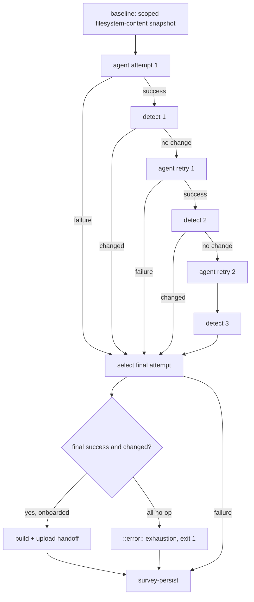

# fix: Record survey success only when the agent changed the wiki, with bounded retries

## Overview

`survey-repo.yaml` records a survey as `success` whenever the agent step exits 0. In the failing run the agent had no `gh` credential. It reported "I could not complete a fresh survey… I made no file changes", exited 0, and the survey was still recorded as a success (`data` commit `47d1f8f`).

This plan changes two things:

- **Stricter success.** A survey counts as success only if the agent's final attempt actually changed the wiki.
- **Bounded retries.** If an attempt succeeds but changes nothing, the job gives the agent up to two more attempts. Hard failures are still never retried. If every attempt ends without changes, the job fails and says so.

## Problem Frame

- **Current rule.** In `survey-persist`, `SURVEY_STATUS` is `success` when the agent step concluded `success` and the wiki commit either succeeded or was skipped.
- **What a false success costs.** It promotes a `pending` repo to `onboarded` and pushes back its next survey (`scripts/repos-metadata.ts`, `recordSurveyResult`).
- **Why "no changes" means "did not run".** The ingest prompt in `survey-repo.yaml` lists required outcomes: update or create the repo page, update the index, and append an ingest summary to `knowledge/log.md`. A survey that finds nothing new still owes the log entry, so a survey that changed nothing didn't do its job. Real survey commits on `data` always touch `log.md`. The false success touched only `metadata/repos.yaml`.
- **The detector gap.** The current change detector (`wiki-baseline` / `wiki-changes`) hashes `git diff` output, so it can't see untracked files, such as a newly created repo page. It's also index-relative: an operation that touches only the git index (staging an edit that already existed at baseline, `git rm --cached`, `git add -N`) flips the hash with zero content change, defeating the retry/exhaustion gate this plan adds.

## Requirements Trace

- R1. `success` requires all of these:
  - the final agent attempt concluded `success`;
  - that attempt's own change detection returned `changed == 'true'`;
  - `survey-repo` succeeded as a job;
  - the privacy recheck succeeded;
  - for a repo with a public entry in `metadata/repos.yaml`, the wiki commit succeeded.
- R2. The gateway announce uses the R1 predicate, and it also still requires `onboarded == 'true'`.
- R3. An attempt that concluded `success` with no wiki changes is retried in the same job, at most 2 times. An attempt that concluded `failure` is never retried.
- R4. If all attempts succeed without changes, the run emits `::error::` and `survey-repo` fails. `survey-persist` then records `failure` exactly once and skips ingest and announce. The fallback stays skipped.
- R5. Downstream consumers read one final attempt: the last attempt that ran, paired with its own detection result. A detection that was missing or failed never falls back to an earlier attempt's positive result.
- R6. Change detection counts content additions, edits, deletions, and renames under the scoped wiki paths — tracked or untracked, git-visible or git-ignored. Index-only operations (staging, unstaging, `git rm --cached`, `git add -N`) never count.
- R7. All three attempts fit inside the job's time budget.
- R8. The use-after-agent credential guard still passes. Its exemption for retries covers only later steps that use the identical pinned agent action with a subset of the first agent step's secrets.
- R9. Comments and solution docs that describe the old success shape are corrected.

## Scope Boundaries

- No change to reconcile cadence or eligibility (`scripts/reconcile-repos.ts`, `next_survey_eligible_at`, the minimum-dispatch floor).
- This does not detect whether a survey is *complete* beyond `changed == 'true'`. For example, an appended "could not survey" log line still passes.
- No retries in any other agent workflow.
- No change to fro-bot/agent's error classification or to the `gh auth login` warning-only behavior.

### Deferred to Separate Tasks

- **Retry cost for pending repos.** A `pending` repo that records `failure` stays eligible on every reconcile run (`reconcile-repos.ts`, the pending threshold path). A repo whose agent keeps exiting 0 without changes could therefore burn three attempts every day. Reconsider pending-failure cooldown only if this shows up in practice.
- **Agent-side logging.** Upstream fro-bot/agent could log the stderr of the failed `gh auth login` rather than just its exit code (`src/services/setup/gh-auth.ts`).

## Context & Research

### Relevant Code and Patterns

- `.github/workflows/survey-repo.yaml`: the three jobs `survey-resolve`, `survey-repo`, and `survey-persist`. Steps involved:
  - `survey-repo`: `wiki-baseline`, `survey-agent`, `wiki-changes`, `wiki-handoff-build`, and the job outputs.
  - `survey-persist`: `record-result`, the announce, and the cancelled/timeout fallback.
- `.github/actions/sync-wiki/action.yaml`: `run_with_retry` is the repo's existing bounded-retry pattern (fixed attempt count, explicit warning/error on exhaustion).
- `scripts/wiki-handoff-core.ts`: `captureWikiBaseline` and `parseGitStatusPorcelainZ` enumerate scoped paths using NUL-safe `git status` — useful reference for NUL-delimited path handling, but sparse and status-dependent by design (it only hashes paths `git status` already reports as changed), not a complete filesystem snapshot. Detection needs the latter.
- `scripts/agent-post-step-credential-guard.test.ts`: `scanAgentJob` finds the first agent step and applies rules (a)–(e). Its non-vacuity assertion expects 6 agent jobs.
- `scripts/survey-repo-workflow.test.ts`, `scripts/fro-bot-workflow.test.ts` (`findStepIndex`), and `scripts/trusted-wiki-env-source-guard.test.ts` parse the workflow YAML and assert on its structure. The fro-bot workflow tests extract `run:` blocks and execute them against a temporary git repo.
- `scripts/check-repo-onboarded.ts`: `onboarded == 'true'` means the repo has a public entry in `metadata/repos.yaml`, whether `pending` or `onboarded`. Otherwise the check fails closed to `false`.
- fro-bot/agent v0.115.1 (`930ffc9f`):
  - The action has a `timeout` input, which defaults to 30 minutes of execution.
  - Sessions continue through the `dispatch-<run_id>` logical key, and no input can force a fresh session.
  - Provider auth, quota, and recoverable LLM errors with no delivery target all fail the step (`src/harness/phases/finalize.ts`).

### Institutional Learnings

- `docs/solutions/runtime-errors/autonomous-pipeline-silent-failures-2026-04-19.md`: the status expression must include every required step.
- `docs/solutions/security-issues/survey-workflow-side-privacy-gate-2026-05-16.md`: the recheck gates every write and emit path.
- `docs/solutions/best-practices/make-failure-boundaries-and-predicates-explicit-2026-08-25.md`: name the fail-hard vs. fail-soft contract of each step. The retry is the only fail-soft point, and it sits before the trust boundary.
- `docs/solutions/workflow-issues/jq-falsy-coalesce-trap-in-shell-gates-2026-05-17.md`: compare booleans strictly and never use `//` fallbacks.
- `docs/solutions/best-practices/test-the-integration-seam-not-the-endpoints-2026-07-06.md`: test where attempt, detection, and persist meet.
- `docs/plans/2026-06-09-001-fix-cadence-contrib-digest-floor-plan.md`: the fallback record is guarded against double-recording by `steps.record-result.outcome != 'success'`.
- No touched module is in `stryker.config.json`'s `mutate` list.

### External References

- Linux procfs: reading `/proc/<pid>/environ` needs only a `PTRACE_MODE_READ` check, which Yama `ptrace_scope=1` doesn't restrict. OpenCode's `external_directory` is a policy on tool use, not a sandbox for bash. Together these support the guard exemption in KTD7.

## Prior-Art Survey

```json
{
  "schema_version": 2,
  "verdict": "extend",
  "scope": ".github/workflows, .github/actions, scripts",
  "freshness": {
    "vcs_reference": "73397079976ee88abd3f8034baadef0d1eee41f3"
  },
  "budget": {
    "max_search_passes": 3,
    "max_candidate_inspections": 5,
    "exhausted": false
  },
  "candidates": [
    {
      "path_or_symbol": ".github/actions/sync-wiki/action.yaml#run_with_retry",
      "description": "bounded retry around git ls-remote and git fetch of origin data, with explicit exhaustion handling",
      "disposition": "reuse"
    },
    {
      "path_or_symbol": ".github/workflows/survey-repo.yaml#survey-agent",
      "description": "single-shot fro-bot/agent invocation that edits the wiki working tree and emits steps.survey-agent.conclusion",
      "disposition": "extend"
    },
    {
      "path_or_symbol": ".github/workflows/survey-repo.yaml#wiki-changes",
      "description": "hashes the scoped knowledge/ git diff against a pre-agent baseline and sets changed=true|false",
      "disposition": "extend"
    },
    {
      "path_or_symbol": ".github/workflows/survey-repo.yaml#wiki-handoff-build",
      "description": "packages the handoff only when changed == 'true' and onboarded == 'true'",
      "disposition": "reuse"
    },
    {
      "path_or_symbol": ".github/workflows/survey-repo.yaml#Record survey result (cancelled/timeout fallback)",
      "description": "second record step that fires only when the primary record did not succeed and the trusted recheck passed",
      "disposition": "reuse"
    }
  ]
}
```

## Key Technical Decisions

- **KTD1: Success means the final attempt changed the wiki.** Rationale: the prompt requires a log entry on every survey, so zero changes means the survey did not run. Every other signal the agent exposes misses this incident. `invocation-outcome` comes from delivery and verification facts, so a clean exit after the model admits it couldn't finish still counts as `succeeded`.
- **KTD2: One predicate for record and announce.** The predicate: final attempt `success`, its detection `changed == 'true'`, `needs.survey-repo.result == 'success'`, recheck succeeded, and wiki commit `success` whenever `onboarded == 'true'`. Rationale: checking the job result closes the path where the handoff build or upload fails and the commit is merely `skipped`. Requiring the commit to succeed when onboarded closes "changes made but discarded".
- **KTD3: Detection hashes complete scoped filesystem content, not a git-relative diff.** Baseline and detection share one implementation. It walks the filesystem under `knowledge/index.md`, `knowledge/log.md`, and `knowledge/wiki`, hashing every path that currently exists there (tracked, untracked, or git-ignored) regardless of index state, and hashes the sorted `[path, contentHash]` set. Rationale: the success gate now depends on this signal, a first survey creates an untracked repo page, and `sync-wiki` restoring `data` into the worktree only (never the index) means an index-relative diff can flip on a pure index operation with zero content change. The CLI contract (`baseline`/`detect`, `hash=`, `changed=`, `WIKI_CHANGE_BASELINE_HASH`) and single-baseline-per-job lifetime are unchanged. This is the third copy of the detection logic (baseline plus two new detects), so it moves into one script instead of four inline shell blocks.
- **KTD4: Retries are explicit duplicated steps, N = 2.** Each retry runs only if `success() && <prev agent>.conclusion == 'success' && <prev detect>.outputs.changed == 'false'`. No `continue-on-error` anywhere in the chain. Rationale: this matches the repo's existing duplicated-step fallback pattern. A shell loop around a packaged action would depend on the action's lifecycle internals, and job re-runs would break the baseline, artifact, and record-once semantics. The repo has no YAML anchors; explicit steps keep the workflow-shape tests simple.
- **KTD5: The retry prompt is the trusted ingest prompt plus a static prefix.** The prefix says the previous attempt ended without the required wiki changes, that they are mandatory, and that if the agent truly cannot complete it must state why. Nothing from a previous attempt's output is interpolated. The session continues through `dispatch-<run_id>`, which is accepted and documented. The retry keeps useful context and also any injected context. A fresh session on the same mutable runner would not be a security boundary anyway.
- **KTD6: No workspace reset between attempts.** An attempt judged a no-op left no change inside the scoped paths, and paths outside the scope never enter the handoff (allowlist validation in `wiki-handoff-core.ts`). A reset adds risk and doesn't fix anything.
- **KTD7: Narrow guard exemption.** A later step in an agent job may reference secrets only if its `uses:` string is identical to the first agent step's (same action, same pinned SHA), and its secret references are a subset of that step's. Rationale: attempt 1's model can already read the provider credential from `~/.local/share/opencode/auth.json` (0600, same user) and the config from `~/.config/opencode/opencode.json`, so re-running the same action with the same secrets exposes nothing new. A different action, a different SHA, or an extra secret would, and those stay violations. The retry may run action code that attempt 1 tampered with in `_actions`. That code receives only credentials the model already held, and its output is still untrusted: it reaches `data` only through the trusted-side handoff validation. So tampering gains the attacker nothing beyond what attempt 1 already allowed.
- **KTD8: Final-attempt selection is a dedicated `!cancelled()` step.** It picks the last attempt whose conclusion isn't `skipped`, and pairs it with that attempt's own detection output. Rationale: `"skipped"` is truthy, so chaining `||` would pick the wrong attempt.
- **KTD9: Time budget.** Each attempt runs with a 20-minute agent `timeout` and a step `timeout-minutes` of 23. The extra 3 minutes cover OpenCode bootstrap and the action's post phase, which the agent `timeout` does not include. The `survey-repo` job timeout goes from 30 to 75 minutes, which fits 3 × 23 plus setup and handoff. Rationale: the job is 30 minutes today and the agent default is 30, so a retry could never run.

## Open Questions

### Resolved During Planning

- **Does `onboarded == 'false'` mean pending?** No. It means the repo has no public entry at all, and `pending` repos are `onboarded == 'true'` and get a handoff. So "changes made, commit skipped" happens only when there's no entry (the record is a no-op) or when the build or upload failed (covered by the job-result condition).
- **Reset between retries?** No (KTD6).
- **Force a fresh session on retry?** No input exists for it, and it wouldn't be a boundary (KTD5).

### Deferred to Implementation

- **Units of the agent `timeout` input** (minutes vs. milliseconds): check them in the pinned `action.yaml`.
- **Name and location of the detection script:** follow the naming in `scripts/wiki-handoff-*.ts`.
- **Exact retry prefix wording:** it must stay static text in the workflow.

## High-Level Technical Design

> *This illustrates the intended approach and is directional guidance for review, not implementation specification. The implementing agent should treat it as context, not code to reproduce.*



| Final state | `survey-repo` result | Record | Status | Ingest / announce | Fallback |
|---|---|---|---|---|---|
| Attempt 1, 2, or 3 succeeds with changes | success | primary | success | run | skipped |
| All 3 no-op | failure (exhaustion) | primary | failure | skipped | skipped |
| Attempt N concludes failure | failure | primary | failure | skipped | skipped |
| Detection fails after an attempt succeeds | failure | primary | failure | skipped | skipped |
| Handoff build/upload fails | failure | primary | failure | skipped | skipped |
| Recheck fails | any | none | none | skipped | skipped |
| Cancelled or job timeout during `survey-repo` | cancelled | fallback | failure | skipped | runs |

## Implementation Units

- [x] **Unit 1: Detection hashes scoped filesystem content, not an index-relative diff**

**Goal:** Baseline and every detection step use one implementation that hashes the actual bytes under the scoped paths on disk — additions, edits, deletions, and renames all count, and no git-index-only operation (staging, unstaging, `git rm --cached`, `git add -N`) can ever flip the result.

**Requirements:** R6

**Dependencies:** None

**Files:**
- Create: `scripts/wiki-change-detect-core.ts`, `scripts/wiki-change-detect.ts`
- Modify: `.github/workflows/survey-repo.yaml` (`wiki-baseline`, `wiki-changes`, plus the comments describing them)
- Test: `scripts/wiki-change-detect.test.ts`, `scripts/survey-repo-workflow.test.ts`

**Approach:**
- One entry point with a baseline mode, which writes a hash output, and a detect mode, which compares against the baseline hash and writes `changed=true|false`.
- Walk the filesystem under the scoped roots (no `.md` filter) and hash a deterministic, unambiguous serialization of the sorted `[relativePath, sha256(bytes)]` set for every path that currently exists — git tracked/untracked/ignored status is irrelevant, only bytes on disk.
- Reject symlinks (the file itself or any ancestor within the scoped subtree, checked with `lstat` before descending or reading), dangling links, and non-regular entries; each fails capture rather than counting as a change.
- Fail closed: a missing scope root is absent (not an error); any other stat/enumerate/read error — including a file disappearing mid-capture — exits non-zero and writes no `changed=true`. The CLI keeps a bounded, content-free `git rev-parse --is-inside-work-tree` check so running outside a git work tree still fails the way it always has.

**Patterns to follow:** the `lstat`-before-read symlink rejection in `validateAndApplyWikiHandoff` (`scripts/wiki-handoff-core.ts`); the `run:` extract-and-execute tests in `scripts/fro-bot-workflow.test.ts`.

**Test scenarios:**
- Happy path: no edits since baseline → `changed=false`.
- Happy path: a tracked edit to `knowledge/log.md` → `changed=true`.
- Edge case: only a new untracked `knowledge/wiki/repos/<slug>.md` → `changed=true`.
- Edge case: a file that was already untracked at baseline and is unchanged → `changed=false`; the same file edited → `changed=true`.
- Edge case: a change outside the scoped paths only → `changed=false`.
- Edge case: a rename counts as a change even when the bytes are identical (the path set changed).
- Edge case: a change to a git-ignored file inside scope still counts.
- Index-only cases (the false-positive this unit fixes): staging an edit that already existed at baseline, `git rm --cached`, `git add -N`, and a normal `git add` with no content edit all report `changed=false`.
- Error path: running outside a git repo, a missing/malformed baseline hash, a symlink (file or ancestor) in scope, a dangling link, or a non-regular entry → exits non-zero and writes no `changed=true`.
- Integration: the workflow runs the script for the baseline and for every detection step (asserted by YAML shape), and a real end-to-end run through the retry/exhaustion gate confirms three index-only no-op attempts still trigger two retries and exhaustion.

**Verification:** Every scenario passes, no inline `git diff`/`git status` hashing remains in the survey workflow, the detector-to-exhaustion integration test in `scripts/survey-repo-workflow.test.ts` passes, and the GHAS `js/unnecessary-use-of-cat` findings in `scripts/wiki-change-detect.test.ts` are cleared (`readFileSync` in place of shelling out to `cat`).

- [x] **Unit 2: Guard exemption for retries of the same agent action**

**Goal:** `scanAgentJob` accepts later steps that re-invoke the identical pinned agent action with a subset of the first agent step's secrets, and still rejects everything else.

**Requirements:** R8

**Dependencies:** None

**Files:**
- Modify: `scripts/agent-post-step-credential-guard.test.ts`

**Approach:**
- Record the first agent step's exact `uses:` string and its set of secret references.
- Exempt a later step only if its `uses:` matches exactly and its references are a subset.
- Rule (d), which forbids `create-github-app-token` anywhere in the job, is unchanged. Keep the non-vacuity count.

**Patterns to follow:** the existing fixture-driven `scanAgentJob` tests in the same file.

**Test scenarios:**
- Happy path: a second step with the same `fro-bot/agent@<sha>` and the same secrets → no violation.
- Happy path: a second step with the same action and a strict subset of the secrets → no violation.
- Error path: same action, different SHA → violation.
- Error path: same action and SHA plus an extra secret (e.g. `GATEWAY_WEBHOOK_SECRET`) → violation that names the secret.
- Error path: a different action carrying the first step's secrets → violation.
- Integration: the real repo has 0 violations after Unit 3, and the agent-job count is still 6.

**Verification:** The new fixtures pass. Temporarily adding an extra secret to a retry step makes the guard fail and name the step.

- [x] **Unit 3: Bounded retries, final-attempt selection, exhaustion, and time budget in `survey-repo`**

**Goal:** The agent gets up to 2 retries after a no-op success. The job exposes one final attempt and fails loudly when every attempt is a no-op.

**Requirements:** R3, R4, R5, R7

**Dependencies:** Unit 1, Unit 2

**Files:**
- Modify: `.github/workflows/survey-repo.yaml` (`survey-repo` job)
- Test: `scripts/survey-repo-workflow.test.ts`

**Approach:**
- The sequence is attempt 1 → detect 1 → retry 1 → detect 2 → retry 2 → detect 3. Each retry and each detect is gated as in KTD4.
- Retry steps copy attempt 1's `with:` block, except for the prompt (KTD5) and the explicit `timeout`.
- The selection step (KTD8) writes the final conclusion and `changed`.
- The exhaustion step runs when the final conclusion is `success` and `changed == 'false'`. It emits `::error::` and exits 1.
- Handoff build and upload run once, gated on the final selection.
- Job outputs: `agent-conclusion` becomes the final conclusion. Add `wiki-changed`. Keep `wiki-artifact-ready`, `onboarded`, `target-*`.
- Timeouts per KTD9.

**Execution note:** Write the structure tests first. The conditions are the whole behavior here.

**Patterns to follow:** `findStepIndex` ordering assertions; the existing `survey-persist` fallback-gating tests.

**Test scenarios:**
- Happy path: retry 1's `if:` requires attempt 1 `conclusion == 'success'` and detect 1 `changed == 'false'`; retry 2 is gated the same way on retry 1 and detect 2.
- Error path: no retry step can run after an attempt that concluded `failure`. Checked by asserting that each retry condition names the previous attempt's `conclusion == 'success'` and contains no status function other than `success()`.
- Happy path: each detect step runs only if its own attempt concluded `success`.
- Edge case: selection runs under `!cancelled()`, picks the last attempt that isn't `skipped`, and takes `changed` only from that attempt's own detect step.
- Edge case: selection with the final attempt `success` and its detect `failure`/missing → `changed` is not `true`.
- Happy path: the exhaustion step's `if:` requires a final `success` and final `changed == 'false'`, and its `run:` emits `::error::` and exits non-zero (extract and execute).
- Happy path: handoff build is gated on the final selection plus `onboarded == 'true'`, and runs once.
- Edge case: the retry prompt is built from `steps.ingest-prompt.outputs.*` plus static text only. No `steps.<agent>.outputs.*` reference and no response-file content.
- Edge case: no step in the chain sets `continue-on-error`.
- Happy path: the job's `timeout-minutes` is ≥ 3 × per-attempt `timeout-minutes` + setup headroom, and every agent step sets an explicit `timeout`.

**Verification:** Tests pass, actionlint is clean, and the Unit 2 guard reports 0 violations with 6 agent jobs.

- [x] **Unit 4: Success gate in `survey-persist` and stale comments**

**Goal:** Record and announce use the KTD2 predicate, and the comments describe it.

**Requirements:** R1, R2, R4, R9

**Dependencies:** Unit 3

**Files:**
- Modify: `.github/workflows/survey-repo.yaml` (`survey-persist`: `record-result` env and `if:`, the announce `if:`, the fallback if needed, and the comment block above `Record survey result`)
- Test: `scripts/survey-repo-workflow.test.ts`

**Approach:**
- `SURVEY_STATUS` becomes `success` only under KTD2. Otherwise it is `failure`.
- Announce uses the same predicate plus `onboarded == 'true'`.
- The primary record still runs whenever the agent ran and the recheck passed, so exhaustion and hard failures record `failure` exactly once. The fallback guard (`record-result.outcome != 'success'`) is unchanged.

**Patterns to follow:** the existing record/fallback condition tests; `docs/solutions/runtime-errors/autonomous-pipeline-silent-failures-2026-04-19.md`.

**Test scenarios:**
- Happy path: the `SURVEY_STATUS` expression references the final conclusion, `wiki-changed == 'true'`, `needs.survey-repo.result == 'success'`, and the onboarded-commit condition.
- Error path: dropping any one term makes a test fail. Show non-vacuity for the `wiki-changed` term.
- Happy path: the announce `if:` has the same terms plus `onboarded == 'true'`.
- Integration: with `survey-repo` failed by exhaustion, the primary record condition evaluates to run, the fallback condition evaluates to skip, and ingest and announce evaluate to skip. Assert the conditions with an expression-level fixture table rather than string matching where practical.
- Integration: when the job is cancelled during `survey-repo`, the fallback runs and the primary record doesn't (existing behavior is preserved).
- Edge case: a non-onboarded target with changes → the commit is skipped, and the predicate doesn't require the commit.

**Verification:** The tests pass, and the comment block accurately describes success and failure.

- [x] **Unit 5: Refresh stale solution docs**

**Goal:** Solution docs that quote the old success expression now show the new gate.

**Requirements:** R9

**Dependencies:** Unit 4

**Files:**
- Modify: `docs/solutions/runtime-errors/autonomous-pipeline-silent-failures-2026-04-19.md`, `docs/solutions/security-issues/survey-workflow-side-privacy-gate-2026-05-16.md`, `docs/solutions/best-practices/byte-exact-gateway-signing-and-fail-soft-telemetry-2026-06-04.md`

**Approach:** Use `ce:compound-refresh` to update the quoted gate expressions and add a short dated note. Don't rewrite the incident narratives.

**Test expectation:** none. This is docs only.

**Verification:** The quoted expressions match the workflow, and the frontmatter is still valid.

## System-Wide Impact

- **Interaction graph:** Only `survey-repo.yaml` changes behavior. Reconcile dispatches surveys unchanged, and `record-survey-result.ts` is unchanged.
- **Error propagation:** An agent failure fails the job with no retry, as today. An exhausted run of no-op attempts now also fails the job, which shows up in Actions failure notifications.
- **State lifecycle:** More surveys will record `failure`. A pending repo stays pending and is retried on the next reconcile run (see Deferred). An onboarded repo waits for its channel or for the 7-day floor.
- **Unchanged invariants:**
  - The privacy recheck gates every write and emit.
  - App-only `data` writes.
  - The trusted `WIKI_*` sources.
  - The fallback's double-record guard.
  - `survey-resolve` runs before the agent.

## Risks & Dependencies

| Risk | Mitigation |
|---|---|
| Tool-level failures that don't fail the step, like the `gh auth` warning, burn all 3 attempts | Accepted. Worst case is 3× agent cost for one run, and the run then fails loudly instead of recording a false success. |
| Up to 3× cost per daily run for a pending repo that is consistently a no-op | Deferred cadence review. The run failure is visible. |
| The session continues across retries and keeps injected context | Documented (KTD5). The trusted persist side still validates the handoff. |
| The guard exemption gets widened later | Negative fixtures pin "same `uses:` and subset of secrets". |
| `changed == 'true'` is only a liveness signal | Scoped explicitly. Detecting completeness is a non-goal. |

## Documentation / Operational Notes

- The first dispatch after merge verifies success-with-changes end to end. To check exhaustion on a live run, temporarily break the agent's `gh` auth in a sandbox repo. If that's impractical, rely on the structural tests.

## Sources & References

- Incident run: https://github.com/fro-bot/.github/actions/runs/36136553521 (attempt 2); false-success commit `47d1f8f` on `data`.
- Verification run after the `read:org` fix: https://github.com/fro-bot/.github/actions/runs/36138989022
- Related PRs: #3926, #3928
- fro-bot/agent v0.115.1 `930ffc9fed93d5a6e5f2c0f9a51b4bc2fcf1e15e`: `src/services/setup/gh-auth.ts`, `src/harness/phases/finalize.ts`, `src/services/setup/auth-json.ts`
