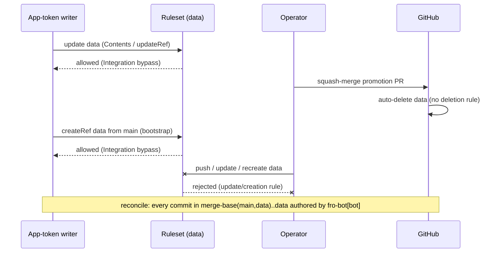

# feat: Make the data branch writable only by the Fro Bot App

## Overview

`data` is where autonomous state is recorded, and it's the trust boundary the wiki privacy and tamper controls depend on. PR #3926 moved every `data` writer to a GitHub App installation token. This plan turns that convention into an enforced rule and tightens how violations are detected:

- **Prevention.** A repository ruleset on `refs/heads/data` allows only the Fro Bot App to update or create the branch, and blocks force pushes.
- **Detection.** Reconcile's tamper check requires every commit since the last reseed to be App-authored. Today it only checks the tip commit, and it also accepts the `fro-bot` user.

The two changes ship as two PRs. The detection change is gated on the next promotion reseeding `data`.

## Problem Frame

- **No enforcement.** Nothing stops a non-App actor from writing `data`. The classic `FRO_BOT_PAT` has write access to this repo, and so does the repo owner. The sole-writer rule (`reconcile-repos.ts` `verifyDataBranchIntegrity`) only detects violations after the fact.
- **Detection is weak in two ways.** It checks the tip only, so non-App commits below an App-authored tip go unseen. And it accepts `fro-bot` (the user) as well as `fro-bot[bot]` (the App).
- **The promotion lifecycle depends on deleting `data`.**
  - The repo sets `delete_branch_on_merge: true` and only allows squash merges.
  - When the operator merges the `data` → `main` promotion PR, GitHub deletes `data`. The next writer's `bootstrapDataBranch` then reseeds it from `main`, as `fro-bot[bot]`, using `createCommit` + `createRef`. For example, `29e0e9d chore(data): restore data branch` was reseeded on top of squash `cbb5a53` from #3847.
  - So a `deletion` rule would leave `data` holding history that was already squash-promoted. The next promotion PR would replay changes that are already on `main`, and they would conflict.

## Requirements Trace

- R1. Only the Fro Bot App can update `data` (`update` rule).
- R2. Only the Fro Bot App can create `data` (`creation` rule), so a deleted `data` can't be recreated with injected content.
- R3. Force pushes to `data` are blocked (`non_fast_forward`).
- R4. Deleting `data` stays possible, so auto-delete on merge and the App reseed keep working.
- R5. The App is the only bypass actor. There is no owner, admin, or role bypass.
- R6. The ruleset is declared as code in `.github/settings.yml`, and each settings run corrects any drift.
- R7. The tamper check requires every commit in `merge-base(main, data)..data` to have author login `fro-bot[bot]`. A null login fails closed. A mismatch keeps the existing `DATA_BRANCH_TAMPER` behavior and the `reconcile:integrity-alert` issue.
- R8. The tightened check merges only after `data` has been reseeded and the range contains zero non-App commits.
- R9. Docs that describe `fro-bot` (the user) as an allowed `data` writer are corrected.
- R10. Every reconcile run checks that the effective rules on `data` still match the declared ruleset. A missing or weakened ruleset fails as tamper.

## Scope Boundaries

- No `deletion` rule (see R4 and Problem Frame).
- No change to `main` protection, the promotion workflow, `delete_branch_on_merge`, or the merge method.
- No change to how any writer writes. Every writer already uses an App token through the Contents API or the Git Data API with `force: false`.
- No replacement of the classic `FRO_BOT_PAT`, and no change to agent credential provisioning.
- Historical plan docs under `docs/plans/` are records and stay as they are.

### Deferred to Separate Tasks

- **Scoping App-token mints.** Workflows that mint Fro Bot App tokens for this repo could pin `repositories:` and `permissions:` at mint time. The ruleset bypass trusts anyone holding the App private key, whatever mint scoping says, so this is separate hardening.
- **The promotion auto-delete race.** Commits that land on `data` between the operator's merge click and the auto-delete are lost. This window exists today and the ruleset doesn't change it.
- **`findExistingPullRequest` returning a closed promotion PR** for the current `data` tip. This is pre-existing and unrelated.

## Context & Research

### Relevant Code and Patterns

- `scripts/reconcile-repos.ts`: `EXPECTED_AUTHORS`, `verifyDataBranchIntegrity` (a `repos.getBranch` tip-author check), `fileIntegrityAlert`, and `DATA_BRANCH_TAMPER`. A missing `data` returns `skipped-no-data-branch`, and a fresh bootstrap skips the check.
- `data` writers, all using App tokens:
  - `scripts/commit-metadata.ts` (Contents API), used by `update-metadata`, `record-survey-result`, `handle-invitation`, and `reconcile-repos`.
  - `packages/wiki-write-core/src/wiki-ingest.ts` (`updateRef`, `force: false`), also used by `wiki-repair`.
  - `packages/wiki-write-core/src/data-branch-bootstrap.ts` (`createRef`, with 422 race recovery).
  - `merge-data.yaml` / `merge-data-pr.ts` (`pulls.updateBranch` on the promotion PR).
- `.github/settings.yml` extends `common-settings.yaml`. It declares `main` protection and no rulesets. `common-settings.yaml` has no `rulesets` key, so under `_extends` a local `rulesets:` array doesn't replace anything.
- bfra-me/.github `update-repository-settings` at pinned v4.33.0 (`6f33c678`) has a `rulesets` plugin. Every entry needs a `name`, and other fields pass through as they are. It creates missing rulesets, updates matching ones by lowercased name, and **deletes undeclared rulesets**. The repo has no rulesets today.
- `scripts/settings-labels-effective-set.test.ts` is the existing test pattern for asserting settings shape.
- `scripts/reconcile-repos.test.ts` tests the tamper check: the `DATA_BRANCH_TAMPER` error, the alert issue, and the bootstrap skip.

### Institutional Learnings

- `docs/solutions/integration-issues/bootstrap-data-branch-before-autonomous-writes-2026-05-09.md`: reseeding after a promotion is by design, and the restore commit is authored by `fro-bot[bot]`.
- `docs/solutions/integration-issues/merge-data-pr-github-422-race-recovery-2026-05-02.md`: `pulls.updateBranch` on the promotion PR has to keep working. It runs as the App.
- `docs/solutions/best-practices/credential-mint-time-permission-scoping-2026-06-22.md`: a second credential narrows rotation, not permissions. That's why mint scoping is deferred.
- `docs/solutions/runtime-errors/autonomous-pipeline-silent-failures-2026-04-19.md`: describes the tamper check as accepting `fro-bot` / `fro-bot[bot]` at the tip. It goes stale once Unit 3 lands.

### External References

- GitHub repository rulesets. They're available on public personal repos. Rules `update`, `non_fast_forward`, and `creation` exist. `bypass_actors` takes `actor_type: Integration`, whose `actor_id` is the numeric App ID. `evaluate` enforcement is Enterprise-only, so the ruleset goes straight to `active`. Managing rulesets requires `administration: write`. `GET /repos/{o}/{r}/rules/branches/{branch}` lists active rules. Rule suites (`GET /repos/{o}/{r}/rulesets/rule-suites`) report evaluations. See https://docs.github.com/en/rest/repos/rules.
- The docs don't state whether `update` treats Contents API writes, Git Data API `updateRef`, and `git push` identically. Unit 2 verifies this on real writers.
- Commit `author.login` isn't authenticated App provenance: the ruleset is the control, and the tamper check is a backstop.

## Prior-Art Survey

```json
{
  "schema_version": 2,
  "verdict": "extend",
  "scope": "fro-bot/.github repo root",
  "freshness": {
    "vcs_reference": "3c34eee9d476e3e28b9e8d7a6e5de9a103a9f6f0"
  },
  "budget": {
    "max_search_passes": 3,
    "max_candidate_inspections": 10,
    "exhausted": false
  },
  "candidates": [
    {
      "path_or_symbol": "scripts/reconcile-repos.ts#verifyDataBranchIntegrity",
      "description": "Reads the data branch tip with repos.getBranch, accepts fro-bot or fro-bot[bot], and escalates via DATA_BRANCH_TAMPER plus a reconcile:integrity-alert issue on mismatch.",
      "disposition": "extend"
    },
    {
      "path_or_symbol": ".github/settings.yml",
      "description": "Declarative settings-as-code applied by bfra-me update-repository-settings; declares main protection and labels but no rulesets.",
      "disposition": "extend"
    },
    {
      "path_or_symbol": "packages/wiki-write-core/src/data-branch-bootstrap.ts#bootstrapDataBranch",
      "description": "Reseeds a missing data ref from main with a fro-bot[bot]-authored same-tree commit and createRef, with 422 race recovery.",
      "disposition": "reuse"
    },
    {
      "path_or_symbol": "scripts/commit-metadata.ts#commitMetadata",
      "description": "Metadata writer that bootstraps data when needed, rejects main, and writes via the Contents API with the caller's App token.",
      "disposition": "reuse"
    },
    {
      "path_or_symbol": "packages/wiki-write-core/src/wiki-ingest.ts#commitWikiChanges",
      "description": "Wiki writer that rejects main, bootstraps data, and advances the ref with git.updateRef(force:false).",
      "disposition": "reuse"
    },
    {
      "path_or_symbol": "scripts/check-wiki-authority.ts#checkWikiAuthority",
      "description": "PR guard allowing Fro Bot identities to touch guarded files only on the data branch.",
      "disposition": "reuse"
    }
  ]
}
```

## Key Technical Decisions

- **KTD1: The rules are `update`, `non_fast_forward`, and `creation`. There is no `deletion` rule.**
  - `creation` closes the recreate-with-injected-content path.
  - Deleting `data` has to stay possible, because promotion relies on auto-delete followed by an App reseed. A human deleting `data` can lose state that hasn't been promoted yet. That's an availability loss, not an integrity one.
- **No negative write probe.** The operator decided against one. A non-App write attempt could land a non-App commit on `data`, and non-fast-forward rules would block undoing it. Verification relies on three things: the effective-rules API, App writers still succeeding, and the rule-suites log.
- **KTD2: The App is the only bypass actor, with `bypass_mode: always`.** The operator decided this. The repo owner gets no bypass. Recovery means editing `.github/settings.yml` on `main`, which the ruleset doesn't cover.
  - Anyone with admin on this repo can still edit or delete the ruleset. That includes the owner and the classic `fro-bot` PAT the agent uses for `gh`. The ruleset stops ordinary writes. It doesn't stop an admin from removing it first.
  - Replacing the PAT is out of scope. What the plan adds is detection: reconcile checks the effective rules on every run (R10, Unit 3), and each settings run re-applies the declared ruleset.
- **KTD3: Settings-as-code.** The ruleset is declared in `.github/settings.yml` through the bfra-me `rulesets` plugin. Changes get reviewed in PRs, and each settings run corrects drift. The plugin deletes rulesets that aren't declared, which is acceptable because none exist and this repo manages all of its settings as code.
- **KTD4: The numeric App ID gets committed.** App IDs aren't secret. The `fro-bot[bot]` user ID (`109017866`) is a different number and must not be used.
- **KTD5: The tamper check covers `merge-base(main, data)..data`.** Every commit in that range must have author login exactly `fro-bot[bot]`. It uses the compare API, paginated. Any non-App or null login fails closed.
  - The range starts at the latest reseed, so it holds exactly the unpromoted history.
  - Right after a reseed, the range is only the App-authored bootstrap commit.
  - `main` gaining commits doesn't move the anchor, and neither does closing the promotion PR. `updateBranch` merging `main` into `data` moves it forward, but every commit made only on `data` stays in `A..B`. The range may cover more than the unpromoted history, but never less.
  - If `data` is missing, the check keeps skipping as it does today.
- **KTD6: Two PRs, and the tamper change waits for a reseed.** Today `data` has 98 commits since the 09-06 reseed. The ones before 09-25 were authored by the `fro-bot` user under the old PAT. The ruleset PR ships now. The tamper PR merges only after a promotion reseeds `data` and a live check shows the range has zero non-App commits. That avoids adding grandfather code that would soon be dead.

## Open Questions

### Resolved During Planning

- **Does the settings plugin support rulesets?** Yes, as of v4.33.0 (KTD3).
- **Would `deletion` break promotion?** Yes (Problem Frame, KTD1).
- **Is there existing state recording the last verified tip?** No. The merge-base anchor removes the need for one (KTD5).

### Deferred to Implementation

- **The numeric App ID.** It's the value of the `APPLICATION_ID` secret, which the operator supplies, or it can be read from `GET /repos/fro-bot/.github/installation` (`app_id`) using an App JWT.
- **Which token the settings workflow uses, and whether it has `administration: write`.** It already manages `main` branch protection, so it very likely does. The reusable workflow mints the token either via `client-id` or via `app-id`, depending on `vars.APPLICATION_CLIENT_ID`. Confirm which from the first settings run.
- **Whether reconcile's App token can read `bypass_actors`.** `GET /repos/{o}/{r}/rules/branches/data` returns each active rule with its `ruleset_id`. `bypass_actors` may only come back from `GET /repos/{o}/{r}/rulesets/{id}` for callers with administration access. If the token can't read them, R10 checks the three rules only and says so in the alert text.
- **Compare API pagination mechanics in the Octokit version pinned here** (`paginate` over `compareCommitsWithBasehead`, or page by page).

## High-Level Technical Design

> _This illustrates the intended approach and is directional guidance for review, not implementation specification. The implementing agent should treat it as context, not code to reproduce._



## Implementation Units

### PR A2a: ruleset and docs

- [x] **Unit 1: Declare the `data` ruleset**

**Goal:** `.github/settings.yml` declares the App-only ruleset, and a test pins its shape.

**Requirements:** R1–R6

**Dependencies:** The App ID (see Deferred to Implementation)

**Files:**

- Modify: `.github/settings.yml`
- Create: `scripts/settings-data-ruleset.test.ts` (or extend `scripts/settings-labels-effective-set.test.ts` if shared parsing helpers make that cleaner)

**Approach:**

- Add a top-level `rulesets:` entry:
  - a stable `name`
  - `target: branch`, `enforcement: active`
  - `conditions.ref_name.include: [refs/heads/data]`, `exclude: []`
  - rules `update`, `non_fast_forward`, `creation`
  - a single bypass actor: `actor_type: Integration`, `actor_id: <App ID>`, `bypass_mode: always`
- Add a one-line comment explaining why `deletion` is left out.

**Patterns to follow:** `scripts/settings-labels-effective-set.test.ts`, which parses settings with `yaml` and asserts exactly.

**Test scenarios:**

- Happy path: exactly one ruleset targets `refs/heads/data`, with enforcement `active`.
- Happy path: the rule types are exactly `{update, non_fast_forward, creation}`.
- Edge case: no `deletion` rule is present. The assertion message names the promotion auto-delete dependency.
- Happy path: there is exactly one bypass actor, `Integration` with `bypass_mode: always`, and its `actor_id` is a positive integer not equal to `109017866` (the bot user ID).
- Error path: no `RepositoryRole`, `User`, `Team`, `OrganizationAdmin`, or `DeployKey` bypass actor is present.
- Edge case: `common-settings.yaml` declares no `rulesets`, so a base array can't silently change what's effective.

**Verification:** The tests pass. Temporarily adding a `deletion` rule or an admin bypass makes a test fail.

- [x] **Unit 2: Correct the sole-writer docs and verify live**

**Goal:** The docs say `data` is App-only and describe the ruleset. The applied ruleset is verified on real writes.

**Requirements:** R6, R9

**Dependencies:** Unit 1

**Files:**

- Modify: `metadata/README.md` (sole-writer and trust-boundary wording)
- Modify: `README.md`, only where it describes who may write `data`
- Modify: `scripts/check-wiki-authority.ts` `formatBlockMessage` text, only if it implies anything other than the App can land `data` edits

**Approach:**

- Reword the docs only. Don't change guard logic.
- After merge (an operational step, recorded in the PR):
  - Confirm the settings run applied the ruleset.
  - Confirm `GET /repos/fro-bot/.github/rules/branches/data` lists the three rules.
  - Dispatch one Contents-API writer (e.g. `update-metadata`) and one Git-Data-API writer (e.g. a survey or wiki ingest), and confirm each lands a `fro-bot[bot]` commit.
  - Check rule suites for rejected evaluations.
  - Don't attempt a non-App write (see KTD1).
  - The other two writer paths get exercised naturally at the next promotion cycle: `pulls.updateBranch`, when the promotion PR is `BEHIND`, and bootstrap `createRef`, after the auto-delete. Confirm both succeed as `fro-bot[bot]`.

**Test expectation:** none. This is docs plus operational verification.

**Verification:** No doc still describes the `fro-bot` user as a `data` writer. The live checks above pass.

### PR A2b: tamper range check (gated)

- [ ] **Unit 3: App-only range tamper check**

**Goal:** `verifyDataBranchIntegrity` verifies every commit since the last reseed and accepts only `fro-bot[bot]`. It also verifies that the effective rules on `data` still match the declared ruleset.

**Requirements:** R7, R8, R10

**Dependencies:** PR A2a merged. A promotion has reseeded `data`. A live check shows zero non-App commits in `merge-base(main, data)..data`.

**Files:**

- Modify: `scripts/reconcile-repos.ts`
- Test: `scripts/reconcile-repos.test.ts`
- Modify: `docs/solutions/runtime-errors/autonomous-pipeline-silent-failures-2026-04-19.md` (refresh the stale tamper-check description, using `ce:compound-refresh` rules)

**Approach:**

- Replace `EXPECTED_AUTHORS` with a single App login.
- Resolve the merge base, then page through the range's commits. On the first commit whose author login isn't exactly `fro-bot[bot]` (including null), file the existing alert and throw `DATA_BRANCH_TAMPER`. The alert names the offending SHA and login.
- Keep the existing behavior for a missing `data` and for skipping on a fresh bootstrap.
- Treat API errors fetching the range as failures. Never treat them as "verified".
- Before checking the range, read the effective rules on `data`. `update`, `non_fast_forward`, and `creation` must all be active. If `bypass_actors` are readable, the App must be the only one. A missing rule or an extra bypass actor files the alert and throws `DATA_BRANCH_TAMPER`, naming what differs.
- The A2b PR body includes the live range-check output taken just before the merge request: zero non-App commits. That's the evidence for the gate.

**Execution note:** Test-first for the range semantics.

**Patterns to follow:** The existing `verifyDataBranchIntegrity` tests, and the mocks in `scripts/reconcile-repos.test.ts`.

**Test scenarios:**

- Happy path: every commit in the range is `fro-bot[bot]` → passes.
- Happy path: the range is only the bootstrap commit, right after a reseed → passes.
- Error path: the tip is `fro-bot[bot]`, but a commit below it is `fro-bot` → `DATA_BRANCH_TAMPER`, and the alert names that commit.
- Error path: the tip author is `fro-bot` (the user) → tamper.
- Error path: an author login in the range is null → tamper.
- Error path: a human login anywhere in the range → tamper.
- Edge case: the range has more than 250 commits and a non-App commit on a later page → detected.
- Edge case: `data` is missing → skipped, as today.
- Happy path: the effective rules include all three types → the ruleset check passes.
- Error path: a rule type is missing, or the ruleset is gone entirely → tamper, and the alert names the missing rule.
- Error path: an extra bypass actor is present (when readable) → tamper.
- Error path: the rules API fails → fails closed.
- Error path: the compare API or merge-base lookup fails → fails closed, not "verified".
- Integration: the reconcile run aborts before writing metadata when tampering is found (existing ordering preserved).

**Verification:** The tests pass. Temporarily reverting to a tip-only check makes the "non-App below the tip" test fail. Adding `fro-bot` back to the accepted set makes the user-author test fail.

## System-Wide Impact

- **Interaction graph:**
  - Every `data` writer now depends on the App bypass.
  - The operator's merge of the promotion PR, the auto-delete, and the App reseed keep working.
  - The operator's UI "Update branch" on the promotion PR gets rejected, as intended: clearing `BEHIND` is the job of the Merge Data Branch workflow.
- **Error propagation:**
  - A misconfigured ruleset surfaces as a rejected write in each writer's existing error path, and those failures are already loud.
  - A tamper detection keeps aborting reconcile and opening an integrity-alert issue.
- **State lifecycle risks:** The pre-existing auto-delete race is unchanged (see Deferred).
- **Unchanged invariants:**
  - `main` protection, the promotion workflow, and the merge method.
  - Writer code paths.
  - `check-wiki-authority` logic.
  - Credential handling.

## Risks & Dependencies

| Risk | Mitigation |
| --- | --- |
| A wrong App ID blocks every writer, the App included | Unit 1 asserts the ID isn't the bot user ID. The post-merge live writer checks in Unit 2 catch it within one dispatch. Recovery: fix `settings.yml` on `main`, which the ruleset doesn't cover, and the next settings run corrects it. |
| The settings token lacks `administration: write` for rulesets | Confirm from the first settings run log. It already manages `main` protection. |
| `update` treats the Contents API, Git Data API, and `git push` differently | No writer uses `git push`. Unit 2 exercises both API writer paths live. |
| The plugin deletes undeclared rulesets | None exist. Every future ruleset has to be declared in `settings.yml`. |
| Anyone holding the App private key can write `data`, and not only `data`. A leaked key can mint installation tokens for every repo the App is installed on, with the installation's full permissions, `administration` included. | The key is the intended trust root for `data`. Mint scoping is deferred. Key-leak response is to suspend the installation, not just delete the key (existing constraint). |
| An admin actor removes or weakens the ruleset, whether the owner or the classic `fro-bot` PAT through a prompt-injected agent | Reconcile's ruleset check raises a tamper alert on the next run, and the next settings run re-applies the declared ruleset. A write in that window can still land. The range check then catches any non-App commit. |
| The tamper PR merges before a reseed and raises a false alarm | KTD6 gate: before merging, run a live range check and confirm zero non-App commits. |

## Documentation / Operational Notes

- The next Merge Data Branch cron runs Sunday 22:00 UTC. The reseed that unblocks PR A2b happens after the operator merges that promotion PR and the next writer runs.
- Once A2b merges, update the project memory about the sole-writer rule: only `fro-bot[bot]` is accepted, and the ruleset enforces it.

## Sources & References

- PRs #3926 (App-only writers), #3928 (post-agent credential isolation), #3929 (survey false success); promotion PR #3847 and reseed commit `29e0e9d`.
- bfra-me/.github `update-repository-settings` v4.33.0 (`6f33c67818f2ad2b35c984f2ee9cd7b604cab967`), `rulesets` plugin.
- GitHub repository rules REST API: https://docs.github.com/en/rest/repos/rules
