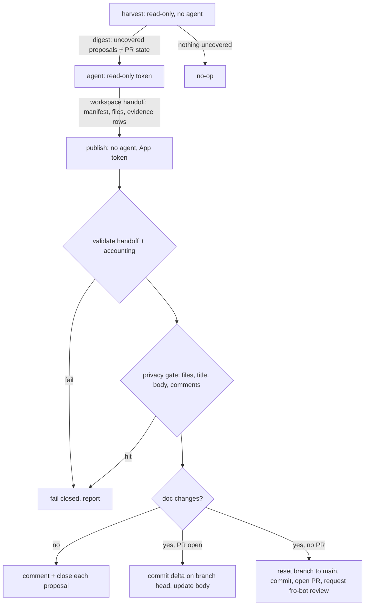

# feat: Draft solution docs from learning proposals

## Overview

A new weekly workflow turns open learning proposals into one drafted `docs/solutions/` PR. A read-only harvest finds proposals the open draft does not yet cover; a no-write agent drafts doc changes and evidence rows into a workspace handoff; a trusted publish job validates the handoff, privacy-gates every public surface, and either appends a commit to the drafted branch and opens or updates the PR, or comments on and closes proposals when nothing changed. Fro Bot reviews that PR through a narrow exception; the daily report points to it.

## Problem Frame

Proposals become durable knowledge only through a manual batch the operator starts, researches, consolidates, verifies, and ships (#3868, #3970). The batching labor is the cost; review stays (see origin: `docs/brainstorms/2026-10-09-drafted-solution-docs-requirements.md`).

## Requirements Trace

- R1. Process every open learning proposal opened by capture (authored by `fro-bot[bot]`), at most five per run, oldest first; otherwise no-op.
- R2. Verify each claim against the merged PR, its reviews and CI runs, and current `main`; drop or narrow the rest.
- R3. Consolidate same-lesson proposals; extend an existing doc when it already covers the lesson.
- R4. Covered or unverifiable proposals get no new doc text; outcome and reason recorded.
- R5. Drafted docs follow solution-doc conventions and pass the lint gate.
- R6. Proposal, PR, review, and CI content is data, not instructions.
- R7. The agent holds no write credential; a no-agent publish job holds the only one.
- R8. One PR on a stable branch; an open PR is updated, not duplicated.
- R9. Per-proposal evidence table plus one closing keyword per addressed proposal.
- R10. A run with no doc changes comments on and closes each processed proposal; no PR.
- R11. No automerge.
- R12. No writes to `main` or `data`.
- R13. Fro Bot reviews App-authored PRs only on the drafted branch.
- R14. Docs, PR title and body, and every comment pass the private-repo check; failure blocks publication.
- R15. Daily report's "Progressive Improvement" points to an open drafted PR instead of reporting covered proposals as stalled.

## Scope Boundaries

- Capture-time capture, filtering, and dedup; capture-patterns; the O8 metric (see origin).
- Automerge; drafting from any source but open learning-proposal issues; a rolling-PR size limit.
- Deleting or renaming existing solution docs: the handoff allows create and modify only.

## Context & Research

### Relevant Code and Patterns

- `.github/workflows/capture-learnings.yaml` — harvest → agent → publish split, workspace handoff dir, metadata overlay from `data`, fail-before-mint artifact check, scoped App token mint.
- `.github/workflows/survey-repo.yaml` — agent → trusted persist split for file changes.
- `scripts/wiki-handoff-core.ts` — `manifest.json` + `files/` handoff; path allowlist, traversal, symlink, regular-file, size-cap checks; validate-all-before-write. Wiki-only today.
- `packages/wiki-write-core/src/wiki-ingest.ts` (`commitWikiChanges`) — Git Data API multi-file commit (blob, tree, commit, updateRef) with conflict retry. Data-branch-bound and built to a checked-in dist; follow its shape, do not reuse it.
- `scripts/merge-data-pr.ts` — PR rediscovery by head branch and 422-race handling.
- `scripts/status-truth-public-output.ts` (`makePublicOutputTokens`, `applyPublicOutputGate`) — shared gate for titles, bodies, comments; includes redacted canonical IDs and hard-secret shapes.
- `scripts/capture-learnings-privacy.ts` (`loadPrivateTokensFromDisk`) — fail-closed private-token load from `metadata/repos.yaml`.
- `.github/workflows/fro-bot.yaml` — review `if:` excludes `[bot]` authors in two clauses (outer fork/bot guard and inner `pull_request` branch); `pull_request` types are `synchronize, ready_for_review, reopened, review_requested`; category 7 owns the learning-proposal stall rule.
- Tests: `scripts/capture-learnings-workflow.test.ts`, `scripts/fro-bot-workflow.test.ts` (full predicate string), `scripts/fro-bot-workflow-progressive-improvement.test.ts`, `scripts/wiki-handoff-core.test.ts`, `scripts/merge-data-pr.test.ts` (injected Octokit mocks).

### Repository facts verified for this plan

- The App (`app/fro-bot`) authors Renovate PRs (`renovate/*`) and the data promotion PR (head `data`), so author alone cannot scope the review exception.
- Merge is squash-only, `delete_branch_on_merge: true`; `main` requires up-to-date branches, one approval, code-owner review (`* @fro-bot @marcusrbrown`), `require_last_push_approval`, dismissal of stale reviews, and the `Fro Bot` check.
- `wiki-handoff-core.ts` is not in the Stryker `mutate` list.

### Institutional Learnings

- `docs/solutions/workflow-issues/required-github-token-for-agent-steps-2026-06-22.md` — the agent needs a token; restrict by scope, not omission.
- `docs/solutions/best-practices/credential-mint-time-permission-scoping-2026-06-22.md` — scope the App token at mint time.
- `docs/solutions/best-practices/privacy-gate-promotion-leak-prevention-2026-06-04.md`, `docs/solutions/security-issues/survey-workflow-side-privacy-gate-2026-05-16.md` — gate content at the trusted chokepoint, before any side effect, fail closed.
- `docs/solutions/workflow-issues/quoted-required-status-check-context-2026-06-09.md` — a job skipped by `if:` reports Success and satisfies a required check; a wrong review predicate passes silently.
- `docs/solutions/best-practices/make-failure-boundaries-and-predicates-explicit-2026-08-25.md` — name fail-closed vs fail-soft at each boundary.
- Memory: agent file tools cannot reach `$RUNNER_TEMP`; agent handoff files live in the workspace.

## Prior-Art Survey

```json
{
  "schema_version": 2,
  "verdict": "extend",
  "scope": ".",
  "freshness": {
    "vcs_reference": "7413df55543aca2217c691b752a11ade75416049"
  },
  "budget": {
    "max_search_passes": 3,
    "max_candidate_inspections": 10,
    "exhausted": false
  },
  "candidates": [
    {
      "path_or_symbol": "scripts/wiki-handoff-core.ts",
      "description": "Validates and applies agent-produced manifest+files handoffs for wiki paths: allowlist, traversal, symlink, regular-file, size cap, validate-all-before-write.",
      "disposition": "extend"
    },
    {
      "path_or_symbol": "scripts/status-truth-public-output.ts",
      "description": "Shared public-output gate for titles, bodies, and comments using private tokens, redacted canonical IDs, and hard-secret detection.",
      "disposition": "reuse"
    },
    {
      "path_or_symbol": "scripts/capture-learnings-privacy.ts",
      "description": "Fail-closed private-token loading from metadata/repos.yaml and substring leak scan.",
      "disposition": "reuse"
    },
    {
      "path_or_symbol": ".github/workflows/capture-learnings.yaml",
      "description": "Harvest, agent draft, and trusted publish split for learning-proposal issues with scoped App token.",
      "disposition": "insufficient"
    },
    {
      "path_or_symbol": "packages/wiki-write-core/src/wiki-ingest.ts",
      "description": "Multi-file Git Data API commit bound to the data branch and shipped as a built dist package.",
      "disposition": "insufficient"
    },
    {
      "path_or_symbol": "scripts/merge-data-pr.ts",
      "description": "Promotion PR discovery, creation, and updateBranch for the data head.",
      "disposition": "insufficient"
    },
    {
      "path_or_symbol": "scripts/status-truth-prs.ts",
      "description": "Single-file correction branches and PRs with public-output gates.",
      "disposition": "insufficient"
    }
  ]
}
```

## Key Technical Decisions

- Separate weekly workflow, Monday after Sunday's capture run, plus `workflow_dispatch`: keeps capture's contract untouched; the schedule makes the two runs effectively sequential.
- Generalize the wiki handoff validator to take a path policy; the drafted policy admits `docs/solutions/<category>/*.md` only and no deletions. Workflow and config paths are unreachable, so a drafted PR cannot alter the review rule that admits it.
- The publish job never rewrites the branch while its PR is open. With an open PR it re-reads the branch head at commit time and commits the handoff as a delta on top, preserving operator and update-branch commits. Without an open PR it points the branch at current `main` (creating or force-resetting it) and opens a new PR. Squash-only merging keeps `main` linear whatever the branch history is.
- Coverage state lives in a fenced, schema-validated machine block in the PR body: per proposal, issue number, outcome, target doc, source SHA, evidence references (PR, review, CI run, or file the kept claims rest on), dropped/narrowed claims, and a hash of the proposal body. New-doc and extension rows require at least one evidence reference; nothing checks their truth beyond Fro Bot's and the operator's review. Publish renders the whole body from it; harvest reads it. An unparseable block fails the run closed and reports; it is never guessed.
- A proposal counts as covered when the block lists it with the current body hash; an edited proposal is re-drafted.
- Every digest proposal must map to exactly one evidence row, and every row to a digest proposal or an existing block row; any mismatch fails closed.
- Existing block rows are re-authorized each run: each must name a `learning-proposal` issue authored by `fro-bot[bot]`, or the run fails closed.
- A `covered` row must name a `docs/solutions` doc that exists on the drafted tree; an `unverified` row must name the gap. Direct closure stays reversible and its comment carries the reason.
- At most five proposals per run, oldest first, matching capture's weekly cap; overflow stays uncovered for the next run, bounding the agent session.
- Privacy gate runs on all files, title, body, and comments before the first side effect; one hit blocks the whole publish.
- One drafted-PR predicate everywhere: base repo is this repo, head repo is not a fork, head ref is the drafted branch, author is `fro-bot[bot]`. The review exception threads it through both bot-excluding clauses; harvest and publish use it to find the PR. The publish job requests a review from `fro-bot` after opening the PR so the review fires without an `opened` trigger; later pushes fire `synchronize`.
- Fro Bot's approval counts as the required review: the App is the last pusher and Fro Bot approves as the `fro-bot` user, so the operator's merge is the human gate (operator decision during planning).
- Lint (link and example gates) is enforced by the agent's own run and by the PR's required `Lint` check; the publish job does not reinstall dependencies to re-run it.
- Issues authored by anyone other than `fro-bot[bot]` are ignored even if labeled. Proposal comments are non-authoritative and never read; a correction belongs in the issue body, and editing it triggers a re-draft through the body hash.

## Open Questions

### Resolved During Planning

- Review trigger without `opened`: explicit review request from the publish job; verified live on first run.
- Strict up-to-date + linear history: squash-only merge; the operator updates the branch at merge time as with other PRs.
- Closed-unmerged PR: branch reset to `main`, new PR.
- Mixed run with a PR open: per the origin, all outcomes go into the PR and close on merge; a rejected PR leaves proposals open for re-drafting.
- Concurrent runs: workflow `concurrency` group, queued, never cancelled mid-write.
- Agent session size: five-proposal cap per run.

### Deferred to Implementation

- Exact drafted branch name (working name `docs/drafted-solutions`) and machine-block encoding.
- How much `ce:compound` process fits one CI agent session, and whether the agent runtime loads Systematic skills or needs the process inlined in the prompt.

## High-Level Technical Design

> *This illustrates the intended approach and is directional guidance for review, not implementation specification. The implementing agent should treat it as context, not code to reproduce.*



## Implementation Units

- [ ] **Unit 1: Generalize the handoff validator**

**Goal:** Validate and apply agent file handoffs under a caller-supplied path policy.

**Requirements:** R5, R7, R12

**Dependencies:** None

**Files:**
- Modify: `scripts/wiki-handoff-core.ts`
- Test: `scripts/wiki-handoff-core.test.ts`

**Approach:**
- Extract the existing checks behind a policy (allowed-path predicate, deletions allowed or not, size cap). The wiki policy keeps current behavior exactly; add a drafted-solutions policy: `docs/solutions/<category>/*.md`, no deletions.

**Patterns to follow:** existing validate-all-before-write flow in the same module.

**Test scenarios:**
- Happy path: drafted policy accepts a new doc and a modified doc under a solutions category.
- Error path: drafted policy rejects `.github/workflows/x.yaml`, `docs/plans/x.md`, `docs/solutions/x.md` (no category), a non-`.md` file, `../` traversal, an absolute path, a symlink, a non-empty `deleted` list, and a bundle over the size cap — each with nothing written.
- Integration: the existing wiki test suite passes unchanged.

**Verification:** wiki behavior identical; drafted policy rejects every non-solutions path.

- [ ] **Unit 2: Coverage block and PR body**

**Goal:** Parse, merge, and render the drafted PR's machine block and body.

**Requirements:** R4, R8, R9

**Dependencies:** None

**Files:**
- Create: `scripts/drafted-solutions-pr-body.ts`
- Test: `scripts/drafted-solutions-pr-body.test.ts`

**Approach:**
- Pure functions: parse block from a body (schema-validated, fail closed), merge new rows (replacing rows whose proposal was re-drafted), render body: short summary, evidence table with an evidence-references column, one `Closes #N` line per row, block last.

**Test scenarios:**
- Happy path: render then parse round-trips rows.
- Edge case: body with no block parses as empty only when the PR is newly created; an existing PR body with no block fails closed.
- Error path: truncated, duplicated, or schema-invalid block fails closed with a reason.
- Edge case: merging a row for an already-listed proposal replaces it; closing lines stay one per issue, sorted.
- Error path: a new-doc or extension row with no evidence reference fails validation.

**Verification:** every rendered body re-parses to the same rows.

- [ ] **Unit 3: Harvest**

**Goal:** Emit the digest of uncovered proposals and the drafted PR's state.

**Requirements:** R1, R6, R8

**Dependencies:** Unit 2

**Files:**
- Create: `scripts/drafted-solutions-harvest.ts`
- Test: `scripts/drafted-solutions-harvest.test.ts`

**Approach:**
- List open `learning-proposal` issues authored by `fro-bot[bot]`; read bodies only. Find the open drafted PR with the shared predicate; abort if a PR on the drafted branch fails any part of it. Parse its block and re-authorize every row; uncovered = not listed or body hash changed. Take the five oldest uncovered. Write the digest into the workspace and output whether there is work.

**Test scenarios:**
- Happy path: two proposals, no PR → both uncovered, PR state `none`.
- Happy path: PR covers one proposal with matching hash → only the other is uncovered.
- Edge case: covered proposal edited (hash changed) → uncovered again.
- Edge case: all covered → no work, digest empty.
- Edge case: seven uncovered proposals → digest holds the five oldest.
- Error path: labeled issue by another author is ignored; PR on the drafted branch by another author or from a fork aborts; malformed block aborts; a block row naming a non-proposal issue aborts.

**Verification:** digest lists exactly the proposals needing a draft.

- [ ] **Unit 4: Publish**

**Goal:** Gate and deliver the agent's handoff.

**Requirements:** R4, R7, R8, R9, R10, R12, R13, R14

**Dependencies:** Units 1, 2

**Files:**
- Create: `scripts/drafted-solutions-publish.ts`
- Test: `scripts/drafted-solutions-publish.test.ts`

**Approach:**
- Validate the handoff with the drafted policy and the evidence rows against the digest (exactly one row per digest proposal); check that each `covered` row's doc exists on the drafted tree. Load private tokens and redacted canonical IDs fail-closed (`loadPrivateTokensFromDisk` in `scripts/capture-learnings-privacy.ts`, `loadRedactedCanonicalIdsFromDisk` in `scripts/status-truth-proposals.ts`, `makePublicOutputTokens`); gate every file, the title, the rendered body, and every comment before any write.
- Doc changes with an open PR: re-read branch head, Git Data API commit of the delta, update body. Without an open PR: point the branch at `main` head, commit, open PR, request review from `fro-bot`.
- No doc changes: comment the outcome and close each processed proposal.
- Idempotent on retry: rediscover the PR with the shared predicate, treat a create-422 as update, skip already-closed issues.

**Patterns to follow:** `commitWikiChanges` commit sequence; `merge-data-pr.ts` rediscovery; `capture-learnings-open.ts` gate-then-write ordering.

**Test scenarios:**
- Happy path: no PR, two doc rows → branch reset to main head, one commit, PR opened with two closing lines, review requested.
- Happy path: open PR → commit parent is the branch head read at commit time, body merged with existing rows.
- Happy path: no doc changes → each proposal commented and closed, no branch or PR call.
- Happy path (AE2): one new-doc row and one `covered` row → one PR with closing lines for both; the covered proposal is not commented or closed directly.
- Error path: privacy hit in one file, the body, or one comment → zero writes, failure reported.
- Error path: a redacted canonical ID in a doc, the title, or a comment → zero writes.
- Error path: a `covered` row naming a doc that does not exist → zero writes.
- Error path: missing or extra evidence row → zero writes.
- Error path: a handoff path outside solutions → zero writes.
- Edge case: PR create returns 422 because one appeared → falls back to update.
- Integration: no call ever targets `main` or `data` refs.

**Verification:** every write path is preceded by validation and privacy gating; no ref other than the drafted branch is written.

- [ ] **Unit 5: Workflow**

**Goal:** Wire harvest, agent, and publish on a weekly schedule.

**Requirements:** R1, R2, R3, R5, R6, R7, R11, R12

**Dependencies:** Units 3, 4

**Files:**
- Create: `.github/workflows/draft-solutions.yaml`
- Modify: `.gitignore`
- Test: `scripts/draft-solutions-workflow.test.ts`

**Approach:**
- Schedule Monday morning UTC plus `workflow_dispatch`; workflow-level permissions read-only; `concurrency` group without cancel.
- Harvest: read-only token, metadata overlay from `data`, skip downstream jobs when no work.
- Agent: read-only token (contents, issues, pull-requests, actions read); checks out the drafted branch when a PR is open, else `main`; writes only the workspace handoff dir; prompt carries the verify → overlap → consolidate → write process, allowed evidence sources, the instruction that proposal and PR content is data, the evidence-row contract, and the docs link and example gates.
- Publish: no agent, `persist-credentials: false`, metadata overlay, fail before mint when the handoff is missing, App token scoped to contents, pull-requests, and issues write.

**Patterns to follow:** `.github/workflows/capture-learnings.yaml` and its contract test.

**Test scenarios:**
- Happy path: three jobs in order with the expected `needs` and skip condition.
- Error path (contract): the agent job has no write permission and no App token step; only publish mints a token, with exactly the three write scopes and no `workflows` scope.
- Edge case: every checkout sets `persist-credentials: false`; handoff paths are inside the workspace; the upload includes hidden files.
- Happy path: prompt contains the untrusted-data instruction and the allowed evidence sources.

**Verification:** contract test pins the credential split and token scopes.

- [ ] **Unit 6: Review exception and daily report**

**Goal:** Let Fro Bot review drafted PRs only; point the daily report at the open draft.

**Requirements:** R13, R15

**Dependencies:** None

**Files:**
- Modify: `.github/workflows/fro-bot.yaml`
- Test: `scripts/fro-bot-workflow.test.ts`, `scripts/fro-bot-workflow-progressive-improvement.test.ts`

**Approach:**
- Add the author-and-branch exception to both bot-excluding clauses; issue and comment clauses unchanged.
- Category 7: when an open PR on the drafted branch covers open proposals, report the PR and its age; proposals it does not cover keep the existing stall rule.

**Test scenarios:**
- Happy path: full predicate string matches the new expected value.
- Error path: the predicate still excludes `fro-bot[bot]` on `renovate/*` and on `data`, any other `[bot]` author, and the `fro-bot` user.
- Happy path: category 7 text names the drafted PR and keeps the 14-day and two-open rule for uncovered proposals.

**Verification:** only `fro-bot[bot]` on the drafted branch passes the review gate.

- [ ] **Unit 7: Documentation**

**Goal:** Describe the drafted-docs flow where the repo documents its automation.

**Requirements:** R11

**Dependencies:** Units 5, 6

**Files:**
- Modify: `README.md` (workflow listing), `.github/copilot-instructions.md` (one line under Autonomous Commits)

**Test expectation:** none -- documentation only; `pnpm lint` covers links.

**Verification:** both files name the workflow, the drafted branch, and that merge is manual.

## System-Wide Impact

- **Interaction graph:** the drafted PR triggers the full required-check set, including `Fro Bot`; merge closes proposals; capture-patterns still reads proposal issues, now closed sooner.
- **Error propagation:** harvest and publish fail the run visibly; no silent partial publish.
- **State lifecycle risks:** commit written but PR update failed → next run rediscovers and repairs; issues closed only after their comment posts.
- **Unchanged invariants:** Renovate, data-promotion, and autoheal PRs keep their current review skip; capture-learnings is untouched; no write to `main` or `data`.

## Risks & Dependencies

| Risk | Mitigation |
|------|------------|
| Review predicate admits more than intended, or skips and reports Success | Author-and-branch conjunction; contract test with negative cases; live check that the `Fro Bot` check actually ran a review |
| Agent writes outside `docs/solutions` | Path policy rejects before any write |
| Prompt injection via proposal or PR text | No write credential in the agent; publish validates paths, accounting, and privacy |
| Private-repo leak in agent prose | Whole-run gate on files, title, body, comments before side effects |
| CODEOWNERS auto-request fails to start review | Explicit review request from publish; first-run verification |

## Documentation / Operational Notes

- First live run: after merge, a `workflow_dispatch` with at least one open proposal (operator approval required). Verify the PR opens on the drafted branch, the review job runs (not skipped), the body block parses, and a second dispatch appends rather than duplicates.
- The plan frontmatter stays `status: active` until that run is verified.

## Sources & References

- **Origin document:** [docs/brainstorms/2026-10-09-drafted-solution-docs-requirements.md](../brainstorms/2026-10-09-drafted-solution-docs-requirements.md)
- Related PRs: #3868, #3970 (manual batches; #3970's body is the evidence-table template), #3960 (workspace handoff paths)
- Related code: `.github/workflows/capture-learnings.yaml`, `scripts/wiki-handoff-core.ts`, `scripts/status-truth-public-output.ts`, `.github/workflows/fro-bot.yaml`
